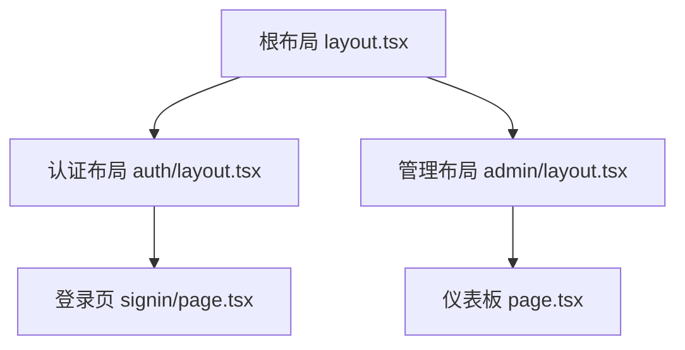
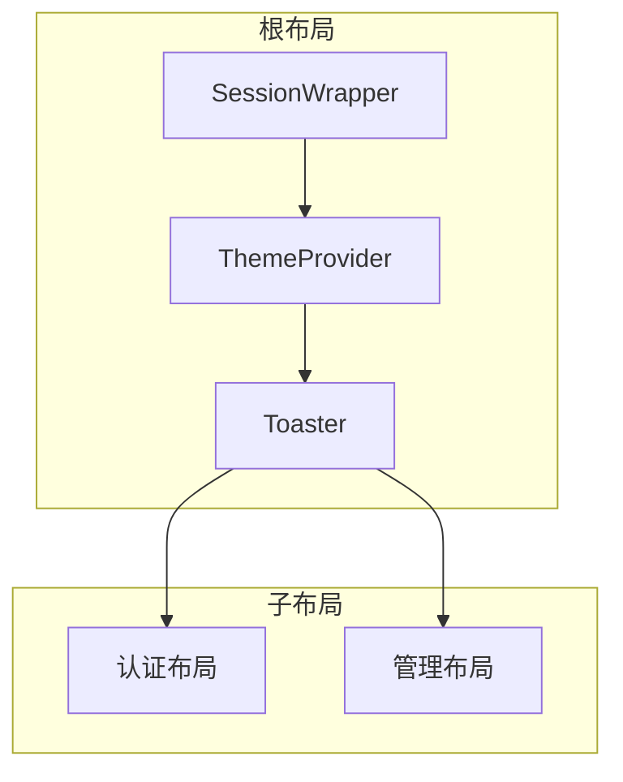
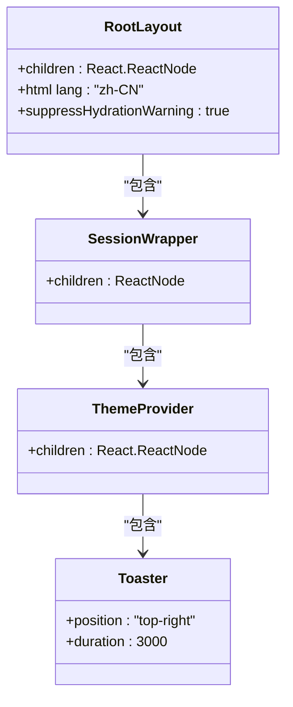
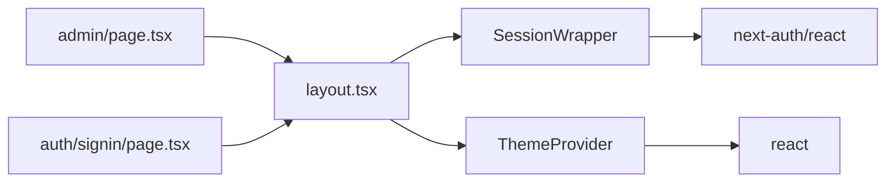

# 嵌套布局机制

<cite>
**本文档中引用的文件**  
- [layout.tsx](file://src/app/layout.tsx)
- [auth/signin/page.tsx](file://src/app/auth/signin/page.tsx)
- [admin/page.tsx](file://src/app/admin/page.tsx)
- [ThemeContext.tsx](file://src/contexts/ThemeContext.tsx)
- [SessionWrapper.tsx](file://src/components/SessionWrapper.tsx)
</cite>

## 目录
1. [引言](#引言)
2. [项目结构](#项目结构)
3. [核心组件](#核心组件)
4. [架构概览](#架构概览)
5. [详细组件分析](#详细组件分析)
6. [依赖分析](#依赖分析)
7. [性能考量](#性能考量)
8. [故障排除指南](#故障排除指南)
9. [结论](#结论)

## 引言
本文档深入解析Next.js中布局嵌套的渲染流程，重点说明根布局与子路径布局（如auth、admin）之间的继承与覆盖关系。通过具体代码示例展示嵌套布局如何组合渲染、props传递规则以及并行渲染中的边界处理。分析不同布局间样式隔离与类名合并的行为，解释数据获取在多层布局中的执行顺序与缓存策略。讨论嵌套深度对首屏加载性能的影响，并提供避免重复渲染的最佳实践。

## 项目结构
项目采用Next.js App Router架构，布局文件通过嵌套目录实现层级化结构。根布局位于`src/app/layout.tsx`，子路径布局如`auth`和`admin`分别位于对应目录下。这种结构支持布局的继承与覆盖机制，允许在不同层级定义共享UI和特定逻辑。

**图示来源**  
- [layout.tsx](file://src/app/layout.tsx#L1-L84)
- [auth/signin/page.tsx](file://src/app/auth/signin/page.tsx)
- [admin/page.tsx](file://src/app/admin/page.tsx)

**本节来源**  
- [layout.tsx](file://src/app/layout.tsx#L1-L84)

## 核心组件
根布局`layout.tsx`通过`generateMetadata`函数动态生成页面元数据，优先使用平台配置的标题，若失败则回退到默认标题。布局中集成了`SessionWrapper`和`ThemeProvider`，为子组件提供认证和主题上下文。子路径布局可继承这些上下文并添加特定功能。

**本节来源**  
- [layout.tsx](file://src/app/layout.tsx#L25-L54)
- [SessionWrapper.tsx](file://src/components/SessionWrapper.tsx#L1-L15)
- [ThemeContext.tsx](file://src/contexts/ThemeContext.tsx#L1-L44)

## 架构概览
系统采用分层布局架构，根布局提供全局结构和共享组件，子路径布局在其基础上进行扩展或覆盖。数据流从根布局向下传递，子布局可通过`children`接收并组合渲染。上下文如认证状态和主题设置在整个布局树中保持一致。

**图示来源**  
- [layout.tsx](file://src/app/layout.tsx#L56-L84)
- [SessionWrapper.tsx](file://src/components/SessionWrapper.tsx#L1-L15)
- [ThemeContext.tsx](file://src/contexts/ThemeContext.tsx#L1-L44)

## 详细组件分析
### 根布局分析
根布局`RootLayout`作为应用的顶层容器，负责包裹所有子页面。它通过`SessionWrapper`提供认证上下文，`ThemeProvider`管理主题切换，并集成`Toaster`用于全局通知。布局中的`suppressHydrationWarning`属性避免服务端与客户端渲染差异警告。

#### 类图

**图示来源**  
- [layout.tsx](file://src/app/layout.tsx#L56-L84)
- [SessionWrapper.tsx](file://src/components/SessionWrapper.tsx#L1-L15)
- [ThemeContext.tsx](file://src/contexts/ThemeContext.tsx#L1-L44)

**本节来源**  
- [layout.tsx](file://src/app/layout.tsx#L56-L84)

### 子路径布局分析
子路径布局如`auth`和`admin`继承根布局的上下文，同时可定义特定UI元素。例如，`admin`布局可能添加导航菜单，而`auth`布局保持简洁以优化登录体验。子布局通过文件系统路径自动嵌套，无需显式导入。

**本节来源**  
- [admin/page.tsx](file://src/app/admin/page.tsx)
- [auth/signin/page.tsx](file://src/app/auth/signin/page.tsx)

## 依赖分析
布局组件之间通过文件系统路径隐式依赖。根布局依赖`SessionWrapper`和`ThemeProvider`，这两个组件又依赖Next.js和React的外部库。子路径布局直接依赖根布局提供的上下文，形成清晰的依赖链。

**图示来源**  
- [layout.tsx](file://src/app/layout.tsx#L1-L84)
- [SessionWrapper.tsx](file://src/components/SessionWrapper.tsx#L1-L15)
- [ThemeContext.tsx](file://src/contexts/ThemeContext.tsx#L1-L44)

**本节来源**  
- [layout.tsx](file://src/app/layout.tsx#L1-L84)
- [SessionWrapper.tsx](file://src/components/SessionWrapper.tsx#L1-L15)
- [ThemeContext.tsx](file://src/contexts/ThemeContext.tsx#L1-L44)

## 性能考量
嵌套布局可能导致重复渲染，特别是在深层嵌套时。建议使用`React.memo`优化子组件，避免不必要的重渲染。数据获取应优先在根布局中执行，利用Next.js的缓存机制减少重复请求。`generateMetadata`中的`cache: 'no-store'`确保平台配置实时更新，但可能影响性能，需权衡使用。

## 故障排除指南
当布局渲染异常时，首先检查`suppressHydrationWarning`是否正确使用以避免水合错误。确认`SessionWrapper`和`ThemeProvider`在根布局中正确包裹。若主题切换失效，检查`localStorage`中的主题设置是否同步到`document.documentElement`。对于认证问题，验证`next-auth`的配置和会话状态传递。

**本节来源**  
- [layout.tsx](file://src/app/layout.tsx#L56-L84)
- [SessionWrapper.tsx](file://src/components/SessionWrapper.tsx#L1-L15)
- [ThemeContext.tsx](file://src/contexts/ThemeContext.tsx#L1-L44)

## 结论
Next.js的嵌套布局机制通过文件系统路径实现，支持灵活的UI组合与上下文继承。根布局提供全局结构和共享状态，子路径布局在此基础上进行扩展。合理利用这一机制可构建高效、可维护的应用界面，同时需注意性能优化和错误处理以确保用户体验。