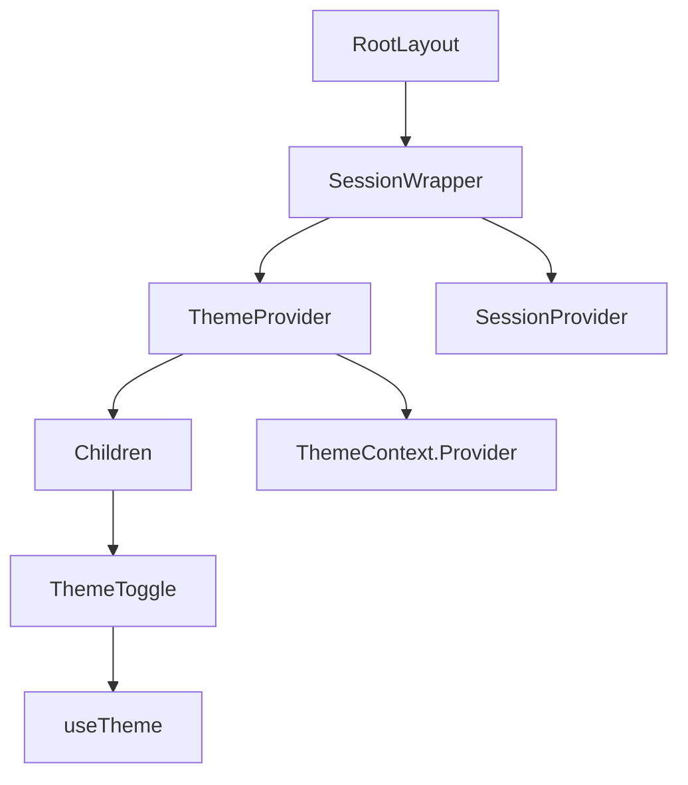
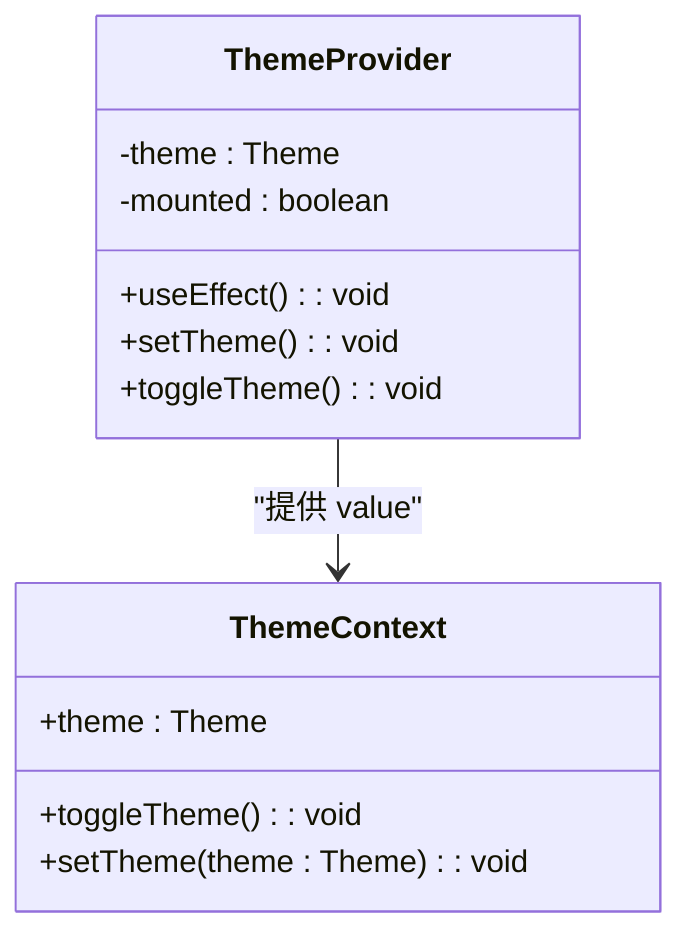
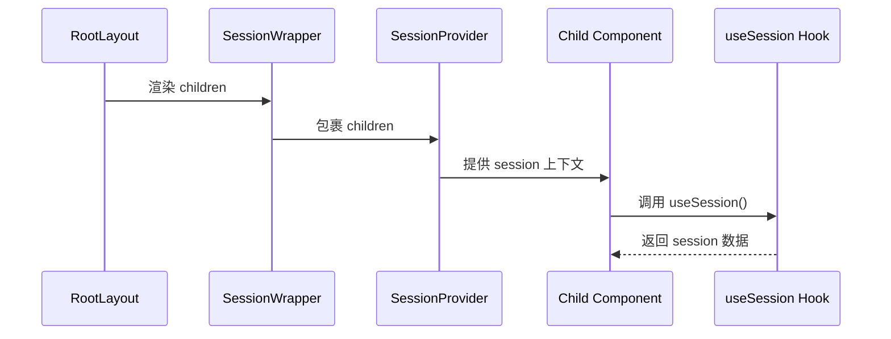
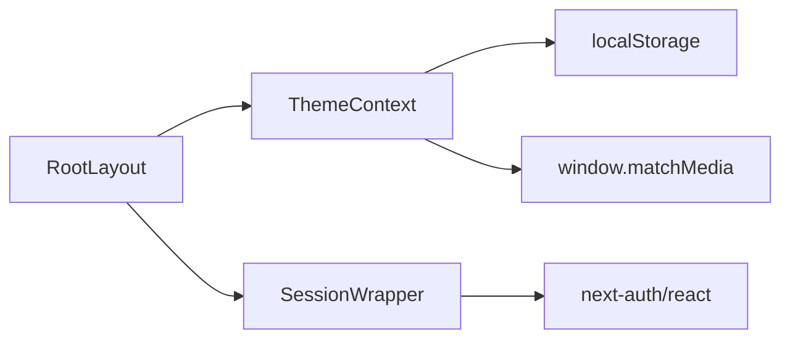

# 布局中的状态集成

<cite>
**本文档引用的文件**  
- [layout.tsx](file://src/app/layout.tsx)
- [ThemeContext.tsx](file://src/contexts/ThemeContext.tsx)
- [SessionWrapper.tsx](file://src/components/SessionWrapper.tsx)
- [ThemeToggle.tsx](file://src/components/ThemeToggle.tsx)
- [next-auth.d.ts](file://src/types/next-auth.d.ts)
</cite>

## 目录
1. [简介](#简介)
2. [项目结构](#项目结构)
3. [核心组件](#核心组件)
4. [架构概览](#架构概览)
5. [详细组件分析](#详细组件分析)
6. [依赖分析](#依赖分析)
7. [性能考量](#性能考量)
8. [故障排除指南](#故障排除指南)
9. [结论](#结论)

## 简介
本文档阐述了在 Next.js 应用中，如何通过 `layout.tsx` 将 `ThemeContext` 与 `SessionWrapper` 集成，实现主题状态与会话管理的全局注入。重点分析上下文的创建、提供者封装、客户端消费方式、服务端与客户端之间的状态传输机制，并探讨潜在的性能瓶颈及优化策略。

## 项目结构
应用采用标准的 Next.js App Router 结构，核心状态管理逻辑集中在 `src/contexts` 和 `src/components` 目录下。`layout.tsx` 作为根布局文件，负责全局上下文的注入。

**Section sources**
- [layout.tsx](file://src/app/layout.tsx#L1-L84)

## 核心组件
核心组件包括 `ThemeContext` 提供的主题管理功能和 `SessionWrapper` 提供的身份验证会话管理功能。两者均通过 React Context API 实现状态的跨层级传递。

**Section sources**
- [ThemeContext.tsx](file://src/contexts/ThemeContext.tsx#L1-L77)
- [SessionWrapper.tsx](file://src/components/SessionWrapper.tsx#L1-L15)

## 架构概览
系统通过在根布局中嵌套 `SessionWrapper` 和 `ThemeProvider`，构建了一个全局可访问的状态树。`SessionWrapper` 内部使用 `next-auth/react` 的 `SessionProvider`，而 `ThemeProvider` 则封装了自定义的 `ThemeContext`。

**Diagram sources**
- [layout.tsx](file://src/app/layout.tsx#L60-L75)
- [SessionWrapper.tsx](file://src/components/SessionWrapper.tsx#L9-L15)
- [ThemeContext.tsx](file://src/contexts/ThemeContext.tsx#L14-L69)

## 详细组件分析

### ThemeContext 分析
`ThemeContext` 负责管理应用的主题状态（浅色/深色模式），支持本地存储、系统偏好同步及动态切换。

#### 创建与 Provider 封装
`ThemeContext` 使用 `createContext` 创建上下文对象，并通过 `ThemeProvider` 组件提供状态。初始化时从 `localStorage` 或系统偏好中读取主题，并应用到 `document.documentElement` 的类名上。

**Diagram sources**
- [ThemeContext.tsx](file://src/contexts/ThemeContext.tsx#L14-L69)

#### 客户端消费方式
客户端组件通过 `useTheme` Hook 消费上下文。例如 `ThemeToggle` 组件调用 `toggleTheme` 来切换主题。

**Section sources**
- [ThemeContext.tsx](file://src/contexts/ThemeContext.tsx#L71-L77)
- [ThemeToggle.tsx](file://src/components/ThemeToggle.tsx#L3-L11)

### SessionWrapper 分析
`SessionWrapper` 是 `next-auth/react` 的 `SessionProvider` 的轻量级封装，用于在应用中注入身份验证会话状态。

#### 包裹 children 以确保会话可访问性
`SessionWrapper` 将 `SessionProvider` 作为其子组件的父级，确保所有后代组件都能通过 `useSession` Hook 访问当前用户会话信息。

**Diagram sources**
- [SessionWrapper.tsx](file://src/components/SessionWrapper.tsx#L9-L15)

#### 上下文在服务端与客户端之间的序列化与传输
`next-auth` 通过 API 路由 `/api/auth/session` 管理会话。服务端可通过 `getSession` 获取会话，客户端通过 `SessionProvider` 自动同步会话状态。会话数据在客户端通过浏览器存储（如 cookies）持久化。

**Section sources**
- [SessionWrapper.tsx](file://src/components/SessionWrapper.tsx#L2)
- [next-auth.d.ts](file://src/types/next-auth.d.ts#L1-L22)

## 依赖分析
`ThemeContext` 依赖于浏览器的 `localStorage` 和 `window.matchMedia` API。`SessionWrapper` 依赖于 `next-auth/react` 库。两者均作为客户端组件运行。

**Diagram sources**
- [ThemeContext.tsx](file://src/contexts/ThemeContext.tsx#L20-L35)
- [SessionWrapper.tsx](file://src/components/SessionWrapper.tsx#L2)

**Section sources**
- [ThemeContext.tsx](file://src/contexts/ThemeContext.tsx#L1-L77)
- [SessionWrapper.tsx](file://src/components/SessionWrapper.tsx#L1-L15)

## 性能考量
在 `layout.tsx` 中嵌套多个 Provider 可能导致不必要的重渲染。建议对状态进行分片管理，仅在必要时才注入全局上下文。例如，将主题状态与会话状态分离，并考虑使用更轻量的状态管理方案或优化 Context 的粒度。

**Section sources**
- [layout.tsx](file://src/app/layout.tsx#L60-L75)

## 故障排除指南
- **主题不保存**：检查浏览器是否禁用了 `localStorage`。
- **会话无法获取**：确认 `next-auth` 的 API 路由配置正确，且 `SessionProvider` 已正确包裹组件。
- **水合不匹配**：确保服务端与客户端的初始状态一致，`ThemeContext` 通过 `mounted` 状态避免此问题。

**Section sources**
- [ThemeContext.tsx](file://src/contexts/ThemeContext.tsx#L20-L25)
- [SessionWrapper.tsx](file://src/components/SessionWrapper.tsx#L9-L15)

## 结论
通过 `layout.tsx` 中的 `SessionWrapper` 和 `ThemeProvider`，应用实现了主题与会话状态的全局集成。该设计利用 React Context 提供了清晰的状态管理方案，但需注意潜在的性能影响。未来可通过状态分片和精细化 Provider 使用来优化渲染性能。