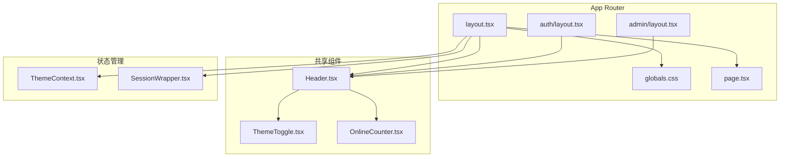
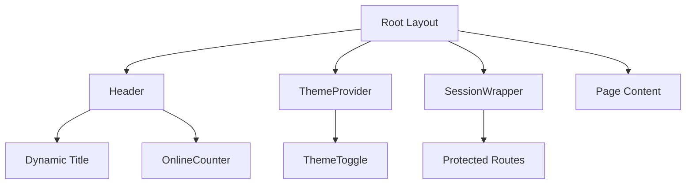
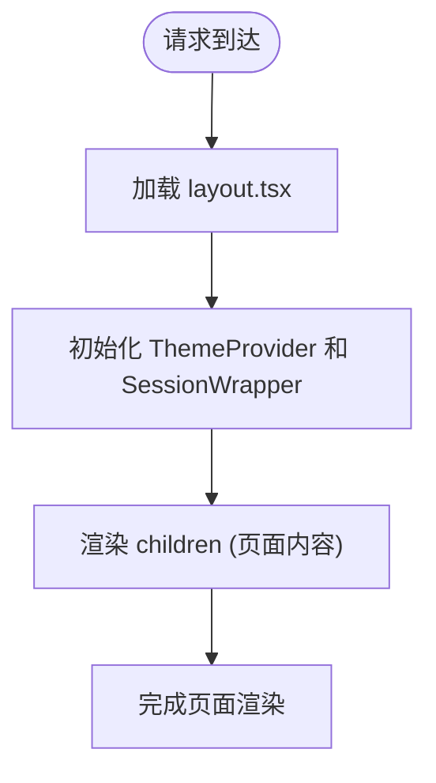
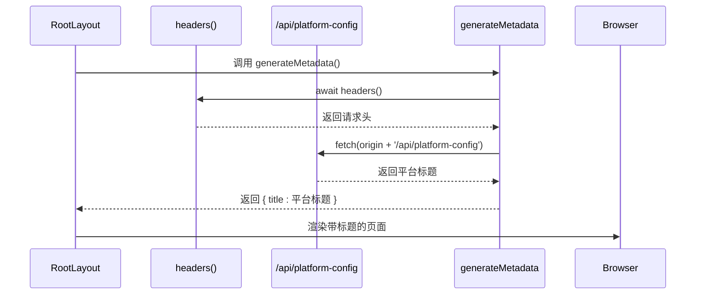
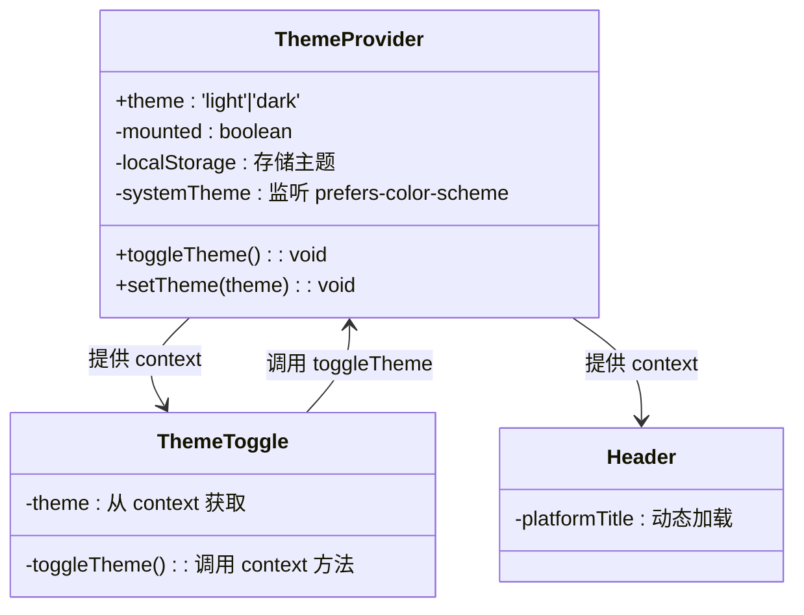
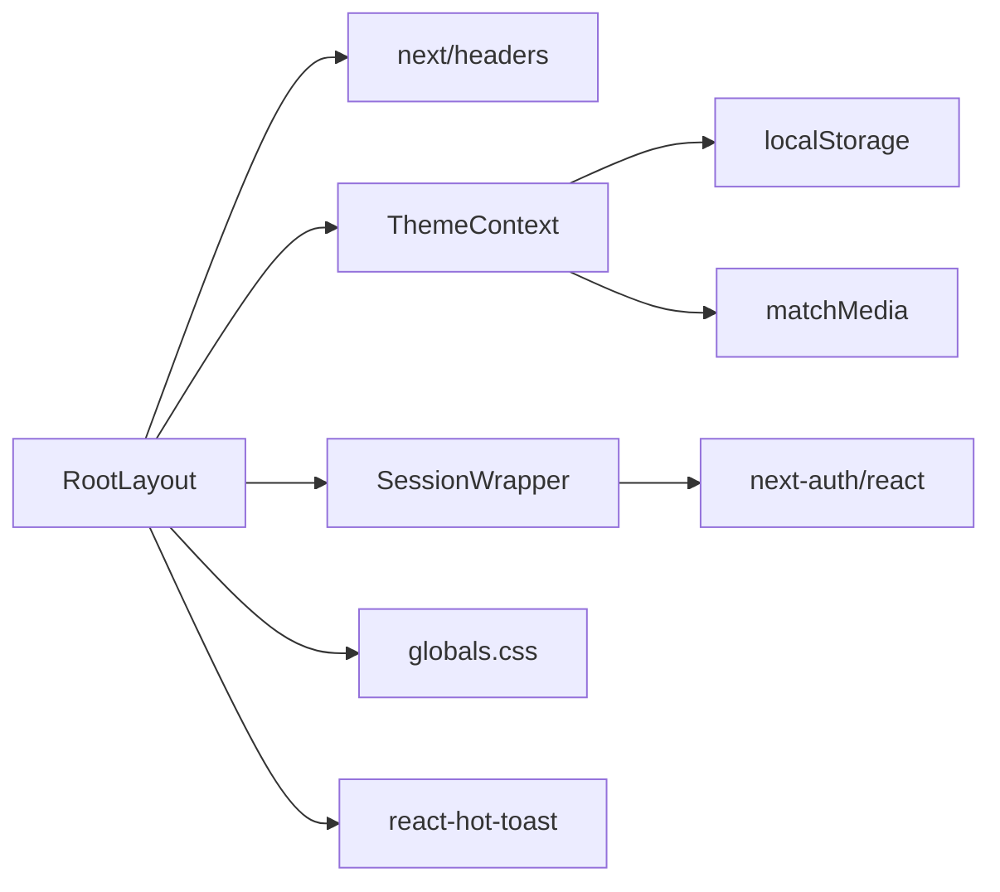

# 布局系统

<cite>
**本文档中引用的文件**  
- [layout.tsx](file://src/app/layout.tsx)
- [ThemeContext.tsx](file://src/contexts/ThemeContext.tsx)
- [SessionWrapper.tsx](file://src/components/SessionWrapper.tsx)
- [Header.tsx](file://src/components/Header.tsx)
- [ThemeToggle.tsx](file://src/components/ThemeToggle.tsx)
- [globals.css](file://src/app/globals.css)
</cite>

## 目录
1. [引言](#引言)
2. [项目结构](#项目结构)
3. [核心组件](#核心组件)
4. [架构概览](#架构概览)
5. [详细组件分析](#详细组件分析)
6. [依赖分析](#依赖分析)
7. [性能考量](#性能考量)
8. [故障排除指南](#故障排除指南)
9. [结论](#结论)

## 引言
本文档系统阐述了基于 Next.js App Router 的布局机制，重点分析根布局 `layout.tsx` 如何为整个应用提供共享 UI 结构（如 Header、ThemeToggle）与全局样式（`globals.css`）。同时对比不同子路径（如 `auth`、`admin`）下独立布局的封装方式与作用域隔离机制，深入解析布局组件的嵌套渲染、props 传递规则及其与页面组件的生命周期关系。结合主题切换（`ThemeContext`）与会话管理（`SessionWrapper`），说明布局中状态管理的实现模式，并讨论布局缓存对性能的影响与优化建议。

## 项目结构
本项目采用 Next.js App Router 架构，布局系统通过 `app` 目录下的 `layout.tsx` 文件实现全局结构封装。根布局位于 `src/app/layout.tsx`，为所有页面提供统一的 HTML 结构、全局样式和共享 UI 组件。各子路径（如 `auth`、`admin`）可定义独立布局，实现特定区域的 UI 隔离。全局样式通过 `src/app/globals.css` 引入，结合 Tailwind CSS 实现响应式设计与主题支持。

**Diagram sources**  
- [layout.tsx](file://src/app/layout.tsx#L1-L84)
- [globals.css](file://src/app/globals.css#L1-L600)
- [Header.tsx](file://src/components/Header.tsx#L1-L119)

**Section sources**  
- [layout.tsx](file://src/app/layout.tsx#L1-L84)
- [globals.css](file://src/app/globals.css#L1-L600)

## 核心组件
根布局 `layout.tsx` 是整个应用的入口结构，负责包裹所有页面内容并注入共享状态。其核心功能包括：提供 `<html>` 和 `<body>` 标签、加载全局样式、注入主题上下文（`ThemeProvider`）与会话管理（`SessionWrapper`），以及动态生成页面元数据（`generateMetadata`）。通过 `children` prop 实现页面内容的嵌套渲染，确保所有子页面共享统一的 UI 框架。

**Section sources**  
- [layout.tsx](file://src/app/layout.tsx#L56-L84)
- [layout.tsx](file://src/app/layout.tsx#L25-L54)

## 架构概览
Next.js App Router 的布局系统采用嵌套结构，允许在不同路由层级定义布局组件。根布局作用于整个应用，而子路径布局仅作用于其子路由。布局组件通过 `children` prop 接收页面内容，并可嵌套多个布局层，形成“布局树”。状态管理通过 React Context（如 `ThemeContext`）在布局中注入，供所有子组件消费，实现跨页面的状态共享。

**Diagram sources**  
- [layout.tsx](file://src/app/layout.tsx#L56-L84)
- [ThemeContext.tsx](file://src/contexts/ThemeContext.tsx#L1-L77)
- [SessionWrapper.tsx](file://src/components/SessionWrapper.tsx#L1-L15)
- [Header.tsx](file://src/components/Header.tsx#L1-L119)

## 详细组件分析

### 根布局分析
根布局 `layout.tsx` 使用 `html` 和 `body` 标签定义文档结构，并通过 `suppressHydrationWarning` 避免水合警告。布局中注入 `ThemeProvider` 和 `SessionWrapper`，为所有子组件提供主题与认证状态。`generateMetadata` 函数异步获取平台配置的标题，实现动态页面标题，优先级高于静态 `metadata` 定义。

#### 布局渲染机制

**Diagram sources**  
- [layout.tsx](file://src/app/layout.tsx#L56-L84)

#### 动态元数据生成

**Diagram sources**  
- [layout.tsx](file://src/app/layout.tsx#L25-L54)

**Section sources**  
- [layout.tsx](file://src/app/layout.tsx#L25-L54)

### 主题切换机制分析
主题功能通过 `ThemeContext` 实现，`ThemeProvider` 在布局中提供主题状态，`useTheme` Hook 供组件消费。主题状态持久化至 `localStorage`，并监听系统偏好变化，实现自动切换。`ThemeToggle` 组件调用 `toggleTheme` 切换主题，并通过 CSS 类 `dark` 控制样式。

#### 主题状态管理

**Diagram sources**  
- [ThemeContext.tsx](file://src/contexts/ThemeContext.tsx#L1-L77)
- [ThemeToggle.tsx](file://src/components/ThemeToggle.tsx#L1-L75)

**Section sources**  
- [ThemeContext.tsx](file://src/contexts/ThemeContext.tsx#L1-L77)
- [ThemeToggle.tsx](file://src/components/ThemeToggle.tsx#L1-L75)

### 会话管理分析
`SessionWrapper` 封装 `next-auth/react` 的 `SessionProvider`，为应用提供认证状态。该组件在根布局中包裹所有内容，确保所有页面均可访问会话信息。`useSession` Hook 在 `Header` 等组件中用于判断用户登录状态，实现动态导航。

**Section sources**  
- [SessionWrapper.tsx](file://src/components/SessionWrapper.tsx#L1-L15)
- [Header.tsx](file://src/components/Header.tsx#L1-L119)

## 依赖分析
布局系统依赖多个核心模块：`next/headers` 用于获取请求头以构建 API 调用地址；`next-auth` 提供会话管理；`react-hot-toast` 实现全局通知；`Tailwind CSS` 与 `globals.css` 提供样式支持。各组件通过模块导入形成依赖链，确保功能完整。

**Diagram sources**  
- [layout.tsx](file://src/app/layout.tsx#L1-L84)
- [ThemeContext.tsx](file://src/contexts/ThemeContext.tsx#L1-L77)
- [SessionWrapper.tsx](file://src/components/SessionWrapper.tsx#L1-L15)

**Section sources**  
- [layout.tsx](file://src/app/layout.tsx#L1-L84)

## 性能考量
布局组件的静态性使其可被 Next.js 高效缓存，减少重复渲染。`generateMetadata` 使用 `{ cache: 'no-store' }` 确保标题实时性，但可能影响性能。建议对频繁访问的元数据添加短期缓存。`ThemeProvider` 和 `SessionWrapper` 的状态管理避免了全局状态的重复初始化，提升水合效率。`Header` 中的 `useEffect` 应优化防抖，避免过多 API 调用。

## 故障排除指南
- **主题切换失效**：检查 `localStorage` 是否被阻止，或 `document.documentElement` 类名未正确切换。
- **动态标题未更新**：确认 `/api/platform-config` 接口返回正确数据，且 `fetch` 未被缓存。
- **会话状态丢失**：确保 `SessionProvider` 正确包裹所有需要认证的组件。
- **水合不匹配**：使用 `suppressHydrationWarning` 或确保服务端与客户端初始状态一致。

**Section sources**  
- [ThemeContext.tsx](file://src/contexts/ThemeContext.tsx#L1-L77)
- [layout.tsx](file://src/app/layout.tsx#L25-L54)
- [SessionWrapper.tsx](file://src/components/SessionWrapper.tsx#L1-L15)

## 结论
Next.js App Router 的布局机制通过嵌套组件实现灵活的 UI 共享与隔离。根布局 `layout.tsx` 作为应用的结构骨架，集成主题、会话、样式等全局能力，通过 `children` 实现内容嵌套。动态元数据、状态管理与组件复用共同构建了高效、可维护的前端架构。合理利用缓存与状态持久化，可进一步提升用户体验与性能表现。