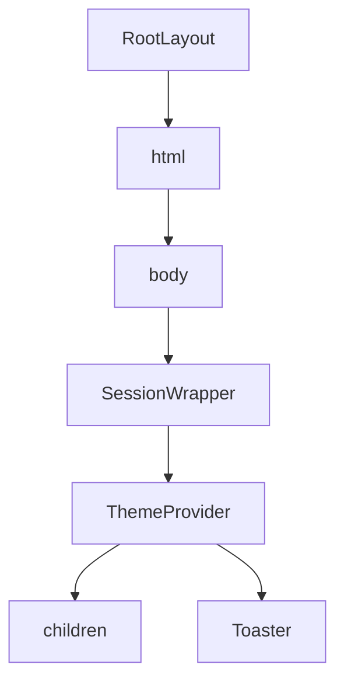

# 路由系统

<cite>
**本文档引用的文件**   
- [layout.tsx](file://src/app/layout.tsx)
- [page.tsx](file://src/app/page.tsx)
- [error.tsx](file://src/app/error.tsx)
- [auth/signin/page.tsx](file://src/app/auth/signin/page.tsx)
- [profile/page.tsx](file://src/app/profile/page.tsx)
- [admin/page.tsx](file://src/app/admin/page.tsx)
- [middleware.ts](file://middleware.ts)
</cite>

## 目录
1. [项目结构与路由基础](#项目结构与路由基础)
2. [根布局与共享UI](#根布局与共享UI)
3. [页面路由映射规则](#页面路由映射规则)
4. [嵌套路由结构](#嵌套路由结构)
5. [动态路由应用](#动态路由应用)
6. [页面间导航](#页面间导航)
7. [路由守卫实现](#路由守卫实现)
8. [错误边界集成](#错误边界集成)

## 项目结构与路由基础

数字化作品互动展示平台采用Next.js App Router架构，其路由系统基于文件系统约定。在`src/app`目录下，每个`page.tsx`文件对应一个路由路径，文件夹名称即为URL路径段。例如，`src/app/profile/page.tsx`对应`/profile`路由，`src/app/admin/page.tsx`对应`/admin`路由。这种约定式路由简化了路由配置，开发者只需通过创建文件和文件夹即可定义应用的路由结构。

**Section sources**
- [page.tsx](file://src/app/page.tsx)
- [profile/page.tsx](file://src/app/profile/page.tsx)
- [admin/page.tsx](file://src/app/admin/page.tsx)

## 根布局与共享UI

根布局文件`src/app/layout.tsx`为整个应用提供共享的UI结构和全局样式。该布局组件包裹所有页面，确保应用在不同页面间切换时保持一致的外观和行为。布局中集成了主题切换器（`ThemeProvider`）、会话管理器（`SessionWrapper`）和通知组件（`Toaster`），这些全局功能无需在每个页面中重复定义。



**Diagram sources **
- [layout.tsx](file://src/app/layout.tsx#L56-L84)

**Section sources**
- [layout.tsx](file://src/app/layout.tsx#L56-L84)

## 页面路由映射规则

应用的路由映射遵循严格的文件系统约定。`src/app`目录下的每个`page.tsx`文件直接映射到其父文件夹名称所代表的URL路径。例如，`src/app/page.tsx`映射到根路径`/`，`src/app/upload/page.tsx`映射到`/upload`路径。这种映射规则使得路由结构清晰直观，开发者可以轻松预测和管理应用的URL结构。

**Section sources**
- [page.tsx](file://src/app/page.tsx)
- [upload/page.tsx](file://src/app/upload/page.tsx)

## 嵌套路由结构

应用通过文件夹嵌套实现复杂的路由结构。例如，`auth`文件夹下包含`signin`和`register`子文件夹，分别对应`/auth/signin`和`/auth/register`路由。这种嵌套结构允许将相关功能组织在一起，形成逻辑清晰的模块化路由。`admin`文件夹同样采用嵌套结构，其下的`page.tsx`文件对应`/admin`路径，实现了管理功能的独立路由空间。

```mermaid
graph TD
    A[/] --> B[/