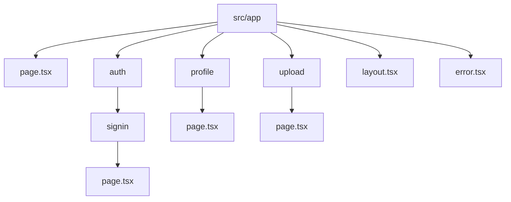
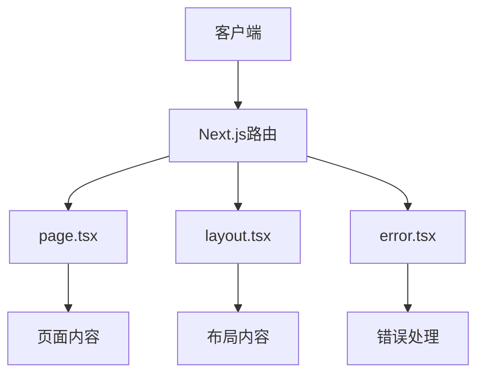
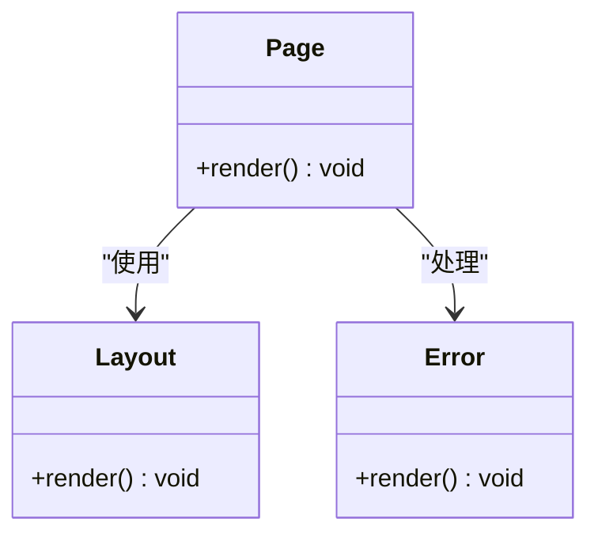
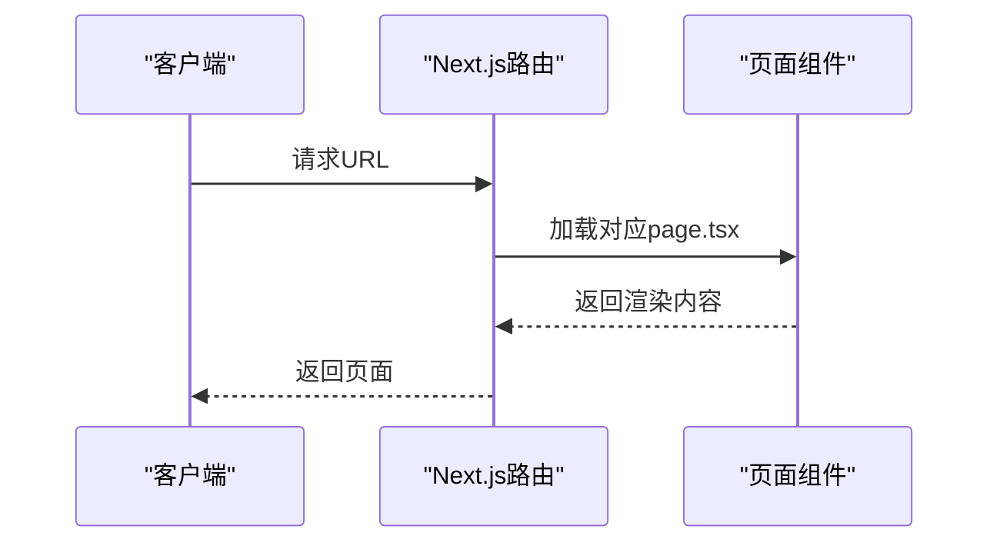
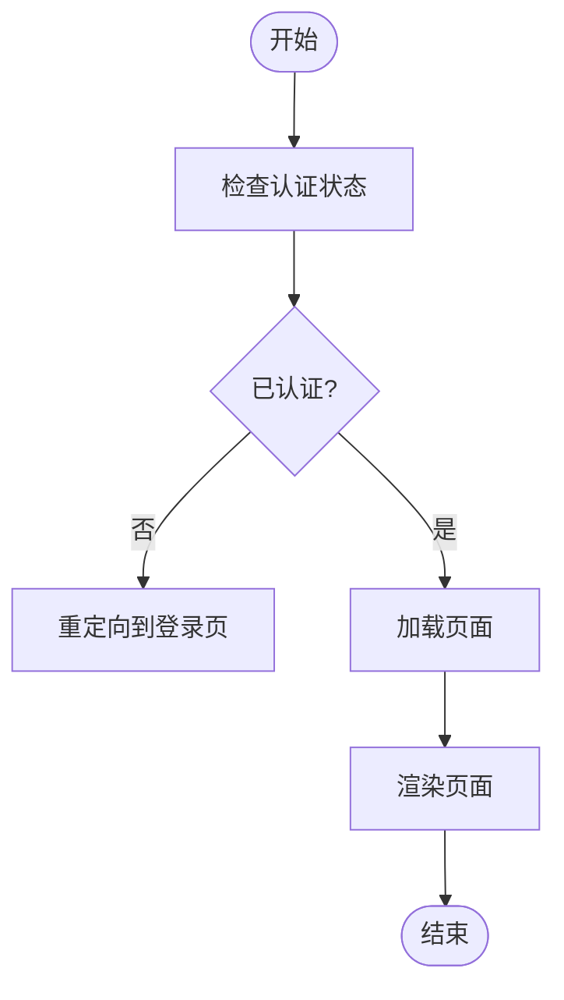
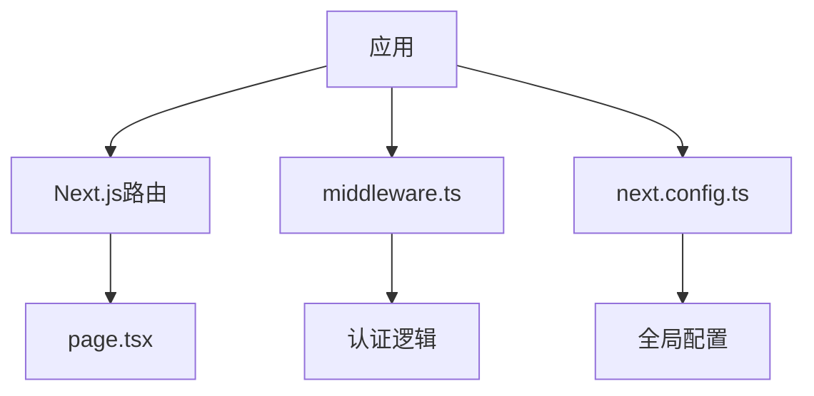

# 静态路由

<cite>
**本文档引用的文件**  
- [page.tsx](file://src/app/page.tsx)
- [auth/signin/page.tsx](file://src/app/auth/signin/page.tsx)
- [profile/page.tsx](file://src/app/profile/page.tsx)
- [upload/page.tsx](file://src/app/upload/page.tsx)
- [layout.tsx](file://src/app/layout.tsx)
- [error.tsx](file://src/app/error.tsx)
- [middleware.ts](file://middleware.ts)
- [next.config.ts](file://next.config.ts)
</cite>

## 目录
1. [简介](#简介)
2. [项目结构](#项目结构)
3. [核心组件](#核心组件)
4. [架构概述](#架构概述)
5. [详细组件分析](#详细组件分析)
6. [依赖分析](#依赖分析)
7. [性能考虑](#性能考虑)
8. [故障排除指南](#故障排除指南)
9. [结论](#结论)

## 简介
本文档详细说明了Next.js App Router中静态路由的实现机制，解释了`src/app`目录下各`page.tsx`文件如何映射到具体URL路径（如`/`、`/auth/signin`、`/profile`等）。结合代码示例展示页面组件的导出方式与路由生成规则，阐述静态路由在构建时的预渲染优势。描述其在SEO优化、加载性能方面的表现，并说明如何通过`Link`组件或路由API进行页面跳转。同时指出常见配置错误（如文件命名不规范、嵌套路径遗漏`layout.tsx`）及其解决方案。

## 项目结构
项目采用Next.js App Router结构，`src/app`目录下的文件系统直接映射为应用的路由结构。每个`page.tsx`文件对应一个URL路径，例如`src/app/page.tsx`对应根路径`/`，`src/app/auth/signin/page.tsx`对应`/auth/signin`路径。

**图示来源**
- [page.tsx](file://src/app/page.tsx)
- [auth/signin/page.tsx](file://src/app/auth/signin/page.tsx)
- [profile/page.tsx](file://src/app/profile/page.tsx)
- [upload/page.tsx](file://src/app/upload/page.tsx)

**章节来源**
- [page.tsx](file://src/app/page.tsx)
- [auth/signin/page.tsx](file://src/app/auth/signin/page.tsx)
- [profile/page.tsx](file://src/app/profile/page.tsx)
- [upload/page.tsx](file://src/app/upload/page.tsx)

## 核心组件
`src/app`目录下的`page.tsx`文件是应用的核心组件，每个文件对应一个路由路径。这些组件通过默认导出的方式暴露给Next.js路由系统，实现静态路由的映射。

**章节来源**
- [page.tsx](file://src/app/page.tsx)
- [auth/signin/page.tsx](file://src/app/auth/signin/page.tsx)
- [profile/page.tsx](file://src/app/profile/page.tsx)
- [upload/page.tsx](file://src/app/upload/page.tsx)

## 架构概述
Next.js App Router通过文件系统实现静态路由，`src/app`目录下的文件结构直接映射为应用的URL路径。每个`page.tsx`文件对应一个路由，`layout.tsx`文件用于定义页面布局，`error.tsx`文件用于处理错误。

**图示来源**
- [layout.tsx](file://src/app/layout.tsx)
- [error.tsx](file://src/app/error.tsx)

**章节来源**
- [layout.tsx](file://src/app/layout.tsx)
- [error.tsx](file://src/app/error.tsx)

## 详细组件分析
### 页面组件分析
`src/app`目录下的`page.tsx`文件通过默认导出的方式暴露给Next.js路由系统，实现静态路由的映射。每个`page.tsx`文件对应一个URL路径，例如`src/app/page.tsx`对应根路径`/`，`src/app/auth/signin/page.tsx`对应`/auth/signin`路径。

#### 对象导向组件

**图示来源**
- [page.tsx](file://src/app/page.tsx)
- [layout.tsx](file://src/app/layout.tsx)
- [error.tsx](file://src/app/error.tsx)

**章节来源**
- [page.tsx](file://src/app/page.tsx)
- [layout.tsx](file://src/app/layout.tsx)
- [error.tsx](file://src/app/error.tsx)

### API/服务组件

**图示来源**
- [page.tsx](file://src/app/page.tsx)

**章节来源**
- [page.tsx](file://src/app/page.tsx)

### 复杂逻辑组件

**图示来源**
- [middleware.ts](file://middleware.ts)

**章节来源**
- [middleware.ts](file://middleware.ts)

## 依赖分析
应用依赖于Next.js的路由系统，通过文件系统实现静态路由。`middleware.ts`文件用于处理认证和重定向逻辑，`next.config.ts`文件用于配置应用的全局设置。

**图示来源**
- [middleware.ts](file://middleware.ts)
- [next.config.ts](file://next.config.ts)

**章节来源**
- [middleware.ts](file://middleware.ts)
- [next.config.ts](file://next.config.ts)

## 性能考虑
静态路由在构建时进行预渲染，提升了加载性能和SEO优化。通过`Link`组件或路由API进行页面跳转，避免了全页面刷新，提升了用户体验。

## 故障排除指南
常见配置错误包括文件命名不规范、嵌套路径遗漏`layout.tsx`等。解决方案包括确保文件命名正确、在嵌套路径中添加`layout.tsx`文件等。

**章节来源**
- [page.tsx](file://src/app/page.tsx)
- [layout.tsx](file://src/app/layout.tsx)

## 结论
Next.js App Router通过文件系统实现静态路由，`src/app`目录下的`page.tsx`文件直接映射为应用的URL路径。通过默认导出的方式暴露给Next.js路由系统，实现静态路由的映射。静态路由在构建时进行预渲染，提升了加载性能和SEO优化。通过`Link`组件或路由API进行页面跳转，避免了全页面刷新，提升了用户体验。