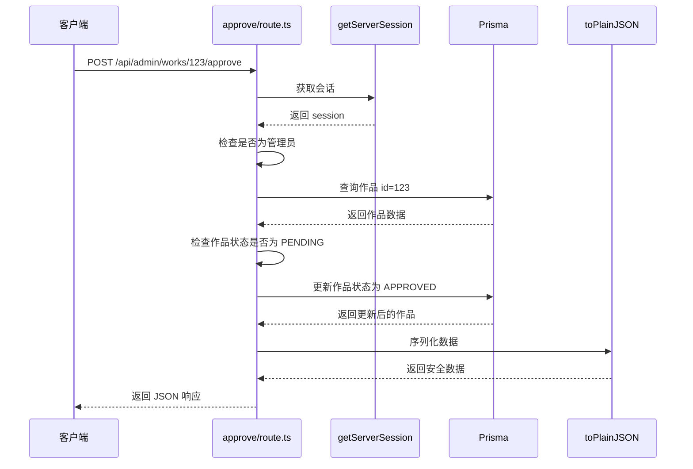

# API 路由结构

<cite>
**本文档引用的文件**  
- [src/app/api/admin/works/[id]/approve/route.ts](file://src/app/api/admin/works/[id]/approve/route.ts)
- [src/app/api/admin/works/[id]/reject/route.ts](file://src/app/api/admin/works/[id]/reject/route.ts)
- [src/app/api/works/[id]/like/route.ts](file://src/app/api/works/[id]/like/route.ts)
- [src/app/api/user/works/route.ts](file://src/app/api/user/works/route.ts)
- [src/app/api/admin/users/[id]/route.ts](file://src/app/api/admin/users/[id]/route.ts)
- [src/app/api/works/route.ts](file://src/app/api/works/route.ts)
- [src/app/api/admin/works/route.ts](file://src/app/api/admin/works/route.ts)
- [src/app/api/user/profile/route.ts](file://src/app/api/user/profile/route.ts)
- [src/app/api/auth/[...nextauth]/route.ts](file://src/app/api/auth/[...nextauth]/route.ts)
- [src/lib/auth.ts](file://src/lib/auth.ts)
- [src/app/api/register/route.ts](file://src/app/api/register/route.ts)
</cite>

## 目录

1. [简介](#简介)
2. [API 路由组织结构](#api-路由组织结构)
3. [核心 API 模块职责划分](#核心-api-模块职责划分)
4. [RESTful 设计原则实现](#restful-设计原则实现)
5. [典型请求处理流程分析](#典型请求处理流程分析)
6. [数据验证与错误处理](#数据验证与错误处理)
7. [请求与响应示例](#请求与响应示例)
8. [扩展新 API 端点指南](#扩展新-api-端点指南)
9. [结论](#结论)

## 简介

本项目采用 Next.js App Router 架构，其 API 路由通过文件系统自动映射。所有 API 端点位于 `src/app/api` 目录下，通过文件夹层级和 `route.ts` 文件定义路由路径与 HTTP 方法处理逻辑。本文档详细说明 API 路由的组织方式、职责划分、RESTful 实践以及关键实现细节。

## API 路由组织结构

项目 API 路由采用分层命名空间设计，主要分为 `admin`、`user`、`auth`、`works` 等模块，清晰划分不同功能域。

```mermaid
graph TB
A[/api] --> B[admin]
A --> C[user]
A --> D[auth]
A --> E[works]
A --> F[health]
A --> G[upload]
A --> H[platform-config]
B --> B1[users]
B --> B2[works]
B --> B3[stats]
B --> B4[upload-config]
B --> B5[online-counter]
C --> C1[profile]
C --> C2[works]
D --> D1[[...nextauth]]
E --> E1[[id]]
E --> E2[user-count]
B2 --> B21[[id]]
B21 --> B21a[approve]
B21 --> B21b[reject]
B21 --> B21c[featured]
B21 --> B21d[edit]
E1 --> E1a[like]
E1 --> E1b[view]
```

**Diagram sources**
- [src/app/api/admin/works/route.ts](file://src/app/api/admin/works/route.ts)
- [src/app/api/works/route.ts](file://src/app/api/works/route.ts)
- [src/app/api/user/works/route.ts](file://src/app/api/user/works/route.ts)

**Section sources**
- [src/app/api](file://src/app/api)

## 核心 API 模块职责划分

### 管理员 API (admin)
`/api/admin` 路径下的端点专为管理员角色设计，提供系统管理功能，包括用户管理、作品审核、平台配置等。所有端点均强制进行管理员权限校验。

**Section sources**
- [src/app/api/admin/users/[id]/route.ts](file://src/app/api/admin/users/[id]/route.ts)
- [src/app/api/admin/works/route.ts](file://src/app/api/admin/works/route.ts)

### 用户 API (user)
`/api/user` 路径下的端点服务于已登录用户，提供个人资料管理、个人作品管理等功能。访问受用户身份认证保护。

**Section sources**
- [src/app/api/user/profile/route.ts](file://src/app/api/user/profile/route.ts)
- [src/app/api/user/works/route.ts](file://src/app/api/user/works/route.ts)

### 作品 API (works)
`/api/works` 是核心业务模块，面向所有用户（包括游客）提供作品的创建、查询、互动（点赞、浏览）等功能。部分操作（如删除）需管理员权限。

**Section sources**
- [src/app/api/works/route.ts](file://src/app/api/works/route.ts)
- [src/app/api/works/[id]/like/route.ts](file://src/app/api/works/[id]/like/route.ts)

### 认证 API (auth)
`/api/auth` 集成 NextAuth.js，处理用户登录、会话管理等认证相关逻辑。`[...nextauth]` 动态路由捕获所有认证子路径。

**Section sources**
- [src/app/api/auth/[...nextauth]/route.ts](file://src/app/api/auth/[...nextauth]/route.ts)
- [src/lib/auth.ts](file://src/lib/auth.ts)

## RESTful 设计原则实现

### HTTP 方法使用
项目严格遵循 RESTful 约定，使用标准 HTTP 方法：
- `GET`：获取资源（如作品列表、用户信息）
- `POST`：创建资源或执行操作（如提交作品、点赞）
- `PUT`：更新资源（如修改用户资料）
- `DELETE`：删除资源（如删除用户、批量删除作品）

### 路径命名规范
- **资源导向**：使用名词复数表示资源集合（`/api/works`, `/api/users`）。
- **层级清晰**：通过路径参数 `[id]` 表示资源实例（`/api/works/[id]`）。
- **操作分离**：复杂操作通过子路径表示（`/api/admin/works/[id]/approve`），而非在查询参数中指定。

### 参数传递机制
- **路径参数**：用于标识资源（`[id]`）。
- **查询参数**：用于过滤、分页和排序（`?page=1&limit=10&status=PENDING`）。
- **请求体**：用于传递创建或更新操作的数据（`POST`, `PUT`）。

**Section sources**
- [src/app/api/works/route.ts](file://src/app/api/works/route.ts)
- [src/app/api/user/works/route.ts](file://src/app/api/user/works/route.ts)
- [src/app/api/admin/users/[id]/route.ts](file://src/app/api/admin/users/[id]/route.ts)

## 典型请求处理流程分析

以作品审核通过 (`/api/admin/works/[id]/approve`) 为例，展示完整处理流程：



**Diagram sources**
- [src/app/api/admin/works/[id]/approve/route.ts](file://src/app/api/admin/works/[id]/approve/route.ts)

**Section sources**
- [src/app/api/admin/works/[id]/approve/route.ts](file://src/app/api/admin/works/[id]/approve/route.ts)

## 数据验证与错误处理

### 数据验证 (Zod)
项目广泛使用 Zod 库进行数据验证，确保输入数据的正确性。
- **请求体验证**：在 `POST`/`PUT` 请求中，使用 Zod Schema 解析并验证 `request.json()`。
- **查询参数验证**：在 `GET` 请求中，使用 Zod 解析和验证 URL 查询参数。

### 错误响应格式化
所有错误响应遵循统一格式，便于前端处理：
```json
{
  "success": false,
  "error": "错误信息",
  "code": "错误代码",
  "details": "详细信息（开发环境）"
}
```
- **权限不足**：返回 403 状态码，`code: 'FORBIDDEN'`。
- **数据验证失败**：返回 400 状态码，`code: 'VALIDATION_ERROR'`，并包含 `details` 字段。
- **服务器错误**：返回 500 状态码，`code: 'INTERNAL_ERROR'`。

### 日志记录
关键操作和错误均通过 `console.error` 记录，便于问题排查和监控。

**Section sources**
- [src/app/api/admin/works/[id]/reject/route.ts](file://src/app/api/admin/works/[id]/reject/route.ts)
- [src/app/api/user/works/route.ts](file://src/app/api/user/works/route.ts)
- [src/app/api/register/route.ts](file://src/app/api/register/route.ts)

## 请求与响应示例

### 示例 1: 审核通过作品
- **请求**:
  ```http
  POST /api/admin/works/clx8m3q1a0000a1b2c3d4e5f/approve
  Authorization: Bearer <admin_token>
  ```
- **成功响应**:
  ```json
  {
    "success": true,
    "data": { /* 作品数据 */ },
    "message": "作品审核通过"
  }
  ```

### 示例 2: 用户注册
- **请求**:
  ```http
  POST /api/register
  Content-Type: application/json

  {
    "name": "张三",
    "email": "zhangsan@example.com",
    "password": "123456",
    "confirmPassword": "123456"
  }
  ```
- **验证失败响应**:
  ```json
  {
    "success": false,
    "error": "输入数据无效",
    "code": "VALIDATION_ERROR",
    "details": [
      { "path": ["email"], "message": "请输入有效的邮箱地址", "code": "invalid_string" }
    ]
  }
  ```

**Section sources**
- [src/app/api/admin/works/[id]/approve/route.ts](file://src/app/api/admin/works/[id]/approve/route.ts)
- [src/app/api/register/route.ts](file://src/app/api/register/route.ts)

## 扩展新 API 端点指南

要添加新的 API 端点，请遵循以下步骤：
1. 在 `src/app/api` 下创建相应的文件夹结构。
2. 在目标文件夹内创建 `route.ts` 文件。
3. 导出 `GET`, `POST`, `PUT`, `DELETE` 等函数以处理对应 HTTP 方法。
4. 如需路径参数，创建以 `[param]` 命名的子文件夹。
5. 使用 `getServerSession(authOptions)` 进行身份认证。
6. 使用 Zod Schema 进行数据验证。
7. 使用 `prisma` 进行数据库操作。
8. 使用 `NextResponse.json()` 返回结构化响应。

**Section sources**
- [src/app/api](file://src/app/api)
- [src/lib/auth.ts](file://src/lib/auth.ts)

## 结论

本项目的 API 路由结构清晰、职责分明，严格遵循 RESTful 设计原则。通过 Next.js App Router 的文件系统路由机制，实现了高效、可维护的后端接口。结合 Zod 验证、统一的错误处理和详细的日志记录，确保了 API 的健壮性和易用性。该结构为未来功能扩展提供了坚实的基础。