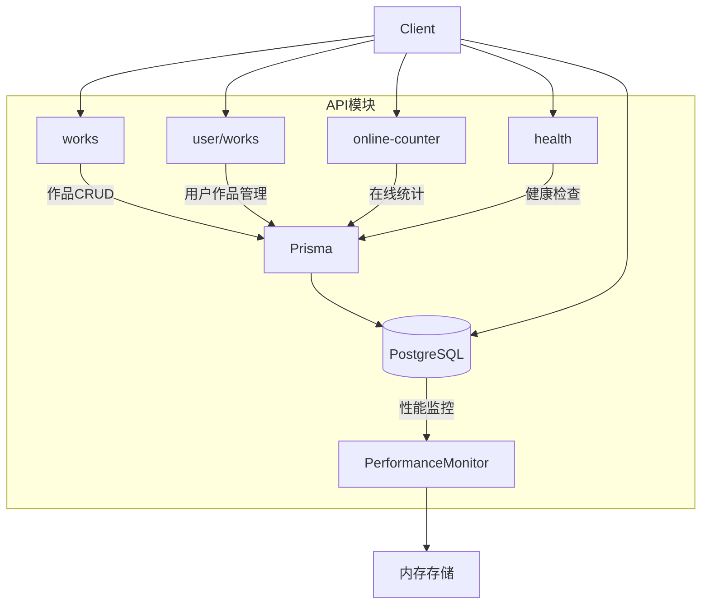
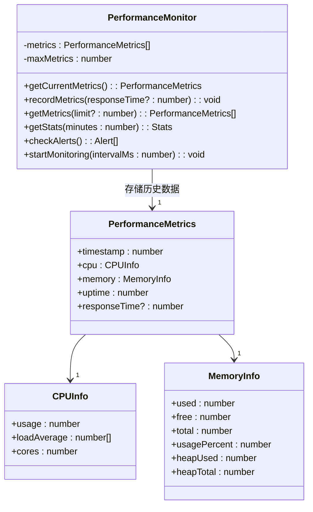
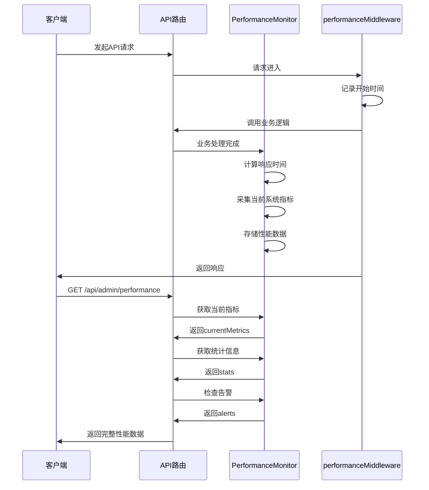
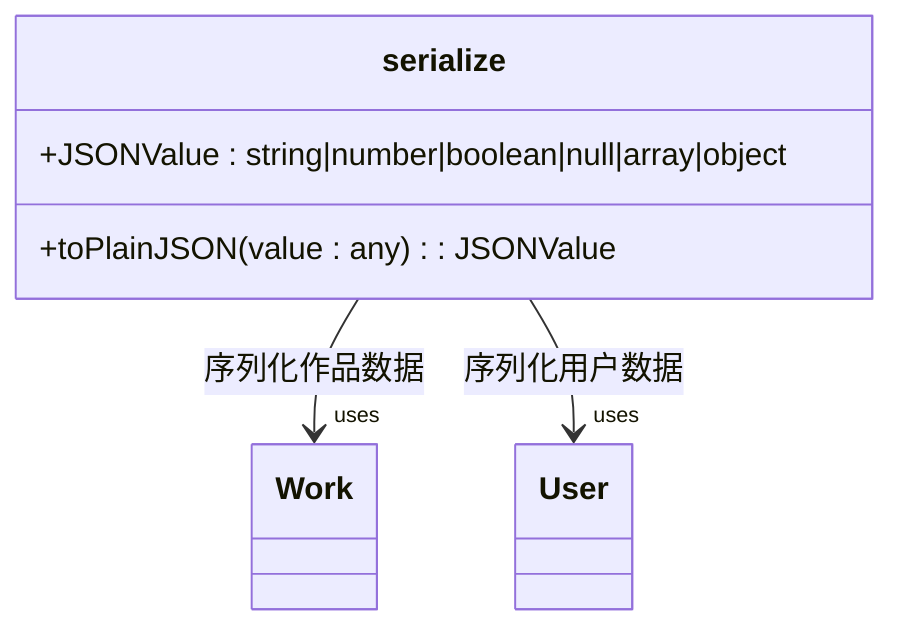
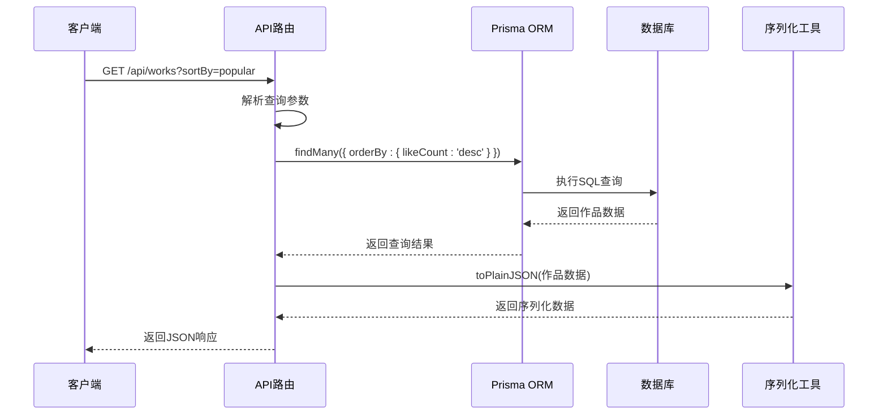

# API设计

<cite>
**本文档中引用的文件**  
- [serialize.ts](file://src/lib/serialize.ts)
- [works/route.ts](file://src/app/api/works/route.ts)
- [works/[id]/route.ts](file://src/app/api/works/[id]/route.ts)
- [works/[id]/like/route.ts](file://src/app/api/works/[id]/like/route.ts)
- [works/[id]/view/route.ts](file://src/app/api/works/[id]/view/route.ts)
- [user/works/route.ts](file://src/app/api/user/works/route.ts)
- [user/works/[id]/route.ts](file://src/app/api/user/works/[id]/route.ts)
- [online-counter/route.ts](file://src/app/api/online-counter/route.ts)
- [health/route.ts](file://src/app/api/health/route.ts)
- [prisma.ts](file://src/lib/prisma.ts)
- [auth.ts](file://src/lib/auth.ts)
- [work.d.ts](file://src/types/work.d.ts)
- [admin/performance/route.ts](file://src/app/api/admin/performance/route.ts) - *新增性能监控API*
- [performance-monitor.ts](file://src/lib/performance-monitor.ts) - *新增性能监控核心模块*
</cite>

## 更新摘要
**已更新内容**  
- 在“核心API模块分析”中新增“管理API模块分析”章节，详细描述性能监控接口
- 更新“API架构概览”以反映新增的管理API模块
- 新增性能监控系统的数据结构与工作流程说明
- 补充性能监控相关的时序图与类图
- 更新“潜在性能瓶颈与缓存优化建议”以包含监控系统优化建议

### 目录
1. [简介](#简介)
2. [API架构概览](#api架构概览)
3. [核心API模块分析](#核心api模块分析)
4. [管理API模块分析](#管理api模块分析)
5. [数据序列化与响应封装](#数据序列化与响应封装)
6. [API版本控制与状态码规范](#api版本控制与状态码规范)
7. [典型请求流程时序图](#典型请求流程时序图)
8. [新增API端点实现示例](#新增api端点实现示例)
9. [性能瓶颈与缓存优化建议](#性能瓶颈与缓存优化建议)
10. [结论](#结论)

## 简介
本项目基于Next.js App Router构建RESTful API，提供作品展示、用户管理、在线统计等核心功能。API设计遵循清晰的职责划分原则，通过统一的响应格式和错误处理机制确保接口一致性。系统采用Prisma作为ORM层与数据库交互，并通过`serialize.ts`统一处理JSON序列化逻辑。新增性能监控系统，为管理员提供服务器运行状态的实时洞察。

## API架构概览
API路由集中于`/src/app/api`目录下，采用模块化设计：
- `works`：公共作品接口，支持增删改查及互动功能
- `user/works`：用户个人作品管理接口
- `online-counter`：在线人数统计接口
- `health`：健康检查接口
- `admin/performance`：性能监控接口（新增）

所有API均使用Next.js Route Handlers实现，支持GET、POST、PUT、DELETE等HTTP方法，返回标准化JSON响应。



**Diagram sources**
- [works/route.ts](file://src/app/api/works/route.ts)
- [user/works/route.ts](file://src/app/api/user/works/route.ts)
- [online-counter/route.ts](file://src/app/api/online-counter/route.ts)
- [health/route.ts](file://src/app/api/health/route.ts)
- [admin/performance/route.ts](file://src/app/api/admin/performance/route.ts)

**Section sources**
- [works/route.ts](file://src/app/api/works/route.ts)
- [user/works/route.ts](file://src/app/api/user/works/route.ts)

## 核心API模块分析

### 作品管理API（/api/works）
提供作品的增删改查与互动功能。

#### GET /api/works - 获取作品列表
- **方法**: GET
- **参数**:
  - `status`: 过滤状态（PENDING, APPROVED, REJECTED）
  - `sortBy`: 排序方式（latest, popular, default）
  - `page`: 页码（默认1）
  - `limit`: 每页数量（默认10）
- **响应结构**:
```json
{
  "success": true,
  "data": {
    "works": [...],
    "pagination": {
      "page": 1,
      "limit": 10,
      "total": 100,
      "pages": 10
    }
  },
  "message": "获取作品列表成功"
}
```
- **错误处理**:
  - 500: 获取失败（FETCH_ERROR）

**Section sources**
- [works/route.ts](file://src/app/api/works/route.ts#L1-L207)

#### POST /api/works - 创建作品
- **方法**: POST
- **请求体**:
```json
{
  "name": "作品名称",
  "author": "作者名",
  "prompt": "AI提示词",
  "imageUrl": "图片URL"
}
```
- **验证规则**:
  - name和imageUrl为必填字段
  - 上传功能需启用且在时间窗口内
  - 登录用户受上传数量限制
- **响应状态码**:
  - 201: 创建成功
  - 400: 缺少必填字段（MISSING_REQUIRED_FIELDS）
  - 403: 上传功能关闭/未开始/已结束（UPLOAD_DISABLED等）
  - 500: 创建失败（CREATE_ERROR）

**Section sources**
- [works/route.ts](file://src/app/api/works/route.ts#L108-L207)

#### GET /api/works/[id] - 获取单个作品
- **方法**: GET
- **路径参数**: id
- **响应**:
  - 200: 返回作品详情
  - 404: 作品不存在
  - 500: 获取失败

**Section sources**
- [works/[id]/route.ts](file://src/app/api/works/[id]/route.ts#L45-L78)

#### PUT /api/works/[id] - 更新作品
- **方法**: PUT
- **权限控制**:
  - 仅作品创建者或管理员可编辑
  - 普通用户修改内容后自动转为待审核状态
  - 仅管理员可修改状态和精选字段
- **验证模式**: 使用Zod进行输入校验（WorkEditSchema）
- **响应**:
  - 200: 更新成功
  - 400: 输入数据无效（VALIDATION_ERROR）
  - 401: 未登录（UNAUTHORIZED）
  - 403: 权限不足（FORBIDDEN）
  - 404: 作品不存在（NOT_FOUND）

**Section sources**
- [works/[id]/route.ts](file://src/app/api/works/[id]/route.ts#L80-L275)

#### DELETE /api/works/[id] - 删除作品
- **方法**: DELETE
- **权限控制**: 仅作者或管理员可删除
- **清理操作**: 删除OSS中的图片文件
- **响应**:
  - 200: 删除成功
  - 401: 未登录
  - 403: 权限不足
  - 404: 作品不存在
  - 500: 删除失败

**Section sources**
- [works/[id]/route.ts](file://src/app/api/works/[id]/route.ts#L277-L328)

### 用户作品管理API（/api/user/works）
专用于用户个人作品的查询与管理。

#### GET /api/user/works - 获取用户作品列表
- **方法**: GET
- **认证要求**: 必须登录
- **查询参数**:
  - `status`: 状态过滤
  - `search`: 名称或描述搜索
- **响应结构**: 包含分页信息的用户作品列表
- **错误处理**:
  - 401: 未登录（UNAUTHORIZED）
  - 400: 查询参数无效（VALIDATION_ERROR）

**Section sources**
- [user/works/route.ts](file://src/app/api/user/works/route.ts#L25-L125)

#### GET /api/user/works/[id] - 获取个人作品详情
- **方法**: GET
- **权限控制**: 仅可访问自己的作品
- **响应**:
  - 200: 获取成功
  - 401: 未登录
  - 404: 作品不存在或无权访问

**Section sources**
- [user/works/[id]/route.ts](file://src/app/api/user/works/[id]/route.ts#L13-L70)

#### DELETE /api/user/works/[id] - 删除个人作品
- **方法**: DELETE
- **权限控制**: 仅可删除自己的作品
- **清理操作**: 删除OSS文件
- **响应**:
  - 200: 删除成功
  - 401: 未登录
  - 404: 作品不存在或无权删除

**Section sources**
- [user/works/[id]/route.ts](file://src/app/api/user/works/[id]/route.ts#L72-L139)

### 作品互动API
#### POST /api/works/[id]/like - 点赞作品
- **方法**: POST
- **逻辑**: 随机增加1-10个点赞数
- **条件**: 仅已审核通过的作品可点赞
- **响应**: 返回更新后的点赞数和实际增加数量

**Section sources**
- [works/[id]/like/route.ts](file://src/app/api/works/[id]/like/route.ts#L1-L64)

#### POST /api/works/[id]/view - 增加浏览量
- **方法**: POST
- **逻辑**: 浏览量+1
- **条件**: 仅已审核通过的作品可增加浏览量

**Section sources**
- [works/[id]/view/route.ts](file://src/app/api/works/[id]/view/route.ts#L1-L61)

### 在线人数统计API（/api/online-counter）
#### GET /api/online-counter - 获取在线人数
- **方法**: GET
- **动态增长**: 每10秒根据配置增长率随机增加
- **响应**: 返回当前人数、显示文本、启用状态

**Section sources**
- [online-counter/route.ts](file://src/app/api/online-counter/route.ts#L1-L100)

#### POST /api/online-counter/increment - 手动增加人数
- **方法**: POST
- **请求体**: `{ "increment": 1 }`
- **验证**: 增量1-100之间

**Section sources**
- [online-counter/route.ts](file://src/app/api/online-counter/route.ts#L102-L188)

### 健康检查API（/api/health）
#### GET /api/health - 健康检查
- **方法**: GET
- **功能**: 检测数据库连接状态
- **响应**:
  - 200: 服务正常
  - 500: 服务异常（数据库断开等）

**Section sources**
- [health/route.ts](file://src/app/api/health/route.ts#L1-L26)

## 管理API模块分析

### 性能监控API（/api/admin/performance）
为管理员提供服务器性能指标的实时监控与历史数据分析。

#### GET /api/admin/performance - 获取性能指标
- **方法**: GET
- **认证要求**: 必须登录且为管理员角色
- **查询参数**:
  - `minutes`: 统计时间窗口（默认5分钟）
  - `history`: 是否包含历史数据（true/false）
- **响应结构**:
```json
{
  "success": true,
  "data": {
    "current": {
      "timestamp": 1730000000000,
      "cpu": {
        "usage": 15.5,
        "loadAverage": [1.2, 1.1, 1.0],
        "cores": 8
      },
      "memory": {
        "used": 2147483648,
        "free": 4294967296,
        "total": 6442450944,
        "usagePercent": 33.3,
        "heapUsed": 1073741824,
        "heapTotal": 2147483648
      },
      "uptime": 3600
    },
    "stats": {
      "avgCpuUsage": 15.2,
      "avgMemoryUsage": 33.1,
      "avgResponseTime": 45.6,
      "maxMemoryUsage": 40.0,
      "maxCpuUsage": 25.0,
      "maxResponseTime": 120.0
    },
    "alerts": [
      {
        "type": "warning",
        "message": "内存使用率较高: 33.3%"
      }
    ],
    "serverInfo": {
      "nodeVersion": "v18.17.0",
      "platform": "linux",
      "arch": "x64",
      "pid": 12345
    },
    "history": [...]
  }
}
```
- **错误处理**:
  - 401: 未登录（UNAUTHORIZED）
  - 403: 权限不足（非管理员）
  - 500: 获取指标失败

**Section sources**
- [admin/performance/route.ts](file://src/app/api/admin/performance/route.ts#L1-L123)

#### DELETE /api/admin/performance - 清理性能数据
- **方法**: DELETE
- **权限控制**: 仅管理员可访问
- **功能**: 重置性能监控历史数据
- **响应**:
  - 200: 清理成功
  - 401: 未登录
  - 403: 权限不足
  - 500: 清理失败

**Section sources**
- [admin/performance/route.ts](file://src/app/api/admin/performance/route.ts#L125-L188)

### 性能监控系统架构
基于单例模式实现的内存中性能监控系统，定期采集服务器指标。



**Diagram sources**
- [performance-monitor.ts](file://src/lib/performance-monitor.ts#L22-L202)
- [performance-monitor.ts](file://src/lib/performance-monitor.ts#L3-L20)

**Section sources**
- [performance-monitor.ts](file://src/lib/performance-monitor.ts#L22-L202)

### 性能监控数据采集流程


**Diagram sources**
- [admin/performance/route.ts](file://src/app/api/admin/performance/route.ts#L1-L123)
- [performance-monitor.ts](file://src/lib/performance-monitor.ts#L205-L217)

**Section sources**
- [admin/performance/route.ts](file://src/app/api/admin/performance/route.ts#L1-L123)

## 数据序列化与响应封装
通过`serialize.ts`统一处理数据序列化：



**Diagram sources**
- [serialize.ts](file://src/lib/serialize.ts#L1-L53)
- [work.d.ts](file://src/types/work.d.ts#L1-L96)

**Section sources**
- [serialize.ts](file://src/lib/serialize.ts#L1-L53)

### 序列化特性
- 支持基本类型、数组、对象、Date、BigInt
- 自动跳过undefined值
- 优化图片URL：优先使用ossUrl
- 防止精度丢失：BigInt转字符串

### 统一响应格式
```json
// 成功响应
{
  "success": true,
  "data": { ... },
  "message": "操作成功"
}

// 失败响应
{
  "success": false,
  "error": "错误信息",
  "code": "错误码"
}
```

## API版本控制与状态码规范
### 版本控制策略
当前采用无版本前缀设计（即v1），未来可通过以下方式演进：
- 路径版本化：`/api/v1/works`
- 请求头版本控制：`Accept: application/vnd.api.v1+json`

### 状态码规范
- **200**: 请求成功（GET/PUT/DELETE）
- **201**: 资源创建成功（POST）
- **400**: 客户端请求错误（参数验证失败）
- **401**: 未授权（需要登录）
- **403**: 禁止访问（权限不足）
- **404**: 资源不存在
- **500**: 服务器内部错误

## 典型请求流程时序图


**Diagram sources**
- [works/route.ts](file://src/app/api/works/route.ts#L1-L207)
- [serialize.ts](file://src/lib/serialize.ts#L1-L53)
- [prisma.ts](file://src/lib/prisma.ts#L1-L20)

**Section sources**
- [works/route.ts](file://src/app/api/works/route.ts#L1-L207)

## 新增API端点实现示例
添加新API端点应遵循以下步骤：

1. 在`/src/app/api`下创建新目录
2. 创建`route.ts`文件
3. 导入必要依赖
4. 实现标准HTTP方法处理器
5. 使用统一响应格式
6. 添加输入验证（如需要）
7. 集成序列化工具

```typescript
import { NextRequest, NextResponse } from 'next/server';
import { getServerSession } from 'next-auth';
import { authOptions } from '@/lib/auth';
import { prisma } from '@/lib/prisma';
import { toPlainJSON } from '@/lib/serialize';

export async function GET(request: NextRequest) {
  try {
    // 业务逻辑
    const data = await prisma.example.findMany();
    
    return NextResponse.json({
      success: true,
      data: toPlainJSON(data)
    });
  } catch (error) {
    return NextResponse.json({
      success: false,
      error: '获取数据失败'
    }, { status: 500 });
  }
}
```

**Section sources**
- [works/route.ts](file://src/app/api/works/route.ts)
- [serialize.ts](file://src/lib/serialize.ts)

## 性能瓶颈与缓存优化建议
### 潜在性能瓶颈
1. **数据库查询压力**：高频访问的作品列表查询
2. **序列化开销**：大型数据集的JSON序列化
3. **在线人数更新**：频繁的数据库写操作
4. **OSS文件删除**：同步删除可能阻塞请求
5. **性能监控数据存储**：内存中存储大量历史指标可能影响性能

### 缓存优化建议
1. **Redis缓存作品列表**：
   - 缓存热门排序结果（latest, popular）
   - 设置TTL（如60秒）平衡实时性与性能

2. **CDN缓存静态资源**：
   - 作品图片通过CDN分发
   - 设置合理缓存策略

3. **内存缓存在线人数**：
   - 减少数据库读写频率
   - 定期持久化到数据库

4. **批量操作优化**：
   - 合并多个Prisma查询为Promise.all
   - 使用include/select精确控制返回字段

5. **异步清理操作**：
   - OSS文件删除改为后台任务
   - 避免阻塞主请求流程

6. **性能监控优化**：
   - 将历史性能数据持久化到数据库，避免内存占用过高
   - 提供数据导出功能，支持离线分析
   - 优化告警检查频率，避免过度消耗CPU

**Section sources**
- [works/route.ts](file://src/app/api/works/route.ts)
- [online-counter/route.ts](file://src/app/api/online-counter/route.ts)
- [performance-monitor.ts](file://src/lib/performance-monitor.ts)

## 结论
本项目API设计遵循RESTful原则，通过模块化路由、统一响应格式和严格的错误处理机制确保接口一致性。系统已实现作品管理、用户交互、在线统计等核心功能，并新增了管理员性能监控模块。性能监控系统通过内存存储和定期采集的方式，为系统运维提供了重要支持。建议后续引入缓存机制以提升高并发场景下的性能表现，同时考虑API版本化策略以支持未来迭代，并优化性能监控数据的持久化方案。