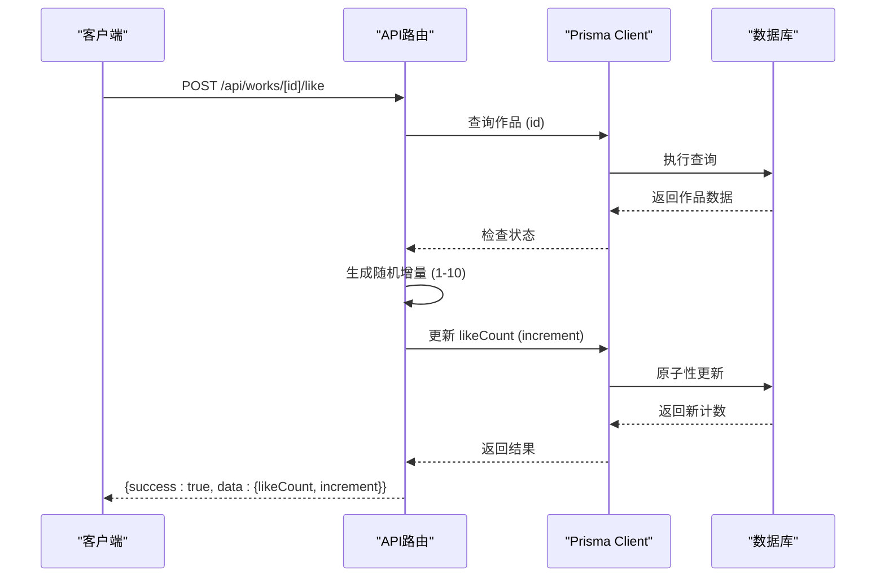
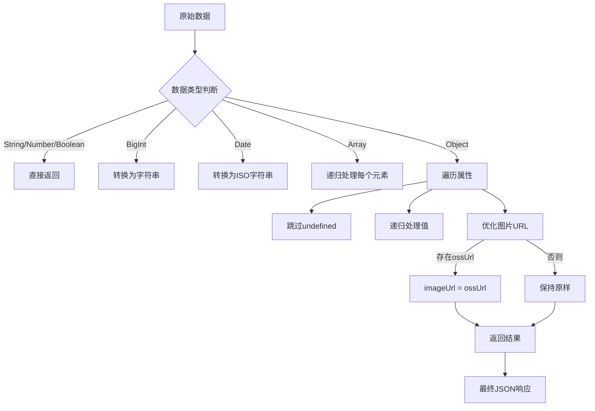
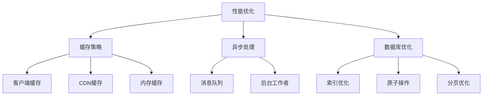

# 作品API

<cite>
**本文档引用的文件**  
- [src/app/api/works/route.ts](file://src/app/api/works/route.ts)
- [src/app/api/works/[id]/route.ts](file://src/app/api/works/[id]/route.ts)
- [src/app/api/works/[id]/like/route.ts](file://src/app/api/works/[id]/like/route.ts)
- [src/app/api/works/[id]/view/route.ts](file://src/app/api/works/[id]/view/route.ts)
- [src/app/api/works/user-count/route.ts](file://src/app/api/works/user-count/route.ts)
- [prisma/schema.prisma](file://prisma/schema.prisma)
- [src/lib/serialize.ts](file://src/lib/serialize.ts)
- [src/types/work.d.ts](file://src/types/work.d.ts)
</cite>

## 目录
1. [简介](#简介)
2. [作品全生命周期管理](#作品全生命周期管理)
3. [用户互动功能](#用户互动功能)
4. [数据序列化与响应格式](#数据序列化与响应格式)
5. [错误处理机制](#错误处理机制)
6. [性能优化建议](#性能优化建议)
7. [结论](#结论)

## 简介
本API文档详细说明了数字化作品互动展示平台中作品资源的全生命周期管理与用户互动功能。文档涵盖作品的创建、查询、更新、删除等核心操作，以及点赞、浏览计数和用户作品统计等互动功能。所有接口均基于Next.js App Router构建，使用Prisma进行数据库操作，并通过`serialize.ts`统一响应格式。系统采用JWT认证机制，确保接口安全。

**章节来源**
- [src/app/api/works/route.ts](file://src/app/api/works/route.ts#L1-L206)
- [prisma/schema.prisma](file://prisma/schema.prisma#L105-L144)

## 作品全生命周期管理

### GET /api/works - 获取作品列表
- **方法**: GET
- **认证要求**: 无（游客可访问）
- **请求头**: 无
- **查询参数**:
  - `status`: 过滤状态（PENDING/APPROVED/REJECTED），默认为APPROVED
  - `sortBy`: 排序方式（latest/ popular/ default）
  - `page`: 页码，默认为1
  - `limit`: 每页数量，默认为10
- **成功响应**:
```json
{
  "success": true,
  "data": {
    "works": [
      {
        "id": "wk123",
        "name": "artwork1.jpg",
        "title": "作品标题",
        "author": "作者名",
        "status": "APPROVED",
        "featured": false,
        "likeCount": 0,
        "viewCount": 0,
        "createdAt": "2025-09-01T10:00:00Z",
        "user": {
          "id": "usr123",
          "name": "张三",
          "email": "zhangsan@example.com"
        }
      }
    ],
    "pagination": {
      "page": 1,
      "limit": 10,
      "total": 150,
      "totalPages": 15
    }
  },
  "message": "获取作品列表成功"
}
```
- **HTTP状态码**:
  - `200 OK`: 请求成功
  - `500 Internal Server Error`: 获取失败

**章节来源**
- [src/app/api/works/route.ts](file://src/app/api/works/route.ts#L1-L206)

### POST /api/works - 创建作品
- **方法**: POST
- **认证要求**: 无（支持游客上传）
- **请求头**: `Content-Type: application/json`
- **请求体**:
```json
{
  "name": "作品名称",
  "author": "作者名",
  "prompt": "AI提示词",
  "imageUrl": "图片URL"
}
```
- **成功响应**:
```json
{
  "success": true,
  "data": { /* 新建作品数据 */ },
  "message": "作品提交成功，等待管理员审核"
}
```
- **HTTP状态码**:
  - `201 Created`: 创建成功
  - `400 Bad Request`: 缺少必填字段
  - `403 Forbidden`: 上传功能关闭或超出限制
  - `500 Internal Server Error`: 创建失败

**章节来源**
- [src/app/api/works/route.ts](file://src/app/api/works/route.ts#L1-L206)

### GET /api/works/[id] - 获取作品详情
- **方法**: GET
- **认证要求**: 无
- **路径参数**: `id` (作品ID)
- **成功响应**:
```json
{
  "success": true,
  "data": { /* 单个作品完整数据 */ }
}
```
- **HTTP状态码**:
  - `200 OK`: 请求成功
  - `404 Not Found`: 作品不存在
  - `500 Internal Server Error`: 获取失败

**章节来源**
- [src/app/api/works/[id]/route.ts](file://src/app/api/works/[id]/route.ts#L1-L327)

### PUT /api/works/[id] - 更新作品
- **方法**: PUT
- **认证要求**: 用户登录
- **路径参数**: `id` (作品ID)
- **请求体**: 同创建作品，支持部分更新
- **权限控制**:
  - 仅作品创建者或管理员可编辑
  - 普通用户修改内容后需重新审核
  - 仅管理员可修改状态和精选标记
- **成功响应**:
```json
{
  "success": true,
  "data": { /* 更新后作品数据 */ },
  "message": "作品更新成功"
}
```
- **HTTP状态码**:
  - `200 OK`: 更新成功
  - `401 Unauthorized`: 未登录
  - `403 Forbidden`: 权限不足
  - `404 Not Found`: 作品不存在
  - `400 Bad Request`: 输入数据无效

**章节来源**
- [src/app/api/works/[id]/route.ts](file://src/app/api/works/[id]/route.ts#L1-L327)

### DELETE /api/works/[id] - 删除作品
- **方法**: DELETE
- **认证要求**: 用户登录
- **路径参数**: `id` (作品ID)
- **删除逻辑**:
  - 检查权限（作者或管理员）
  - 从OSS删除文件（如有）
  - 从数据库删除记录
- **成功响应**:
```json
{
  "success": true,
  "message": "删除成功"
}
```
- **HTTP状态码**:
  - `200 OK`: 删除成功
  - `401 Unauthorized`: 未登录
  - `403 Forbidden`: 权限不足
  - `404 Not Found`: 作品不存在
  - `500 Internal Server Error`: 删除失败

**章节来源**
- [src/app/api/works/[id]/route.ts](file://src/app/api/works/[id]/route.ts#L1-L327)

## 用户互动功能

### POST /api/works/[id]/like - 点赞作品
- **方法**: POST
- **认证要求**: 无
- **路径参数**: `id` (作品ID)
- **业务逻辑**:
  - 检查作品是否存在且已审核通过
  - 使用Prisma原子操作`increment`增加`likeCount`
  - 随机增加1-10之间的点赞数以模拟真实场景
- **成功响应**:
```json
{
  "success": true,
  "data": {
    "likeCount": 15,
    "increment": 3
  }
}
```
- **HTTP状态码**:
  - `200 OK`: 点赞成功
  - `404 Not Found`: 作品不存在或未审核
  - `500 Internal Server Error`: 操作失败



**图表来源**
- [src/app/api/works/[id]/like/route.ts](file://src/app/api/works/[id]/like/route.ts#L1-L64)

**章节来源**
- [src/app/api/works/[id]/like/route.ts](file://src/app/api/works/[id]/like/route.ts#L1-L64)

### POST /api/works/[id]/view - 增加浏览量
- **方法**: POST
- **认证要求**: 无
- **路径参数**: `id` (作品ID)
- **业务逻辑**:
  - 检查作品是否存在且已审核通过
  - 使用Prisma原子操作`increment`增加`viewCount`
- **成功响应**:
```json
{
  "success": true,
  "data": {
    "viewCount": 100
  }
}
```
- **HTTP状态码**:
  - `200 OK`: 操作成功
  - `404 Not Found`: 作品不存在或未审核
  - `500 Internal Server Error`: 操作失败

**章节来源**
- [src/app/api/works/[id]/view/route.ts](file://src/app/api/works/[id]/view/route.ts#L1-L61)

### GET /api/works/user-count - 获取用户作品数量
- **方法**: GET
- **认证要求**: 用户登录
- **请求头**: `Authorization: Bearer <token>`
- **业务逻辑**:
  - 验证用户会话
  - 使用`prisma.work.count()`统计用户作品数量
- **成功响应**:
```json
{
  "success": true,
  "data": {
    "count": 5,
    "userId": "usr123"
  },
  "message": "查询成功"
}
```
- **HTTP状态码**:
  - `200 OK`: 查询成功
  - `401 Unauthorized`: 未登录
  - `500 Internal Server Error`: 查询失败

**章节来源**
- [src/app/api/works/user-count/route.ts](file://src/app/api/works/user-count/route.ts#L1-L41)

## 数据序列化与响应格式

### 序列化逻辑
系统使用`src/lib/serialize.ts`中的`toPlainJSON`函数统一处理响应数据，确保所有类型（包括BigInt、Date等）都能被JSON安全序列化。



**图表来源**
- [src/lib/serialize.ts](file://src/lib/serialize.ts#L1-L52)

**章节来源**
- [src/lib/serialize.ts](file://src/lib/serialize.ts#L1-L52)

### 作者信息嵌套
通过Prisma的`include`选项，在查询作品时关联用户信息：

```ts
include: {
  user: {
    select: {
      id: true,
      name: true,
      email: true
    }
  }
}
```

前端通过`WorkWithUser`类型接收数据，该类型在`src/types/work.d.ts`中定义，确保类型安全。

**章节来源**
- [src/app/api/works/route.ts](file://src/app/api/works/route.ts#L1-L206)
- [src/types/work.d.ts](file://src/types/work.d.ts#L1-L95)

### 时间格式化
所有日期时间字段通过`toPlainJSON`自动转换为ISO 8601格式的字符串，确保前端能正确解析。

### 敏感字段过滤
系统通过`select`选项严格控制返回的字段，避免暴露敏感信息如密码。例如，在返回用户信息时，只选择`id`、`name`、`email`等必要字段。

## 错误处理机制

### 作品不存在 (404)
当请求的作品ID不存在时，系统返回404状态码和明确的错误信息：

```json
{
  "success": false,
  "error": "作品不存在"
}
```

此逻辑在`GET /api/works/[id]`和`PUT /api/works/[id]`等接口中实现，确保用户能获得清晰的反馈。

**章节来源**
- [src/app/api/works/[id]/route.ts](file://src/app/api/works/[id]/route.ts#L1-L327)

### 未授权操作 (401)
对于需要认证的接口（如更新、删除作品），若用户未登录，系统返回401状态码：

```json
{
  "success": false,
  "error": "请先登录",
  "code": "UNAUTHORIZED"
}
```

系统使用NextAuth.js的`getServerSession`函数验证会话，确保操作的安全性。

**章节来源**
- [src/app/api/works/[id]/route.ts](file://src/app/api/works/[id]/route.ts#L1-L327)

### 其他错误场景
- **403 Forbidden**: 权限不足（如非作者尝试编辑作品）
- **400 Bad Request**: 输入数据验证失败
- **500 Internal Server Error**: 服务器内部错误，所有异常均被捕获并返回统一错误格式

## 性能优化建议

### 缓存策略
对高频访问的作品列表接口`GET /api/works`，建议添加缓存策略：

- **客户端缓存**: 使用`Cache-Control: public, max-age=60`，让浏览器缓存1分钟
- **CDN缓存**: 在反向代理层（如Nginx）配置缓存，减轻服务器压力
- **内存缓存**: 对热门作品详情使用Redis缓存，设置TTL为5分钟

### 异步处理
对于点赞和查看操作，建议改为异步处理以提升响应速度：

1. 接收请求后立即返回成功响应
2. 将计数更新任务放入消息队列（如Redis Queue）
3. 由后台工作者进程异步执行数据库更新

这能有效应对高并发场景，避免数据库成为瓶颈。

### 数据库优化
- **索引优化**: 为`status`、`likeCount`、`viewCount`、`createdAt`等查询字段创建数据库索引
- **原子操作**: 使用Prisma的`increment`操作确保计数器的并发安全
- **分页优化**: 使用`skip`和`take`进行高效分页，避免全表扫描



**图表来源**
- [src/app/api/works/[id]/like/route.ts](file://src/app/api/works/[id]/like/route.ts#L1-L64)
- [src/app/api/works/[id]/view/route.ts](file://src/app/api/works/[id]/view/route.ts#L1-L61)

## 结论
本作品API设计完整覆盖了作品资源的全生命周期管理与用户互动功能。通过Prisma实现高效的数据操作，利用`serialize.ts`确保响应格式统一，结合NextAuth.js提供安全的认证机制。API设计充分考虑了用户体验和系统性能，为数字化作品互动展示平台提供了坚实的技术基础。建议在生产环境中实施缓存和异步处理等优化策略，以应对高并发场景。