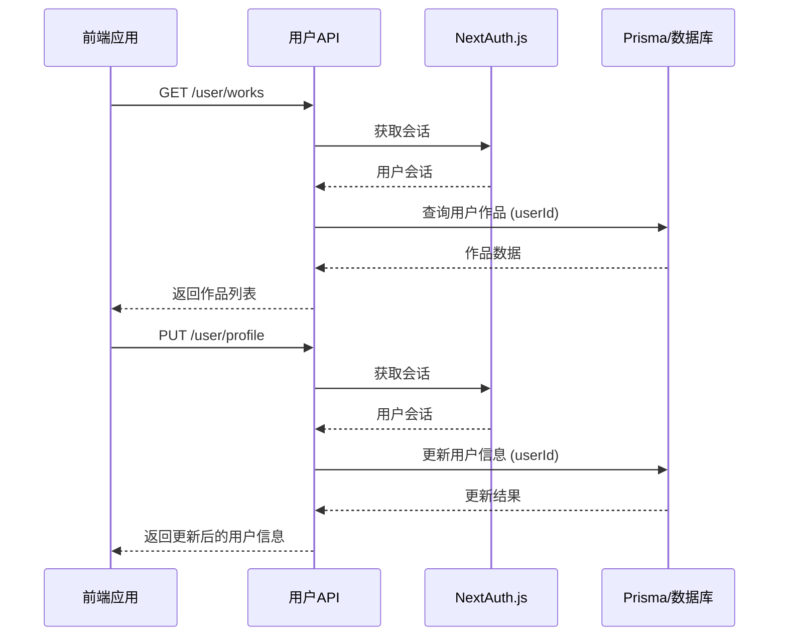

# 用户API

<cite>
**本文档引用的文件**
- [route.ts](file://src/app/api/user/works/route.ts)
- [route.ts](file://src/app/api/user/works/[id]/route.ts)
- [route.ts](file://src/app/api/user/profile/route.ts)
- [profile.tsx](file://src/app/profile/page.tsx)
- [auth.ts](file://src/lib/auth.ts)
- [prisma.ts](file://src/lib/prisma.ts)
- [middleware.ts](file://middleware.ts)
- [work.d.ts](file://src/types/work.d.ts)
</cite>

## 目录
1. [简介](#简介)
2. [项目结构](#项目结构)
3. [核心组件](#核心组件)
4. [架构概述](#架构概述)
5. [详细组件分析](#详细组件分析)
6. [依赖分析](#依赖分析)
7. [性能考虑](#性能考虑)
8. [故障排除指南](#故障排除指南)
9. [结论](#结论)

## 简介
本文档详细描述了数字化作品互动展示平台中的用户相关API，重点聚焦于用户个人作品管理功能。文档涵盖用户作品列表获取（GET /user/works）、用户作品详情查询（GET /user/works/[id]）以及个人资料操作等接口的实现逻辑。详细说明了API如何通过NextAuth.js获取当前会话用户信息，并基于用户ID进行数据隔离与权限校验。请求流程包括身份验证、用户ID提取、Prisma查询过滤和数据返回。同时提供了安全实现用户专属数据访问的代码示例，防止越权访问，并说明了错误处理机制，如用户未登录（401）、访问非本人作品（403）等情况的响应策略。

## 项目结构

```mermaid
graph TD
A[src/app/api/user] --> B[works]
A --> C[profile]
B --> D[route.ts]
B --> E[[id]/route.ts]
C --> F[route.ts]
G[src/lib] --> H[auth.ts]
G --> I[prisma.ts]
J[src/app] --> K[profile/page.tsx]
```

**图示来源**
- [route.ts](file://src/app/api/user/works/route.ts)
- [route.ts](file://src/app/api/user/works/[id]/route.ts)
- [route.ts](file://src/app/api/user/profile/route.ts)
- [auth.ts](file://src/lib/auth.ts)
- [prisma.ts](file://src/lib/prisma.ts)
- [profile.tsx](file://src/app/profile/page.tsx)

**本节来源**
- [src/app/api/user](file://src/app/api/user)
- [src/lib](file://src/lib)

## 核心组件

本文档的核心组件包括用户作品管理API（/api/user/works）和个人资料管理API（/api/user/profile）。这些组件通过NextAuth.js进行身份验证，确保只有经过认证的用户才能访问其专属数据。Prisma客户端用于与数据库交互，实现数据的查询、更新和删除操作。用户作品管理功能支持分页、排序和过滤，确保高效的数据检索。个人资料管理功能包括用户信息的读取和更新，支持密码修改等敏感操作的安全处理。

**本节来源**
- [route.ts](file://src/app/api/user/works/route.ts)
- [route.ts](file://src/app/api/user/profile/route.ts)

## 架构概述



**图示来源**
- [route.ts](file://src/app/api/user/works/route.ts)
- [route.ts](file://src/app/api/user/profile/route.ts)
- [auth.ts](file://src/lib/auth.ts)
- [prisma.ts](file://src/lib/prisma.ts)

## 详细组件分析

### 用户作品管理分析

#### 作品列表获取


**图示来源**
- [route.ts](file://src/app/api/user/works/route.ts)
- [prisma.ts](file://src/lib/prisma.ts)

#### 作品详情查询


**图示来源**
- [route.ts](file://src/app/api/user/works/[id]/route.ts)
- [prisma.ts](file://src/lib/prisma.ts)

**本节来源**
- [route.ts](file://src/app/api/user/works/route.ts)
- [route.ts](file://src/app/api/user/works/[id]/route.ts)

### 个人资料管理分析

#### 个人资料读取与更新
```mermaid
classDiagram
class UserProfile {
+id : string
+name : string
+email : string
+role : string
+image? : string
+createdAt : string
+updatedAt : string
+_count : { works : number }
}
class ProfileUpdateSchema {
+name : string (optional)
+email : string (optional)
+currentPassword : string (optional)
+newPassword : string (optional)
+confirmNewPassword : string (optional)
}
class AuthController {
-userService : UserService
+handleProfileGet(request) : Response
+handleProfilePut(request) : Response
}
AuthController --> UserProfile : "返回"
AuthController --> ProfileUpdateSchema : "验证"
AuthController --> UserService : "依赖"
```

**图示来源**
- [route.ts](file://src/app/api/user/profile/route.ts)
- [profile.tsx](file://src/app/profile/page.tsx)
- [work.d.ts](file://src/types/work.d.ts)

**本节来源**
- [route.ts](file://src/app/api/user/profile/route.ts)
- [profile.tsx](file://src/app/profile/page.tsx)

## 依赖分析


**图示来源**
- [middleware.ts](file://middleware.ts)
- [auth.ts](file://src/lib/auth.ts)
- [prisma.ts](file://src/lib/prisma.ts)

**本节来源**
- [middleware.ts](file://middleware.ts)
- [src/lib/auth.ts](file://src/lib/auth.ts)
- [src/lib/prisma.ts](file://src/lib/prisma.ts)

## 性能考虑
为优化用户作品列表查询性能，建议在数据库的works表上为userId字段创建索引。这将显著提高基于用户ID的查询效率，特别是在用户作品数量较多的情况下。此外，API实现了分页功能，避免一次性返回大量数据，减少网络传输开销和前端渲染压力。对于频繁访问的用户资料信息，可以考虑引入缓存机制，减少数据库查询次数。

## 故障排除指南
常见问题包括用户未登录导致401错误、访问非本人作品导致403错误、密码修改验证失败等。对于401错误，检查前端是否正确传递了认证令牌，后端是否正确解析了会话。对于403错误，确认API在查询作品时是否正确应用了用户ID过滤条件。密码修改失败通常由于验证规则未通过，检查前端提交的数据是否符合ProfileUpdateSchema定义的规则。

**本节来源**
- [route.ts](file://src/app/api/user/works/route.ts)
- [route.ts](file://src/app/api/user/works/[id]/route.ts)
- [route.ts](file://src/app/api/user/profile/route.ts)

## 结论
本文档详细阐述了用户相关API的设计与实现，重点描述了用户作品管理和个人资料操作的功能。通过NextAuth.js实现安全的身份验证，利用Prisma进行高效的数据查询，并通过严格的权限校验确保数据隔离。API设计考虑了性能优化和错误处理，为用户提供安全、高效的服务。建议在生产环境中为关键查询字段添加数据库索引，进一步提升系统性能。