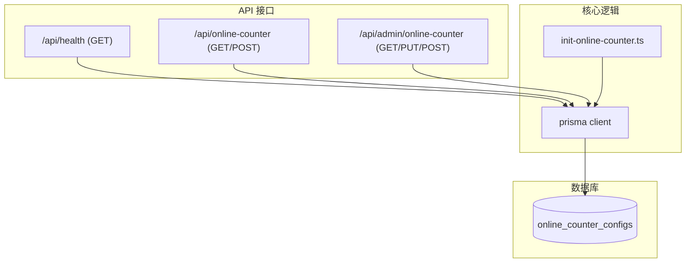
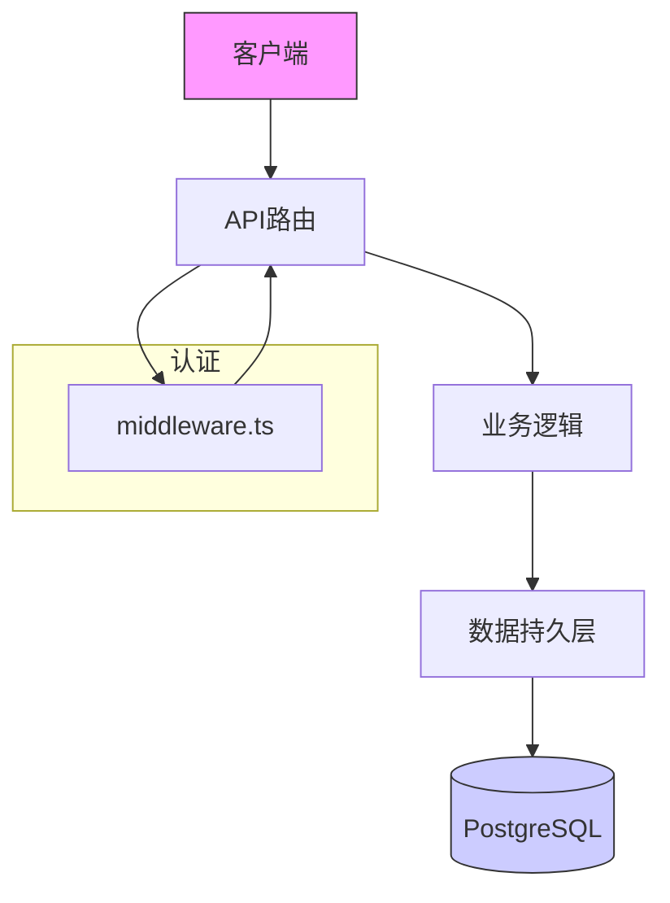
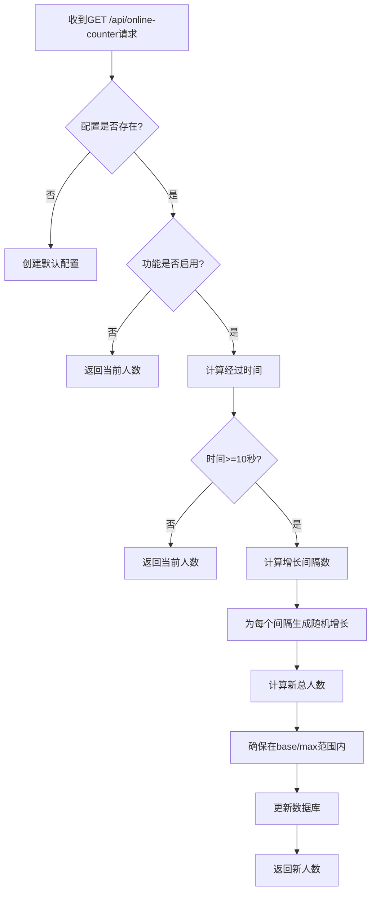
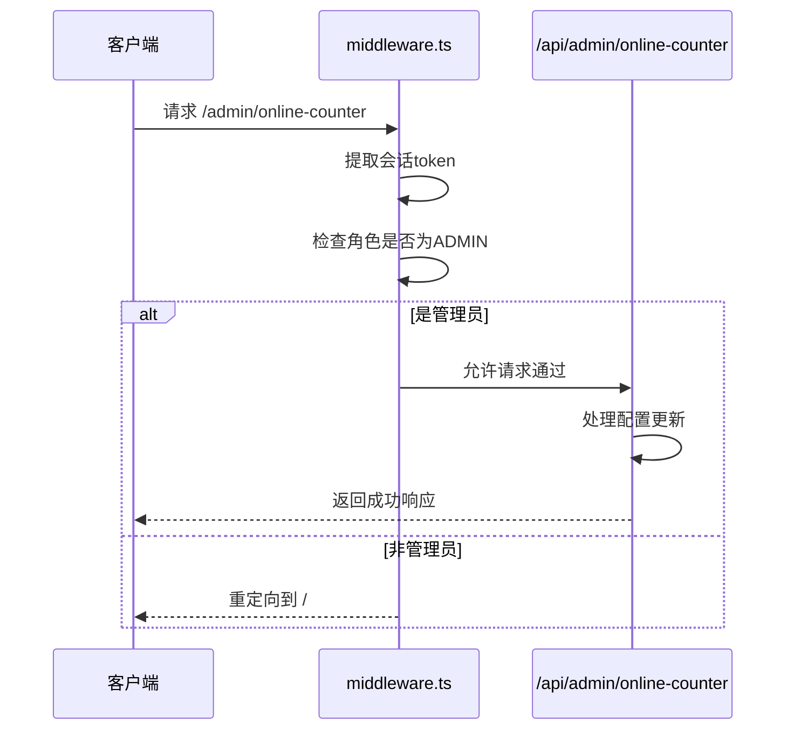
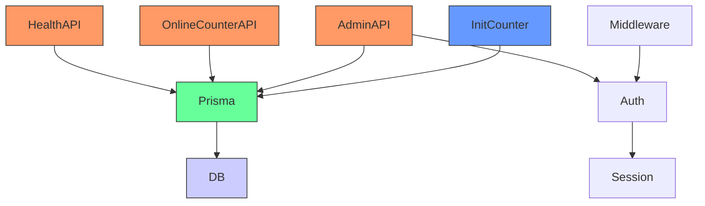

# 系统API

<cite>
**本文档引用的文件**
- [health/route.ts](file://src/app/api/health/route.ts)
- [online-counter/route.ts](file://src/app/api/online-counter/route.ts)
- [middleware.ts](file://middleware.ts)
- [init-online-counter.ts](file://src/lib/init-online-counter.ts)
- [admin/online-counter/route.ts](file://src/app/api/admin/online-counter/route.ts)
</cite>

## 目录
1. [简介](#简介)
2. [项目结构](#项目结构)
3. [核心组件](#核心组件)
4. [架构概述](#架构概述)
5. [详细组件分析](#详细组件分析)
6. [依赖分析](#依赖分析)
7. [性能考虑](#性能考虑)
8. [故障排除指南](#故障排除指南)
9. [结论](#结论)

## 简介
本文档详细描述了数字化作品互动展示平台中的两个关键系统级API：健康检查接口（GET /health）和在线人数统计接口（GET /api/online-counter）。文档涵盖接口设计、实现机制、错误处理、与中间件的协同工作流程以及配置管理功能。重点解析在线人数的动态增长算法、数据持久化策略、管理员配置接口及容错机制，确保系统稳定性和数据准确性。

## 项目结构
系统API主要位于`src/app/api`目录下，采用Next.js的App Router架构。健康检查和在线人数统计功能分别由独立的路由文件实现。核心业务逻辑与数据库交互通过Prisma ORM完成，配置初始化在`src/lib`目录中管理。管理员对在线人数的配置能力通过`/api/admin/online-counter`提供。

**Diagram sources**
- [health/route.ts](file://src/app/api/health/route.ts)
- [online-counter/route.ts](file://src/app/api/online-counter/route.ts)
- [admin/online-counter/route.ts](file://src/app/api/admin/online-counter/route.ts)
- [init-online-counter.ts](file://src/lib/init-online-counter.ts)

**Section sources**
- [src/app/api](file://src/app/api)
- [middleware.ts](file://middleware.ts)

## 核心组件
本系统的核心组件包括健康检查服务和在线人数统计服务。健康检查服务通过直接查询数据库来验证后端服务和数据库连接的健康状态。在线人数统计服务则是一个更复杂的组件，它基于数据库中的配置记录，实现了一个动态增长的虚拟在线人数计数器。该服务在GET请求时计算并更新人数，支持管理员通过专用API进行配置管理。系统还包含一个初始化模块，确保服务启动时存在默认配置。

**Section sources**
- [health/route.ts](file://src/app/api/health/route.ts#L1-L25)
- [online-counter/route.ts](file://src/app/api/online-counter/route.ts#L1-L188)
- [init-online-counter.ts](file://src/lib/init-online-counter.ts#L1-L52)

## 架构概述
系统采用分层架构，前端通过HTTP请求与后端API交互。API路由层处理请求并调用业务逻辑。业务逻辑层（主要在`init-online-counter.ts`中）封装了与数据库的交互。数据持久层由Prisma ORM和PostgreSQL数据库组成。`middleware.ts`负责全局的认证和授权，确保只有管理员能访问配置接口。整个架构围绕`online_counter_configs`这一核心数据库表构建，所有功能都围绕其读写操作展开。

**Diagram sources**
- [middleware.ts](file://middleware.ts#L1-L50)
- [online-counter/route.ts](file://src/app/api/online-counter/route.ts#L1-L188)
- [admin/online-counter/route.ts](file://src/app/api/admin/online-counter/route.ts#L1-L175)

## 详细组件分析

### 健康检查API分析
健康检查API提供了一个简单但关键的端点，用于监控应用的运行状况。其实现逻辑清晰：尝试执行一个简单的数据库查询（`SELECT 1`）。如果查询成功，则返回包含`success: true`和`database: 'connected'`的JSON响应，表明服务和数据库均正常。如果捕获到任何错误（如数据库连接失败），则返回500状态码和`success: false`的响应，同时包含错误详情。此设计使得监控系统可以轻松地通过HTTP状态码和响应体来判断服务的健康状况。

**Section sources**
- [health/route.ts](file://src/app/api/health/route.ts#L1-L25)

### 在线人数统计API分析
在线人数统计API是系统的核心功能之一，其工作机制如下：当收到GET请求时，API首先从`online_counter_configs`表中获取最新的配置。如果表中无记录，API会自动创建一个包含默认值（如初始人数1075）的配置。如果功能被禁用（`isEnabled: false`），则直接返回当前存储的人数。如果功能启用，API会计算自上次更新以来经过的时间。每满10秒，系统就会根据配置的`growthRate`（增长率）进行一次随机增长计算。增长人数为0到`growthRate`之间的随机整数，确保增长的自然感。新的人数会与`baseCount`和`maxCount`进行比较，确保在合理范围内，然后更新数据库并返回最新数据。

**Diagram sources**
- [online-counter/route.ts](file://src/app/api/online-counter/route.ts#L1-L188)

**Section sources**
- [online-counter/route.ts](file://src/app/api/online-counter/route.ts#L1-L188)

### 管理员配置API分析
管理员配置API为系统提供了动态管理在线人数参数的能力。该API位于`/api/admin/online-counter`，包含GET、PUT和POST三个方法。GET方法允许管理员获取当前配置，PUT方法用于更新配置（如修改增长率、最大人数等），POST方法用于重置当前人数至基础人数。所有操作都通过`middleware.ts`进行权限校验，确保只有管理员角色才能访问。输入数据通过Zod库进行严格验证，防止无效数据写入数据库。

**Section sources**
- [admin/online-counter/route.ts](file://src/app/api/admin/online-counter/route.ts#L1-L175)

### 与中间件的协同工作流程
在线人数统计API与`middleware.ts`紧密协作。`middleware.ts`定义了应用的全局中间件，负责处理认证和路由重定向。虽然在线人数API本身对所有用户开放，但其管理接口（`/api/admin/online-counter`）受到中间件的保护。当中间件检测到用户访问管理页面时，会检查其会话中的角色。只有角色为`ADMIN`的用户才能访问管理API，否则会被重定向到首页。这种设计确保了配置的安全性，防止非授权用户篡改在线人数参数。

**Diagram sources**
- [middleware.ts](file://middleware.ts#L1-L50)
    - [admin/online-counter/route.ts](file://src/app/api/admin/online-counter/route.ts#L1-L175)

**Section sources**
- [middleware.ts](file://middleware.ts#L1-L50)
- [admin/online-counter/route.ts](file://src/app/api/admin/online-counter/route.ts#L1-L175)

## 依赖分析
系统的主要依赖关系清晰。API路由直接依赖`prisma`客户端进行数据库操作。`init-online-counter.ts`模块被多个API路由（如`/api/online-counter`和`/api/admin/online-counter`）调用，以确保数据库配置的初始化。`middleware.ts`依赖`next-auth`进行会话管理，并间接影响所有受保护的API。数据库表`online_counter_configs`是所有功能的数据源，其结构由Prisma迁移文件定义。

**Diagram sources**
- [health/route.ts](file://src/app/api/health/route.ts)
- [online-counter/route.ts](file://src/app/api/online-counter/route.ts)
- [admin/online-counter/route.ts](file://src/app/api/admin/online-counter/route.ts)
- [init-online-counter.ts](file://src/lib/init-online-counter.ts)
- [middleware.ts](file://middleware.ts)

**Section sources**
- [package.json](file://package.json)
- [prisma/schema.prisma](file://prisma/migrations/20250905143157_add_online_counter_config/migration.sql)

## 性能考虑
在线人数API的设计考虑了性能和准确性。通过将增长计算与数据库更新解耦，系统避免了为每个用户请求都进行数据库写入。增长计算仅在距离上次更新超过10秒时触发，这大大减少了数据库的写入压力。使用随机增长算法模拟了真实用户的波动，提高了数据的可信度。对于高并发场景，建议监控`/api/online-counter`的调用频率和响应延迟，确保其不会成为性能瓶颈。由于计算逻辑简单，预计该API的响应延迟极低。

## 故障排除指南
当系统出现问题时，可参考以下指南进行排查：
- **健康检查失败**：检查数据库连接是否正常，确认数据库服务是否运行，以及网络是否通畅。
- **在线人数不增长**：检查数据库中的`lastUpdated`时间戳，确认是否已过10秒；检查`growthRate`配置是否大于0。
- **管理员无法访问配置页面**：确认用户会话中的角色是否为`ADMIN`；检查`middleware.ts`中的权限逻辑。
- **API返回500错误**：查看服务器日志，根据错误信息判断是数据库操作失败还是其他内部错误。
- **配置更新失败**：检查PUT请求的JSON数据是否符合`OnlineCounterConfigSchema`的验证规则。

**Section sources**
- [health/route.ts](file://src/app/api/health/route.ts#L1-L25)
- [online-counter/route.ts](file://src/app/api/online-counter/route.ts#L1-L188)
- [admin/online-counter/route.ts](file://src/app/api/admin/online-counter/route.ts#L1-L175)

## 结论
本文档详细阐述了系统健康检查和在线人数统计两大核心API的设计与实现。健康检查API提供了基础的系统监控能力。在线人数统计API通过巧妙的设计，结合数据库持久化和定时随机增长算法，实现了既真实又可控的虚拟在线人数展示。系统通过管理员API和中间件实现了安全的配置管理。整体架构清晰，依赖明确，性能表现良好，为数字化作品互动展示平台提供了稳定可靠的支持。