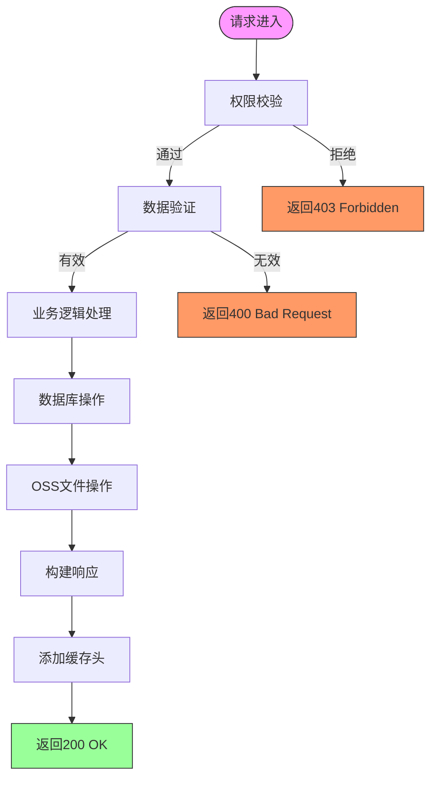
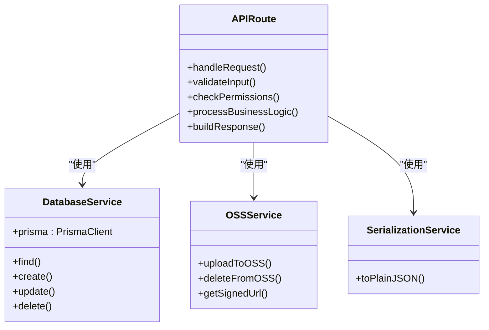
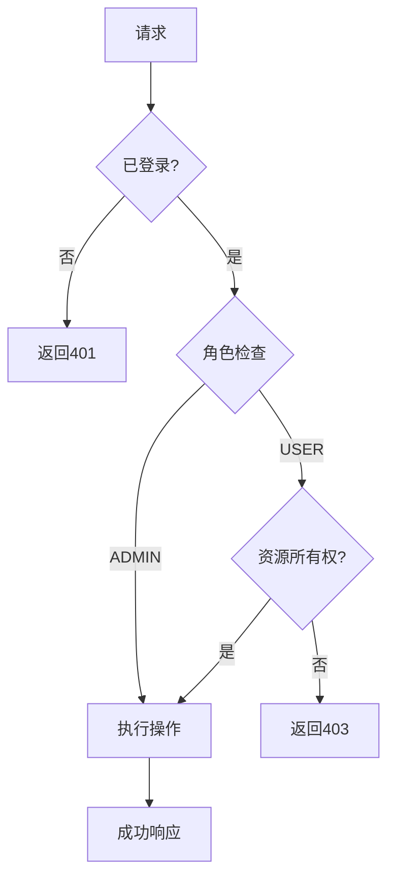
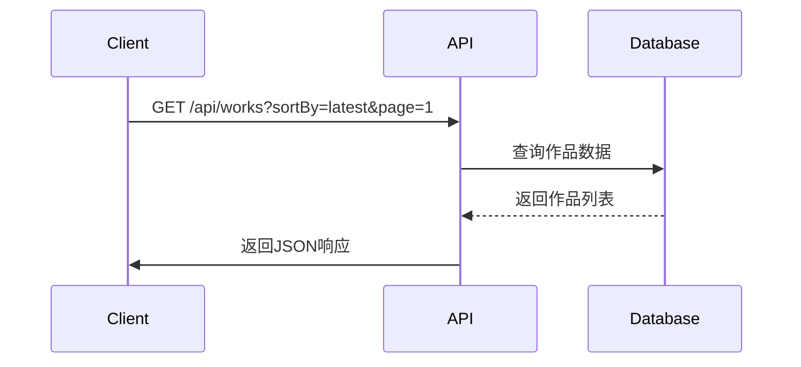

# API路由架构

<cite>
**本文档中引用的文件**  
- [works/route.ts](file://src/app/api/works/route.ts)
- [works/[id]/route.ts](file://src/app/api/works/[id]/route.ts)
- [user/works/route.ts](file://src/app/api/user/works/route.ts)
- [admin/works/route.ts](file://src/app/api/admin/works/route.ts)
- [admin/works/[id]/approve/route.ts](file://src/app/api/admin/works/[id]/approve/route.ts)
- [admin/works/[id]/reject/route.ts](file://src/app/api/admin/works/[id]/reject/route.ts)
- [admin/works/[id]/featured/route.ts](file://src/app/api/admin/works/[id]/featured/route.ts)
- [user/profile/route.ts](file://src/app/api/user/profile/route.ts)
- [admin/users/route.ts](file://src/app/api/admin/users/route.ts)
- [admin/users/[id]/route.ts](file://src/app/api/admin/users/[id]/route.ts)
- [online-counter/route.ts](file://src/app/api/online-counter/route.ts)
- [admin/online-counter/route.ts](file://src/app/api/admin/online-counter/route.ts)
- [platform-config/route.ts](file://src/app/api/platform-config/route.ts)
- [admin/upload-config/route.ts](file://src/app/api/admin/upload-config/route.ts)
- [upload/route.ts](file://src/app/api/upload/route.ts)
- [register/route.ts](file://src/app/api/register/route.ts)
- [health/route.ts](file://src/app/api/health/route.ts)
- [lib/serialize.ts](file://src/lib/serialize.ts)
- [lib/oss.ts](file://src/lib/oss.ts)
- [lib/auth.ts](file://src/lib/auth.ts)
- [lib/prisma.ts](file://src/lib/prisma.ts)
- [types/work.d.ts](file://src/types/work.d.ts)
</cite>

## 目录
1. [项目结构](#项目结构)
2. [RESTful端点设计原则](#restful端点设计原则)
3. [请求处理流程](#请求处理流程)
4. [动态路由参数](#动态路由参数)
5. [业务逻辑封装](#业务逻辑封装)
6. [权限校验机制](#权限校验机制)
7. [数据验证模式](#数据验证模式)
8. [错误处理规范](#错误处理规范)
9. [作品管理接口](#作品管理接口)
10. [用户操作接口](#用户操作接口)
11. [管理员接口](#管理员接口)
12. [响应格式与状态码](#响应格式与状态码)
13. [性能优化策略](#性能优化策略)

## 项目结构

```mermaid
graph TD
A[/api] --> B[works]
A --> C[user]
A --> D[admin]
A --> E[auth]
A --> F[health]
A --> G[online-counter]
A --> H[platform-config]
A --> I[register]
A --> J[upload]
B --> K[[id]]
B --> L[like]
B --> M[view]
B --> N[user-count]
C --> O[profile]
C --> P[works]
D --> Q[stats]
D --> R[users]
D --> S[works]
D --> T[upload-config]
D --> U[online-counter]
R --> V[[id]]
S --> W[[id]]
W --> X[approve]
W --> Y[reject]
W --> Z[featured]
```

**图示来源**
- [works/route.ts](file://src/app/api/works/route.ts)
- [user/works/route.ts](file://src/app/api/user/works/route.ts)
- [admin/works/route.ts](file://src/app/api/admin/works/route.ts)
- [admin/users/route.ts](file://src/app/api/admin/users/route.ts)

## RESTful端点设计原则

系统遵循RESTful架构风格，通过HTTP动词（GET、POST、PUT、DELETE）对资源进行操作。每个API端点对应特定的业务实体，如作品、用户、配置等。采用分层目录结构组织路由，确保接口的可发现性和一致性。

核心设计原则包括：
- 资源导向：每个URL代表一个明确的资源
- 状态无感知：服务器不保存客户端状态
- 统一接口：使用标准HTTP方法进行操作
- 可缓存性：合理设置缓存头以提升性能
- 分层系统：前后端分离，API作为中间层

**本节来源**
- [works/route.ts](file://src/app/api/works/route.ts)
- [admin/works/route.ts](file://src/app/api/admin/works/route.ts)
- [user/profile/route.ts](file://src/app/api/user/profile/route.ts)

## 请求处理流程



**图示来源**
- [works/route.ts](file://src/app/api/works/route.ts)
- [admin/works/route.ts](file://src/app/api/admin/works/route.ts)
- [upload/route.ts](file://src/app/api/upload/route.ts)

## 动态路由参数

系统广泛使用Next.js的动态路由功能，通过`[id]`语法实现参数化路径。这种设计允许对特定资源实例进行操作，如作品详情、用户管理等。

动态路由的典型应用场景：
- 作品详情页：`/api/works/[id]`
- 用户作品管理：`/api/user/works/[id]`
- 管理员审核：`/api/admin/works/[id]/approve`

动态参数通过解构`params`对象获取，确保类型安全和代码可读性。

```typescript
export async function GET(
  request: NextRequest,
  { params }: RouteParams
) {
  const { id } = await params;
  // 处理基于ID的业务逻辑
}
```

**本节来源**
- [works/[id]/route.ts](file://src/app/api/works/[id]/route.ts)
- [admin/works/[id]/approve/route.ts](file://src/app/api/admin/works/[id]/approve/route.ts)
- [user/works/[id]/route.ts](file://src/app/api/user/works/[id]/route.ts)

## 业务逻辑封装

业务逻辑被合理封装在API路由处理函数中，遵循单一职责原则。每个端点专注于特定的业务功能，通过调用底层服务和工具函数实现复杂操作。

关键封装模式：
- 数据访问：通过Prisma客户端进行数据库操作
- 文件管理：使用OSS服务处理文件上传下载
- 序列化：统一JSON序列化处理
- 配置管理：集中式配置读取与更新



**图示来源**
- [lib/prisma.ts](file://src/lib/prisma.ts)
- [lib/oss.ts](file://src/lib/oss.ts)
- [lib/serialize.ts](file://src/lib/serialize.ts)
- [works/route.ts](file://src/app/api/works/route.ts)

## 权限校验机制

系统实现了多层次的权限校验机制，确保不同角色只能访问授权资源。权限检查贯穿于各个API端点，采用基于角色的访问控制（RBAC）模型。

权限校验流程：
1. 获取会话信息
2. 验证用户身份
3. 检查角色权限
4. 验证资源所有权



**本节来源**
- [admin/works/route.ts](file://src/app/api/admin/works/route.ts)
- [admin/users/route.ts](file://src/app/api/admin/users/route.ts)
- [user/profile/route.ts](file://src/app/api/user/profile/route.ts)

## 数据验证模式

系统采用Zod库进行数据验证，确保输入数据的完整性和正确性。验证模式定义在各个API路由文件中，提供类型安全和详细的错误信息。

主要验证模式：
- 注册信息验证
- 作品编辑验证
- 配置更新验证
- 查询参数验证

```typescript
const WorkEditSchema = z.object({
  name: z.string().min(1, '作品名称不能为空').max(100),
  description: z.string().max(1000),
  author: z.string().min(1, '作者名不能为空').max(50),
  imageUrl: z.string().min(1, '图片URL不能为空')
});
```

验证失败时返回400状态码，并包含详细的错误信息，便于前端展示。

**本节来源**
- [works/[id]/route.ts](file://src/app/api/works/[id]/route.ts)
- [user/profile/route.ts](file://src/app/api/user/profile/route.ts)
- [admin/upload-config/route.ts](file://src/app/api/admin/upload-config/route.ts)
- [register/route.ts](file://src/app/api/register/route.ts)

## 错误处理规范

系统实现了统一的错误处理规范，确保API响应的一致性和可预测性。错误处理遵循以下原则：

- 使用标准HTTP状态码
- 提供清晰的错误消息
- 包含错误代码便于调试
- 敏感信息不暴露给客户端

错误响应格式：
```json
{
  "success": false,
  "error": "错误消息",
  "code": "错误代码",
  "details": "详细信息（仅开发环境）"
}
```

异常处理流程：
1. 捕获异常
2. 分类处理（验证错误、权限错误、数据库错误等）
3. 构建标准化错误响应
4. 记录日志用于调试

**本节来源**
- [works/route.ts](file://src/app/api/works/route.ts)
- [admin/works/route.ts](file://src/app/api/admin/works/route.ts)
- [user/profile/route.ts](file://src/app/api/user/profile/route.ts)

## 作品管理接口

作品管理接口提供了完整的CRUD操作，支持分页、排序和过滤功能。接口设计考虑了用户体验和性能优化。

### 获取作品列表

支持多种排序方式：
- 默认排序：精选优先
- 最新作品：按审核时间
- 热门作品：按点赞数



### 创建作品

允许游客上传作品，提交后进入审核队列。上传功能受配置控制，包括时间窗口、文件大小限制等。

**本节来源**
- [works/route.ts](file://src/app/api/works/route.ts)
- [works/[id]/route.ts](file://src/app/api/works/[id]/route.ts)
- [upload/route.ts](file://src/app/api/upload/route.ts)

## 用户操作接口

用户操作接口支持个人作品管理和资料更新，确保用户能够管理自己的内容。

### 用户作品管理

- 获取用户作品列表
- 编辑个人作品
- 删除个人作品
- 更新作品信息

普通用户编辑作品时，修改后的内容需要重新审核，确保内容质量。

### 个人资料更新