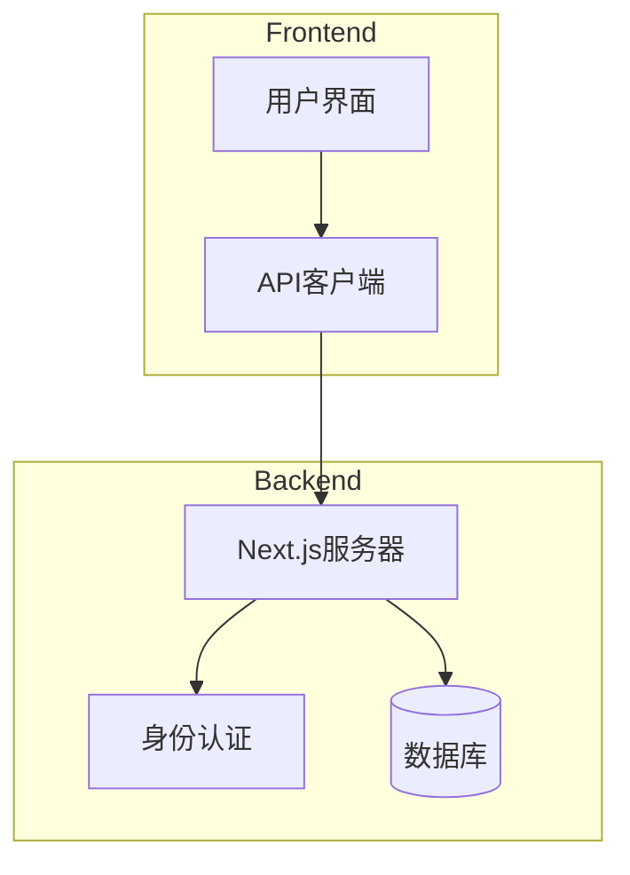
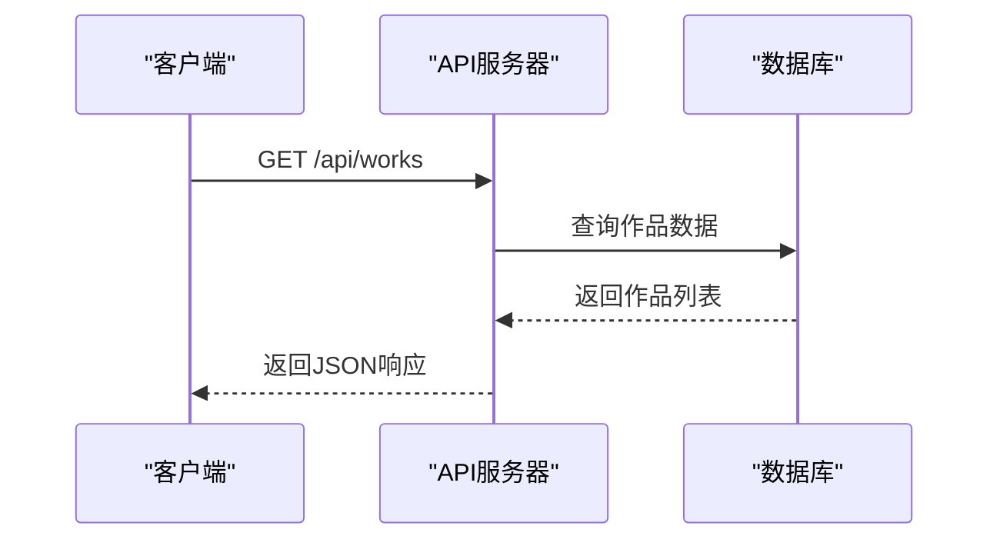
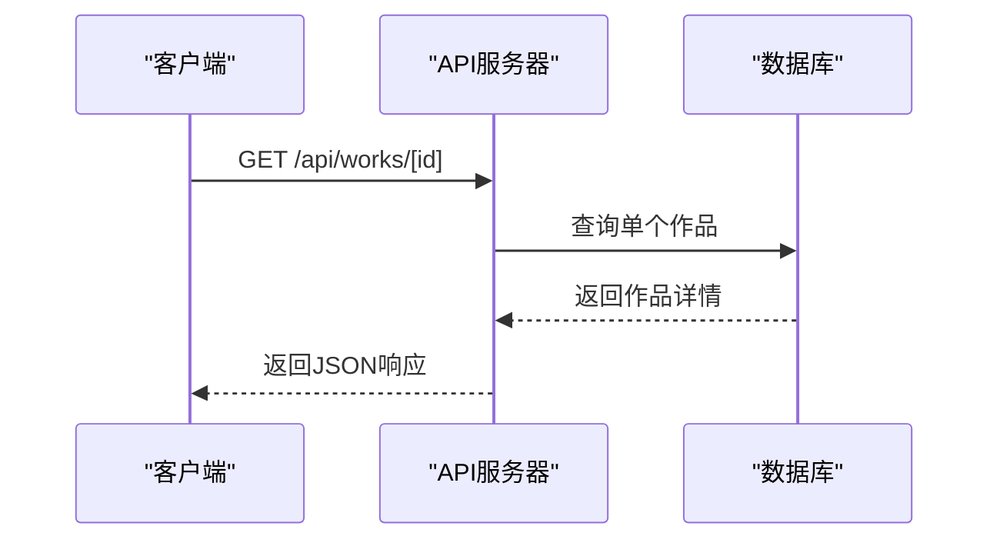
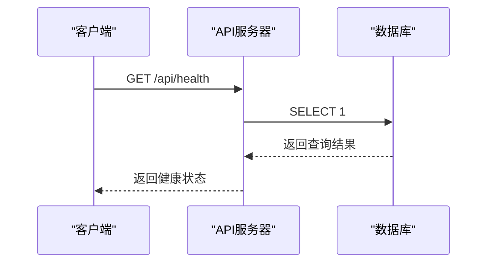
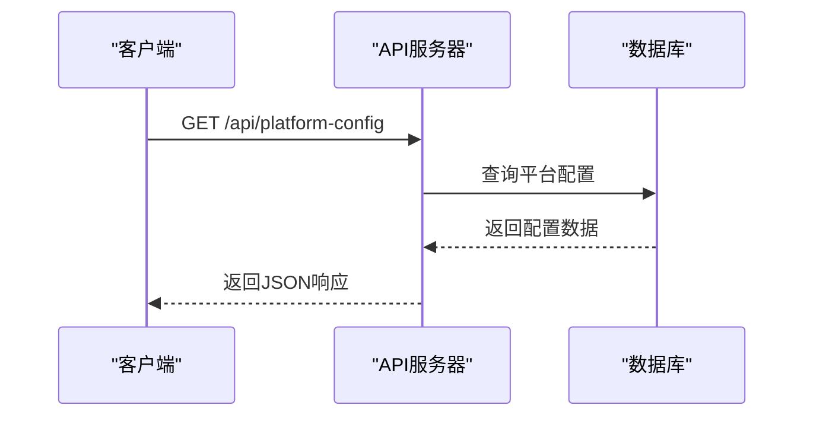
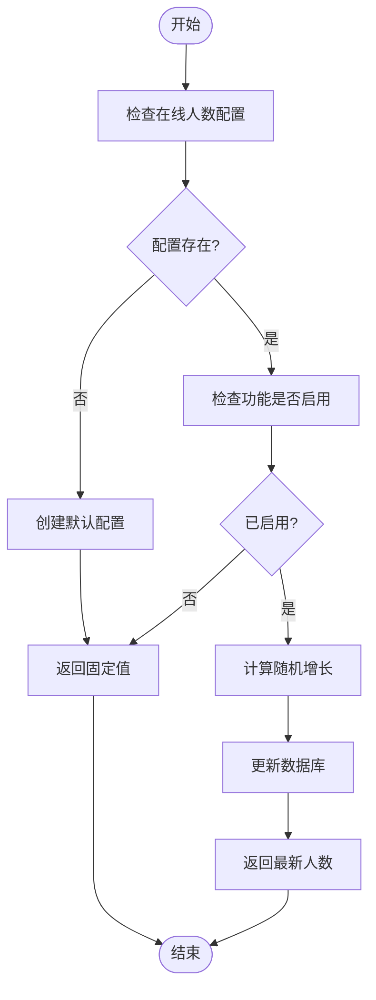
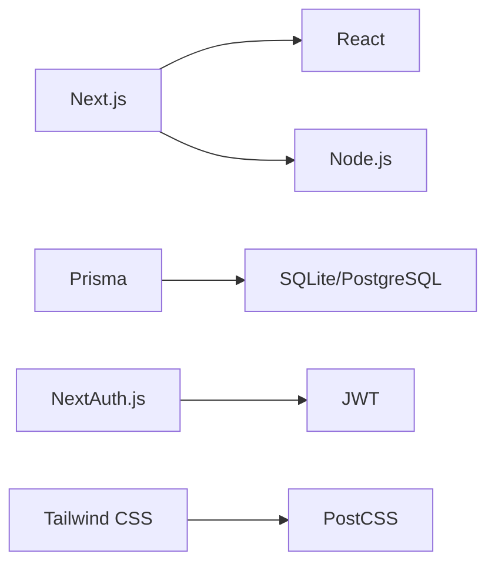

# 公开API接口

<cite>
**本文档引用的文件**
- [works/route.ts](file://src/app/api/works/route.ts)
- [works/[id]/route.ts](file://src/app/api/works/[id]/route.ts)
- [health/route.ts](file://src/app/api/health/route.ts)
- [platform-config/route.ts](file://src/app/api/platform-config/route.ts)
- [online-counter/route.ts](file://src/app/api/online-counter/route.ts)
- [init-online-counter.ts](file://src/lib/init-online-counter.ts)
</cite>

## 目录
1. [简介](#简介)
2. [项目结构](#项目结构)
3. [核心组件](#核心组件)
4. [架构概述](#架构概述)
5. [详细组件分析](#详细组件分析)
6. [依赖分析](#依赖分析)
7. [性能考虑](#性能考虑)
8. [故障排除指南](#故障排除指南)
9. [结论](#结论)
10. [附录](#附录)（如有必要）

## 简介
本文档旨在为数字化作品互动展示平台提供公开API接口的技术文档，面向所有客户端（包括游客）提供基础服务支持。涵盖作品列表获取、单个作品详情查询、平台健康状态检查、平台配置读取和在线人数统计等功能。说明各端点的无状态特性、缓存策略（如Cache-Control头）和性能优化实践。详细描述分页机制（如limit/offset）、响应字段含义及错误处理规范。提供curl命令示例和JavaScript调用模板，帮助开发者快速集成。强调这些接口的高可用性和抗压能力设计。

## 项目结构
本项目采用Next.js 14 App Router架构，主要API端点位于`src/app/api`目录下。公开API接口主要包括作品管理、健康检查、平台配置和在线人数统计等功能。项目使用Prisma作为ORM，SQLite作为数据库（生产环境可切换为PostgreSQL），并通过NextAuth.js实现身份认证。

```mermaid
graph TB
subgraph "API Endpoints"
A[/api/works] --> B[作品列表]
A --> C[单个作品]
D[/api/health] --> E[健康检查]
F[/api/platform-config] --> G[平台配置]
H[/api/online-counter] --> I[在线人数]
end
subgraph "Core Components"
J[Prisma] --> K[数据库]
L[NextAuth.js] --> M[认证]
N[Tailwind CSS] --> O[样式]
end
A --> J
D --> J
F --> J
H --> J
```

**图示来源**
- [works/route.ts](file://src/app/api/works/route.ts)
- [health/route.ts](file://src/app/api/health/route.ts)
- [platform-config/route.ts](file://src/app/api/platform-config/route.ts)
- [online-counter/route.ts](file://src/app/api/online-counter/route.ts)

**章节来源**
- [src/app/api](file://src/app/api)
- [prisma/schema.prisma](file://prisma/schema.prisma)

## 核心组件
公开API接口的核心组件包括作品管理、健康检查、平台配置和在线人数统计。这些组件均设计为无状态服务，支持高并发访问，并通过合理的缓存策略提升性能。

**章节来源**
- [works/route.ts](file://src/app/api/works/route.ts)
- [health/route.ts](file://src/app/api/health/route.ts)
- [platform-config/route.ts](file://src/app/api/platform-config/route.ts)
- [online-counter/route.ts](file://src/app/api/online-counter/route.ts)

## 架构概述
系统采用现代化的全栈Web开发技术栈，前端框架为Next.js 14 (App Router)，开发语言为TypeScript，样式框架为Tailwind CSS，数据库ORM为Prisma，数据库为SQLite（生产环境可切换PostgreSQL），身份认证为NextAuth.js（支持游客模式）。



**图示来源**
- [src/app/page.tsx](file://src/app/page.tsx)
- [src/lib/auth.ts](file://src/lib/auth.ts)
- [prisma/schema.prisma](file://prisma/schema.prisma)

## 详细组件分析
### 作品管理分析
作品管理API提供作品列表获取和单个作品详情查询功能，支持游客访问。

#### 作品列表获取


**图示来源**
- [works/route.ts](file://src/app/api/works/route.ts#L0-L194)

#### 单个作品详情查询


**图示来源**
- [works/[id]/route.ts](file://src/app/api/works/[id]/route.ts#L0-L327)

### 健康检查分析
健康检查API用于检查平台服务状态，包括数据库连接情况。



**图示来源**
- [health/route.ts](file://src/app/api/health/route.ts#L0-L25)

### 平台配置分析
平台配置API提供平台标题等配置信息的读取和更新功能。



**图示来源**
- [platform-config/route.ts](file://src/app/api/platform-config/route.ts#L0-L113)

### 在线人数统计分析
在线人数统计API提供动态在线人数的获取功能，支持自动增长和手动重置。



**图示来源**
- [online-counter/route.ts](file://src/app/api/online-counter/route.ts#L0-L188)
- [init-online-counter.ts](file://src/lib/init-online-counter.ts#L0-L52)

**章节来源**
- [online-counter/route.ts](file://src/app/api/online-counter/route.ts)
- [init-online-counter.ts](file://src/lib/init-online-counter.ts)

## 依赖分析
系统依赖主要包括Next.js框架、Prisma ORM、NextAuth.js认证库和Tailwind CSS样式框架。数据库依赖SQLite（开发环境）或PostgreSQL（生产环境）。



**图示来源**
- [package.json](file://package.json)
- [prisma/schema.prisma](file://prisma/schema.prisma)

**章节来源**
- [package.json](file://package.json)
- [prisma/schema.prisma](file://prisma/schema.prisma)

## 性能考虑
公开API接口设计时充分考虑了性能优化，包括：
- 使用Cache-Control头实现HTTP缓存
- 采用分页机制减少单次响应数据量
- 数据库查询优化，避免N+1问题
- 异步处理提高并发能力

**章节来源**
- [works/route.ts](file://src/app/api/works/route.ts)
- [online-counter/route.ts](file://src/app/api/online-counter/route.ts)

## 故障排除指南
常见问题及解决方案：
- **数据库连接失败**：检查数据库服务是否正常运行
- **API响应慢**：检查网络连接和服务器负载
- **缓存未生效**：检查Cache-Control头设置是否正确
- **分页数据异常**：检查limit和offset参数是否正确

**章节来源**
- [health/route.ts](file://src/app/api/health/route.ts)
- [works/route.ts](file://src/app/api/works/route.ts)

## 结论
本文档详细介绍了数字化作品互动展示平台的公开API接口，包括作品管理、健康检查、平台配置和在线人数统计等功能。这些接口设计为无状态服务，支持高并发访问，并通过合理的缓存策略和分页机制提升性能。开发者可以参考本文档快速集成相关功能。

## 附录
### API端点列表
| 端点 | 方法 | 描述 | 认证要求 |
|------|------|------|----------|
| `/api/works` | GET | 获取作品列表 | 无需认证 |
| `/api/works/[id]` | GET | 获取单个作品详情 | 无需认证 |
| `/api/health` | GET | 健康检查 | 无需认证 |
| `/api/platform-config` | GET | 获取平台配置 | 无需认证 |
| `/api/online-counter` | GET | 获取在线人数 | 无需认证 |

**章节来源**
- [README.md](file://README.md)
- [src/app/api](file://src/app/api)