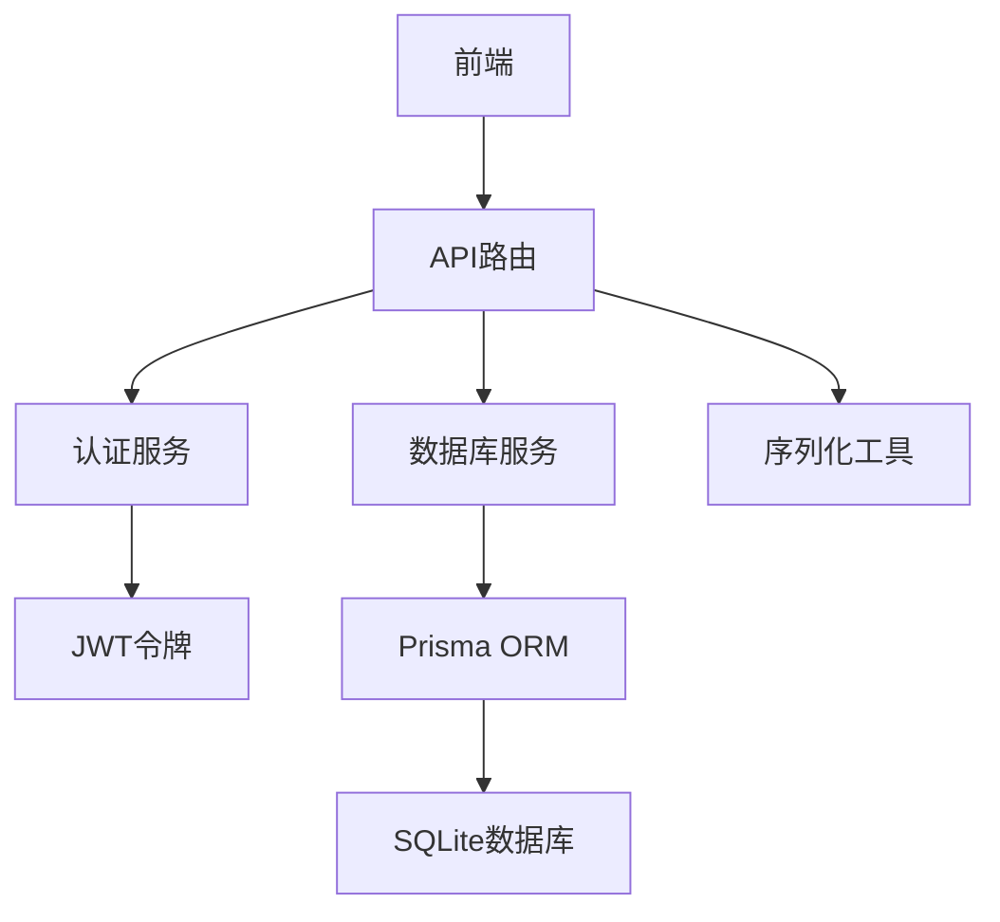
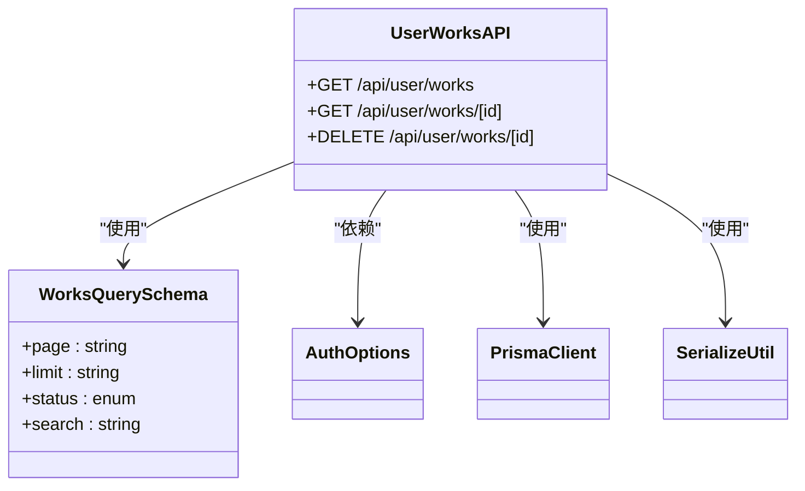
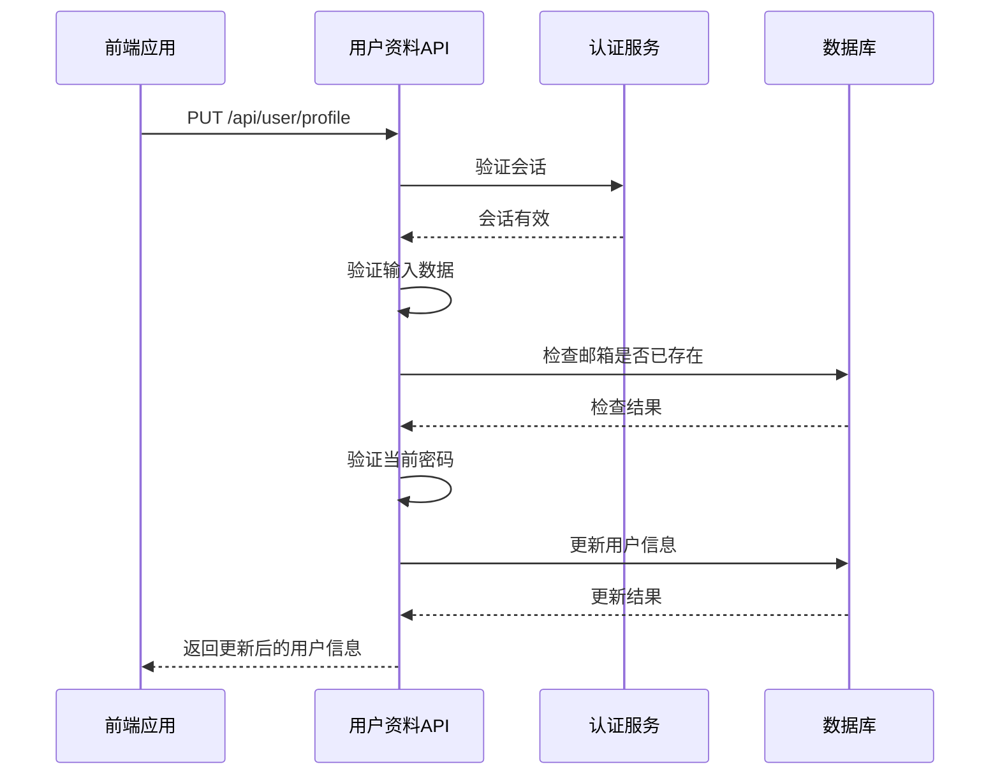
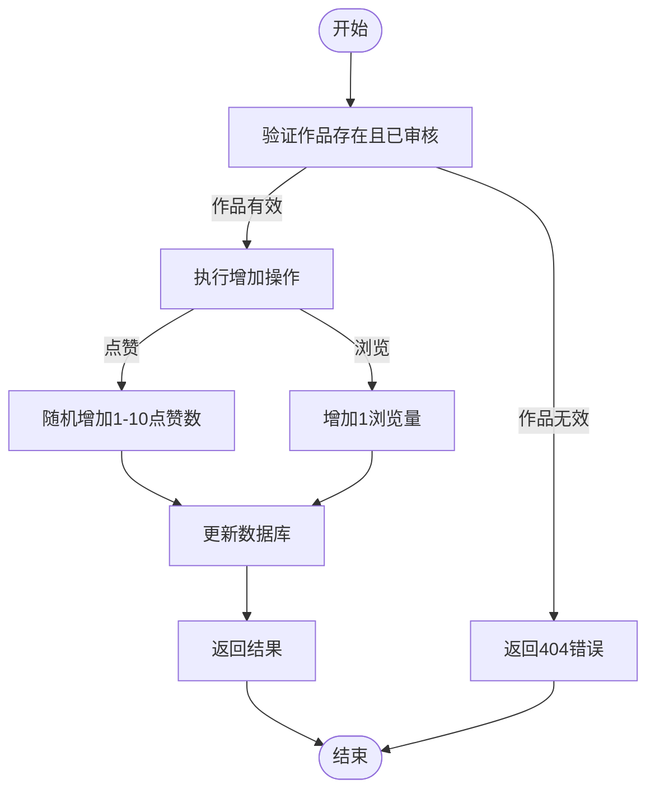
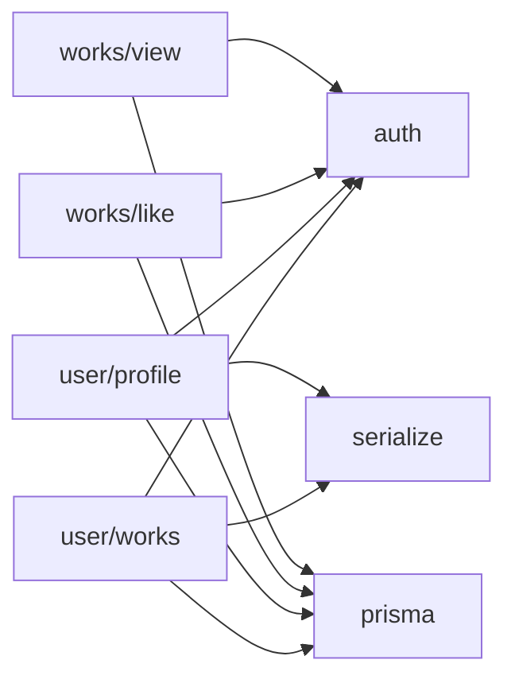

# 用户相关API

<cite>
**本文档引用的文件**
- [user/works/route.ts](file://src/app/api/user/works/route.ts)
- [user/profile/route.ts](file://src/app/api/user/profile/route.ts)
- [works/[id]/like/route.ts](file://src/app/api/works/[id]/like/route.ts)
- [works/[id]/view/route.ts](file://src/app/api/works/[id]/view/route.ts)
- [auth.ts](file://src/lib/auth.ts)
- [work.d.ts](file://src/types/work.d.ts)
- [serialize.ts](file://src/lib/serialize.ts)
</cite>

## 目录
1. [简介](#简介)
2. [项目结构](#项目结构)
3. [核心组件](#核心组件)
4. [架构概述](#架构概述)
5. [详细组件分析](#详细组件分析)
6. [依赖分析](#依赖分析)
7. [性能考虑](#性能考虑)
8. [故障排除指南](#故障排除指南)
9. [结论](#结论)
10. [附录](#附录)（如有必要）

## 简介
本文档详细介绍了数字化作品互动展示平台的用户相关API，涵盖用户作品管理、个人资料操作、作品点赞与浏览计数功能。文档解释了每个端点的HTTP方法、请求参数、认证机制（JWT）和响应结构。通过代码示例说明如何通过API获取用户作品列表、执行点赞操作及更新浏览量。同时描述了权限控制逻辑，确保只有认证用户可访问特定资源。提供了常见错误码（如401未授权、404未找到）的含义及处理建议，并给出了前端调用示例（使用fetch或axios）。

## 项目结构
本项目采用Next.js 14的App Router架构，API路由位于`src/app/api`目录下。用户相关API主要分布在`user`和`works`两个子目录中，分别处理用户个人中心操作和作品互动功能。系统使用Prisma作为ORM，SQLite作为数据库，NextAuth.js实现JWT认证。

```mermaid
graph TB
subgraph "API路由"
A[/api/user/works] --> B[/api/user/works/[id]]
C[/api/user/profile] --> D[/api/works/[id]/like]
E[/api/works/[id]/view]
end
subgraph "核心库"
F[auth.ts] --> G[prisma.ts]
H[serialize.ts]
end
A --> F
B --> F
C --> F
D --> F
E --> F
F --> G
A --> H
B --> H
C --> H
```

**图示来源**
- [user/works/route.ts](file://src/app/api/user/works/route.ts#L1-L125)
- [user/profile/route.ts](file://src/app/api/user/profile/route.ts#L1-L235)
- [works/[id]/like/route.ts](file://src/app/api/works/[id]/like/route.ts#L1-L64)
- [works/[id]/view/route.ts](file://src/app/api/works/[id]/view/route.ts#L1-L61)
- [auth.ts](file://src/lib/auth.ts#L1-L71)
- [prisma.ts](file://src/lib/prisma.ts#L1-L10)

**本节来源**
- [user/works/route.ts](file://src/app/api/user/works/route.ts#L1-L125)
- [user/profile/route.ts](file://src/app/api/user/profile/route.ts#L1-L235)
- [works/[id]/like/route.ts](file://src/app/api/works/[id]/like/route.ts#L1-L64)
- [works/[id]/view/route.ts](file://src/app/api/works/[id]/view/route.ts#L1-L61)

## 核心组件
核心组件包括用户作品管理API、个人资料操作API、作品点赞API和浏览计数API。这些组件共同构成了用户与平台互动的主要功能。用户作品管理API允许用户获取和删除自己的作品；个人资料操作API支持用户获取和更新个人信息；作品点赞和浏览计数API则实现了作品的互动功能。

**本节来源**
- [user/works/route.ts](file://src/app/api/user/works/route.ts#L1-L125)
- [user/profile/route.ts](file://src/app/api/user/profile/route.ts#L1-L235)
- [works/[id]/like/route.ts](file://src/app/api/works/[id]/like/route.ts#L1-L64)
- [works/[id]/view/route.ts](file://src/app/api/works/[id]/view/route.ts#L1-L61)

## 架构概述
系统采用分层架构，前端通过API路由与后端交互，后端服务通过Prisma与数据库通信。认证系统基于JWT，通过NextAuth.js实现。序列化工具确保数据安全传输。整体架构支持高并发访问和实时互动。



**图示来源**
- [auth.ts](file://src/lib/auth.ts#L1-L71)
- [prisma.ts](file://src/lib/prisma.ts#L1-L10)
- [serialize.ts](file://src/lib/serialize.ts#L1-L52)

## 详细组件分析

### 用户作品管理分析
用户作品管理组件提供获取和删除用户作品的功能。GET请求获取用户作品列表，支持分页、状态过滤和搜索功能。DELETE请求删除指定作品，同时清理OSS存储中的相关文件。

#### 用户作品管理类图


**图示来源**
- [user/works/route.ts](file://src/app/api/user/works/route.ts#L1-L125)
- [user/works/[id]/route.ts](file://src/app/api/user/works/[id]/route.ts#L1-L139)
- [auth.ts](file://src/lib/auth.ts#L1-L71)
- [prisma.ts](file://src/lib/prisma.ts#L1-L10)
- [serialize.ts](file://src/lib/serialize.ts#L1-L52)

**本节来源**
- [user/works/route.ts](file://src/app/api/user/works/route.ts#L1-L125)
- [user/works/[id]/route.ts](file://src/app/api/user/works/[id]/route.ts#L1-L139)

### 个人资料操作分析
个人资料操作组件提供获取和更新用户信息的功能。GET请求获取用户基本信息，包括作品统计。PUT请求更新用户信息，支持修改姓名、邮箱和密码，包含完整的验证和安全检查。

#### 个人资料操作序列图


**图示来源**
- [user/profile/route.ts](file://src/app/api/user/profile/route.ts#L1-L235)
- [auth.ts](file://src/lib/auth.ts#L1-L71)
- [prisma.ts](file://src/lib/prisma.ts#L1-L10)

**本节来源**
- [user/profile/route.ts](file://src/app/api/user/profile/route.ts#L1-L235)

### 作品互动功能分析
作品互动功能组件提供点赞和浏览计数功能。POST请求到`/api/works/[id]/like`增加作品点赞数，随机增加1-10之间的数值。POST请求到`/api/works/[id]/view`增加作品浏览量，每次增加1。

#### 作品互动流程图


**图示来源**
- [works/[id]/like/route.ts](file://src/app/api/works/[id]/like/route.ts#L1-L64)
- [works/[id]/view/route.ts](file://src/app/api/works/[id]/view/route.ts#L1-L61)
- [prisma.ts](file://src/lib/prisma.ts#L1-L10)

**本节来源**
- [works/[id]/like/route.ts](file://src/app/api/works/[id]/like/route.ts#L1-L64)
- [works/[id]/view/route.ts](file://src/app/api/works/[id]/view/route.ts#L1-L61)

## 依赖分析
系统组件间存在明确的依赖关系。API路由依赖认证服务进行权限验证，依赖数据库服务进行数据持久化，依赖序列化工具确保数据安全传输。各API之间相对独立，通过统一的认证和数据访问层进行交互。



**图示来源**
- [user/works/route.ts](file://src/app/api/user/works/route.ts#L1-L125)
- [user/profile/route.ts](file://src/app/api/user/profile/route.ts#L1-L235)
- [works/[id]/like/route.ts](file://src/app/api/works/[id]/like/route.ts#L1-L64)
- [works/[id]/view/route.ts](file://src/app/api/works/[id]/view/route.ts#L1-L61)
- [auth.ts](file://src/lib/auth.ts#L1-L71)
- [prisma.ts](file://src/lib/prisma.ts#L1-L10)
- [serialize.ts](file://src/lib/serialize.ts#L1-L52)

**本节来源**
- [user/works/route.ts](file://src/app/api/user/works/route.ts#L1-L125)
- [user/profile/route.ts](file://src/app/api/user/profile/route.ts#L1-L235)
- [works/[id]/like/route.ts](file://src/app/api/works/[id]/like/route.ts#L1-L64)
- [works/[id]/view/route.ts](file://src/app/api/works/[id]/view/route.ts#L1-L61)
- [auth.ts](file://src/lib/auth.ts#L1-L71)
- [prisma.ts](file://src/lib/prisma.ts#L1-L10)
- [serialize.ts](file://src/lib/serialize.ts#L1-L52)

## 性能考虑
系统在性能方面进行了多项优化。使用Prisma的`findMany`和`count`方法的并行执行提高查询效率。序列化工具避免了BigInt精度丢失问题。点赞功能采用随机增量而非固定值，增加了互动的真实感。所有API端点都实现了适当的错误处理和输入验证，确保系统稳定性。

## 故障排除指南
常见问题包括认证失败、资源未找到和输入验证错误。401错误通常表示JWT令牌无效或过期，需要重新登录。404错误表示请求的资源不存在，可能是ID错误或权限不足。400错误通常与输入数据验证失败有关，需要检查请求参数是否符合规范。

**本节来源**
- [user/works/route.ts](file://src/app/api/user/works/route.ts#L1-L125)
- [user/profile/route.ts](file://src/app/api/user/profile/route.ts#L1-L235)
- [works/[id]/like/route.ts](file://src/app/api/works/[id]/like/route.ts#L1-L64)
- [works/[id]/view/route.ts](file://src/app/api/works/[id]/view/route.ts#L1-L61)

## 结论
本文档全面介绍了数字化作品互动展示平台的用户相关API。系统通过清晰的路由设计、严格的认证机制和高效的数据库操作，为用户提供安全可靠的互动体验。API设计遵循RESTful原则，具有良好的可扩展性和维护性。未来可以考虑增加更多互动功能，如作品分享统计和用户成就系统。

## 附录

### API端点汇总表
| 端点 | 方法 | 描述 | 认证要求 |
|------|------|------|----------|
| `/api/user/works` | GET | 获取用户作品列表 | 是 |
| `/api/user/works/[id]` | GET | 获取单个作品详情 | 是 |
| `/api/user/works/[id]` | DELETE | 删除作品 | 是 |
| `/api/user/profile` | GET | 获取用户信息 | 是 |
| `/api/user/profile` | PUT | 更新用户信息 | 是 |
| `/api/works/[id]/like` | POST | 点赞作品 | 否 |
| `/api/works/[id]/view` | POST | 增加浏览量 | 否 |

**本节来源**
- [user/works/route.ts](file://src/app/api/user/works/route.ts#L1-L125)
- [user/works/[id]/route.ts](file://src/app/api/user/works/[id]/route.ts#L1-L139)
- [user/profile/route.ts](file://src/app/api/user/profile/route.ts#L1-L235)
- [works/[id]/like/route.ts](file://src/app/api/works/[id]/like/route.ts#L1-L64)
- [works/[id]/view/route.ts](file://src/app/api/works/[id]/view/route.ts#L1-L61)