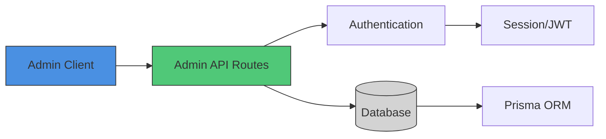
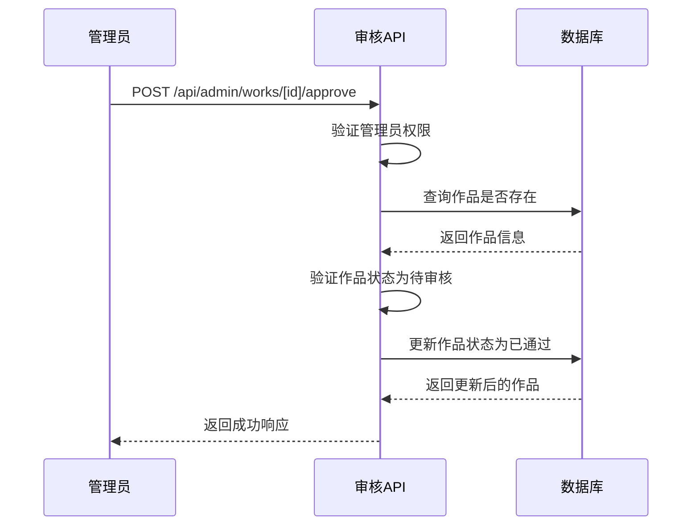
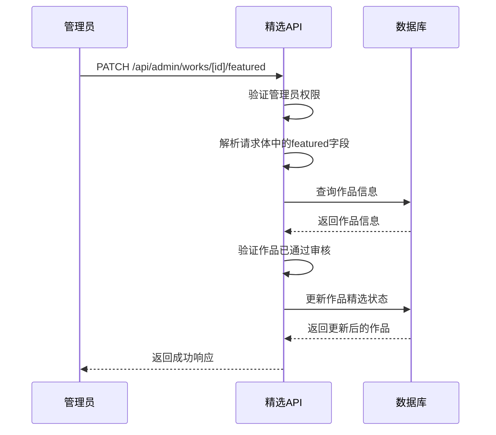
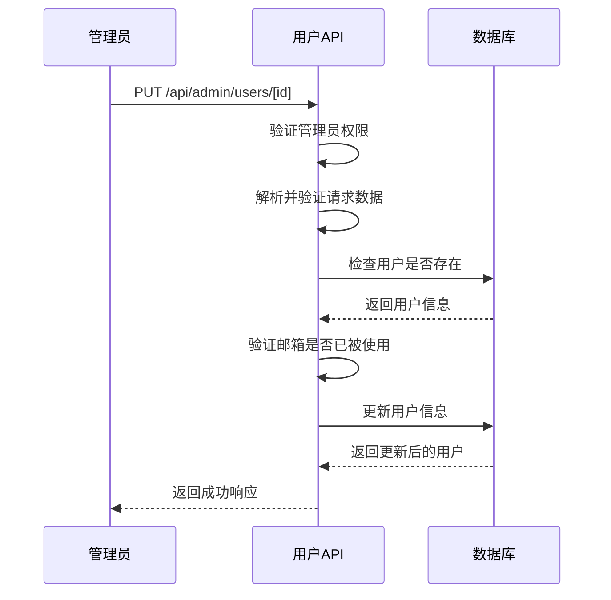
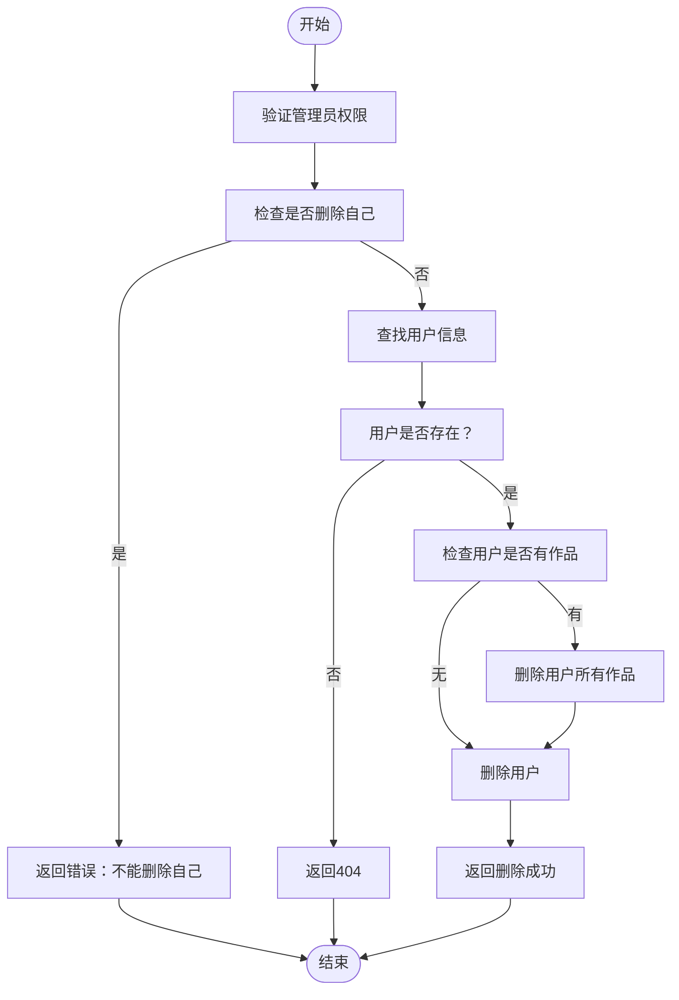
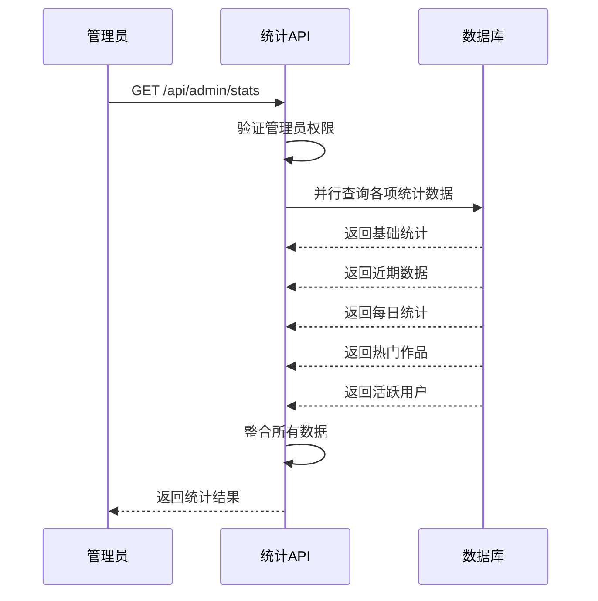
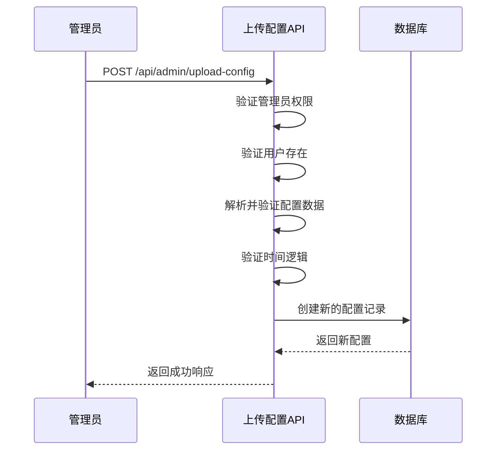
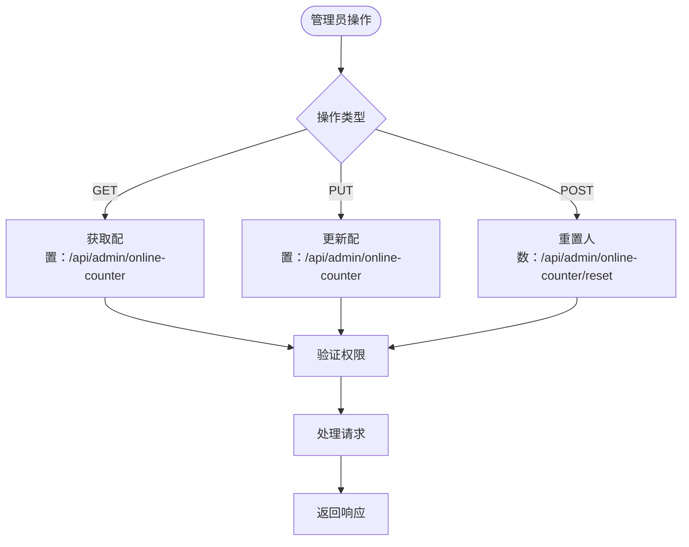
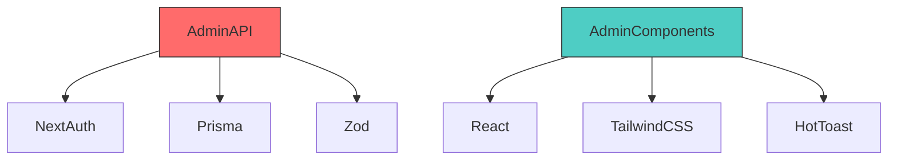

# 管理员专用API

<cite>
**本文档引用文件**  
- [approve/route.ts](file://src/app/api/admin/works/[id]/approve/route.ts)
- [featured/route.ts](file://src/app/api/admin/works/[id]/featured/route.ts)
- [users/[id]/route.ts](file://src/app/api/admin/users/[id]/route.ts)
- [stats/route.ts](file://src/app/api/admin/stats/route.ts)
- [upload-config/route.ts](file://src/app/api/admin/upload-config/route.ts)
- [online-counter/route.ts](file://src/app/api/admin/online-counter/route.ts)
- [works/route.ts](file://src/app/api/admin/works/route.ts)
- [users/route.ts](file://src/app/api/admin/users/route.ts)
- [auth.ts](file://src/lib/auth.ts)
- [db-utils.ts](file://src/lib/db-utils.ts)
- [WorksManagement.tsx](file://src/components/admin/WorksManagement.tsx)
- [AdminStats.tsx](file://src/components/admin/AdminStats.tsx)
- [UploadConfigManagement.tsx](file://src/components/admin/UploadConfigManagement.tsx)
- [OnlineCounterManagement.tsx](file://src/components/admin/OnlineCounterManagement.tsx)
</cite>

## 目录
1. [简介](#简介)
2. [项目结构](#项目结构)
3. [核心组件](#核心组件)
4. [架构概览](#架构概览)
5. [详细组件分析](#详细组件分析)
6. [依赖分析](#依赖分析)
7. [性能考虑](#性能考虑)
8. [故障排除指南](#故障排除指南)
9. [结论](#结论)

## 简介
本文档详细说明了数字化作品互动展示平台的管理员专用API，涵盖作品审核、用户管理、数据统计和配置更新等核心功能。所有API端点均需管理员角色权限，确保系统安全。文档详细描述了各端点的请求流程、业务逻辑处理、响应数据结构及安全措施。

## 项目结构
管理员API位于`src/app/api/admin`目录下，按功能模块组织。主要模块包括作品管理、用户管理、统计、上传配置和在线人数配置。前端组件位于`src/components/admin`目录，使用React客户端组件与API交互。

```mermaid
graph TB
subgraph "API Endpoints"
A[/api/admin/works]
B[/api/admin/users]
C[/api/admin/stats]
D[/api/admin/upload-config]
E[/api/admin/online-counter]
end
subgraph "Admin Components"
F[WorksManagement]
G[AdminStats]
H[UploadConfigManagement]
I[OnlineCounterManagement]
end
F --> A
G --> C
H --> D
I --> E
```

**图示来源**  
- [WorksManagement.tsx](file://src/components/admin/WorksManagement.tsx)
- [AdminStats.tsx](file://src/components/admin/AdminStats.tsx)
- [UploadConfigManagement.tsx](file://src/components/admin/UploadConfigManagement.tsx)
- [OnlineCounterManagement.tsx](file://src/components/admin/OnlineCounterManagement.tsx)

**本节来源**  
- [src/app/api/admin](file://src/app/api/admin)
- [src/components/admin](file://src/components/admin)

## 核心组件
管理员API的核心功能包括作品审核、用户管理、数据统计和系统配置。每个功能模块都有对应的API端点和前端管理组件。权限控制通过NextAuth实现，确保只有管理员角色可以访问这些功能。

**本节来源**  
- [auth.ts](file://src/lib/auth.ts)
- [WorksManagement.tsx](file://src/components/admin/WorksManagement.tsx)
- [AdminStats.tsx](file://src/components/admin/AdminStats.tsx)

## 架构概览
系统采用Next.js App Router架构，API路由与前端组件分离。管理员操作通过客户端组件调用API端点，Prisma ORM与数据库交互。权限验证在每个API端点中进行，确保安全性。



**图示来源**  
- [auth.ts](file://src/lib/auth.ts)
- [prisma](file://prisma)
- [api/admin](file://src/app/api/admin)

## 详细组件分析

### 作品审核功能分析
管理员可以审核用户提交的作品，包括通过、拒绝和设为精选等操作。审核流程确保只有待审核状态的作品可以被处理。

#### 作品审核通过


**图示来源**  
- [approve/route.ts](file://src/app/api/admin/works/[id]/approve/route.ts)

#### 作品精选状态管理


**图示来源**  
- [featured/route.ts](file://src/app/api/admin/works/[id]/featured/route.ts)

**本节来源**  
- [approve/route.ts](file://src/app/api/admin/works/[id]/approve/route.ts)
- [featured/route.ts](file://src/app/api/admin/works/[id]/featured/route.ts)
- [WorksManagement.tsx](file://src/components/admin/WorksManagement.tsx)

### 用户管理功能分析
管理员可以查看、更新和删除用户信息，包括修改用户角色和基本信息。

#### 用户信息更新


**图示来源**  
- [users/[id]/route.ts](file://src/app/api/admin/users/[id]/route.ts)

#### 用户删除流程


**图示来源**  
- [users/[id]/route.ts](file://src/app/api/admin/users/[id]/route.ts)

**本节来源**  
- [users/[id]/route.ts](file://src/app/api/admin/users/[id]/route.ts)
- [users/route.ts](file://src/app/api/admin/users/route.ts)

### 数据统计功能分析
管理员可以获取平台的综合统计数据，包括用户数、作品数和活跃度等指标。

#### 统计数据获取流程


**图示来源**  
- [stats/route.ts](file://src/app/api/admin/stats/route.ts)

**本节来源**  
- [stats/route.ts](file://src/app/api/admin/stats/route.ts)
- [AdminStats.tsx](file://src/components/admin/AdminStats.tsx)

### 配置管理功能分析
管理员可以管理系统的各种配置，包括上传配置和在线人数配置。

#### 上传配置更新


**图示来源**  
- [upload-config/route.ts](file://src/app/api/admin/upload-config/route.ts)

#### 在线人数配置管理


**图示来源**  
- [online-counter/route.ts](file://src/app/api/admin/online-counter/route.ts)

**本节来源**  
- [upload-config/route.ts](file://src/app/api/admin/upload-config/route.ts)
- [online-counter/route.ts](file://src/app/api/admin/online-counter/route.ts)
- [UploadConfigManagement.tsx](file://src/components/admin/UploadConfigManagement.tsx)
- [OnlineCounterManagement.tsx](file://src/components/admin/OnlineCounterManagement.tsx)

## 依赖分析
管理员API依赖于NextAuth进行身份验证，Prisma进行数据库操作，Zod进行数据验证。前端组件依赖React和相关UI库。



**图示来源**  
- [package.json](file://package.json)
- [auth.ts](file://src/lib/auth.ts)
- [prisma](file://prisma)
- [components/admin](file://src/components/admin)

**本节来源**  
- [package.json](file://package.json)
- [auth.ts](file://src/lib/auth.ts)
- [prisma](file://prisma)

## 性能考虑
- 统计API使用`Promise.all`并行查询，提高响应速度
- 统计数据添加了缓存头，减少数据库查询频率
- 批量操作（如批量删除作品）使用数据库批量操作，提高效率
- 使用Zod进行数据验证，确保输入数据的有效性

## 故障排除指南
常见错误及解决方案：

| 错误代码 | 错误信息 | 原因 | 解决方案 |
|---------|--------|------|---------|
| FORBIDDEN | 权限不足 | 用户角色不是管理员 | 确保使用管理员账户登录 |
| NOT_FOUND | 作品不存在 | 作品ID无效 | 检查作品ID是否正确 |
| UNPROCESSABLE_ENTITY | 只能审核待审核状态的作品 | 作品状态不是待审核 | 确保作品处于待审核状态 |
| VALIDATION_ERROR | 请求参数无效 | 输入数据不符合验证规则 | 检查请求参数格式 |
| CONFLICT | 该邮箱已被使用 | 邮箱已存在 | 使用其他邮箱或联系用户 |
| INTERNAL_ERROR | 服务器内部错误 | 服务器异常 | 检查服务器日志 |

**本节来源**  
- [approve/route.ts](file://src/app/api/admin/works/[id]/approve/route.ts)
- [featured/route.ts](file://src/app/api/admin/works/[id]/featured/route.ts)
- [users/[id]/route.ts](file://src/app/api/admin/users/[id]/route.ts)
- [stats/route.ts](file://src/app/api/admin/stats/route.ts)

## 结论
管理员专用API提供了完整的平台管理功能，包括作品审核、用户管理、数据统计和系统配置。所有操作都经过严格的身份验证和权限控制，确保系统安全。API设计遵循RESTful原则，响应格式统一，便于前端集成和维护。