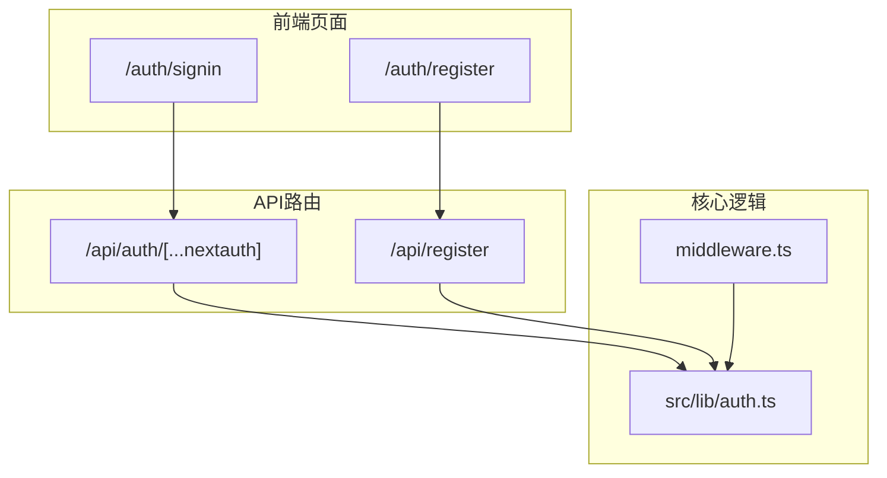
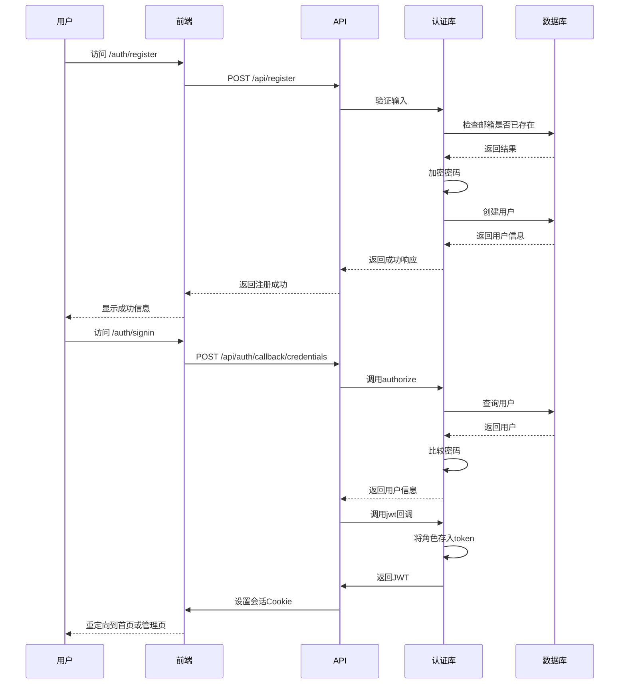
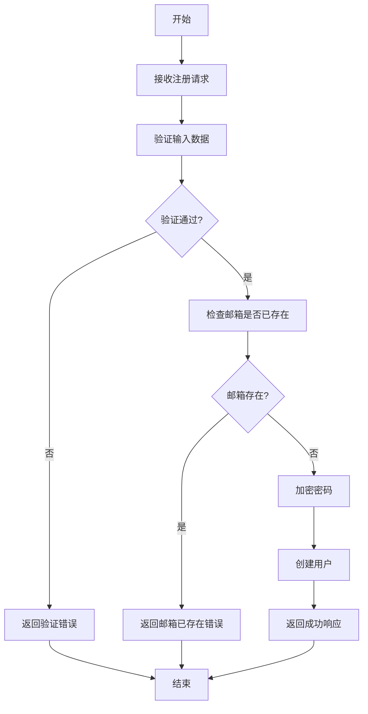
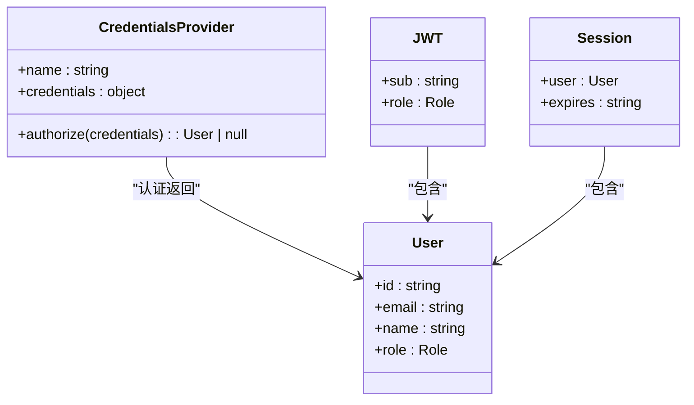
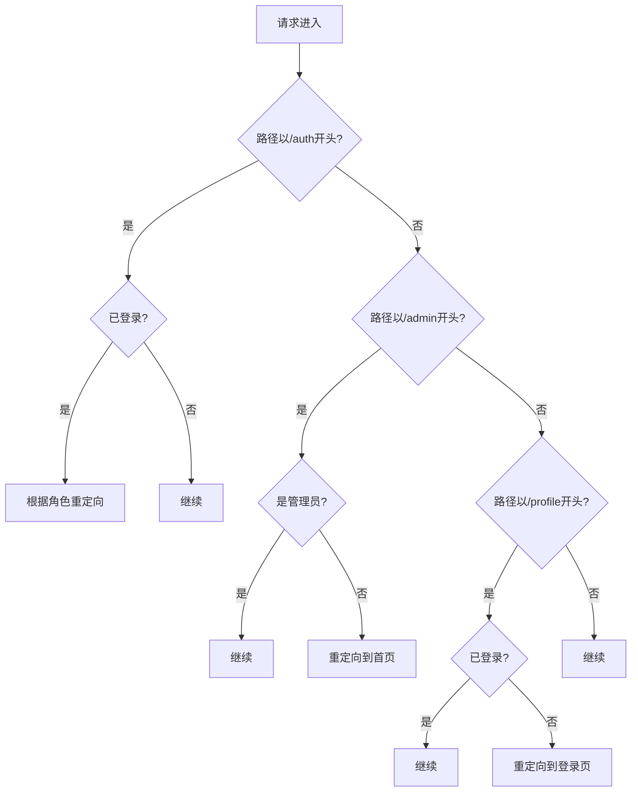
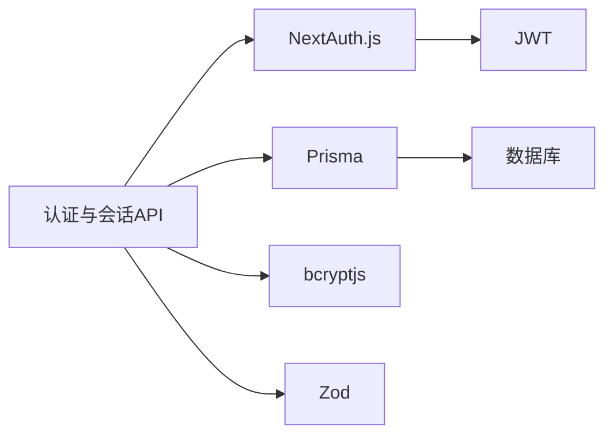

# 认证与会话API

<cite>
**本文档引用的文件**  
- [auth.ts](file://src/lib/auth.ts)
- [route.ts](file://src/app/api/auth/[...nextauth]/route.ts)
- [register/route.ts](file://src/app/api/register/route.ts)
- [page.tsx](file://src/app/auth/register/page.tsx)
- [signin/page.tsx](file://src/app/auth/signin/page.tsx)
- [middleware.ts](file://middleware.ts)
- [next-auth.d.ts](file://src/types/next-auth.d.ts)
</cite>

## 目录
1. [简介](#简介)
2. [项目结构](#项目结构)
3. [核心组件](#核心组件)
4. [架构概览](#架构概览)
5. [详细组件分析](#详细组件分析)
6. [依赖分析](#依赖分析)
7. [性能考虑](#性能考虑)
8. [故障排除指南](#故障排除指南)
9. [结论](#结论)

## 简介
本文档旨在全面阐述基于NextAuth.js的认证与会话管理API，涵盖用户注册、登录、登出及会话维持的完整流程。重点解析NextAuth.js在Next.js App Router中的集成方式、认证策略、会话存储机制、令牌刷新逻辑以及第三方OAuth2.0扩展。同时提供常见问题的排查方法，确保系统的安全性和可靠性。

## 项目结构
认证与会话管理功能主要分布在`src/app/api/auth`和`src/lib`目录下。前端页面位于`src/app/auth`，API路由在`src/app/api`，核心逻辑封装于`src/lib/auth.ts`。中间件`middleware.ts`负责全局路由保护。

**图示来源**  
- [auth.ts](file://src/lib/auth.ts)
- [route.ts](file://src/app/api/auth/[...nextauth]/route.ts)
- [register/route.ts](file://src/app/api/register/route.ts)
- [page.tsx](file://src/app/auth/register/page.tsx)
- [signin/page.tsx](file://src/app/auth/signin/page.tsx)
- [middleware.ts](file://middleware.ts)

**本节来源**  
- [src/app/api/auth/[...nextauth]/route.ts](file://src/app/api/auth/[...nextauth]/route.ts)
- [src/app/api/register/route.ts](file://src/app/api/register/route.ts)
- [src/lib/auth.ts](file://src/lib/auth.ts)
- [middleware.ts](file://middleware.ts)

## 核心组件
系统的核心组件包括：基于CredentialsProvider的认证逻辑、JWT会话策略、用户注册API、认证中间件以及角色权限控制。这些组件协同工作，实现安全的用户身份验证和会话管理。

**本节来源**  
- [auth.ts](file://src/lib/auth.ts#L7-L71)
- [register/route.ts](file://src/app/api/register/route.ts#L1-L95)
- [middleware.ts](file://middleware.ts#L1-L51)

## 架构概览
系统采用NextAuth.js作为认证框架，结合Prisma适配器与数据库交互。会话策略为JWT，令牌中嵌入用户角色信息。用户通过`/api/register`注册，通过NextAuth内置流程登录，中间件负责保护受控路由。

**图示来源**  
- [auth.ts](file://src/lib/auth.ts#L7-L71)
- [register/route.ts](file://src/app/api/register/route.ts#L1-L95)
- [route.ts](file://src/app/api/auth/[...nextauth]/route.ts#L1-L6)

## 详细组件分析

### 用户注册逻辑
`/api/register`端点处理用户注册请求。首先使用Zod进行数据验证，检查邮箱是否已被注册，然后使用bcryptjs加密密码，最后将用户信息存入数据库。

#### 注册流程图

**图示来源**  
- [register/route.ts](file://src/app/api/register/route.ts#L1-L95)

**本节来源**  
- [register/route.ts](file://src/app/api/register/route.ts#L1-L95)
- [page.tsx](file://src/app/auth/register/page.tsx#L1-L279)

### 认证策略与会话管理
系统使用CredentialsProvider进行基于邮箱和密码的认证。会话策略为JWT，用户角色通过回调函数注入令牌和会话对象。

#### 认证类图

**图示来源**  
- [auth.ts](file://src/lib/auth.ts#L7-L71)
- [next-auth.d.ts](file://src/types/next-auth.d.ts#L1-L23)

**本节来源**  
- [auth.ts](file://src/lib/auth.ts#L7-L71)
- [next-auth.d.ts](file://src/types/next-auth.d.ts#L1-L23)

### 认证中间件
`middleware.ts`文件中的中间件负责保护路由。它根据用户角色和请求路径进行重定向，确保只有授权用户才能访问特定页面。

#### 中间件逻辑流程

**图示来源**  
- [middleware.ts](file://middleware.ts#L1-L51)

**本节来源**  
- [middleware.ts](file://middleware.ts#L1-L51)

## 依赖分析
系统依赖NextAuth.js进行认证管理，Prisma进行数据库操作，bcryptjs进行密码加密，Zod进行数据验证。这些依赖通过`package.json`管理，并在相应文件中导入使用。

**图示来源**  
- [auth.ts](file://src/lib/auth.ts)
- [register/route.ts](file://src/app/api/register/route.ts)
- [package.json](file://package.json)

**本节来源**  
- [auth.ts](file://src/lib/auth.ts)
- [register/route.ts](file://src/app/api/register/route.ts)

## 性能考虑
- 密码加密使用bcrypt，成本因子为12，平衡安全与性能。
- JWT会话避免了数据库查询，提高会话验证效率。
- 中间件在边缘运行，减少服务器负载。

## 故障排除指南
### 常见问题
- **会话过期**：检查`NEXTAUTH_SECRET`环境变量是否设置，JWT过期时间是否合理。
- **跨域Cookie设置失败**：确保前端和后端域名一致，或正确配置CORS和Cookie的`sameSite`属性。
- **登录后无法访问管理页面**：检查用户角色是否为`ADMIN`，中间件逻辑是否正确。

**本节来源**  
- [auth.ts](file://src/lib/auth.ts#L7-L71)
- [middleware.ts](file://middleware.ts#L1-L51)

## 结论
本文档详细阐述了认证与会话管理系统的实现细节。系统采用现代化的技术栈，具有良好的安全性、可扩展性和可维护性。通过清晰的组件划分和严谨的逻辑设计，确保了用户身份验证的可靠性和用户体验的流畅性。