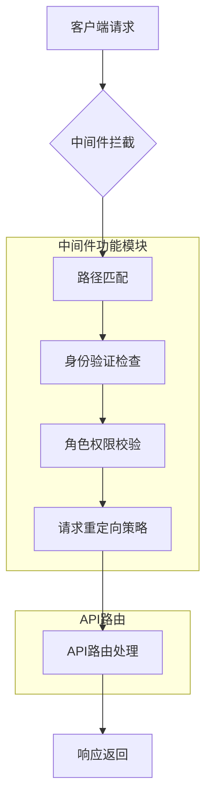
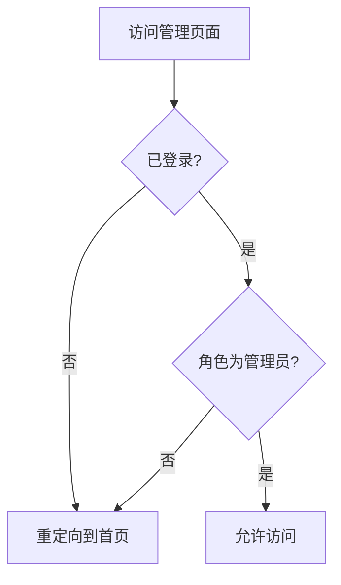
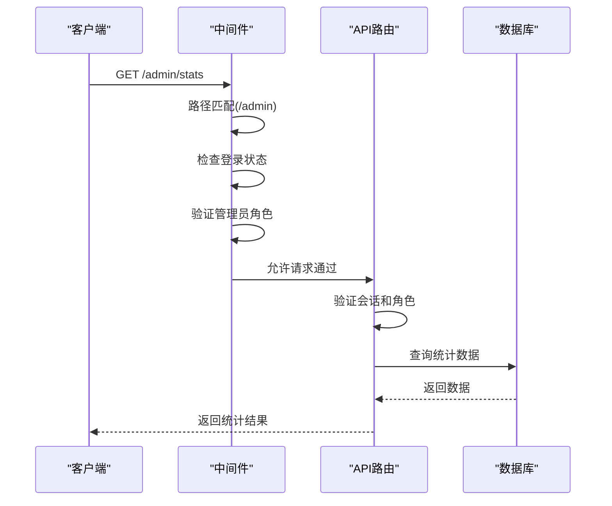

# 中间件与请求流

<cite>
**本文档引用文件**   
- [middleware.ts](file://middleware.ts)
- [auth.ts](file://src/lib/auth.ts)
- [auth\[...nextauth]\route.ts](file://src/app/api/auth\[...nextauth]/route.ts)
- [admin\stats\route.ts](file://src/app/api/admin/stats/route.ts)
- [online-counter\route.ts](file://src/app/api/admin/online-counter/route.ts)
- [platform-config\route.ts](file://src/app/api/admin/platform-config/route.ts)
- [upload-config\route.ts](file://src/app/api/admin/upload-config/route.ts)
- [users\route.ts](file://src/app/api/admin/users/route.ts)
- [works\route.ts](file://src/app/api/admin/works/route.ts)
- [auth\signin\page.tsx](file://src/app/auth/signin/page.tsx)
- [nextjs15-type-fixes-report.md](file://src/nextjs15-type-fixes-report.md)
</cite>

## 目录
1. [引言](#引言)
2. [中间件系统架构](#中间件系统架构)
3. [核心中间件逻辑分析](#核心中间件逻辑分析)
4. [管理员接口调用流程](#管理员接口调用流程)
5. [中间件调试方法](#中间件调试方法)
6. [性能影响评估](#性能影响评估)
7. [结论](#结论)

## 引言
中间件系统在数字化作品互动展示平台中扮演着关键角色，负责处理所有进入系统的请求。该系统通过`middleware.ts`文件定义的中间件实现路径匹配、身份验证、角色权限校验和请求重定向等核心功能。中间件作为请求处理流程的第一道防线，确保了系统的安全性和用户体验的流畅性。本文档将深入分析中间件的工作机制，特别是其在管理员接口访问控制中的实现方式。

## 中间件系统架构

**图示来源**
- [middleware.ts](file://middleware.ts#L1-L50)

**本节来源**
- [middleware.ts](file://middleware.ts#L1-L50)

## 核心中间件逻辑分析

### 路径匹配机制
中间件通过`req.nextUrl.pathname.startsWith()`方法对请求路径进行匹配，识别不同的页面类型。系统定义了四种主要路径类型：认证页面(`/auth`)、管理页面(`/admin`)、上传页面(`/upload`)和个人中心页面(`/profile`)。这种基于前缀的路径匹配策略简单高效，能够快速确定请求的目标区域。

**本节来源**
- [middleware.ts](file://middleware.ts#L5-L10)

### 身份验证检查
身份验证基于NextAuth.js的会话系统实现。中间件通过`req.nextauth.token`获取用户令牌，利用`!!token`操作符判断用户是否已登录。令牌中包含了用户的角色信息(`token?.role`)，这是实现细粒度访问控制的基础。当用户访问需要认证的页面但未登录时，系统会自动重定向到登录页面。

**本节来源**
- [middleware.ts](file://middleware.ts#L12-L15)
- [auth.ts](file://src/lib/auth.ts#L7-L71)

### 角色权限校验
角色权限校验是中间件的核心安全机制。系统定义了两种角色：普通用户(`USER`)和管理员(`ADMIN`)。当用户尝试访问管理页面时，中间件会检查其角色是否为`ADMIN`。如果用户未登录或角色不符，请求将被重定向到首页。这种基于角色的访问控制(RBAC)确保了管理功能的安全性。

**图示来源**
- [middleware.ts](file://middleware.ts#L25-L30)

**本节来源**
- [middleware.ts](file://middleware.ts#L25-L30)
- [auth.ts](file://src/lib/auth.ts#L7-L71)

### 请求重定向策略
中间件实现了智能的请求重定向策略。当已登录用户访问认证页面时，系统会根据其角色进行重定向：管理员用户被引导至管理页面，普通用户则返回首页。这种用户体验优化减少了不必要的页面跳转。同时，未登录用户访问个人中心时会被重定向到登录页面，确保了功能的可用性。

**本节来源**
- [middleware.ts](file://middleware.ts#L17-L23)
- [auth\signin\page.tsx](file://src/app/auth/signin/page.tsx#L39-L74)

## 管理员接口调用流程

### 管理员接口访问控制
管理员接口的访问控制通过双重机制实现：中间件层面的路径保护和API路由层面的权限验证。以`/api/admin/stats`接口为例，其调用流程如下：

**图示来源**
- [middleware.ts](file://middleware.ts#L25-L30)
- [admin\stats\route.ts](file://src/app/api/admin/stats/route.ts#L1-L162)

**本节来源**
- [middleware.ts](file://middleware.ts#L25-L30)
- [admin\stats\route.ts](file://src/app/api/admin/stats/route.ts#L1-L162)

### 细粒度访问控制实现
系统通过在API路由中重复验证权限来实现细粒度的访问控制。即使请求通过了中间件的检查，在API路由处理函数中仍会再次验证用户会话和角色。这种双重验证机制提高了系统的安全性。例如，在更新在线人数配置的`PUT /api/admin/online-counter`接口中，代码首先检查用户是否登录且角色为管理员，然后才允许执行数据库操作。

**本节来源**
- [online-counter\route.ts](file://src/app/api/admin/online-counter/route.ts#L1-L175)
- [platform-config\route.ts](file://src/app/api/admin/platform-config/route.ts)
- [upload-config\route.ts](file://src/app/api/admin/upload-config/route.ts)

## 中间件调试方法

### 日志记录
在中间件中添加详细的日志记录是调试的关键。可以在关键决策点添加`console.log`语句，记录请求路径、用户令牌和重定向决策。例如，在角色检查后记录"用户角色: ${token?.role}, 访问路径: ${req.nextUrl.pathname}"可以帮助快速定位权限问题。

**本节来源**
- [middleware.ts](file://middleware.ts#L1-L50)

### 单元测试
为中间件逻辑编写单元测试可以确保其行为的正确性。测试应覆盖各种场景：已登录管理员访问管理页面、未登录用户访问管理页面、已登录普通用户访问管理页面等。通过模拟不同的请求对象，可以验证中间件的重定向行为是否符合预期。

**本节来源**
- [nextjs15-type-fixes-report.md](file://src/nextjs15-type-fixes-report.md#L0-L49)

## 性能影响评估

### 执行开销
中间件的执行开销相对较小，主要包含路径字符串匹配和对象属性访问操作。这些操作的时间复杂度均为O(1)，对系统性能影响微乎其微。然而，如果在中间件中添加复杂的数据库查询或外部API调用，将显著增加请求延迟。

### 缓存策略
对于频繁访问的静态资源，可以考虑在中间件中实现缓存策略。通过设置适当的HTTP缓存头，可以减少服务器负载并提高响应速度。但对于需要身份验证的动态内容，应谨慎使用缓存，以免造成安全风险。

**本节来源**
- [middleware.ts](file://middleware.ts#L1-L50)

## 结论
中间件系统是数字化作品互动展示平台安全架构的核心组件。通过路径匹配、身份验证、角色权限校验和智能重定向策略，中间件有效地保护了管理功能，同时优化了用户体验。双重权限验证机制确保了系统的安全性，而简单的实现方式则保证了良好的性能表现。建议在开发过程中充分利用日志记录和单元测试来确保中间件的正确性，并定期审查中间件逻辑以适应系统需求的变化。