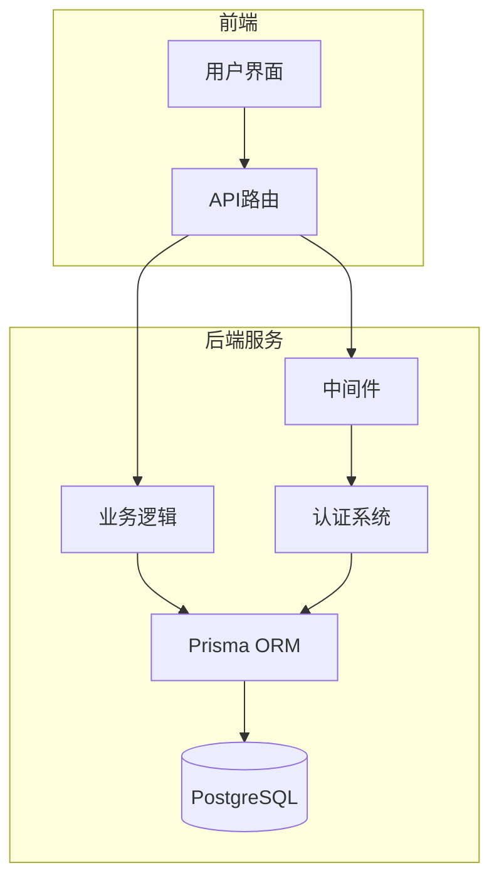
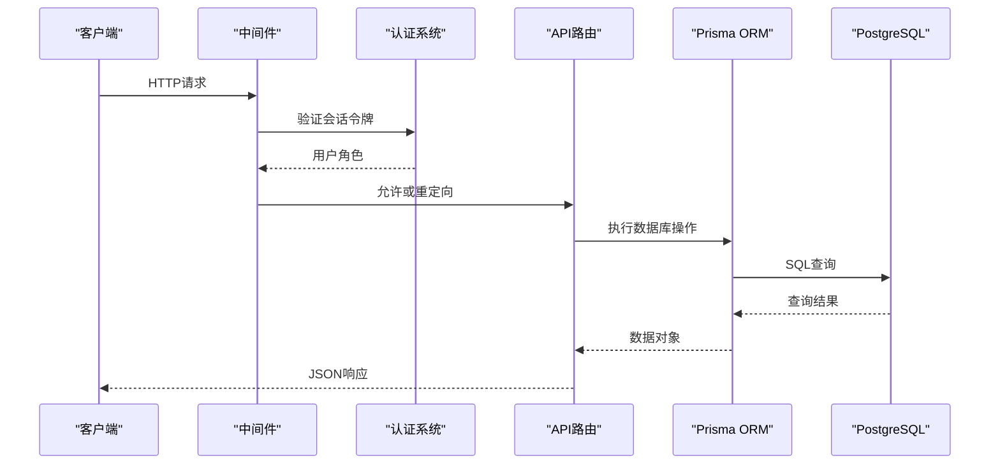
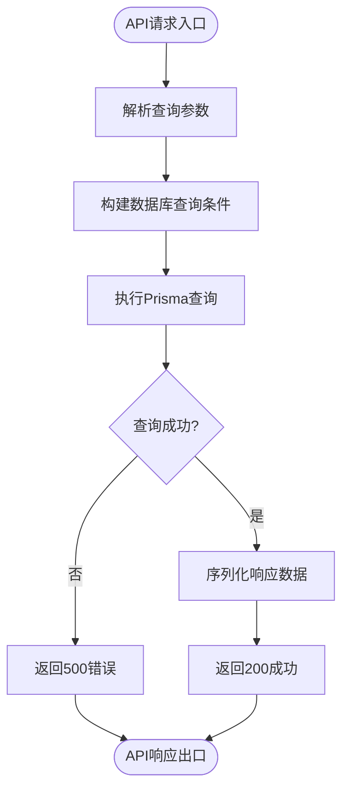
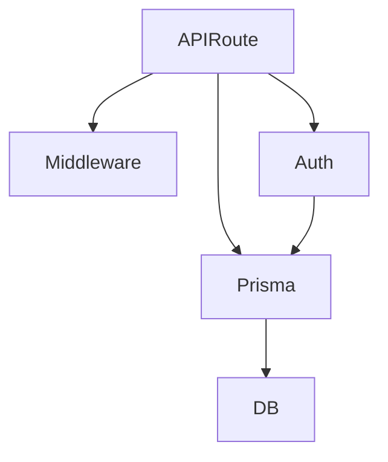

# 后端架构

<cite>
**本文档引用的文件**  
- [auth.ts](file://src/lib/auth.ts)
- [middleware.ts](file://middleware.ts)
- [prisma.ts](file://src/lib/prisma.ts)
- [route.ts](file://src/app/api/auth/[...nextauth]/route.ts)
- [works/route.ts](file://src/app/api/works/route.ts)
- [admin/works/[id]/approve/route.ts](file://src/app/api/admin/works/[id]/approve/route.ts)
- [user/profile/route.ts](file://src/app/api/user/profile/route.ts)
</cite>

## 目录
1. [简介](#简介)
2. [项目结构](#项目结构)
3. [核心组件](#核心组件)
4. [架构概览](#架构概览)
5. [详细组件分析](#详细组件分析)
6. [依赖分析](#依赖分析)
7. [性能考虑](#性能考虑)
8. [故障排除指南](#故障排除指南)
9. [结论](#结论)

## 简介
本文档旨在全面描述基于 Next.js 的后端架构实现，重点涵盖 API 路由作为后端服务的处理机制、中间件的身份验证逻辑、认证系统（NextAuth.js）的集成与扩展、Prisma ORM 与 PostgreSQL 的数据访问层设计，以及业务逻辑的封装模式和会话管理机制。

## 项目结构
项目采用标准的 Next.js App Router 架构，后端逻辑通过 API 路由（`src/app/api`）实现。API 端点按功能模块组织，如 `works`、`admin`、`user` 等，每个端点通过 `route.ts` 文件定义请求处理逻辑。数据访问层由 Prisma ORM 统一管理，认证系统基于 NextAuth.js 实现，并通过中间件进行全局访问控制。



**Diagram sources**
- [middleware.ts](file://middleware.ts#L1-L50)
- [src/app/api](file://src/app/api)

**Section sources**
- [middleware.ts](file://middleware.ts#L1-L50)
- [src/app/api](file://src/app/api)

## 核心组件
系统的核心组件包括：基于 NextAuth.js 的认证系统、Prisma 数据访问层、Next.js API 路由处理逻辑、全局中间件访问控制，以及 JWT 会话管理机制。这些组件协同工作，实现了安全、可扩展的后端服务。

**Section sources**
- [auth.ts](file://src/lib/auth.ts#L7-L71)
- [prisma.ts](file://src/lib/prisma.ts#L6-L17)
- [middleware.ts](file://middleware.ts#L1-L50)

## 架构概览
整个后端架构以 Next.js 服务器为核心，通过 API 路由接收 HTTP 请求。请求首先经过 `middleware.ts` 进行身份验证和权限检查，然后路由到相应的 API 处理函数。业务逻辑在 `route.ts` 文件中实现，通过 Prisma 客户端与 PostgreSQL 数据库交互。认证状态通过 JWT 在会话中持久化。



**Diagram sources**
- [middleware.ts](file://middleware.ts#L1-L50)
- [auth.ts](file://src/lib/auth.ts#L7-L71)
- [works/route.ts](file://src/app/api/works/route.ts#L1-L195)

## 详细组件分析

### 认证系统分析
认证系统基于 NextAuth.js 实现，采用凭证提供者（CredentialsProvider）进行邮箱密码登录。用户信息通过 Prisma 适配器与数据库同步。会话策略为 JWT，用户角色信息在 `jwt` 和 `session` 回调中注入到令牌和会话对象中，实现基于角色的访问控制。

```mermaid
classDiagram
class NextAuthOptions {
+adapter : PrismaAdapter
+providers : [CredentialsProvider]
+session : {strategy : 'jwt'}
+callbacks : {jwt(), session()}
+pages : {signIn : '/auth/signin'}
+secret : string
}
class CredentialsProvider {
+name : 'credentials'
+credentials : {email, password}
+authorize(credentials) : User | null
}
class PrismaAdapter {
+prisma : PrismaClient
}
class User {
+id : string
+email : string
+name : string
+role : Role
+password : string
}
NextAuthOptions --> CredentialsProvider : "使用"
NextAuthOptions --> PrismaAdapter : "适配"
CredentialsProvider --> User : "验证"
PrismaAdapter --> User : "同步"
```

**Diagram sources**
- [auth.ts](file://src/lib/auth.ts#L7-L71)

**Section sources**
- [auth.ts](file://src/lib/auth.ts#L7-L71)
- [route.ts](file://src/app/api/auth/[...nextauth]/route.ts#L1-L6)

### API路由处理流程
API 路由作为后端服务的入口，封装了完整的请求处理流程。以 `GET /api/works` 为例，流程包括：解析查询参数、构建数据库查询条件、执行 Prisma 查询、序列化响应数据、返回 JSON 结果。错误处理通过 try-catch 捕获，确保返回一致的错误格式。



**Diagram sources**
- [works/route.ts](file://src/app/api/works/route.ts#L1-L195)

**Section sources**
- [works/route.ts](file://src/app/api/works/route.ts#L1-L195)

### 中间件权限控制
中间件（`middleware.ts`）负责全局访问控制。它检查请求路径和用户会话，实现以下逻辑：已登录用户访问登录页则重定向至首页或管理页；非管理员访问管理页则重定向至首页；未登录用户访问个人中心则重定向至登录页。上传页面允许游客访问。

**Section sources**
- [middleware.ts](file://middleware.ts#L1-L50)

### 数据访问层
数据访问层由 Prisma ORM 实现，通过 `prisma.ts` 单例导出 `prisma` 客户端。该客户端配置了数据库连接 URL，并在开发环境下挂载到全局对象以避免热重载时创建多个实例。所有 API 路由通过 `@/lib/prisma` 导入该实例进行数据库操作。

**Section sources**
- [prisma.ts](file://src/lib/prisma.ts#L6-L17)

## 依赖分析
系统依赖关系清晰，上层组件依赖下层服务。API 路由依赖中间件和认证系统进行安全控制，业务逻辑依赖 Prisma 进行数据持久化，Prisma 依赖 PostgreSQL 数据库。NextAuth.js 通过 Prisma 适配器与数据库交互，形成闭环。



**Diagram sources**
- [middleware.ts](file://middleware.ts#L1-L50)
- [auth.ts](file://src/lib/auth.ts#L7-L71)
- [prisma.ts](file://src/lib/prisma.ts#L6-L17)

**Section sources**
- [middleware.ts](file://middleware.ts#L1-L50)
- [auth.ts](file://src/lib/auth.ts#L7-L71)
- [prisma.ts](file://src/lib/prisma.ts#L6-L17)

## 性能考虑
- **Prisma 客户端单例**：避免重复实例化，减少数据库连接开销。
- **并行查询**：在 `GET /api/works` 中使用 `Promise.all` 并行执行数据查询和总数统计。
- **连接池**：数据库连接池配置通过 `DATABASE_URL` 参数控制，优化并发性能。
- **JWT 会话**：无状态会话减少服务器存储压力，提升可扩展性。

## 故障排除指南
- **认证失败**：检查 `NEXTAUTH_SECRET` 环境变量是否设置，用户密码是否正确哈希。
- **数据库连接错误**：确认 `DATABASE_URL` 配置正确，数据库服务正在运行。
- **中间件重定向循环**：检查 `middleware.ts` 中的路径匹配规则和重定向逻辑。
- **API 响应慢**：检查数据库查询是否缺少索引，特别是 `work.status` 和 `work.approvedAt` 字段。

**Section sources**
- [auth.ts](file://src/lib/auth.ts#L7-L71)
- [prisma.ts](file://src/lib/prisma.ts#L6-L17)
- [middleware.ts](file://middleware.ts#L1-L50)

## 结论
本系统通过 Next.js API 路由实现了功能完整的后端服务，结合 NextAuth.js 和 Prisma ORM，构建了一个安全、高效、可维护的架构。JWT 会话管理和基于角色的访问控制确保了系统的安全性，而清晰的模块化结构为未来的扩展奠定了坚实基础。