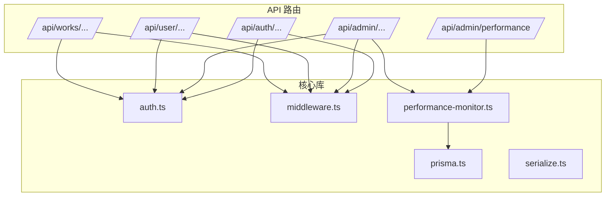
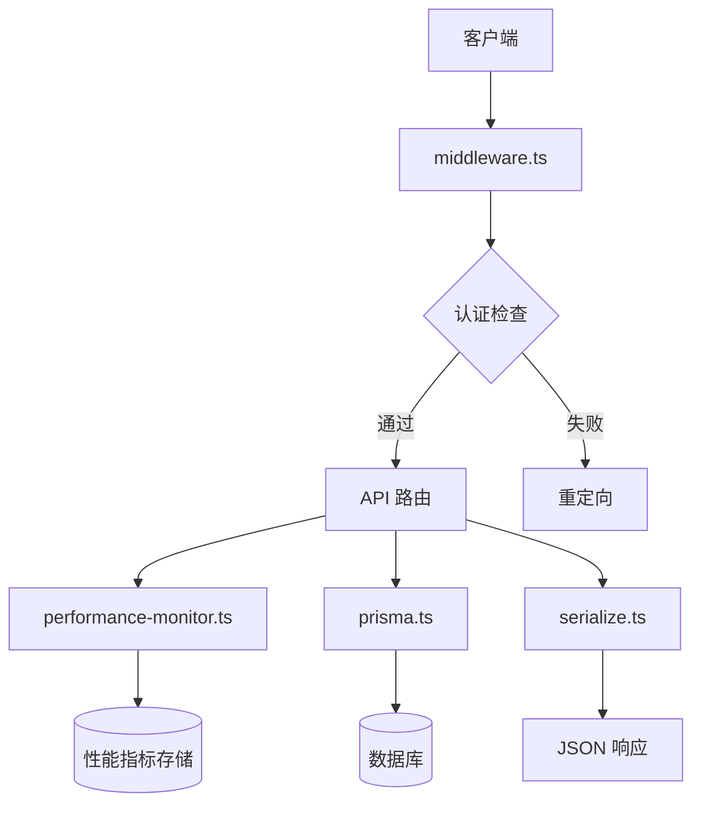
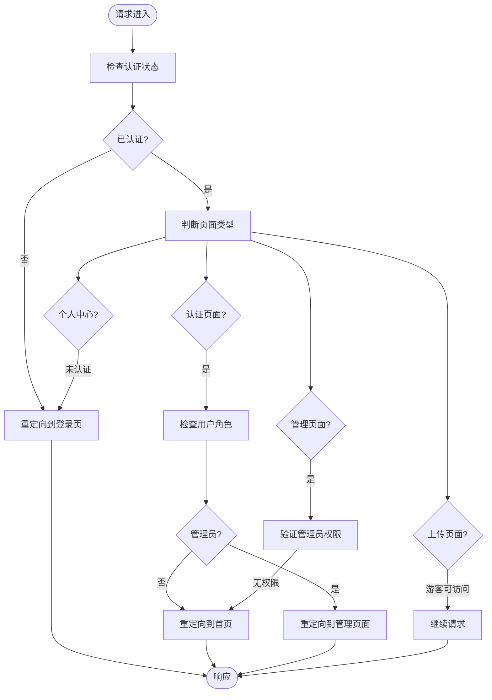
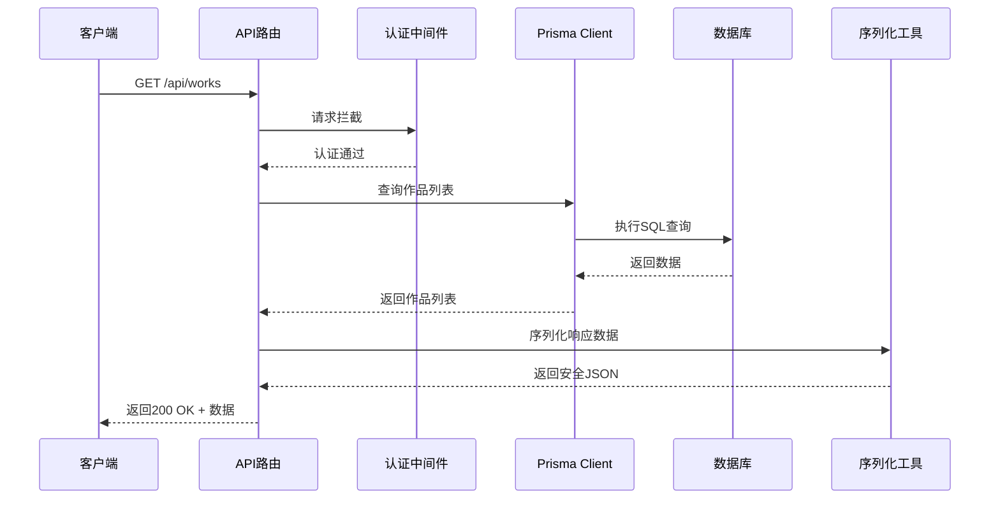
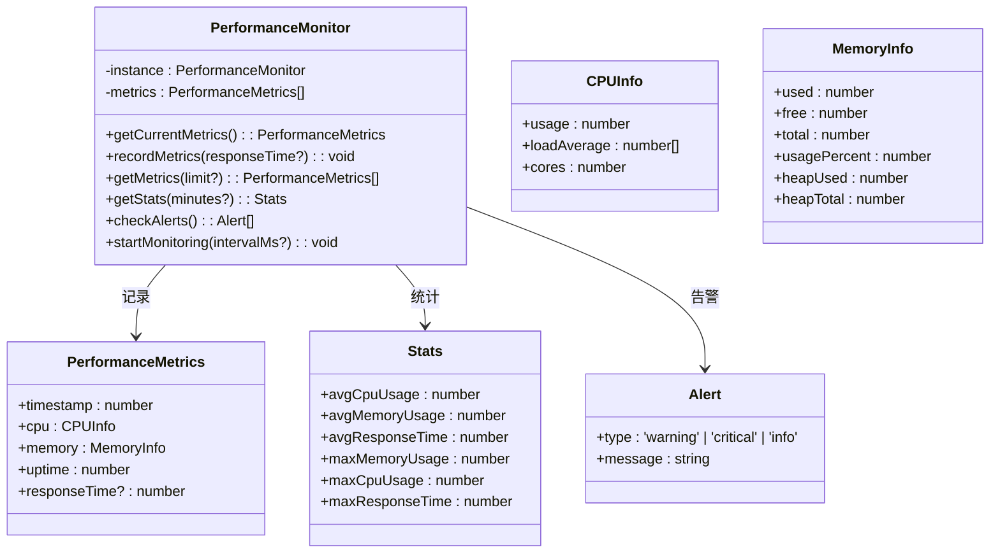
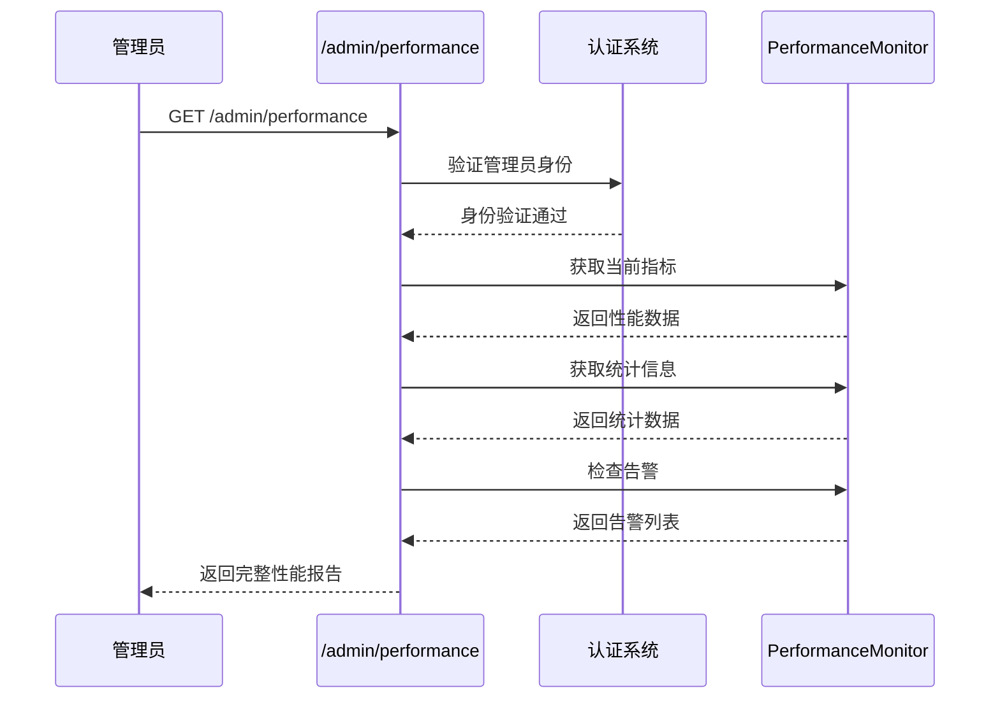
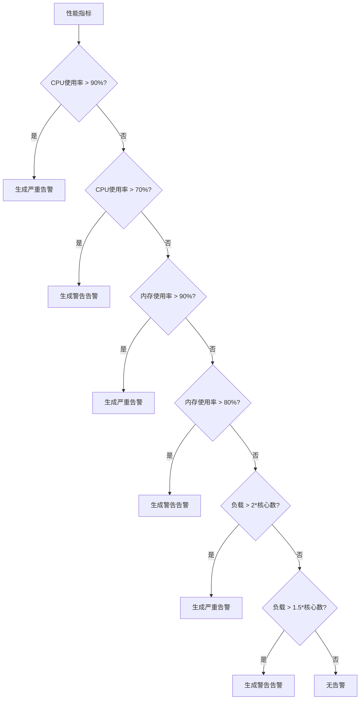
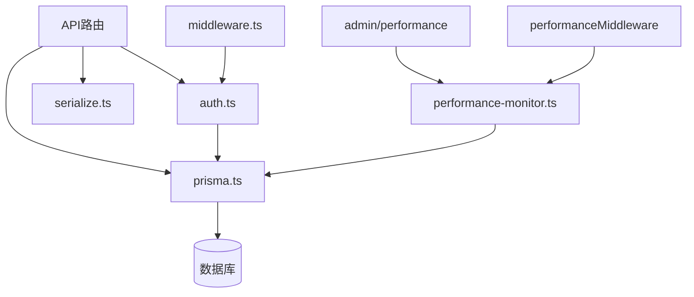

# 后端架构

<cite>
**本文档引用文件**  
- [auth.ts](file://src/lib/auth.ts)
- [middleware.ts](file://middleware.ts)
- [prisma.ts](file://src/lib/prisma.ts)
- [db-utils.ts](file://src/lib/db-utils.ts)
- [serialize.ts](file://src/lib/serialize.ts)
- [works/route.ts](file://src/app/api/works/route.ts)
- [admin/works/route.ts](file://src/app/api/admin/works/route.ts)
- [user/works/route.ts](file://src/app/api/user/works/route.ts)
- [performance-monitor.ts](file://src/lib/performance-monitor.ts) - *新增性能监控功能*
- [admin/performance/route.ts](file://src/app/api/admin/performance/route.ts) - *新增管理端性能监控接口*
</cite>

## 更新摘要
**变更内容**  
- 新增“性能监控系统”章节，详细说明性能监控功能的实现
- 在“架构概览”中补充性能监控中间件的集成
- 更新“依赖分析”图表以包含新的性能监控组件
- 增加性能监控相关的图表和源码引用
- 所有新增内容均基于最新代码变更进行描述

## 目录
1. [简介](#简介)
2. [项目结构](#项目结构)
3. [核心组件](#核心组件)
4. [架构概览](#架构概览)
5. [详细组件分析](#详细组件分析)
6. [性能监控系统](#性能监控系统)
7. [依赖分析](#依赖分析)
8. [性能考虑](#性能考虑)
9. [故障排除指南](#故障排除指南)
10. [结论](#结论)

## 简介
本文档旨在全面阐述基于 Next.js API 路由的后端架构设计，重点说明认证、管理接口与作品功能的模块化实现。通过分析中间件、认证机制、数据库访问模式及 RESTful 接口设计，为后端开发提供清晰的设计准则与最佳实践。本次更新新增了性能监控系统的详细说明，反映了最新的架构演进。

## 项目结构
项目采用标准的 Next.js App Router 结构，API 路由集中于 `src/app/api` 目录下，按功能划分为 `auth`、`admin`、`user` 和 `works` 等子模块。这种组织方式实现了职责分离，提升了代码可维护性。新增的性能监控功能位于 `src/lib/performance-monitor.ts`，并通过 `admin/performance` 路由暴露管理接口。



**Diagram sources**
- [src/app/api](file://src/app/api)
- [middleware.ts](file://middleware.ts#L1-L50)
- [src/lib/performance-monitor.ts](file://src/lib/performance-monitor.ts#L1-L220)

**Section sources**
- [middleware.ts](file://middleware.ts#L1-L50)
- [src/app/api](file://src/app/api)
- [src/lib/performance-monitor.ts](file://src/lib/performance-monitor.ts#L1-L220)

## 核心组件
后端核心由认证系统、API 路由、Prisma 数据访问层、序列化工具和性能监控系统构成。`auth.ts` 统一处理身份验证，`prisma.ts` 提供数据库连接实例，`serialize.ts` 确保安全的 JSON 序列化，`performance-monitor.ts` 实现系统性能监控，共同支撑各 API 模块的运行。

**Section sources**
- [auth.ts](file://src/lib/auth.ts#L1-L71)
- [prisma.ts](file://src/lib/prisma.ts#L1-L20)
- [serialize.ts](file://src/lib/serialize.ts#L1-L52)
- [performance-monitor.ts](file://src/lib/performance-monitor.ts#L1-L220)

## 架构概览
系统采用分层架构，客户端请求经由中间件进行全局拦截与身份验证，随后路由至对应的 API 处理函数。所有数据操作通过 Prisma Client 与数据库交互，并使用统一的序列化函数处理响应数据。新增的性能监控中间件记录每个 API 请求的响应时间，用于系统性能分析。



**Diagram sources**
- [middleware.ts](file://middleware.ts#L1-L50)
- [prisma.ts](file://src/lib/prisma.ts#L1-L20)
- [serialize.ts](file://src/lib/serialize.ts#L1-L52)
- [performance-monitor.ts](file://src/lib/performance-monitor.ts#L1-L220)

## 详细组件分析

### 认证系统分析
认证系统基于 NextAuth.js 实现，采用 JWT 令牌策略，通过凭证提供者（Credentials Provider）验证用户邮箱与密码。用户角色信息被注入 JWT 令牌，用于后续的权限控制。

```mermaid
classDiagram
class authOptions {
+adapter : PrismaAdapter
+providers : CredentialsProvider[]
+session : {strategy : 'jwt'}
+callbacks : {jwt(), session()}
+pages : {signIn : '/auth/signin'}
+secret : string
}
class CredentialsProvider {
+name : 'credentials'
+credentials : {email, password}
+authorize(credentials) : User | null
}
class jwtCallback {
+jwt({token, user}) : JWT
+session({session, token}) : Session
}
authOptions --> CredentialsProvider : 包含
authOptions --> jwtCallback : 使用回调
```

**Diagram sources**
- [auth.ts](file://src/lib/auth.ts#L1-L71)

**Section sources**
- [auth.ts](file://src/lib/auth.ts#L1-L71)

### 中间件请求流程分析
中间件实现全局请求拦截，根据用户认证状态和角色进行访问控制与重定向。管理员访问管理页面需具备 ADMIN 角色，普通用户访问认证页面后将被重定向至首页。



**Diagram sources**
- [middleware.ts](file://middleware.ts#L1-L50)

**Section sources**
- [middleware.ts](file://middleware.ts#L1-L50)

### 作品列表获取流程分析
用户获取作品列表的请求流程展示了从 API 路由到数据库查询再到响应序列化的完整链条。该流程遵循 RESTful 设计原则，并包含统一的错误处理机制。



**Diagram sources**
- [works/route.ts](file://src/app/api/works/route.ts#L1-L207)
- [prisma.ts](file://src/lib/prisma.ts#L1-L20)
- [serialize.ts](file://src/lib/serialize.ts#L1-L52)

**Section sources**
- [works/route.ts](file://src/app/api/works/route.ts#L1-L207)

## 性能监控系统
新增的性能监控系统用于实时监测服务器运行状态，包括CPU使用率、内存占用、系统负载和API响应时间等关键指标。系统由 `performance-monitor.ts` 核心类和 `admin/performance` 管理接口组成。

### 性能监控架构
性能监控系统采用单例模式实现，通过中间件收集API响应时间，并定期记录系统资源使用情况。



**Diagram sources**
- [performance-monitor.ts](file://src/lib/performance-monitor.ts#L1-L220)

**Section sources**
- [performance-monitor.ts](file://src/lib/performance-monitor.ts#L1-L220)

### 性能监控API流程
管理员可以通过特定API获取系统性能指标，包括实时数据、统计信息和告警状态。



**Diagram sources**
- [admin/performance/route.ts](file://src/app/api/admin/performance/route.ts#L1-L123)

**Section sources**
- [admin/performance/route.ts](file://src/app/api/admin/performance/route.ts#L1-L123)

### 告警机制
系统实现了基于阈值的告警机制，当关键指标超过预设阈值时会生成相应级别的告警。



**Diagram sources**
- [performance-monitor.ts](file://src/lib/performance-monitor.ts#L131-L177)

**Section sources**
- [performance-monitor.ts](file://src/lib/performance-monitor.ts#L131-L177)

## 依赖分析
后端组件间依赖关系清晰，API 路由依赖认证和数据库访问服务，中间件依赖认证配置，所有数据操作最终通过 Prisma Client 与数据库交互。新增的性能监控系统被管理接口和中间件所依赖。



**Diagram sources**
- [package.json](file://package.json)
- [middleware.ts](file://middleware.ts#L1-L50)
- [performance-monitor.ts](file://src/lib/performance-monitor.ts#L1-L220)
- [admin/performance/route.ts](file://src/app/api/admin/performance/route.ts#L1-L123)

**Section sources**
- [package.json](file://package.json)
- [middleware.ts](file://middleware.ts#L1-L50)
- [performance-monitor.ts](file://src/lib/performance-monitor.ts#L1-L220)

## 性能考虑
- 使用 Prisma Client 单例模式减少数据库连接开销
- 在查询中合理使用 `include` 和 `select` 以减少数据传输量
- 通过分页（pagination）避免一次性加载过多数据
- 利用 `Promise.all` 并行执行独立的数据库查询
- 新增性能监控系统，通过 `performanceMiddleware` 记录API响应时间
- 实现定期系统资源监控，及时发现性能瓶颈
- 设置多级告警阈值，预防系统过载

## 故障排除指南
- **认证失败**：检查 `authOptions` 配置及环境变量 `NEXTAUTH_SECRET`
- **数据库连接错误**：确认 `DATABASE_URL` 配置正确
- **类型错误**：如 `withAuth` 函数类型不匹配，确保 `context` 参数为可选
- **上传功能异常**：检查 `uploadConfig` 表是否存在且配置正确
- **性能监控数据缺失**：确认 `performanceMiddleware` 已正确集成
- **告警未触发**：检查 `checkAlerts` 方法中的阈值设置

**Section sources**
- [auth.ts](file://src/lib/auth.ts#L1-L71)
- [prisma.ts](file://src/lib/prisma.ts#L1-L20)
- [src/nextjs15-type-fixes-report.md](file://src/nextjs15-type-fixes-report.md)
- [performance-monitor.ts](file://src/lib/performance-monitor.ts#L1-L220)

## 结论
本项目通过 Next.js API 路由构建了结构清晰、职责分明的后端服务。采用 NextAuth.js 实现安全的认证机制，结合中间件进行全局访问控制，利用 Prisma 提供高效的数据访问，并通过统一的序列化和错误处理规范确保 API 的一致性与可靠性。本次更新新增的性能监控系统为系统运维提供了重要支持，能够实时监测服务器状态并及时发现潜在问题。该架构为后续功能扩展提供了坚实的基础。