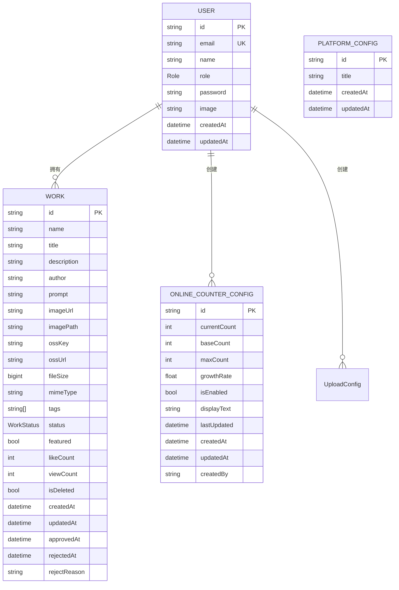
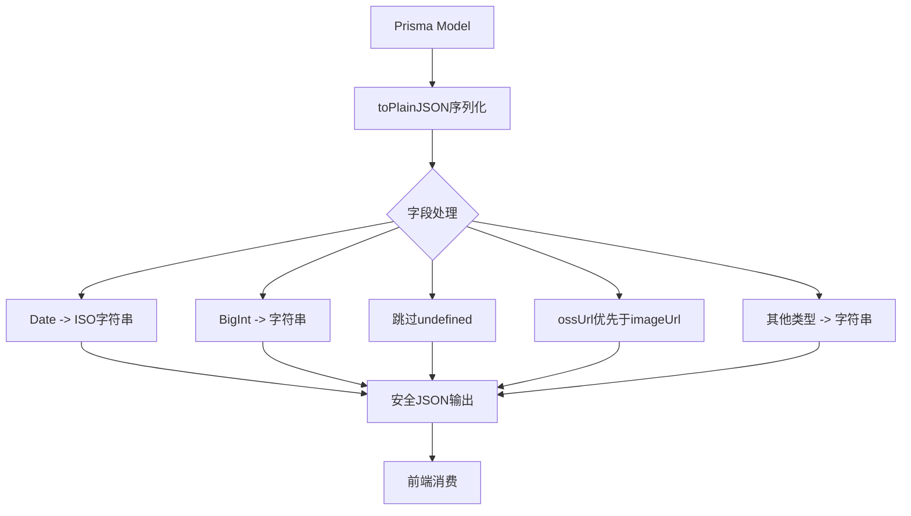

# 数据模型

<cite>
**Referenced Files in This Document**   
- [schema.prisma](file://prisma/schema.prisma)
- [work.d.ts](file://src/types/work.d.ts)
- [serialize.ts](file://src/lib/serialize.ts)
- [db-utils.ts](file://src/lib/db-utils.ts)
- [route.ts](file://src/app/api/admin/stats/route.ts)
- [route.ts](file://src/app/api/user/works/route.ts)
</cite>

## 目录
1. [核心实体模型](#核心实体模型)
2. [实体关系与ER图](#实体关系与er图)
3. [业务字段详解](#业务字段详解)
4. [数据序列化与安全传输](#数据序列化与安全传输)
5. [典型查询场景](#典型查询场景)
6. [索引设计与性能优化](#索引设计与性能优化)

## 核心实体模型

本系统基于Prisma ORM定义了多个核心数据模型，主要包括用户（User）、作品（Work）、平台配置（PlatformConfig）和在线人数配置（OnlineCounterConfig）等实体。这些模型构成了系统的基础数据结构，支撑着用户管理、作品展示、平台配置等核心功能。

**Section sources**
- [schema.prisma](file://prisma/schema.prisma#L1-L168)

## 实体关系与ER图

系统中的核心实体通过外键和关系字段建立了明确的关联关系。其中，用户与作品之间存在一对多的关系，一个用户可以拥有多个作品；平台配置和在线人数配置则作为独立的单例配置实体存在。



**Diagram sources**
- [schema.prisma](file://prisma/schema.prisma#L1-L168)

**Section sources**
- [schema.prisma](file://prisma/schema.prisma#L1-L168)

## 业务字段详解

### User模型
用户模型（User）是系统的核心身份实体，包含以下关键字段：
- `id`: 唯一标识符，使用cuid()生成
- `email`: 邮箱地址，具有唯一性约束
- `name`: 用户姓名，可选字段
- `role`: 用户角色，枚举类型，默认为USER
- `password`: 密码字段，用于认证
- `image`: 用户头像URL
- `createdAt`和`updatedAt`: 审计时间戳

### Work模型
作品模型（Work）是系统的核心内容实体，其字段设计充分考虑了数字作品展示的需求：
- `id`: 唯一标识符
- `name`和`title`: 作品名称和简述
- `author`: 作者名
- `imageUrl`, `imagePath`, `ossKey`, `ossUrl`: 图片相关字段，支持OSS对象存储
- `fileSize`和`mimeType`: 文件元数据
- `tags`: 标签数组，用于分类和搜索
- `status`: 作品状态，枚举类型（待审核、已通过、已拒绝）
- `featured`: 精选标记，布尔类型，默认为false
- `likeCount`和`viewCount`: 点赞数和浏览数统计
- `isDeleted`: 软删除标记
- 时间戳字段：`createdAt`, `updatedAt`, `approvedAt`, `rejectedAt`

### PlatformConfig模型
平台配置模型（PlatformConfig）用于管理平台级别的配置：
- `id`: 唯一标识符
- `title`: 平台主标题，默认值为"Qoder和通义灵码 AI Coding 作品秀"
- 时间戳字段：`createdAt`, `updatedAt`

该模型的设计采用了JSONB结构（在PostgreSQL中），允许灵活存储和查询复杂的配置数据，同时保持了良好的查询性能。

### OnlineCounterConfig模型
在线人数配置模型（OnlineCounterConfig）用于实现动态的在线人数显示功能：
- `currentCount`: 当前显示人数
- `baseCount`: 基础人数
- `maxCount`: 最大人数
- `growthRate`: 增长速率
- `isEnabled`: 功能开关
- `displayText`: 显示文本
- `lastUpdated`: 最后更新时间
- `createdBy`: 创建者ID，关联到User模型

**Section sources**
- [schema.prisma](file://prisma/schema.prisma#L1-L168)

## 数据序列化与安全传输

为了确保后端数据能够安全地传输到前端，系统实现了专门的数据序列化机制。通过`src/lib/serialize.ts`中的`toPlainJSON`函数，后端数据在传输前会被转换为前端安全的JSON格式。

该序列化过程包含以下关键特性：
1. **类型安全转换**：支持字符串、数字、布尔值、null、数组和对象的递归转换
2. **特殊类型处理**：Date对象转换为ISO字符串，BigInt转换为字符串以避免精度丢失
3. **敏感字段过滤**：自动跳过undefined值，防止不兼容的JSON序列化
4. **URL优化**：优先使用OSS完整URL（ossUrl）作为图片显示地址
5. **兜底处理**：对不可序列化类型（如函数、symbol）转换为字符串

在`src/types/work.d.ts`中定义了前端使用的类型接口，如`WorkWithUser`和`UserWork`，这些接口明确指定了前端需要的数据结构，避免了将完整的Prisma模型暴露给前端，增强了系统的安全性。



**Diagram sources**
- [serialize.ts](file://src/lib/serialize.ts#L1-L52)
- [work.d.ts](file://src/types/work.d.ts#L1-L95)

**Section sources**
- [serialize.ts](file://src/lib/serialize.ts#L1-L52)
- [work.d.ts](file://src/types/work.d.ts#L1-L95)

## 典型查询场景

### 获取用户作品列表
通过`/api/user/works`接口，可以获取当前用户的作品列表。查询时会根据用户ID过滤作品，并支持分页、状态筛选和关键词搜索功能。返回的数据经过序列化处理，只包含前端需要的字段。

```typescript
// 查询条件构建
const where: any = {
  userId: session.user.id
};

if (status) {
  where.status = status;
}

if (search) {
  where.OR = [
    { title: { contains: search, mode: 'insensitive' } },
    { description: { contains: search, mode: 'insensitive' } }
  ];
}
```

### 筛选精选作品
作品的`featured`字段用于标记精选作品。在作品展示页面（如个人主页），会通过条件判断显示精选标识：
```typescript
{work.featured && (
  <div className="absolute top-2 left-2">
    <span className="inline-flex items-center px-2 py-1 rounded-full text-xs font-medium bg-yellow-100 text-yellow-800 dark:bg-yellow-900/20 dark:text-yellow-400">
      ⭐ 精选
    </span>
  </div>
)}
```

### 统计作品总览数据
管理员面板通过`/api/admin/stats`接口获取作品的统计概览数据，包括：
- 总用户数、总作品数
- 待审核、已通过、已拒绝的作品数量
- 最近7天的新增用户和作品数
- 每日作品提交趋势
- 活跃用户排名

这些统计数据通过并行查询（Promise.all）高效获取，确保了管理后台的响应性能。

**Section sources**
- [route.ts](file://src/app/api/user/works/route.ts#L34-L87)
- [page.tsx](file://src/app/profile/page.tsx#L451-L472)
- [route.ts](file://src/app/api/admin/stats/route.ts#L0-L137)

## 索引设计与性能优化

虽然当前的Prisma schema中未显式定义索引，但根据查询模式分析，系统在关键字段上应建立适当的索引以优化查询性能：

1. **复合索引**：在`Work`模型的`userId`和`createdAt`字段上建立复合索引，优化用户作品列表的查询性能
2. **状态索引**：在`Work`模型的`status`字段上建立索引，加速作品状态筛选查询
3. **时间索引**：在`createdAt`字段上建立索引，优化按时间排序的查询
4. **全文搜索索引**：在`title`和`description`字段上考虑建立全文搜索索引，提升关键词搜索性能

尽管当前schema中未使用`@@index`或`@@unique`指令显式定义这些索引，但在生产环境中应根据实际查询负载添加适当的索引策略。同时，系统通过并行查询（如`Promise.all`）和分页机制有效控制了数据库查询的性能开销。

**Section sources**
- [schema.prisma](file://prisma/schema.prisma#L1-L168)
- [db-utils.ts](file://src/lib/db-utils.ts#L51-L67)