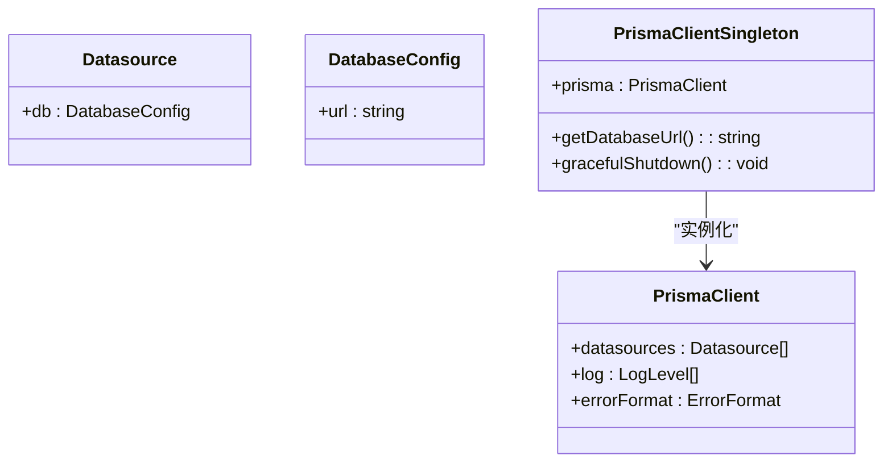

# 数据访问层

<cite>
**本文档引用的文件**  
- [prisma.ts](file://src/lib/prisma.ts)
- [schema.prisma](file://prisma/schema.prisma)
- [db-utils.ts](file://src/lib/db-utils.ts)
- [seed.ts](file://prisma/seed.ts)
</cite>

## 目录
1. [简介](#简介)
2. [Prisma Client初始化与连接管理](#prisma-client初始化与连接管理)
3. [数据库模型定义与业务实体映射](#数据库模型定义与业务实体映射)
4. [常用数据操作抽象](#常用数据操作抽象)
5. [种子数据加载机制](#种子数据加载机制)
6. [性能优化建议](#性能优化建议)
7. [常见数据库错误处理](#常见数据库错误处理)
8. [结论](#结论)

## 简介
本文档详细阐述了数字化作品互动展示平台的数据访问层架构，重点介绍Prisma ORM的使用模式。文档涵盖Prisma Client的初始化与连接管理、数据库模型定义及其与业务实体的映射关系、常用数据操作抽象的设计与复用模式、种子数据的加载机制，并提供性能优化建议和常见数据库错误处理方案。

## Prisma Client初始化与连接管理

Prisma Client的初始化与连接管理在`src/lib/prisma.ts`文件中实现。该文件导出一个单例的Prisma Client实例，确保在整个应用中共享同一个数据库连接池，避免创建过多连接导致资源浪费。



**图表来源**
- [prisma.ts](file://src/lib/prisma.ts#L1-L50)

**章节来源**
- [prisma.ts](file://src/lib/prisma.ts#L1-L50)

## 数据库模型定义与业务实体映射

数据库模型定义位于`prisma/schema.prisma`文件中，使用Prisma Schema语言定义了用户、作品、上传配置、在线人数配置等多个模型。这些模型与业务实体一一对应，通过Prisma Client生成的类型在TypeScript中实现类型安全的数据库操作。

```mermaid
erDiagram
  USER ||--o{ WORK : "上传"
  USER ||--o{ UPLOAD_CONFIG : "创建"
  USER ||--o{ ONLINE_COUNTER_CONFIG : "创建"
  WORK ||--o{ TAG : "包含"
  USER {
    string id PK
    string email UK
    string name
    Role role
    string password
    datetime createdAt
    datetime updatedAt
  }
  WORK {
    string id PK
    string name
    string title
    string description
    string author
    string prompt
    string imageUrl
    string imagePath
    string ossKey
    string ossUrl
    bigint fileSize
    string mimeType
    string[] tags
    WorkStatus status
    boolean featured
    int likeCount
    int viewCount
    boolean isDeleted
    datetime createdAt
    datetime updatedAt
    datetime approvedAt
    datetime rejectedAt
    string rejectReason
    string userId