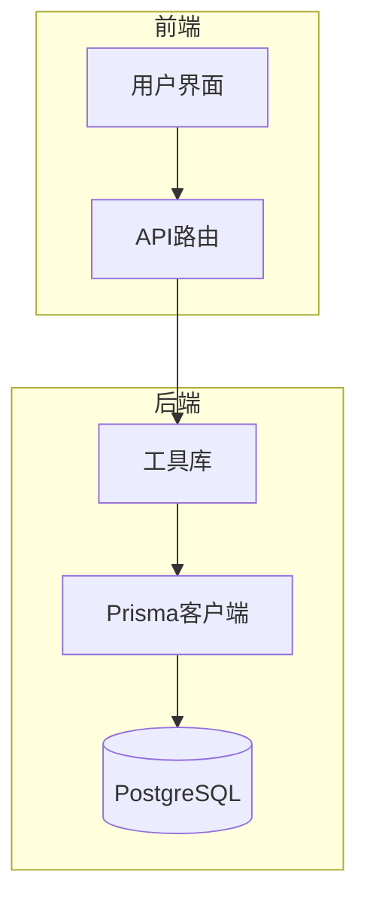
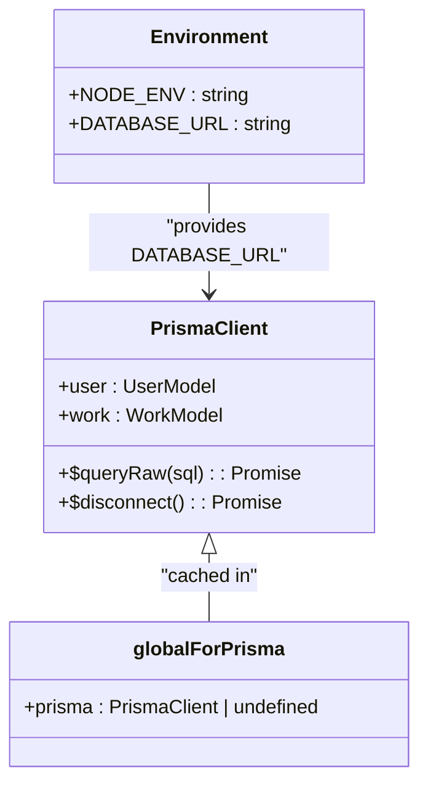
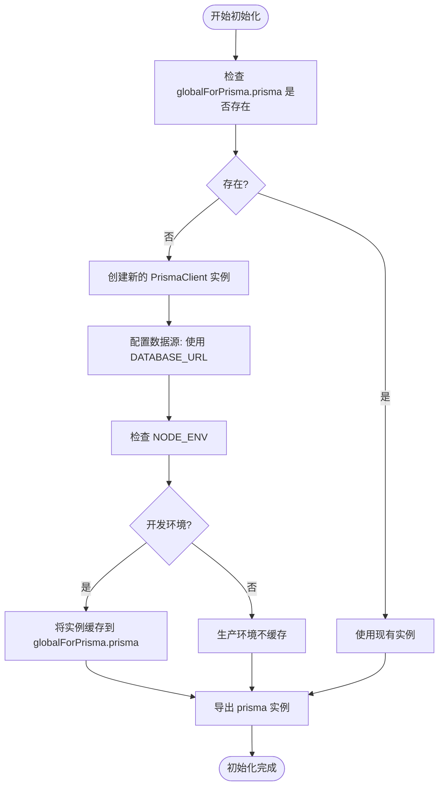
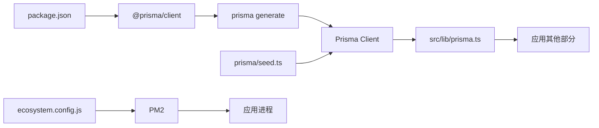

# Prisma客户端初始化

<cite>
**本文档中引用的文件**  
- [prisma.ts](file://src/lib/prisma.ts)
- [package.json](file://package.json)
- [seed.ts](file://prisma/seed.ts)
- [ecosystem.config.js](file://ecosystem.config.js)
- [next.config.ts](file://next.config.ts)
- [README.md](file://README.md)
</cite>

## 目录
1. [简介](#简介)
2. [项目结构](#项目结构)
3. [核心组件](#核心组件)
4. [架构概述](#架构概述)
5. [详细组件分析](#详细组件分析)
6. [依赖分析](#依赖分析)
7. [性能考虑](#性能考虑)
8. [故障排除指南](#故障排除指南)
9. [结论](#结论)

## 简介
本文档详细说明了在 `src/lib/prisma.ts` 中如何通过全局变量缓存 PrismaClient 实例，以避免在开发环境中重复创建数据库连接。文档解释了 `globalForPrisma` 类型的定义及其在热重载环境下的作用机制，描述了如何从环境变量 `DATABASE_URL` 中读取数据库连接字符串并正确配置数据源。同时涵盖了生产环境与开发环境初始化的差异，以及连接池参数在连接字符串中的配置方式（如 `connection_limit`）。此外，还提供了防止内存泄漏的最佳实践，并演示了如何在应用关闭时正确断开数据库连接。

## 项目结构
本项目采用 Next.js 15 的 App Router 架构，结合 Prisma ORM 进行数据库操作。主要目录包括 `src/app`（页面和 API 路由）、`prisma`（数据库模式和迁移）、`src/lib`（工具库）等。Prisma 客户端初始化逻辑位于 `src/lib/prisma.ts`，是整个应用数据库交互的核心入口。

**Diagram sources**
- [prisma.ts](file://src/lib/prisma.ts)
- [next.config.ts](file://next.config.ts)

**Section sources**
- [prisma.ts](file://src/lib/prisma.ts)
- [README.md](file://README.md)

## 核心组件
`src/lib/prisma.ts` 文件中的核心是 `prisma` 实例的导出。该实例通过检查全局对象 `globalForPrisma` 是否已存在 PrismaClient 实例来决定是复用现有实例还是创建新实例。这种模式有效防止了在开发环境热重载时重复创建连接，从而避免内存泄漏。

**Section sources**
- [prisma.ts](file://src/lib/prisma.ts#L0-L19)

## 架构概述
Prisma 客户端的初始化采用了单例模式，通过全局对象进行实例缓存。在开发环境中，该实例被挂载到 `globalThis` 上，确保热重载不会导致新的客户端被创建。生产环境中则直接创建新实例。数据库连接字符串通过 `process.env.DATABASE_URL` 注入，连接池等参数通过连接字符串的查询参数（如 `connection_limit`）进行配置。

**Diagram sources**
- [prisma.ts](file://src/lib/prisma.ts#L0-L19)

## 详细组件分析

### Prisma客户端初始化分析
`src/lib/prisma.ts` 文件实现了 PrismaClient 的智能初始化。通过类型断言将 `globalThis` 扩展为包含 `prisma` 属性的对象 `globalForPrisma`。导出的 `prisma` 常量首先尝试从 `globalForPrisma.prisma` 获取现有实例，若不存在则创建新实例。在非生产环境（即开发环境）中，新创建的实例会被赋值给 `globalForPrisma.prisma`，以便后续热重载时复用。

#### 初始化逻辑流程图

**Diagram sources**
- [prisma.ts](file://src/lib/prisma.ts#L0-L19)

**Section sources**
- [prisma.ts](file://src/lib/prisma.ts#L0-L19)

### 环境变量与连接配置
数据库连接完全依赖于环境变量 `DATABASE_URL`。该 URL 不仅包含主机、端口、数据库名等基本信息，还可以通过查询参数配置连接池行为，例如 `connection_limit=10` 用于限制最大连接数。此配置方式符合 Prisma 的最佳实践，将连接管理交由数据库驱动层处理。

**Section sources**
- [prisma.ts](file://src/lib/prisma.ts#L0-L19)
- [README.md](file://README.md)

## 依赖分析
Prisma 客户端的初始化依赖于 `@prisma/client` 包，其版本在 `package.json` 中明确指定。项目通过 `prisma generate` 命令生成客户端代码，并在 `seed.ts` 中使用该客户端进行数据库种子数据填充。`ecosystem.config.js` 配置了 PM2 进程管理器，确保在生产环境中稳定运行。

**Diagram sources**
- [package.json](file://package.json)
- [prisma.ts](file://src/lib/prisma.ts)
- [seed.ts](file://prisma/seed.ts)
- [ecosystem.config.js](file://ecosystem.config.js)

**Section sources**
- [package.json](file://package.json)
- [seed.ts](file://prisma/seed.ts)
- [ecosystem.config.js](file://ecosystem.config.js)

## 性能考虑
在开发环境中使用全局缓存实例可以显著减少因热重载导致的数据库连接数激增，从而避免连接池耗尽和内存泄漏。生产环境中虽然不使用缓存，但通过连接字符串中的 `connection_limit` 等参数可以有效控制数据库资源使用。建议根据实际部署环境的数据库规格调整连接池大小。

## 故障排除指南
- **问题：开发环境出现 "too many connections" 错误**
  - **原因**：热重载未正确复用 PrismaClient 实例。
  - **解决方案**：确认 `src/lib/prisma.ts` 中的全局缓存逻辑是否正确执行，检查 `NODE_ENV` 是否为 `development`。

- **问题：生产环境连接不稳定**
  - **原因**：连接池配置不当。
  - **解决方案**：检查 `DATABASE_URL` 中的 `connection_limit` 和 `pool_timeout` 等参数，确保与数据库服务器的配置相匹配。

- **问题：应用关闭后数据库连接未释放**
  - **解决方案**：在应用关闭钩子（如 `process.on('SIGTERM')`）中调用 `await prisma.$disconnect()`，确保优雅关闭。

**Section sources**
- [prisma.ts](file://src/lib/prisma.ts)
- [verify-database.ts](file://verify-database.ts)

## 结论
`src/lib/prisma.ts` 中的 PrismaClient 初始化模式是 Next.js 应用中处理数据库连接的典范。它巧妙地利用了 Node.js 的全局对象解决了开发环境的热重载问题，同时保持了生产环境的简洁性。通过环境变量和连接字符串参数，实现了配置的灵活性和可移植性。遵循此模式可以有效避免常见的数据库连接问题，确保应用的稳定性和性能。