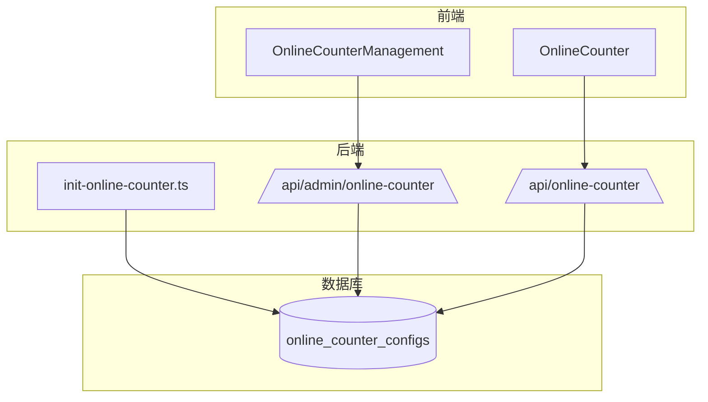
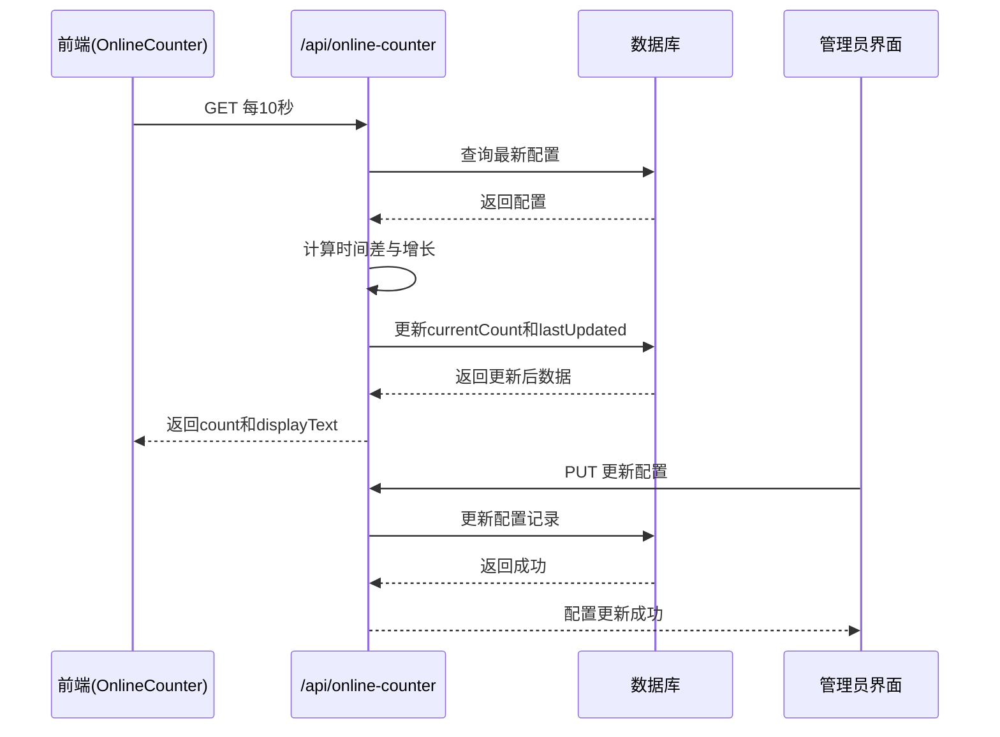
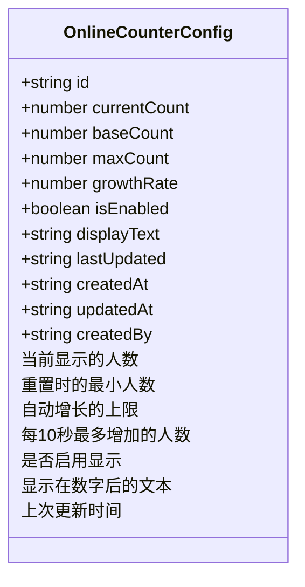
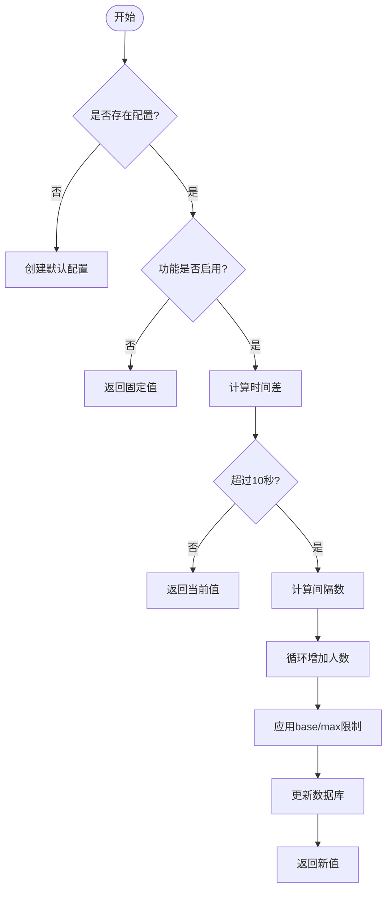
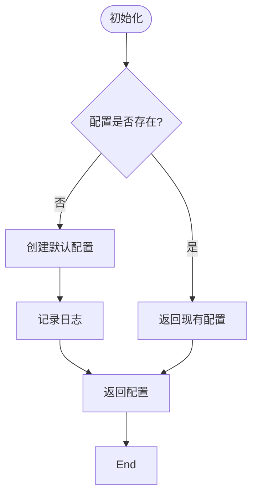
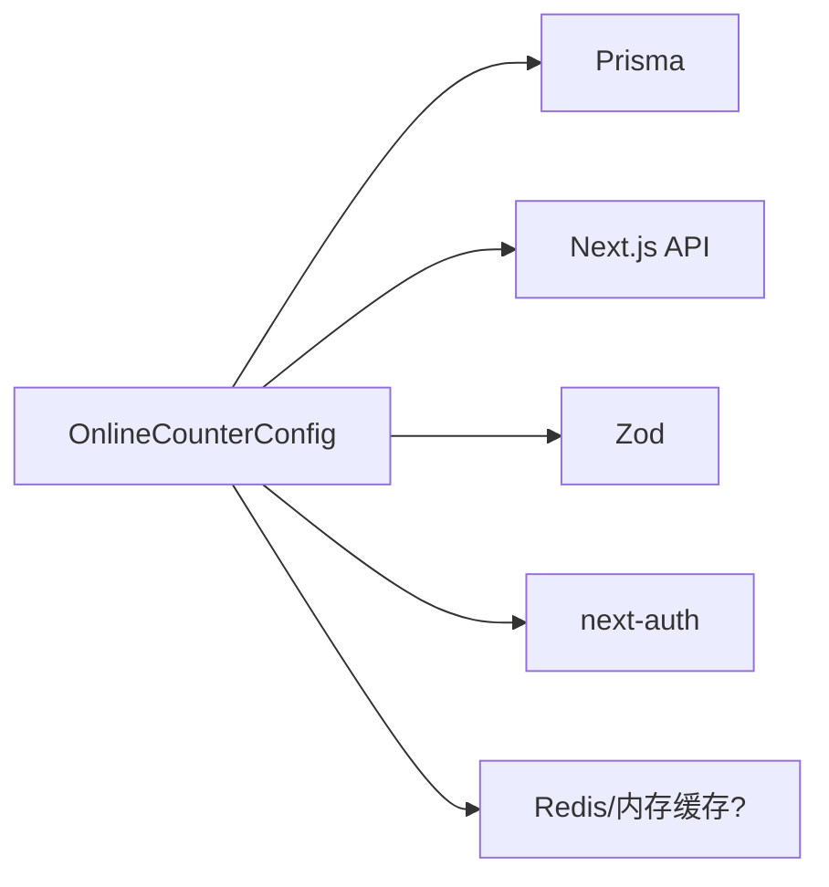

# 在线计数器配置模型 (OnlineCounterConfig)

<cite>
**本文档引用的文件**  
- [OnlineCounterConfig.tsx](file://src/components/admin/OnlineCounterManagement.tsx)
- [route.ts](file://src/app/api/online-counter/route.ts)
- [init-online-counter.ts](file://src/lib/init-online-counter.ts)
- [route.ts](file://src/app/api/admin/online-counter/route.ts)
- [migration.sql](file://prisma/migrations/20250905143157_add_online_counter_config/migration.sql)
- [OnlineCounter.tsx](file://src/components/OnlineCounter.tsx)
</cite>

## 目录
1. [简介](#简介)
2. [项目结构](#项目结构)
3. [核心组件](#核心组件)
4. [架构概述](#架构概述)
5. [详细组件分析](#详细组件分析)
6. [依赖分析](#依赖分析)
7. [性能考量](#性能考量)
8. [故障排除指南](#故障排除指南)
9. [结论](#结论)

## 简介
`OnlineCounterConfig` 模型是数字化作品互动展示平台中的关键功能模块，用于动态管理前端在线人数的显示行为。该模型支持通过管理员界面进行热更新配置，并结合数据库持久化与定时增长逻辑，实现逼真的在线用户增长效果。本文档全面解析其结构、运行机制、初始化流程、接口交互及高并发场景下的优化建议。

## 项目结构
`OnlineCounterConfig` 模型贯穿于后端 API、数据库迁移、前端管理界面与展示组件中，形成完整的闭环系统。

**Diagram sources**  
- [migration.sql](file://prisma/migrations/20250905143157_add_online_counter_config/migration.sql#L1-L20)
- [route.ts](file://src/app/api/online-counter/route.ts#L1-L188)
- [route.ts](file://src/app/api/admin/online-counter/route.ts#L1-L175)

**Section sources**  
- [src](file://src#L1-L100)
- [prisma](file://prisma#L1-L10)

## 核心组件
`OnlineCounterConfig` 模型由数据库表、后端接口、初始化逻辑和前端组件共同构成。其核心字段包括 `currentCount`、`baseCount`、`maxCount`、`growthRate`、`isEnabled` 和 `displayText`，分别控制当前人数、基础人数、最大人数、增长速率、启用状态和显示文本。

**Section sources**  
- [OnlineCounterManagement.tsx](file://src/components/admin/OnlineCounterManagement.tsx#L5-L16)
- [migration.sql](file://prisma/migrations/20250905143157_add_online_counter_config/migration.sql#L1-L20)

## 架构概述
系统通过定时轮询与随机增长算法模拟真实用户增长。前端每 10 秒调用 `/api/online-counter` 接口获取最新人数，后端根据 `lastUpdated` 时间差计算应增长的人数，并更新数据库。管理员可通过 `/api/admin/online-counter` 接口修改配置或重置人数。

**Diagram sources**  
- [route.ts](file://src/app/api/online-counter/route.ts#L1-L188)
- [OnlineCounter.tsx](file://src/components/OnlineCounter.tsx#L78-L127)

## 详细组件分析

### OnlineCounterConfig 模型结构分析
该模型定义了在线人数显示的核心参数，支持动态调整显示行为。

**Diagram sources**  
- [migration.sql](file://prisma/migrations/20250905143157_add_online_counter_config/migration.sql#L1-L20)
- [OnlineCounterManagement.tsx](file://src/components/admin/OnlineCounterManagement.tsx#L5-L16)

**Section sources**  
- [OnlineCounterManagement.tsx](file://src/components/admin/OnlineCounterManagement.tsx#L5-L16)

### 配置获取与更新流程分析
`/api/online-counter` 接口在每次请求时检查距离上次更新的时间，若超过 10 秒，则按 `growthRate` 随机增加人数，并更新数据库。

**Diagram sources**  
- [route.ts](file://src/app/api/online-counter/route.ts#L1-L188)

**Section sources**  
- [route.ts](file://src/app/api/online-counter/route.ts#L1-L188)

### 初始化逻辑分析
应用启动时，通过 `initOnlineCounterConfig` 函数检查数据库是否存在配置，若无则创建默认配置，确保服务可用性。

**Diagram sources**  
- [init-online-counter.ts](file://src/lib/init-online-counter.ts#L1-L52)

**Section sources**  
- [init-online-counter.ts](file://src/lib/init-online-counter.ts#L1-L52)

## 依赖分析
`OnlineCounterConfig` 模块依赖于 Prisma ORM 进行数据库操作，Next.js API 路由处理请求，Zod 进行数据验证，并通过 `next-auth` 实现管理员权限控制。

**Diagram sources**  
- [route.ts](file://src/app/api/online-counter/route.ts#L1-L188)
- [route.ts](file://src/app/api/admin/online-counter/route.ts#L1-L175)
- [init-online-counter.ts](file://src/lib/init-online-counter.ts#L1-L52)

**Section sources**  
- [prisma](file://prisma#L1-L10)
- [src/lib/prisma.ts](file://src/lib/prisma.ts#L1-L10)

## 性能考量
在高并发场景下，频繁的数据库读写可能成为瓶颈。建议引入 Redis 缓存配置与当前人数，减少数据库压力。可设置缓存 TTL 为 5-10 秒，既保证实时性又降低负载。此外，增长计算可移至后台任务，避免阻塞请求响应。

## 故障排除指南
- **人数不增长**：检查 `lastUpdated` 时间是否正确更新，确认接口调用频率。
- **配置未生效**：确认管理员权限，检查数据库写入是否成功。
- **前端显示异常**：检查 API 返回结构，确认 `isEnabled` 状态。
- **性能下降**：监控数据库 QPS，考虑引入缓存层。

**Section sources**  
- [route.ts](file://src/app/api/online-counter/route.ts#L1-L188)
- [OnlineCounter.tsx](file://src/components/OnlineCounter.tsx#L78-L127)

## 结论
`OnlineCounterConfig` 模型通过简洁的设计实现了动态在线人数显示功能，支持管理员热更新与自动增长。未来可通过引入缓存、异步更新等机制进一步提升性能与可扩展性。