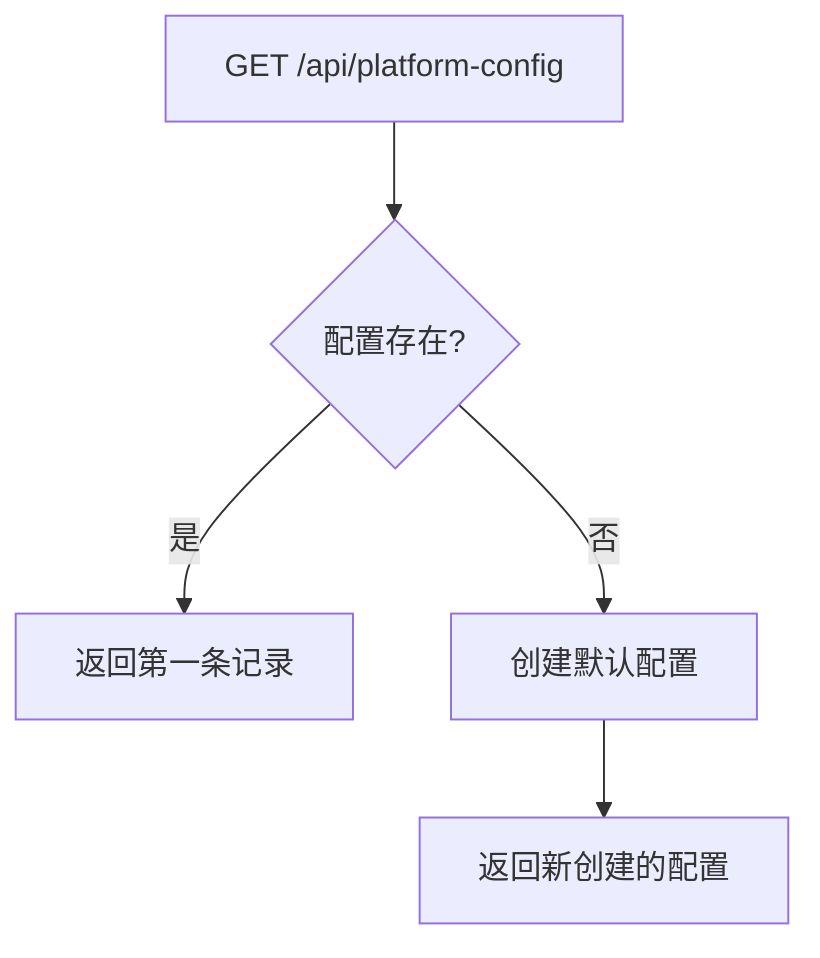
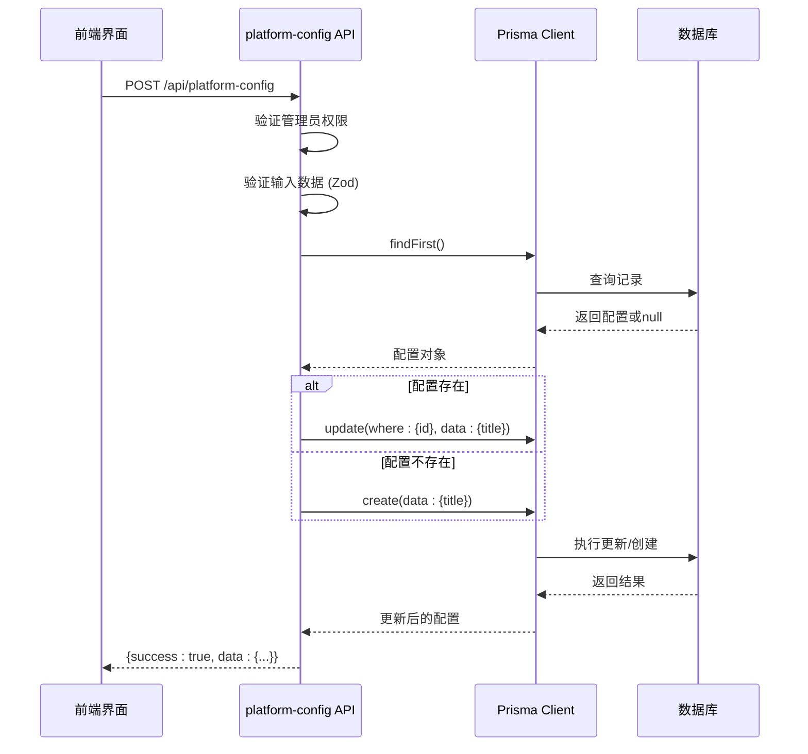
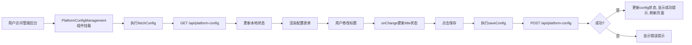

# 平台配置模型 (PlatformConfig)

<cite>
**本文档引用的文件**   
- [platform-config/route.ts](file://src/app/api/platform-config/route.ts)
- [PlatformConfigManagement.tsx](file://src/components/admin/PlatformConfigManagement.tsx)
- [schema.prisma](file://prisma/schema.prisma)
- [migration.sql](file://prisma/migrations/20250905150839_add_platform_config/migration.sql)
</cite>

## 目录
1. [简介](#简介)
2. [模型设计与字段语义](#模型设计与字段语义)
3. [单例模式实现机制](#单例模式实现机制)
4. [API接口实现逻辑](#api接口实现逻辑)
5. [前端管理界面与数据流](#前端管理界面与数据流)
6. [配置变更影响与回滚策略](#配置变更影响与回滚策略)

## 简介
`PlatformConfig` 模型是数字化作品互动展示平台的核心全局配置实体，用于集中管理平台级可变参数。该模型通过单例设计模式确保系统中仅存在一条有效配置记录，支持管理员通过安全的API接口动态调整平台行为。当前实现聚焦于平台主标题的可配置化，为未来扩展维护模式、注册开关、投稿限制等关键功能奠定基础。

## 模型设计与字段语义
`PlatformConfig` 模型在 Prisma Schema 中定义，包含以下核心字段：

| 字段名 | 类型 | 默认值 | 语义说明 |
|-------|------|--------|---------|
| id | String | 自动生成 (cuid) | 唯一标识符，作为主键 |
| title | String | "Qoder和通义灵码 AI Coding 作品秀" | 平台主标题，显示于页面头部 |
| createdAt | DateTime | 当前时间戳 | 记录创建时间 |
| updatedAt | DateTime | 更新时自动设置 | 记录最后修改时间 |

**字段语义分析**：
- **title**: 该字段直接控制平台首页和管理后台显示的主标题，是用户最直观感知的配置项。其最大长度限制为100字符，确保界面显示完整性。
- **createdAt/updatedAt**: 审计字段，用于追踪配置生命周期，支持操作追溯与调试。
- **id**: 采用 `cuid` 生成，保证全局唯一性。尽管技术上允许多条记录，但业务逻辑强制其作为单例使用。

**Section sources**
- [schema.prisma](file://prisma/schema.prisma#L155-L161)
- [migration.sql](file://prisma/migrations/20250905150839_add_platform_config/migration.sql#L0-L8)

## 单例模式实现机制
`PlatformConfig` 模型通过“逻辑单例”而非数据库约束来实现全局唯一性。其核心机制如下：

1. **无唯一性约束**：数据库表 `platform_configs` 仅以 `id` 为主键，未对其他字段设置唯一性限制，允许技术上存在多条记录。
2. **业务层强制单例**：
   - **读取逻辑**：始终使用 `findFirst()` 查询第一条记录，忽略可能存在的其他记录。
   - **创建逻辑**：当查询无结果时，自动创建一条新记录，确保配置始终存在。
   - **更新逻辑**：基于查询到的单条记录的 `id` 进行更新，保证操作目标唯一。

此设计提供了灵活性，避免了因严格单例约束（如固定ID=1）可能导致的迁移或测试复杂性，同时通过封装良好的API确保了应用层的行为一致性。

**Diagram sources**
- [schema.prisma](file://prisma/schema.prisma#L155-L161)
- [platform-config/route.ts](file://src/app/api/platform-config/route.ts#L15-L30)

**Section sources**
- [platform-config/route.ts](file://src/app/api/platform-config/route.ts#L15-L30)

## API接口实现逻辑
平台配置的读取与更新通过 `src/app/api/platform-config/route.ts` 中的 REST API 实现，包含 `GET` 和 `POST` 两个端点。

### GET - 获取平台配置
- **权限控制**：无需管理员权限，所有用户均可读取。
- **逻辑流程**：
  1. 调用 `prisma.platformConfig.findFirst()` 查询任意一条配置。
  2. 若无结果，则调用 `prisma.platformConfig.create()` 创建默认配置。
  3. 返回包含 `id`、`title` 和 `updatedAt` 的标准化响应。
- **容错性**：首次访问时自动初始化配置，确保系统健壮性。

### POST - 更新平台配置
- **权限控制**：严格校验管理员身份 (`session.user?.role === 'ADMIN'`)，未授权请求返回401状态码。
- **输入验证**：使用 `zod` 库进行数据校验，确保 `title` 非空且长度在1-100字符之间。
- **更新流程**：
  1. 解析并验证请求体。
  2. 查询现有配置。
  3. 若存在则更新 (`prisma.platformConfig.update`)，否则创建新记录。
  4. 返回更新后的配置信息。
- **错误处理**：区分 `VALIDATION_ERROR` (400) 和 `INTERNAL_ERROR` (500)，提供清晰的错误反馈。

**Diagram sources**
- [platform-config/route.ts](file://src/app/api/platform-config/route.ts#L0-L113)

**Section sources**
- [platform-config/route.ts](file://src/app/api/platform-config/route.ts#L0-L113)

## 前端管理界面与数据流
管理员通过 `PlatformConfigManagement` 组件（位于 `src/components/admin/PlatformConfigManagement.tsx`）管理平台配置。

### 组件功能
- **配置展示**：显示当前标题和最后更新时间。
- **编辑功能**：提供输入框供管理员修改标题，实时显示字符计数。
- **状态管理**：使用 `useState` 管理 `config`、`title`、`isLoading` 和 `isSaving` 状态。
- **交互反馈**：使用 `react-hot-toast` 提供操作成功或失败的提示。

### 数据流分析
1. **初始化**：组件挂载时 (`useEffect`) 调用 `fetch('/api/platform-config')` 获取当前配置。
2. **本地编辑**：用户在输入框中修改 `title`，通过 `onChange` 事件同步到 `title` 状态。
3. **提交更新**：
   - 点击“保存配置”触发 `saveConfig` 函数。
   - 发起 `POST` 请求至 `/api/platform-config`，携带新的 `title`。
   - 请求成功后，更新本地 `config` 状态，并通过 `window.location.reload()` 刷新页面以确保全局标题更新。
4. **验证与反馈**：提交前进行前端空值校验，后端返回的验证错误也会在界面上提示。

此流程实现了从用户交互到后端持久化的完整闭环，确保了配置变更的可靠性和用户体验。

**Diagram sources**
- [PlatformConfigManagement.tsx](file://src/components/admin/PlatformConfigManagement.tsx#L0-L143)

**Section sources**
- [PlatformConfigManagement.tsx](file://src/components/admin/PlatformConfigManagement.tsx#L0-L143)

## 配置变更影响与回滚策略
### 变更影响
- **直接影响**：`title` 字段的变更会立即反映在平台所有页面的标题栏，影响用户对平台的品牌认知。
- **间接影响**：作为未来扩展的基础，该模型的稳定性直接影响后续功能（如维护模式、投稿限制）的可靠性。

### 回滚策略
当前系统**未实现**自动化的配置版本管理和回滚机制。回滚需通过以下手动方式完成：
1. **管理员操作**：管理员需再次访问管理界面，将 `title` 修改为变更前的值并保存。
2. **数据库干预**：在紧急情况下，可通过直接操作数据库 `platform_configs` 表，将 `title` 字段恢复至期望值。

**建议**：为增强系统可靠性，应引入配置历史记录功能，例如：
- 在 `PlatformConfig` 模型中增加 `version` 字段。
- 创建 `PlatformConfigHistory` 模型，记录每次变更的快照、操作人和时间戳。
- 在管理界面提供“历史版本”和“恢复”按钮，实现一键回滚。

**Section sources**
- [platform-config/route.ts](file://src/app/api/platform-config/route.ts#L44-L113)
- [PlatformConfigManagement.tsx](file://src/components/admin/PlatformConfigManagement.tsx#L38-L87)