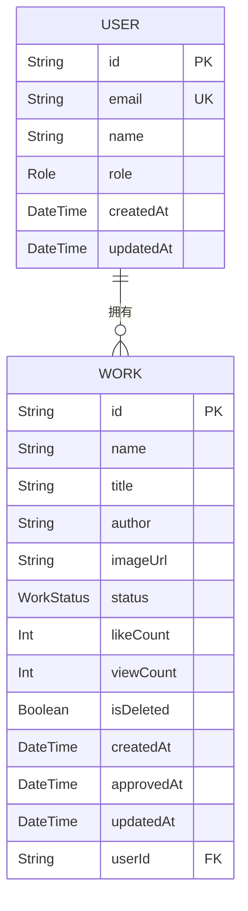

# 数据库模型定义

<cite>
**本文档引用的文件**   
- [schema.prisma](file://prisma/schema.prisma)
- [prisma.ts](file://src/lib/prisma.ts)
- [seed.ts](file://prisma/seed.ts)
- [next-auth.d.ts](file://src/types/next-auth.d.ts)
- [PlatformConfigManagement.tsx](file://src/components/admin/PlatformConfigManagement.tsx)
- [OnlineCounterManagement.tsx](file://src/components/admin/OnlineCounterManagement.tsx)
</cite>

## 目录
1. [简介](#简介)
2. [核心模型定义](#核心模型定义)
3. [关系定义与外键约束](#关系定义与外键约束)
4. [字段映射策略](#字段映射策略)
5. [Prisma与TypeScript类型协同](#prisma与typescript类型协同)
6. [模型设计最佳实践](#模型设计最佳实践)
7. [结论](#结论)

## 简介
本项目采用Prisma作为ORM工具，定义了一套完整的数据库模型体系，用于支撑数字化作品互动展示平台的核心功能。系统通过`prisma/schema.prisma`文件定义了用户、作品、平台配置等核心数据模型，实现了数据结构的清晰定义和类型安全。Prisma不仅提供了直观的模型定义语法，还通过`npx prisma generate`命令自动生成TypeScript类型，实现了数据库与应用层的无缝集成。本项目使用PostgreSQL作为数据存储，通过环境变量`DATABASE_URL`进行连接配置，确保了开发、测试和生产环境的一致性。

**Section sources**
- [schema.prisma](file://prisma/schema.prisma#L1-L20)
- [prisma.ts](file://src/lib/prisma.ts#L1-L10)

## 核心模型定义

### User模型
User模型是系统的核心身份实体，采用字符串类型cuid()作为主键，确保了全局唯一性。模型包含用户的基本信息如邮箱、姓名、角色等，其中邮箱字段通过`@unique`约束保证唯一性。角色字段使用枚举类型`Role`，默认值为USER，支持ADMIN和USER两种角色。模型还包含审计字段`createdAt`和`updatedAt`，分别记录创建时间和最后更新时间，其中`updatedAt`通过`@updatedAt`装饰器自动更新。User模型与Account、Session等NextAuth认证相关模型建立了一对多关系，支持第三方登录功能。

**Section sources**
- [schema.prisma](file://prisma/schema.prisma#L25-L45)

### Work模型
Work模型用于存储用户上传的数字化作品信息。主键同样使用cuid()生成的字符串。模型包含作品的元数据如名称、标题、描述、作者等，其中`imageUrl`字段存储作品图片的URL。状态字段使用`WorkStatus`枚举，包含PENDING、APPROVED、REJECTED三种状态，默认为PENDING。模型包含计数字段`likeCount`和`viewCount`，用于记录点赞和浏览次数，初始值为0。通过`userId`外键与User模型建立可选的多对一关系，支持匿名上传功能。模型还包含软删除标记`isDeleted`和审核时间戳`approvedAt`、`rejectedAt`，实现了完整的审核流程。

**Section sources**
- [schema.prisma](file://prisma/schema.prisma#L100-L130)

### PlatformConfig模型
PlatformConfig模型用于存储平台级别的配置信息。该模型设计简洁，仅包含主键`id`和平台主标题`title`两个核心字段，其中`title`字段设置了默认值"Qoder和通义灵码 AI Coding 作品秀"。模型包含标准的审计字段`createdAt`和`updatedAt`，便于追踪配置变更历史。该模型在系统中通常只存在一条记录，通过API接口进行读取和更新，支持管理员动态修改平台显示名称。

**Section sources**
- [schema.prisma](file://prisma/schema.prisma#L190-L195)

### OnlineCounterConfig模型
OnlineCounterConfig模型用于管理在线人数显示功能。模型包含当前显示人数`currentCount`、基础人数`baseCount`、最大人数`maxCount`等核心配置，支持动态调整在线人数的显示范围。增长速率`growthRate`字段控制人数自动增长的速度，`isEnabled`布尔字段控制功能开关。`displayText`字段存储显示文本，如"人正在云栖大会创作"。模型还包含创建者`creator`的可选外键，通过`@relation("UserOnlineCounterConfigs")`与User模型建立关系，记录配置的创建者信息。

**Section sources**
- [schema.prisma](file://prisma/schema.prisma#L170-L185)

## 关系定义与外键约束

### 一对多关系实现
Prisma通过`[]`语法定义一对多关系，在User模型中，`works Work[]`表示一个用户可以拥有多个作品。这种关系在数据库层面通过外键约束实现，Work表中的`userId`字段引用User表的`id`字段。当删除用户时，通过`onDelete: Cascade`配置，其关联的作品也会被级联删除，确保数据完整性。对于可选关系，如作品与用户的关联，通过在字段后添加`?`符号实现，表示作品可以没有关联的用户（匿名上传）。

**Diagram sources **
- [schema.prisma](file://prisma/schema.prisma#L25-L45)
- [schema.prisma](file://prisma/schema.prisma#L100-L130)

### 可选关系与外键生成
在Work模型中，`userId String?`和`user User?`定义了一个可选的多对一关系。这里的`?`表示该字段可以为空，即作品可以不关联任何用户。Prisma会自动在数据库中生成对应的外键约束，但允许NULL值。`@relation`装饰器明确指定了关系的字段映射，`fields: [userId]`指向当前模型的字段，`references: [id]`指向关联模型的主键。这种设计既支持用户上传的作品，也支持匿名提交的作品，提供了灵活的数据建模能力。

**Section sources**
- [schema.prisma](file://prisma/schema.prisma#L115-L120)

## 字段映射策略

### ID字段的BigInt使用
在Work模型中，`fileSize BigInt?`字段使用BigInt类型来存储文件大小。BigInt是Prisma提供的特殊类型，用于处理超出JavaScript Number安全整数范围的大数值。这对于存储大文件的字节数非常有用，避免了数值溢出问题。BigInt类型在PostgreSQL中映射为`BIGINT`数据类型，在TypeScript中映射为`bigint`类型，确保了跨层的数据类型一致性。

**Section sources**
- [schema.prisma](file://prisma/schema.prisma#L110-L115)

### 时间戳处理
所有核心模型都包含`createdAt`和`updatedAt`时间戳字段。`createdAt`通过`@default(now())`装饰器设置默认值为当前时间，确保每条记录都有准确的创建时间。`updatedAt`字段通过`@updatedAt`装饰器实现，当记录被更新时，Prisma会自动将其值设置为当前时间。这种自动化的时间戳管理减少了手动维护时间字段的错误风险，提高了数据的可靠性。在PostgreSQL中，这些字段映射为`TIMESTAMP WITH TIME ZONE`类型，支持时区信息。

**Section sources**
- [schema.prisma](file://prisma/schema.prisma#L35-L36)
- [schema.prisma](file://prisma/schema.prisma#L125-L126)

## Prisma与TypeScript类型协同

### 类型生成机制
Prisma通过`npx prisma generate`命令从`schema.prisma`文件生成TypeScript类型定义。该命令会解析模型定义，生成对应的接口和类型，存储在`node_modules/.prisma/client/index.d.ts`中。生成的类型包括模型接口、查询参数类型、枚举类型等，为应用层提供了完整的类型安全。例如，User模型会生成`User`接口，包含所有字段的类型定义，以及`UserCreateInput`、`UserUpdateInput`等输入类型，用于API请求的类型校验。

**Section sources**
- [package.json](file://package.json#L10-L11)

### 类型同步实践
项目通过在`package.json`中定义`db:generate`脚本，将类型生成集成到开发工作流中。每次修改`schema.prisma`文件后，运行`npm run db:generate`即可更新TypeScript类型。这种自动化同步确保了数据库模式和应用代码的一致性。在TypeScript文件中，通过`import { PrismaClient } from '@prisma/client'`导入Prisma客户端，即可获得类型安全的数据库操作API。例如，`prisma.user.findMany()`的返回值会被正确推断为`User[]`类型，提供完整的类型检查和自动补全。

**Section sources**
- [package.json](file://package.json#L10-L11)
- [prisma.ts](file://src/lib/prisma.ts#L1-L5)

## 模型设计最佳实践

### 命名规范
项目遵循清晰的命名规范，模型名称使用单数形式的驼峰命名法，如`User`、`Work`。字段名称使用小写字母和下划线分隔，如`createdAt`、`likeCount`。枚举类型使用大写字母，如`Role`、`WorkStatus`。这种命名约定提高了代码的可读性和一致性。表名通过`@@map`装饰器显式映射，如`@@map("users")`，确保了数据库表名的清晰和统一。

**Section sources**
- [schema.prisma](file://prisma/schema.prisma#L45)
- [schema.prisma](file://prisma/schema.prisma#L130)

### 安全性考虑
模型设计充分考虑了安全性。User模型的`password`字段不设置唯一约束，但通过应用层的bcrypt加密确保密码安全。敏感信息如邮箱通过`@unique`约束防止重复注册。通过角色枚举`Role`实现基于角色的访问控制（RBAC），区分管理员和普通用户权限。审计字段`createdAt`和`updatedAt`提供了操作追溯能力。软删除标记`isDeleted`避免了数据的物理删除，支持数据恢复和审计。

**Section sources**
- [schema.prisma](file://prisma/schema.prisma#L30-L31)
- [schema.prisma](file://prisma/schema.prisma#L120-L125)

### 扩展性设计
模型设计具有良好的扩展性。通过枚举类型`WorkStatus`和`Role`，可以轻松添加新的状态或角色而无需修改数据库结构。`tags String[] @default([])`字段使用Prisma的原生数组类型，支持灵活的标签系统。配置模型如`PlatformConfig`和`OnlineCounterConfig`采用独立的表结构，便于添加新的配置项。通过`cuid()`生成的字符串主键避免了自增ID的安全风险，支持分布式系统部署。

**Section sources**
- [schema.prisma](file://prisma/schema.prisma#L190-L195)
- [schema.prisma](file://prisma/schema.prisma#L170-L185)

## 结论
本项目的数据库模型设计体现了现代Web应用的最佳实践。通过Prisma的声明式语法，实现了清晰、类型安全的数据模型定义。核心模型如User、Work、PlatformConfig和OnlineCounterConfig覆盖了平台的主要业务需求，关系定义和约束规则确保了数据的完整性和一致性。字段映射策略合理，特别是BigInt和时间戳的处理，满足了实际业务场景的需求。Prisma与TypeScript的深度集成，通过`npx prisma generate`实现了数据库模式与应用代码的自动同步，极大地提高了开发效率和代码质量。整体设计遵循了清晰的命名规范，充分考虑了安全性和扩展性，为平台的稳定运行和未来功能扩展奠定了坚实的基础。