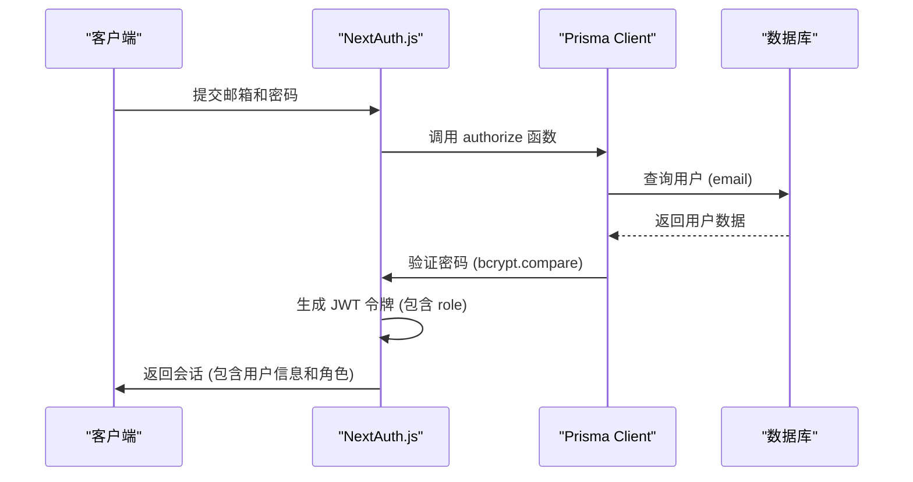
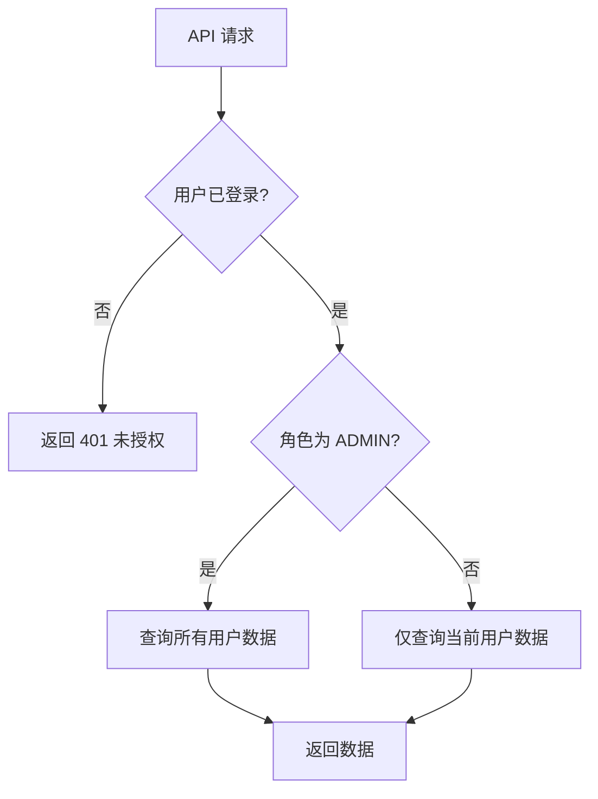

# 用户模型 (User)

<cite>
**本文档引用的文件**   
- [prisma/schema.prisma](file://prisma/schema.prisma)
- [src/types/next-auth.d.ts](file://src/types/next-auth.d.ts)
- [src/lib/auth.ts](file://src/lib/auth.ts)
- [src/app/api/admin/users/[id]/route.ts](file://src/app/api/admin/users/[id]/route.ts)
- [src/app/api/user/works/route.ts](file://src/app/api/user/works/route.ts)
- [src/app/profile/page.tsx](file://src/app/profile/page.tsx)
</cite>

## 目录
1. [用户模型字段详解](#用户模型字段详解)
2. [关系与关联](#关系与关联)
3. [NextAuth.js 集成与会话管理](#nextauthjs-集成与会话管理)
4. [类型安全扩展](#类型安全扩展)
5. [常见操作示例](#常见操作示例)
6. [安全风险与防范](#安全风险与防范)

## 用户模型字段详解

用户模型（User）定义了系统中用户的核心属性，其字段具有明确的数据类型和约束条件，确保数据的完整性和一致性。

- **id**: `String` 类型，使用 `@id` 和 `@default(cuid())` 修饰符，表示该字段是主键，并使用 Prisma 的 cuid() 函数生成唯一标识符。
- **email**: `String` 类型，通过 `@unique` 修饰符强制唯一性约束，确保每个用户的邮箱地址在系统中是唯一的。
- **name**: `String?` 类型，表示可选的字符串字段，用于存储用户的姓名。
- **role**: `Role` 枚举类型，通过 `@default(USER)` 设置默认值为 `USER`。该枚举定义了 `USER` 和 `ADMIN` 两种角色，用于权限控制。
- **password**: `String?` 类型，可选字符串，用于存储经过哈希处理的用户密码。
- **createdAt**: `DateTime` 类型，通过 `@default(now())` 在创建记录时自动填充当前时间戳。
- **updatedAt**: `DateTime` 类型，通过 `@updatedAt` 修饰符在记录更新时自动更新为当前时间戳。

**Section sources**
- [prisma/schema.prisma](file://prisma/schema.prisma#L10-L20)

## 关系与关联

用户模型通过 `@relation` 修饰符与其他模型建立了一对多的关系，体现了数据间的关联性。

- **与 Work 模型的关系**：用户模型包含 `works Work[]` 字段，表示一个用户可以拥有多个作品（Work）。在 Work 模型中，通过 `user User? @relation(fields: [userId], references: [id])` 建立反向关联，其中 `userId` 是外键，引用了 User 模型的 `id` 字段。这种设计实现了用户与作品之间的一对多关系。
- **@relation 的实现**：`@relation` 修饰符明确指定了关系的字段（`fields`）和引用的主键（`references`），并可以配置级联删除行为（如 `onDelete: Cascade`）。这确保了数据库层面的引用完整性。

**Section sources**
- [prisma/schema.prisma](file://prisma/schema.prisma#L10-L25)

## NextAuth.js 集成与会话管理

用户模型与 NextAuth.js 身份验证系统深度集成，实现了安全的用户认证和会话管理。

- **认证流程**：在 `src/lib/auth.ts` 中，`CredentialsProvider` 的 `authorize` 回调函数使用 Prisma Client 查询数据库，根据提供的邮箱和密码查找用户。密码通过 `bcryptjs` 进行哈希比较验证。
- **JWT 会话策略**：系统采用 JWT（JSON Web Token）会话策略。在 `jwt` 回调中，用户的 `role` 被添加到 JWT 令牌中；在 `session` 回调中，该角色信息从令牌中提取并注入到会话对象的 `user` 属性中，使得在后续请求中可以方便地访问用户角色。

**Diagram sources **
- [src/lib/auth.ts](file://src/lib/auth.ts#L20-L70)
- [prisma/schema.prisma](file://prisma/schema.prisma#L10-L20)

**Section sources**
- [src/lib/auth.ts](file://src/lib/auth.ts#L20-L70)

## 类型安全扩展

为了在 TypeScript 环境下实现类型安全，系统通过模块扩展（module augmentation）为 NextAuth.js 的类型定义增加了自定义属性。

- **扩展 Session 接口**：在 `src/types/next-auth.d.ts` 中，通过 `declare module 'next-auth'` 扩展了 `Session` 接口，向 `user` 对象添加了 `id` 和 `role` 字段。这确保了在使用 `useSession()` 或 `getServerSession()` 时，TypeScript 能够正确识别这些自定义属性，避免类型错误。
- **扩展 JWT 接口**：同样地，`declare module 'next-auth/jwt'` 扩展了 `JWT` 接口，添加了 `role` 字段，保证了 JWT 令牌载荷的类型安全。

**Section sources**
- [src/types/next-auth.d.ts](file://src/types/next-auth.d.ts#L1-L22)

## 常见操作示例

以下代码示例展示了对用户模型的常见操作，包括创建、查询和权限判断。

- **创建用户**：在注册流程中，接收用户输入，使用 `bcryptjs` 对密码进行哈希处理，然后调用 `prisma.user.create()` 方法将用户数据存入数据库。
- **查询用户作品**：管理员可以通过 `GET /api/admin/users/[id]` 接口获取特定用户及其作品列表。此操作在 `src/app/api/admin/users/[id]/route.ts` 中实现，使用 `prisma.user.findUnique()` 并通过 `select` 指定返回的字段，包括关联的 `works`。
- **权限判断**：在 API 路由中，通过检查会话中的 `user.role` 来判断用户权限。例如，在 `src/app/api/user/works/route.ts` 中，首先验证用户是否登录，然后根据其角色决定是否允许访问其作品列表。

**Diagram sources **
- [src/app/api/admin/users/[id]/route.ts](file://src/app/api/admin/users/[id]/route.ts#L8-L100)
- [src/app/api/user/works/route.ts](file://src/app/api/user/works/route.ts#L10-L40)

**Section sources**
- [src/app/api/admin/users/[id]/route.ts](file://src/app/api/admin/users/[id]/route.ts#L8-L100)
- [src/app/api/user/works/route.ts](file://src/app/api/user/works/route.ts#L10-L40)

## 安全风险与防范

在处理用户数据时，必须注意潜在的安全风险并采取相应的防范措施。

- **敏感字段暴露风险**：直接将数据库查询结果（如 `prisma.user.findMany()`）返回给前端，可能会意外暴露敏感字段（如 `password`、`hashedPassword`）。尽管在 Prisma 模式中 `password` 字段被定义，但应始终使用 `select` 选项明确指定返回的字段，排除敏感信息。
- **防范措施**：在所有 API 响应中，使用 `select` 严格控制返回的字段。例如，在返回用户信息时，只选择 `id`、`name`、`email`、`role` 和 `createdAt`，而排除 `password`。此外，前端组件（如 `src/app/profile/page.tsx` 中的 `UserProfile` 接口）也应只定义需要的字段，从应用层面强化数据安全。

**Section sources**
- [src/app/api/admin/users/[id]/route.ts](file://src/app/api/admin/users/[id]/route.ts#L44-L50)
- [src/app/profile/page.tsx](file://src/app/profile/page.tsx#L16-L27)