# 数据库迁移

<cite>
**本文档引用的文件**  
- [migration_lock.toml](file://prisma/migrations/migration_lock.toml)
- [add_featured_field/migration.sql](file://prisma/migrations/20250831084947_add_featured_field/migration.sql)
- [add_online_counter_config/migration.sql](file://prisma/migrations/20250905143157_add_online_counter_config/migration.sql)
- [add_platform_config/migration.sql](file://prisma/migrations/20250905150839_add_platform_config/migration.sql)
- [add_missing_fields/migration.sql](file://prisma/migrations/20250917050212_add_missing_fields/migration.sql)
- [seed.ts](file://prisma/seed.ts)
- [prisma.ts](file://src/lib/prisma.ts)
- [package.json](file://package.json)
- [verify-database.ts](file://verify-database.ts)
</cite>

## 目录
1. [引言](#引言)
2. [Prisma迁移机制概述](#prisma迁移机制概述)
3. [迁移文件结构与生成逻辑](#迁移文件结构与生成逻辑)
4. [已执行迁移脚本分析](#已执行迁移脚本分析)
5. [migration_lock.toml的作用](#migration_locktoml的作用)
6. [本地模式演进流程](#本地模式演进流程)
7. [生产环境安全部署](#生产环境安全部署)
8. [迁移回滚策略与冲突解决](#迁移回滚策略与冲突解决)
9. [跨环境迁移最佳实践](#跨环境迁移最佳实践)
10. [数据模型变更示例](#数据模型变更示例)
11. [结论](#结论)

## 引言
本文档详细说明了项目中基于Prisma的数据库迁移机制，涵盖迁移系统的工作原理、核心文件结构、团队协作保障机制以及开发与生产环境下的操作流程。通过分析现有迁移脚本及其业务背景，提供完整的迁移实践指南。

## Prisma迁移机制概述
Prisma迁移系统通过声明式数据模型（`schema.prisma`）与增量式SQL迁移脚本相结合的方式管理数据库模式演进。每次模式变更都会生成一个带有时间戳的迁移目录，包含可执行的SQL脚本和元数据文件，确保迁移过程可追溯、可重复。

该机制支持开发阶段的快速迭代（`prisma migrate dev`）和生产环境的安全部署（`prisma migrate deploy`），并通过`migration_lock.toml`锁定迁移历史，防止团队协作中的冲突。

**Section sources**
- [package.json](file://package.json#L1-L62)
- [prisma.ts](file://src/lib/prisma.ts#L0-L19)

## 迁移文件结构与生成逻辑
每个迁移目录以时间戳命名，包含`migration.sql`和可选的`steps.json`。SQL脚本由Prisma自动根据`schema.prisma`的变化生成，遵循以下结构：

- `-- CreateEnum`：创建枚举类型
- `-- CreateTable`：创建新表
- `-- AlterTable`：修改现有表结构
- `-- CreateIndex`：创建索引
- `-- AddForeignKey`：添加外键约束

生成逻辑基于前后两次数据模型的差异比对，确保只生成必要的变更语句。例如，添加字段会生成`ALTER TABLE ... ADD COLUMN`语句，并自动处理默认值和约束。

**Diagram sources**
- [add_featured_field/migration.sql](file://prisma/migrations/20250831084947_add_featured_field/migration.sql#L0-L122)
- [add_missing_fields/migration.sql](file://prisma/migrations/20250917050212_add_missing_fields/migration.sql#L0-L7)

**Section sources**
- [add_featured_field/migration.sql](file://prisma/migrations/20250831084947_add_featured_field/migration.sql#L0-L122)
- [add_missing_fields/migration.sql](file://prisma/migrations/20250917050212_add_missing_fields/migration.sql#L0-L7)

## 已执行迁移脚本分析
### 添加featured字段迁移
该迁移创建了初始数据库结构，包括用户、作品、会话等核心表，并为`works`表添加`featured`布尔字段，用于标识推荐作品。此变更为平台内容运营功能奠定基础。

**Section sources**
- [add_featured_field/migration.sql](file://prisma/migrations/20250831084947_add_featured_field/migration.sql#L0-L122)

### 添加online_counter_config迁移
为支持“在线创作人数”动态展示功能，创建`online_counter_configs`表，存储计数器的当前值、增长率、显示文本等配置。初始值设为1075，体现云栖大会期间的实时互动氛围。

**Section sources**
- [add_online_counter_config/migration.sql](file://prisma/migrations/20250905143157_add_online_counter_config/migration.sql#L0-L19)

### 添加platform_config迁移
创建`platform_configs`表以集中管理平台级配置，如标题、Logo、主题色等。首条记录设置默认标题为“Qoder和通义灵码 AI Coding 作品秀”，实现平台品牌信息的动态可配置化。

**Section sources**
- [add_platform_config/migration.sql](file://prisma/migrations/20250905150839_add_platform_config/migration.sql#L0-L9)

### 添加缺失字段迁移
在作品审核上线后，补充`fileSize`、`imagePath`、`mimeType`、`ossKey`、`ossUrl`及`tags`等字段，完善作品元数据。其中`tags`使用TEXT数组类型，支持作品的多标签分类。

**Section sources**
- [add_missing_fields/migration.sql](file://prisma/migrations/20250917050212_add_missing_fields/migration.sql#L0-L7)

## migration_lock.toml的作用
`migration_lock.toml`是Prisma迁移系统的协调文件，记录当前使用的数据库提供程序（本项目为PostgreSQL）。其核心作用包括：

1. **团队协作一致性**：确保所有开发者使用相同的迁移历史，避免因本地迁移顺序不一致导致的冲突。
2. **迁移状态同步**：在CI/CD流程中验证迁移脚本的完整性，防止遗漏或重复执行。
3. **版本控制集成**：作为Git版本库的一部分，保证迁移历史与代码版本同步。

该文件禁止手动编辑，由Prisma CLI自动维护。

**Section sources**
- [migration_lock.toml](file://prisma/migrations/migration_lock.toml#L0-L2)

## 本地模式演进流程
使用`npx prisma migrate dev`进行本地开发环境的模式演进：

1. 修改`schema.prisma`定义数据模型
2. 执行`prisma migrate dev --name <migration-name>`生成迁移
3. Prisma自动创建迁移目录并应用变更
4. 验证数据库状态与预期一致

此命令会自动处理开发数据库的重置与种子数据加载，适合快速迭代。

```mermaid
sequenceDiagram
participant Dev as 开发者
participant CLI as Prisma CLI
participant DB as 数据库
Dev->>CLI : 修改 schema.prisma
Dev->>CLI : 执行 migrate dev
CLI->>CLI : 生成迁移脚本
CLI->>DB : 应用迁移
DB-->>CLI : 返回结果
CLI->>CLI : 更新 migration_lock.toml
CLI-->>Dev : 迁移完成
```

**Diagram sources**
- [package.json](file://package.json#L1-L62)
- [prisma.ts](file://src/lib/prisma.ts#L0-L19)

**Section sources**
- [package.json](file://package.json#L1-L62)

## 生产环境安全部署
使用`npx prisma migrate deploy`进行生产环境部署：

1. 确保所有迁移脚本已提交至版本控制
2. 在部署流水线中执行`prisma migrate deploy`
3. Prisma比对数据库状态与迁移历史
4. 自动应用缺失的迁移脚本

该命令不修改现有数据，仅应用未执行的模式变更，确保生产环境安全稳定。

**Section sources**
- [package.json](file://package.json#L1-L62)
- [verify-database.ts](file://verify-database.ts#L39-L77)

## 迁移回滚策略与冲突解决
### 回滚策略
Prisma不支持自动回滚，建议采用以下策略：
- **开发环境**：使用`prisma migrate reset`重置数据库（仅限非生产环境）
- **生产环境**：编写反向迁移脚本，通过`migrate dev`测试后手动应用

### 冲突解决
当团队成员并行开发导致迁移冲突时：
1. 暂停新迁移的创建
2. 合并迁移历史，确保顺序一致
3. 使用`prisma migrate resolve --rolled-back`或`--applied`标记已处理的迁移
4. 重新生成协调后的迁移脚本

**Section sources**
- [verify-database.ts](file://verify-database.ts#L73-L125)

## 跨环境迁移最佳实践
1. **统一迁移流程**：所有环境均通过CI/CD执行`migrate deploy`
2. **环境隔离**：使用不同数据库URL区分环境
3. **迁移验证**：部署后运行`verify-database.ts`检查关键表状态
4. **备份先行**：生产环境部署前自动备份数据库
5. **灰度发布**：重大变更分阶段应用，监控数据一致性

## 数据模型变更示例
以作品表（works）为例，展示迁移前后变化：

**Diagram sources**
- [add_featured_field/migration.sql](file://prisma/migrations/20250831084947_add_featured_field/migration.sql#L0-L122)
- [add_missing_fields/migration.sql](file://prisma/migrations/20250917050212_add_missing_fields/migration.sql#L0-L7)

**Section sources**
- [add_featured_field/migration.sql](file://prisma/migrations/20250831084947_add_featured_field/migration.sql#L0-L122)
- [add_missing_fields/migration.sql](file://prisma/migrations/20250917050212_add_missing_fields/migration.sql#L0-L7)

## 结论
本项目通过Prisma迁移系统实现了数据库模式的高效、安全演进。结合`migration_lock.toml`的协作保障机制和标准化的操作流程，确保了从开发到生产的全链路一致性。建议持续遵循迁移最佳实践，维护数据模型的清晰与可维护性。