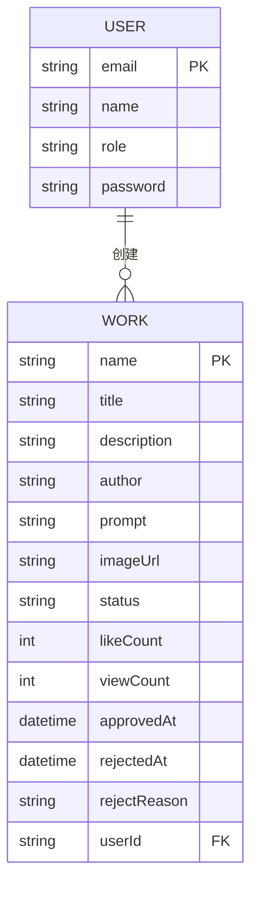
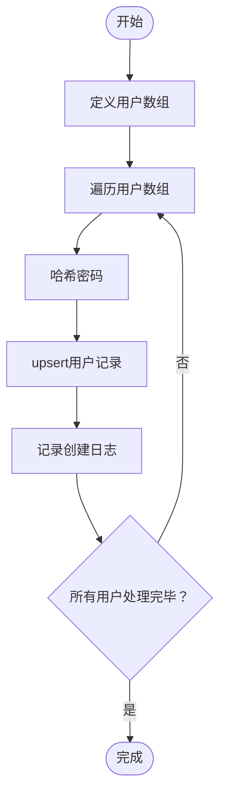
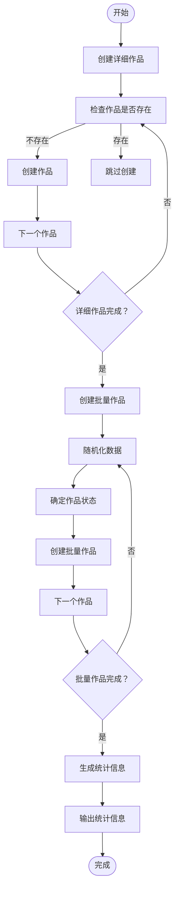
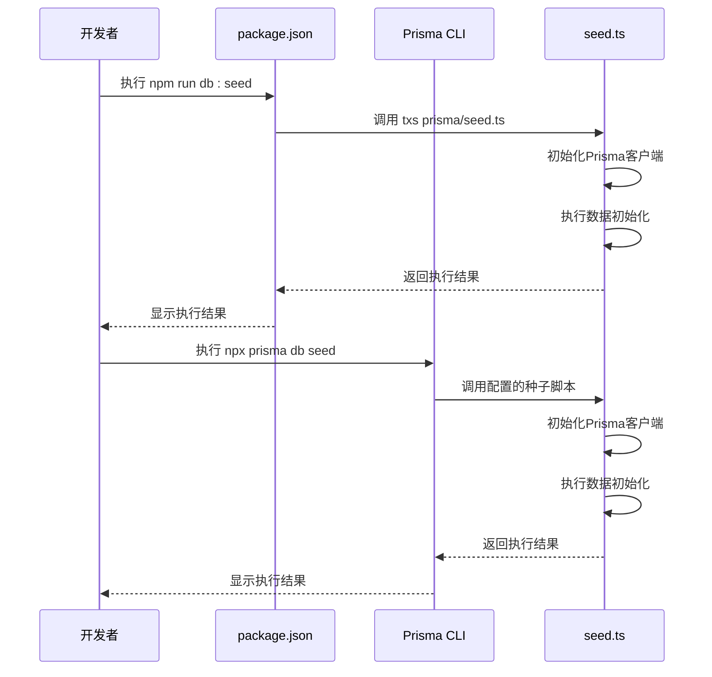
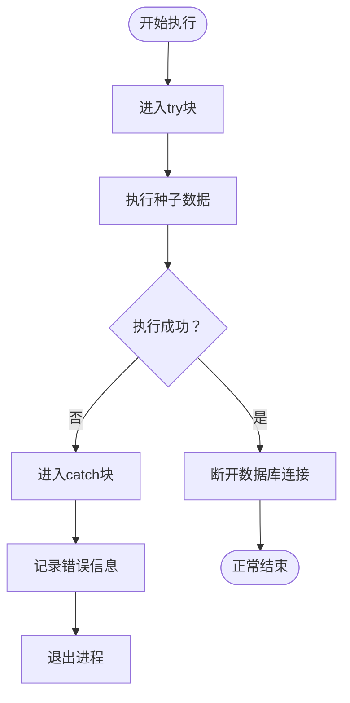

# 种子数据管理

<cite>
**Referenced Files in This Document**  
- [seed.ts](file://prisma/seed.ts)
- [package.json](file://package.json)
</cite>

## 目录
1. [引言](#引言)
2. [种子数据文件结构](#种子数据文件结构)
3. [核心数据模型](#核心数据模型)
4. [用户数据初始化](#用户数据初始化)
5. [作品数据初始化](#作品数据初始化)
6. [环境区分与条件逻辑](#环境区分与条件逻辑)
7. [执行机制与脚本配置](#执行机制与脚本配置)
8. [错误处理与幂等性保障](#错误处理与幂等性保障)
9. [调试与验证技巧](#调试与验证技巧)
10. [最佳实践总结](#最佳实践总结)

## 引言

种子数据管理是数字化作品互动展示平台开发过程中的关键环节，它为开发、测试和演示环境提供了必要的基础数据。本指南详细阐述了如何通过 `seed.ts` 文件实现高效、安全的数据初始化，确保系统在不同环境下都能快速进入可用状态。通过规范化的种子数据管理，开发团队能够保持数据一致性，提高开发效率，并为自动化测试提供可靠的数据基础。

## 种子数据文件结构

`seed.ts` 文件采用模块化结构，包含导入声明、Prisma客户端实例化、主函数定义和执行流程控制四个主要部分。文件通过异步函数 `main()` 组织数据初始化逻辑，确保操作的顺序性和原子性。整个文件遵循清晰的代码组织原则，将不同类型的数据初始化任务分组处理，便于维护和扩展。

**Section sources**
- [seed.ts](file://prisma/seed.ts#L1-L318)

## 核心数据模型

种子数据管理基于两个核心数据模型：用户（User）和作品（Work）。用户模型包含电子邮件、姓名、角色和密码等属性，其中角色枚举（Role）区分管理员和普通用户权限。作品模型则包含名称、标题、描述、作者、提示词、图片URL、状态、点赞数、浏览数等丰富属性，状态枚举（WorkStatus）用于标识作品的审核状态。

**Diagram sources**
- [seed.ts](file://prisma/seed.ts#L1-L318)

**Section sources**
- [seed.ts](file://prisma/seed.ts#L1-L318)

## 用户数据初始化

用户数据初始化通过预定义的用户数组实现，包含系统管理员、副管理员、普通用户、艺术家、设计师等多种角色的测试账号。每个用户对象包含电子邮件、姓名、角色和明文密码等信息。系统使用 `bcryptjs` 库对密码进行哈希处理后存储，确保安全性。通过 `upsert` 操作实现幂等性，避免重复创建相同用户。

**Diagram sources**
- [seed.ts](file://prisma/seed.ts#L15-L78)

**Section sources**
- [seed.ts](file://prisma/seed.ts#L15-L78)

## 作品数据初始化

作品数据初始化分为三个层次：详细作品、批量作品和统计信息。详细作品包含精心设计的测试数据，用于功能验证；批量作品通过随机算法生成大量测试数据，模拟真实使用场景；统计信息则在初始化完成后输出数据摘要，便于验证结果。作品状态通过权重分配实现合理的数据分布比例。

**Diagram sources**
- [seed.ts](file://prisma/seed.ts#L80-L278)

**Section sources**
- [seed.ts](file://prisma/seed.ts#L80-L278)

## 环境区分与条件逻辑

虽然当前实现中未显式包含环境区分逻辑，但项目中广泛使用 `process.env.NODE_ENV` 进行环境判断，为种子数据的环境差异化提供了基础。建议在未来的实现中，通过检查环境变量来决定是否执行数据清理操作或加载不同规模的测试数据，从而实现开发、测试和生产环境的差异化数据初始化策略。

**Section sources**
- [seed.ts](file://prisma/seed.ts#L1-L318)
- [package.json](file://package.json#L1-L62)

## 执行机制与脚本配置

种子数据的执行机制通过 `package.json` 中的脚本配置实现。`db:seed` 脚本使用 `tsx` 运行时直接执行 `prisma/seed.ts` 文件，无需预先编译。Prisma框架也通过 `prisma` 字段配置了种子命令，支持通过 `npx prisma db seed` 命令安全执行数据注入。这种双重配置提供了灵活性和兼容性，确保在不同开发环境中都能顺利执行种子数据。

**Diagram sources**
- [package.json](file://package.json#L10-L11)
- [seed.ts](file://prisma/seed.ts#L1-L318)

**Section sources**
- [package.json](file://package.json#L10-L11)
- [seed.ts](file://prisma/seed.ts#L1-L318)

## 错误处理与幂等性保障

种子数据脚本实现了完善的错误处理机制，通过 `try-catch` 结构捕获执行过程中的异常，并在发生错误时输出详细错误信息后退出进程。幂等性通过 `upsert` 操作和存在性检查实现，确保多次执行种子脚本不会导致数据重复或冲突。数据库连接在脚本结束时通过 `finally` 块确保正确断开，防止资源泄漏。

**Diagram sources**
- [seed.ts](file://prisma/seed.ts#L280-L318)

**Section sources**
- [seed.ts](file://prisma/seed.ts#L280-L318)

## 调试与验证技巧

调试种子数据时，建议使用详细的日志输出来跟踪执行进度和数据状态。脚本末尾的统计信息输出提供了快速验证数据完整性的手段。通过检查控制台输出的用户和作品统计数字，可以快速确认数据初始化是否按预期完成。对于复杂的数据关系，建议分阶段执行和验证，先初始化用户数据，再初始化依赖用户ID的作品数据。

**Section sources**
- [seed.ts](file://prisma/seed.ts#L248-L278)

## 最佳实践总结

种子数据管理的最佳实践包括：使用幂等操作确保多次执行的安全性，合理组织数据初始化顺序以满足依赖关系，提供详细的执行日志便于调试，以及通过统计信息验证数据完整性。建议在团队开发中统一种子数据标准，确保所有成员使用相同的基础数据环境，从而提高开发协作效率和测试可靠性。

**Section sources**
- [seed.ts](file://prisma/seed.ts#L1-L318)
- [package.json](file://package.json#L1-L62)