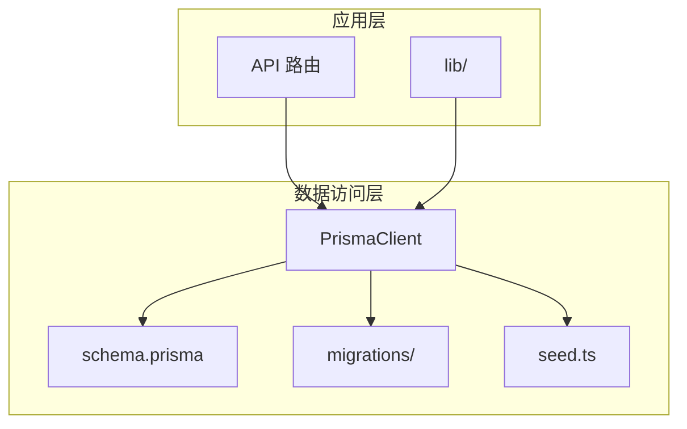
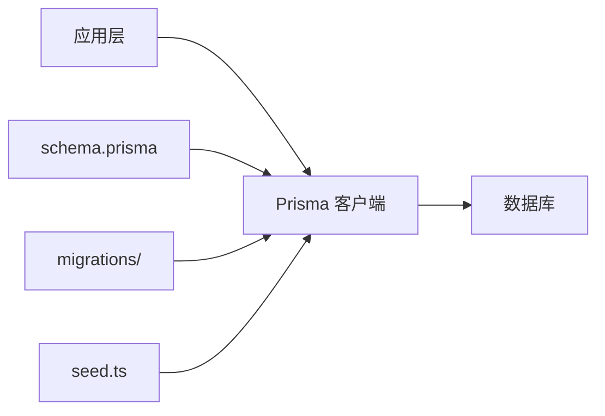
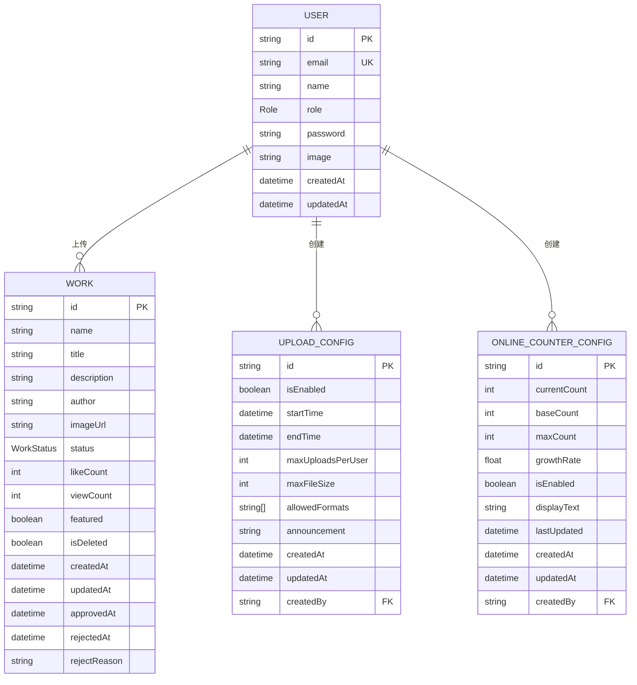
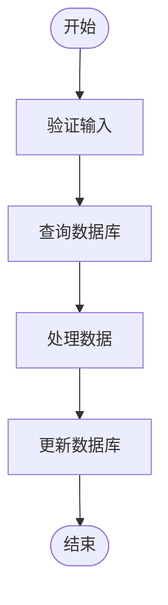
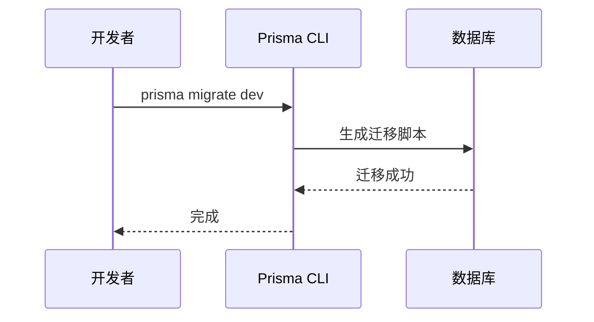
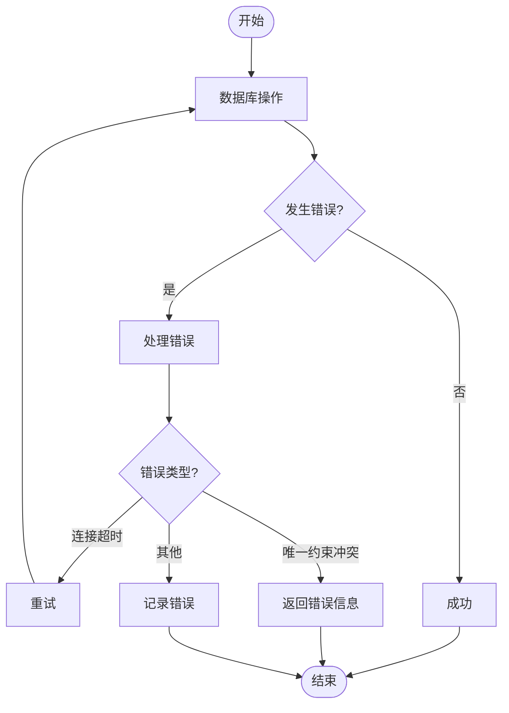

# 数据访问层

<cite>
**本文档引用的文件**
- [prisma.ts](file://src/lib/prisma.ts)
- [schema.prisma](file://prisma/schema.prisma)
- [seed.ts](file://prisma/seed.ts)
- [migration_lock.toml](file://prisma/migrations/migration_lock.toml)
- [package-lock.json](file://package-lock.json)
</cite>

## 目录
1. [简介](#简介)
2. [项目结构](#项目结构)
3. [核心组件](#核心组件)
4. [架构概述](#架构概述)
5. [详细组件分析](#详细组件分析)
6. [依赖分析](#依赖分析)
7. [性能考虑](#性能考虑)
8. [故障排除指南](#故障排除指南)
9. [结论](#结论)

## 简介
本文档旨在为使用 Prisma ORM 作为数据访问层的系统提供权威的技术说明。文档详细阐述了 Prisma 客户端的初始化与配置、数据库模型定义与 TypeScript 类型的同步机制、常用数据操作模式（如事务处理、批量操作和复杂查询构建）、数据库连接管理与性能优化技巧、数据库种子数据生成和迁移管理流程，以及常见数据库异常处理方案。

## 项目结构
本项目采用分层架构，数据访问层由 Prisma ORM 实现，位于 `prisma` 目录下。`src/lib/prisma.ts` 文件负责 Prisma 客户端的初始化与配置，`prisma/schema.prisma` 文件定义了数据库模型，`prisma/seed.ts` 文件用于生成种子数据，`prisma/migrations/` 目录管理数据库迁移。



**Diagram sources**
- [prisma/schema.prisma](file://prisma/schema.prisma)
- [prisma/seed.ts](file://prisma/seed.ts)
- [src/lib/prisma.ts](file://src/lib/prisma.ts)

**Section sources**
- [prisma/schema.prisma](file://prisma/schema.prisma)
- [prisma/seed.ts](file://prisma/seed.ts)
- [src/lib/prisma.ts](file://src/lib/prisma.ts)

## 核心组件
核心组件包括 Prisma 客户端、数据库模型、迁移脚本和种子数据生成器。Prisma 客户端通过 `src/lib/prisma.ts` 初始化，数据库模型在 `prisma/schema.prisma` 中定义，迁移脚本位于 `prisma/migrations/` 目录，种子数据生成器为 `prisma/seed.ts`。

**Section sources**
- [prisma/schema.prisma](file://prisma/schema.prisma)
- [prisma/seed.ts](file://prisma/seed.ts)
- [src/lib/prisma.ts](file://src/lib/prisma.ts)

## 架构概述
系统架构以 Prisma ORM 为核心，连接应用层与数据库。应用层通过 Prisma 客户端访问数据库，Prisma 客户端根据 `schema.prisma` 文件生成的类型安全的查询构建器与数据库交互。



**Diagram sources**
- [prisma/schema.prisma](file://prisma/schema.prisma)
- [prisma/seed.ts](file://prisma/seed.ts)
- [src/lib/prisma.ts](file://src/lib/prisma.ts)

## 详细组件分析
### Prisma 客户端初始化与配置
Prisma 客户端在 `src/lib/prisma.ts` 中初始化，使用单例模式确保全局唯一实例。客户端配置了数据源 URL，连接池配置通过 `DATABASE_URL` 中的参数控制。

```mermaid
classDiagram
class PrismaClient {
+datasources : { db : { url : string } }
+$connect() : Promise~void~
+$disconnect() : Promise~void~
}
```

**Diagram sources**
- [src/lib/prisma.ts](file://src/lib/prisma.ts#L6-L17)

**Section sources**
- [src/lib/prisma.ts](file://src/lib/prisma.ts#L0-L19)

### 数据库模型定义与 TypeScript 类型同步
数据库模型在 `prisma/schema.prisma` 中定义，Prisma CLI 根据模型生成 TypeScript 类型，确保类型安全。模型包括用户、作品、上传配置、在线人数配置等。



**Diagram sources**
- [prisma/schema.prisma](file://prisma/schema.prisma#L20-L168)

**Section sources**
- [prisma/schema.prisma](file://prisma/schema.prisma#L0-L168)

### 常用数据操作模式
#### 事务处理
Prisma 支持事务处理，确保数据一致性。使用 `prisma.$transaction()` 方法包裹多个操作。

#### 批量操作
Prisma 支持批量创建、更新和删除操作，提高数据处理效率。

#### 复杂查询构建
Prisma 提供链式调用和嵌套查询，支持复杂查询构建。



**Diagram sources**
- [src/app/api/admin/works/route.ts](file://src/app/api/admin/works/route.ts#L34-L79)

**Section sources**
- [src/app/api/admin/works/route.ts](file://src/app/api/admin/works/route.ts#L0-L79)

### 数据库连接管理与性能优化
数据库连接通过 `DATABASE_URL` 配置，连接池参数在 URL 中指定。性能优化包括合理使用索引、避免 N+1 查询、使用批量操作等。

**Section sources**
- [src/lib/prisma.ts](file://src/lib/prisma.ts#L6-L17)

### 数据库种子数据生成与迁移管理
种子数据在 `prisma/seed.ts` 中生成，迁移脚本在 `prisma/migrations/` 目录管理。迁移脚本通过 `prisma migrate dev` 命令生成。



**Diagram sources**
- [prisma/seed.ts](file://prisma/seed.ts)
- [prisma/migrations/migration_lock.toml](file://prisma/migrations/migration_lock.toml)

**Section sources**
- [prisma/seed.ts](file://prisma/seed.ts#L0-L318)
- [prisma/migrations/migration_lock.toml](file://prisma/migrations/migration_lock.toml#L0-L2)

### 常见数据库异常处理
常见异常包括连接超时、唯一约束冲突等。使用 `PrismaClientKnownRequestError` 捕获和处理数据库错误。



**Diagram sources**
- [src/app/api/user/profile/route.ts](file://src/app/api/user/profile/route.ts#L217-L235)
- [verify-database.ts](file://verify-database.ts#L66-L77)

**Section sources**
- [src/app/api/user/profile/route.ts](file://src/app/api/user/profile/route.ts#L0-L235)
- [verify-database.ts](file://verify-database.ts#L0-L125)

## 依赖分析
项目依赖 Prisma ORM 作为数据访问层，版本为 5.22.0。Prisma 依赖 PostgreSQL 数据库，通过 `@prisma/client` 包提供类型安全的查询构建器。

```mermaid
graph LR
A[项目] --> B[@prisma/client]
B --> C[PostgreSQL]
```

**Diagram sources**
- [package-lock.json](file://package-lock.json#L1863-L1901)

**Section sources**
- [package-lock.json](file://package-lock.json#L1863-L1901)

## 性能考虑
性能优化包括合理使用索引、避免 N+1