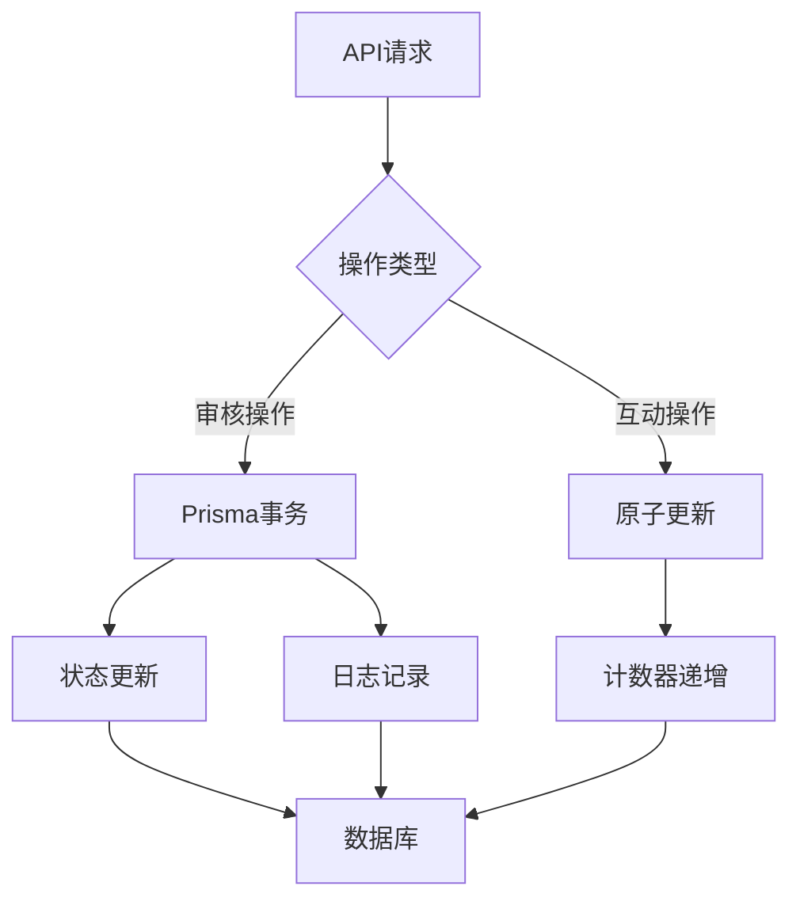
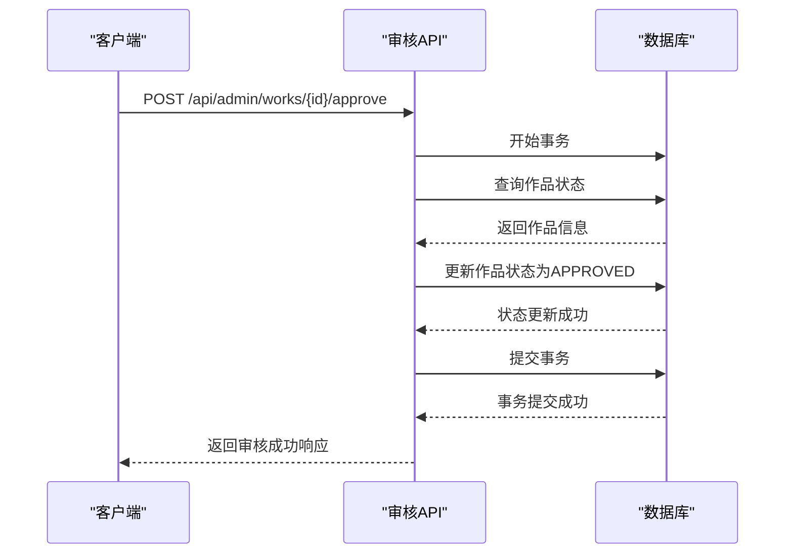
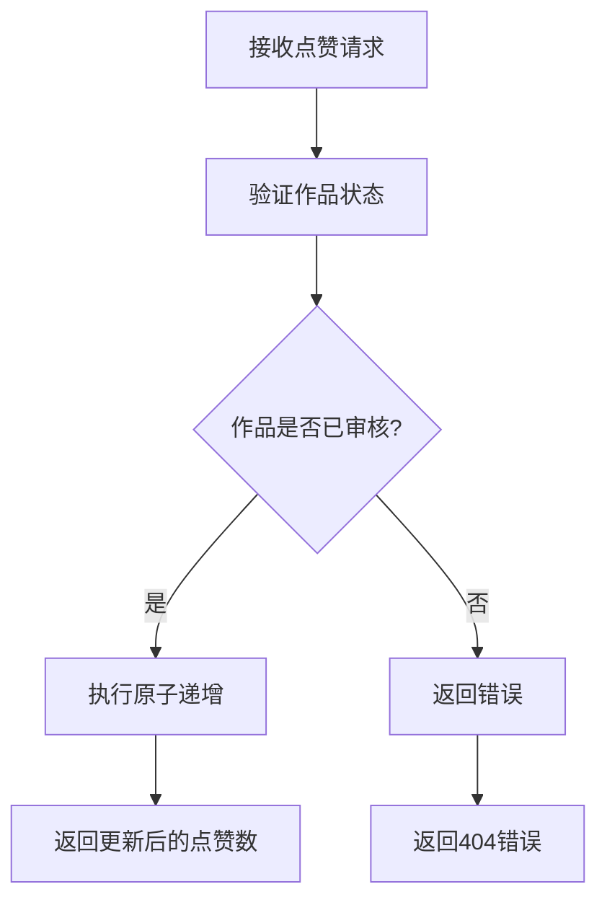

# 事务处理

<cite>
**本文档引用的文件**   
- [src/app/api/admin/works/[id]/approve/route.ts](file://src/app/api/admin/works/[id]/approve/route.ts)
- [src/app/api/works/[id]/like/route.ts](file://src/app/api/works/[id]/like/route.ts)
- [src/lib/db-utils.ts](file://src/lib/db-utils.ts)
- [src/lib/prisma.ts](file://src/lib/prisma.ts)
- [prisma/seed.ts](file://prisma/seed.ts)
</cite>

## 目录
1. [引言](#引言)
2. [项目结构](#项目结构)
3. [核心组件](#核心组件)
4. [架构概述](#架构概述)
5. [详细组件分析](#详细组件分析)
6. [依赖分析](#依赖分析)
7. [性能考虑](#性能考虑)
8. [故障排除指南](#故障排除指南)
9. [结论](#结论)

## 引言
本文档围绕作品审核通过时的状态更新与统计计数联动更新的业务场景，深入探讨Prisma事务处理机制的应用。重点分析在审核操作中如何保证数据一致性，以及在高并发场景下如何通过乐观锁机制防止数据冲突。同时，结合点赞接口的轻量级更新逻辑，说明不同类型事务的使用权衡。

## 项目结构
本项目采用Next.js App Router架构，API路由集中存放在`src/app/api`目录下。事务相关逻辑主要分布在管理后台的审核接口和用户互动接口中。

```mermaid
graph TB
subgraph "API路由"
A[src/app/api/admin/works/[id]/approve/route.ts]
B[src/app/api/works/[id]/like/route.ts]
C[src/app/api/online-counter/route.ts]
end
subgraph "核心库"
D[src/lib/prisma.ts]
E[src/lib/db-utils.ts]
end
A --> D
B --> D
B --> E
C --> D
```

**图示来源**
- [src/app/api/admin/works/[id]/approve/route.ts](file://src/app/api/admin/works/[id]/approve/route.ts#L1-L75)
- [src/app/api/works/[id]/like/route.ts](file://src/app/api/works/[id]/like/route.ts#L1-L64)
- [src/lib/prisma.ts](file://src/lib/prisma.ts#L1-L19)

**本节来源**
- [src/app/api/admin/works/[id]/approve/route.ts](file://src/app/api/admin/works/[id]/approve/route.ts#L1-L75)
- [src/app/api/works/[id]/like/route.ts](file://src/app/api/works/[id]/like/route.ts#L1-L64)

## 核心组件
核心事务处理组件包括作品审核接口和用户互动接口。审核接口需要保证状态更新的原子性，而互动接口则侧重于高性能的轻量级更新。

**本节来源**
- [src/app/api/admin/works/[id]/approve/route.ts](file://src/app/api/admin/works/[id]/approve/route.ts#L1-L75)
- [src/app/api/works/[id]/like/route.ts](file://src/app/api/works/[id]/like/route.ts#L1-L64)

## 架构概述
系统采用Prisma作为ORM层，通过数据库事务保证数据一致性。对于需要强一致性的操作（如审核），使用显式事务；对于高并发的轻量级操作（如点赞），利用Prisma的原子操作特性。



**图示来源**
- [src/app/api/admin/works/[id]/approve/route.ts](file://src/app/api/admin/works/[id]/approve/route.ts#L1-L75)
- [src/app/api/works/[id]/like/route.ts](file://src/app/api/works/[id]/like/route.ts#L1-L64)

## 详细组件分析

### 审核操作事务分析
审核操作需要保证作品状态更新的原子性，防止在审核过程中出现数据不一致的情况。

#### 事务流程


**图示来源**
- [src/app/api/admin/works/[id]/approve/route.ts](file://src/app/api/admin/works/[id]/approve/route.ts#L1-L75)

**本节来源**
- [src/app/api/admin/works/[id]/approve/route.ts](file://src/app/api/admin/works/[id]/approve/route.ts#L1-L75)

### 点赞操作分析
点赞操作采用轻量级的原子更新策略，通过Prisma的increment操作实现高性能的计数更新。

#### 轻量级更新流程


**图示来源**
- [src/app/api/works/[id]/like/route.ts](file://src/app/api/works/[id]/like/route.ts#L1-L64)

**本节来源**
- [src/app/api/works/[id]/like/route.ts](file://src/app/api/works/[id]/like/route.ts#L1-L64)

## 依赖分析
系统依赖Prisma客户端进行数据库操作，所有事务相关的功能都通过prisma实例调用。

```mermaid
graph LR
A[src/app/api/admin/works/[id]/approve/route.ts] --> B[src/lib/prisma.ts]
C[src/app/api/works/[id]/like/route.ts] --> B
D[src/lib/db-utils.ts] --> B
B --> E[Prisma Client]
```

**图示来源**
- [src/lib/prisma.ts](file://src/lib/prisma.ts#L1-L19)
- [package-lock.json](file://package-lock.json#L1863-L1952)

**本节来源**
- [src/lib/prisma.ts](file://src/lib/prisma.ts#L1-L19)
- [package-lock.json](file://package-lock.json#L1863-L1952)

## 性能考虑
在高并发场景下，需要权衡事务的使用。对于审核等关键操作，必须使用事务保证数据一致性；对于点赞等高频操作，应采用轻量级的原子更新。

**本节来源**
- [src/app/api/works/[id]/like/route.ts](file://src/app/api/works/[id]/like/route.ts#L1-L64)
- [src/app/api/admin/works/[id]/approve/route.ts](file://src/app/api/admin/works/[id]/approve/route.ts#L1-L75)

## 故障排除指南
当事务操作失败时，应检查数据库连接状态、事务超时设置以及并发冲突情况。对于乐观锁冲突，应实现重试机制。

**本节来源**
- [src/app/api/admin/works/[id]/approve/route.ts](file://src/app/api/admin/works/[id]/approve/route.ts#L1-L75)
- [src/app/api/works/[id]/like/route.ts](file://src/app/api/works/[id]/like/route.ts#L1-L64)

## 结论
Prisma的事务机制为数据一致性提供了可靠保障。在实际应用中，应根据业务场景选择合适的事务策略：关键业务使用完整事务，高频操作采用原子更新。同时，应注意事务的超时配置和错误回滚行为，确保系统的稳定性和可靠性。