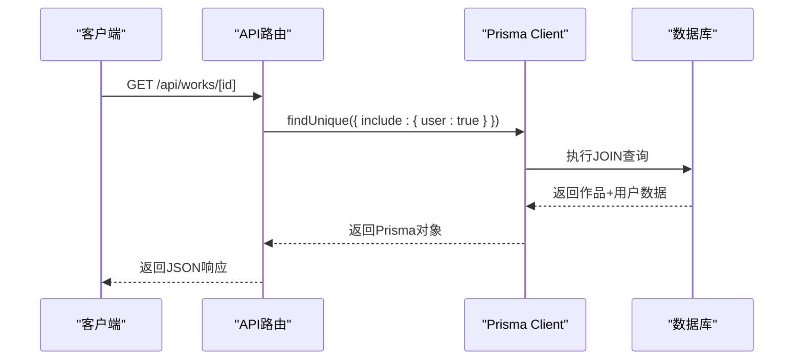
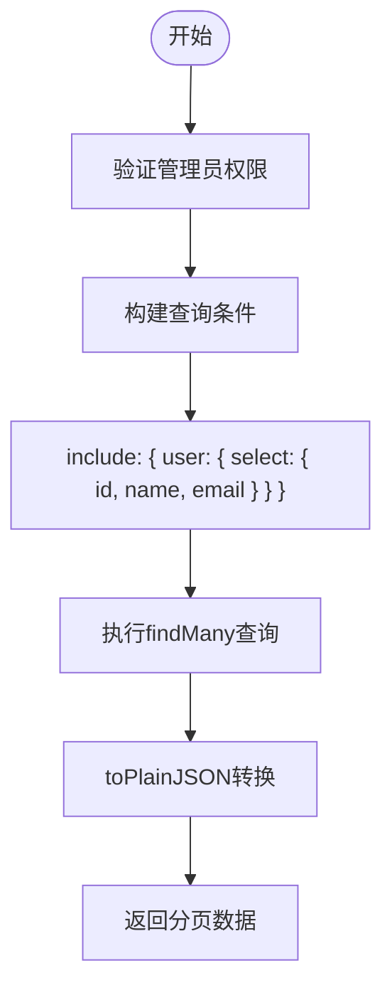
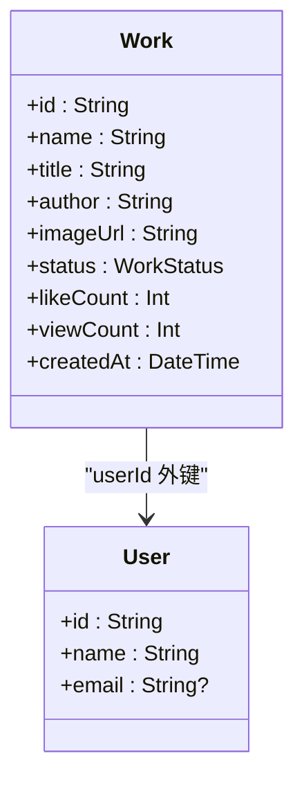

# 关联数据查询

<cite>
**本文档引用的文件**  
- [schema.prisma](file://prisma/schema.prisma)
- [works/route.ts](file://src/app/api/works/[id]/route.ts)
- [admin/works/route.ts](file://src/app/api/admin/works/route.ts)
- [user/works/route.ts](file://src/app/api/user/works/route.ts)
- [admin/users/[id]/route.ts](file://src/app/api/admin/users/[id]/route.ts)
- [db-utils.ts](file://src/lib/db-utils.ts)
- [prisma.ts](file://src/lib/prisma.ts)
</cite>

## 目录
1. [引言](#引言)
2. [项目结构](#项目结构)
3. [核心组件](#核心组件)
4. [架构概述](#架构概述)
5. [详细组件分析](#详细组件分析)
6. [依赖分析](#依赖分析)
7. [性能考虑](#性能考虑)
8. [故障排除指南](#故障排除指南)
9. [结论](#结论)

## 引言
本文档深入讲解Prisma中关联数据查询的实现方式，重点介绍`include`与`select`的使用场景与性能差异。结合作品详情接口中关联作者信息的查询逻辑，展示嵌套关系的加载策略。通过用户与作品的一对多关系模型，说明如何避免N+1查询问题。提供关联字段裁剪、深度嵌套查询限制、循环引用预防等最佳实践。使用`prisma/schema.prisma`中的数据模型定义作为参考，解释外键关系与级联删除配置对查询行为的影响。包含性能监控建议和调试技巧。

## 项目结构
本项目采用Next.js 14 App Router架构，结合Prisma ORM实现数据持久化。主要目录包括`prisma`（数据库定义）、`src/app`（应用路由与页面）、`src/lib`（工具函数与数据库连接）等。

```mermaid
graph TB
subgraph "数据库层"
Prisma[Prisma Client]
Schema[prisma/schema.prisma]
end
subgraph "API层"
WorksAPI[src/app/api/works/[id]/route.ts]
AdminWorksAPI[src/app/api/admin/works/route.ts]
UserWorksAPI[src/app/api/user/works/route.ts]
AdminUsersAPI[src/app/api/admin/users/[id]/route.ts]
end
subgraph "工具层"
DBUtils[src/lib/db-utils.ts]
PrismaLib[src/lib/prisma.ts]
end
Schema --> Prisma
Prisma --> WorksAPI
Prisma --> AdminWorksAPI
Prisma --> UserWorksAPI
Prisma --> AdminUsersAPI
Prisma --> DBUtils
PrismaLib --> Prisma
```

**图示来源**
- [schema.prisma](file://prisma/schema.prisma)
- [works/route.ts](file://src/app/api/works/[id]/route.ts)
- [admin/works/route.ts](file://src/app/api/admin/works/route.ts)
- [user/works/route.ts](file://src/app/api/user/works/route.ts)
- [admin/users/[id]/route.ts](file://src/app/api/admin/users/[id]/route.ts)
- [db-utils.ts](file://src/lib/db-utils.ts)
- [prisma.ts](file://src/lib/prisma.ts)

**本节来源**
- [schema.prisma](file://prisma/schema.prisma)
- [works/route.ts](file://src/app/api/works/[id]/route.ts)
- [admin/works/route.ts](file://src/app/api/admin/works/route.ts)

## 核心组件
系统核心组件包括用户模型（User）与作品模型（Work），通过外键关系建立一对多关联。Prisma通过`include`和`select`实现关联数据的加载与字段裁剪。

**本节来源**
- [schema.prisma](file://prisma/schema.prisma)
- [works/route.ts](file://src/app/api/works/[id]/route.ts)

## 架构概述
系统采用分层架构，前端通过Next.js API路由与后端交互，后端使用Prisma Client操作SQLite数据库。数据模型间通过外键建立关系，查询时通过`include`实现关联加载。

```mermaid
graph TD
A[客户端] --> B[Next.js API路由]
B --> C[Prisma Client]
C --> D[SQLite数据库]
C --> E[数据模型]
E --> F[User模型]
E --> G[Work模型]
F --> G : "一对多"
```

**图示来源**
- [schema.prisma](file://prisma/schema.prisma)
- [prisma.ts](file://src/lib/prisma.ts)

## 详细组件分析

### 作品详情查询分析
作品详情接口通过`include`加载关联的用户信息，实现作者数据的嵌套查询。



**图示来源**
- [works/route.ts](file://src/app/api/works/[id]/route.ts)
- [schema.prisma](file://prisma/schema.prisma)

### 管理员作品列表分析
管理员接口使用`include`与`select`组合，精确控制关联字段的加载，避免过度获取数据。



**图示来源**
- [admin/works/route.ts](file://src/app/api/admin/works/route.ts)
- [schema.prisma](file://prisma/schema.prisma)

### 用户作品列表分析
用户作品列表使用`select`进行字段裁剪，仅获取必要字段，提升查询性能。



**图示来源**
- [user/works/route.ts](file://src/app/api/user/works/route.ts)
- [schema.prisma](file://prisma/schema.prisma)

**本节来源**
- [works/route.ts](file://src/app/api/works/[id]/route.ts)
- [admin/works/route.ts](file://src/app/api/admin/works/route.ts)
- [user/works/route.ts](file://src/app/api/user/works/route.ts)

## 依赖分析
系统依赖关系清晰，Prisma Client作为核心依赖被所有数据访问层使用。数据模型间通过外键建立强关联，确保数据一致性。

```mermaid
graph TD
A[Prisma Client] --> B[Work模型]
A --> C[User模型]
A --> D[Account模型]
A --> E[Session模型]
B --> C : "userId 外键"
C --> B : "works 关联"
C --> D : "一对多"
C --> E : "一对多"
```

**图示来源**
- [schema.prisma](file://prisma/schema.prisma)
- [prisma.ts](file://src/lib/prisma.ts)

**本节来源**
- [schema.prisma](file://prisma/schema.prisma)
- [prisma.ts](file://src/lib/prisma.ts)

## 性能考虑
使用`select`进行字段裁剪可显著减少网络传输量和内存占用。对于大型数据集，建议结合`take`、`skip`实现分页。避免在循环中执行数据库查询，防止N+1问题。

## 故障排除指南
当遇到关联查询失败时，检查外键约束是否正确。使用Prisma的`$queryRaw`执行原生SQL调试复杂查询。确保`include`和`select`的嵌套层级不过深，避免性能下降。

**本节来源**
- [db-utils.ts](file://src/lib/db-utils.ts)
- [admin/users/[id]/route.ts](file://src/app/api/admin/users/[id]/route.ts)

## 结论
Prisma的`include`和`select`提供了灵活的关联数据查询能力。合理使用这些功能可以有效平衡数据完整性与查询性能。在实际开发中，应根据具体场景选择合适的加载策略，避免过度获取或不足获取数据。