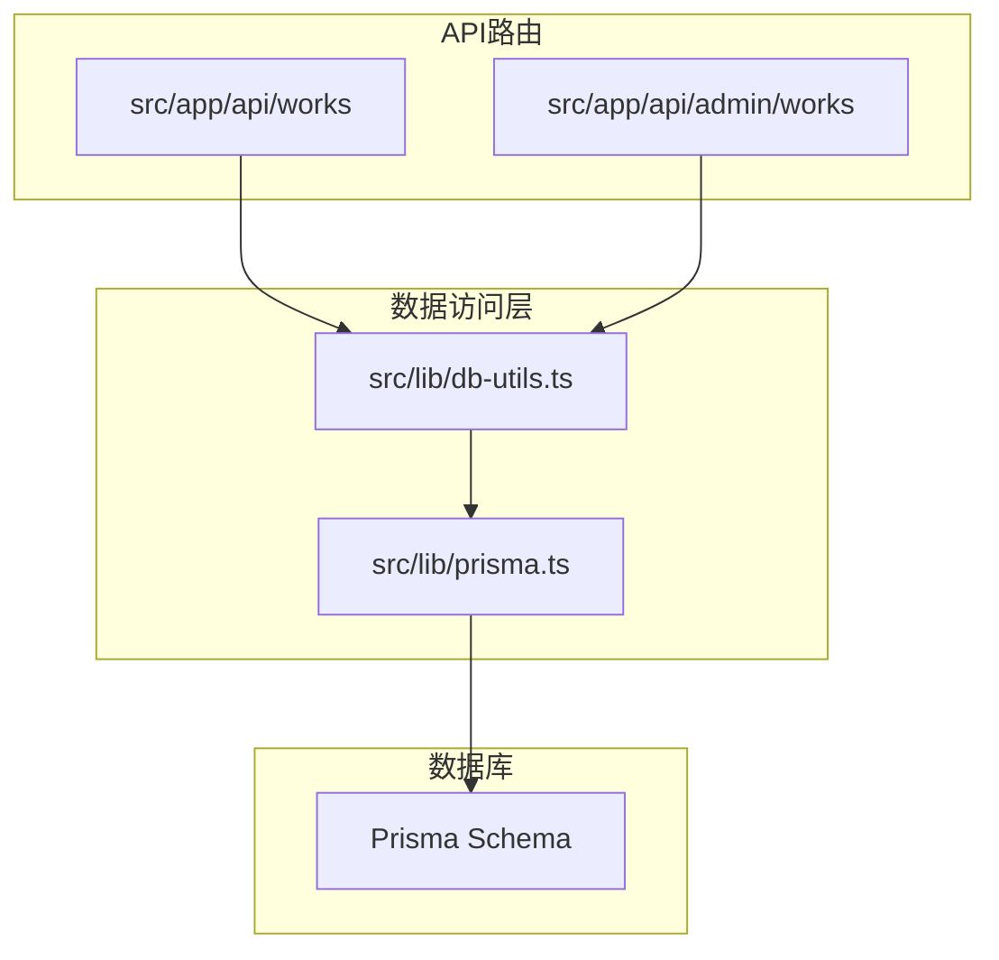
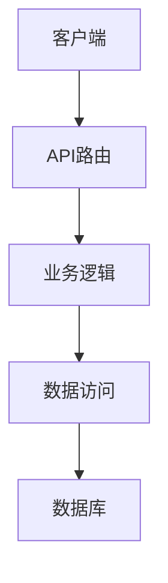
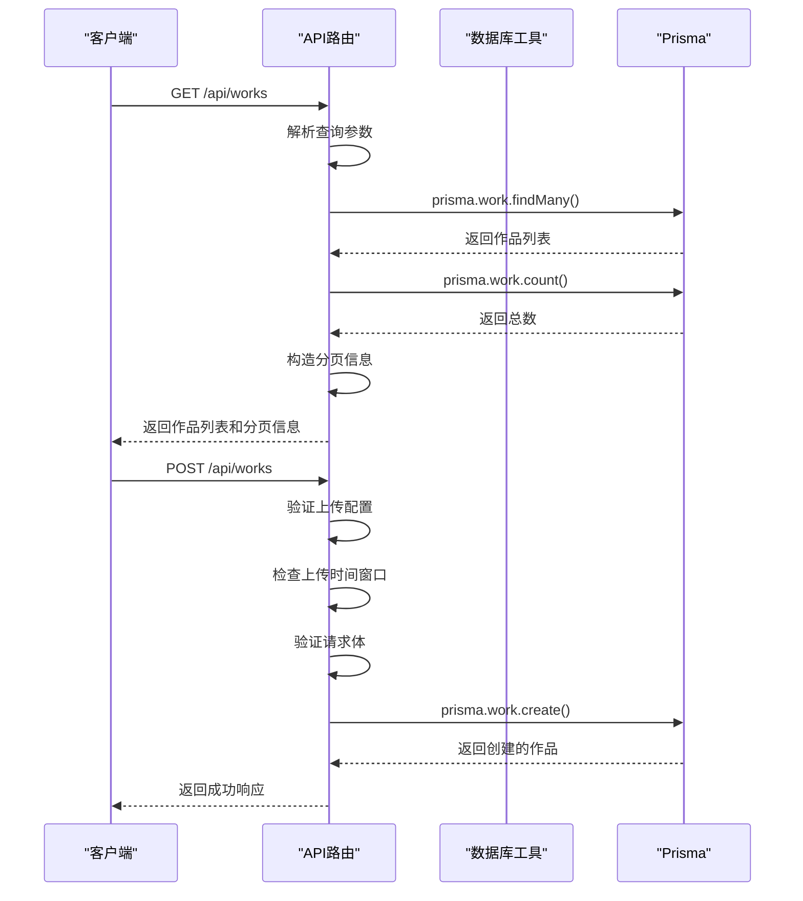
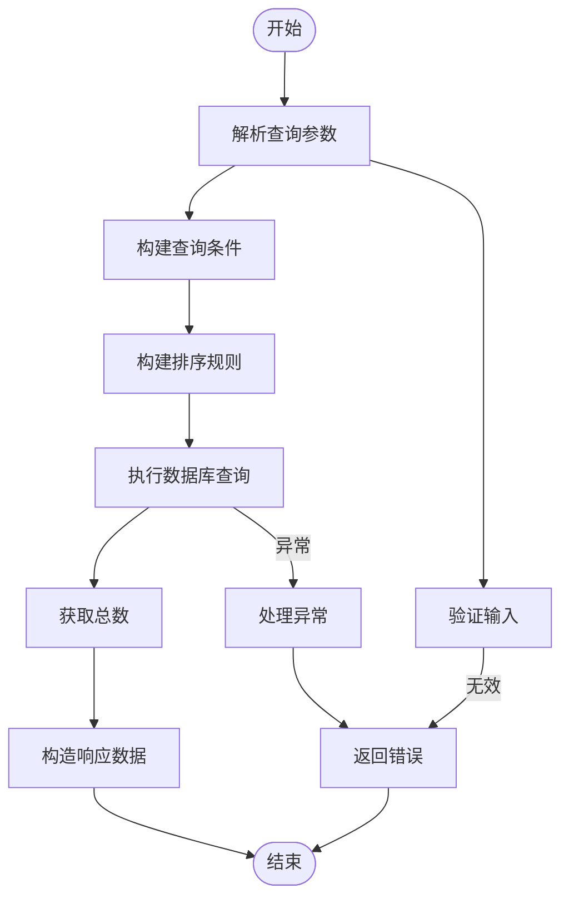
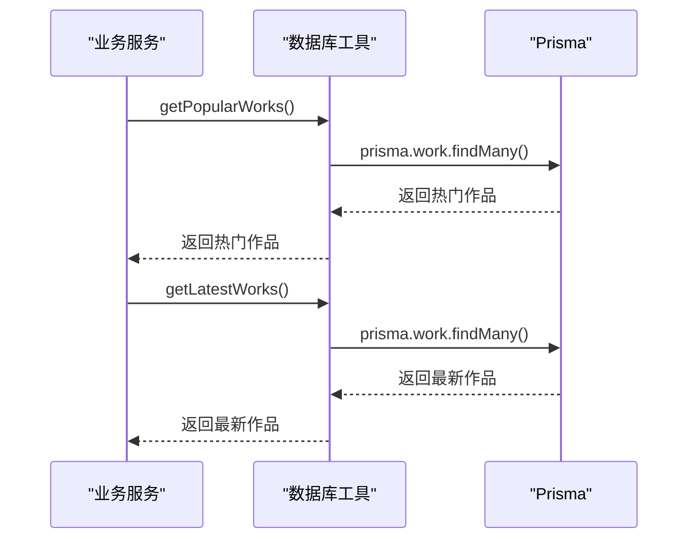

# 基础增删改查

<cite>
**本文档引用的文件**   
- [src/app/api/works/route.ts](file://src/app/api/works/route.ts)
- [src/lib/db-utils.ts](file://src/lib/db-utils.ts)
- [src/lib/prisma.ts](file://src/lib/prisma.ts)
</cite>

## 目录
1. [简介](#简介)
2. [项目结构](#项目结构)
3. [核心组件](#核心组件)
4. [架构概述](#架构概述)
5. [详细组件分析](#详细组件分析)
6. [依赖分析](#依赖分析)
7. [性能考虑](#性能考虑)
8. [故障排除指南](#故障排除指南)
9. [结论](#结论)

## 简介
本文档详细介绍了本项目中基于Prisma的增删改查（CRUD）操作实现。重点分析了作品模块的数据访问逻辑，包括作品列表查询、创建、更新和删除等基本操作。文档结合`src/app/api/works/route.ts`中的具体实现，说明了Prisma的`findMany`、`create`等方法的实际用法。同时，通过`src/lib/db-utils.ts`中封装的通用查询辅助函数，展示了如何抽象重复的查询逻辑以提升代码可维护性。文档还提供了分页查询、条件过滤、字段排序等常见场景的代码示例，并强调了输入验证与数据库操作的安全性，避免未授权的数据访问。最后，文档包含了错误处理模式和常见问题排查指南。

## 项目结构
项目采用Next.js App Router架构，API路由位于`src/app/api`目录下。数据访问层通过Prisma ORM实现，相关配置和工具函数位于`src/lib`目录。作品相关的CRUD操作主要分布在`src/app/api/works`和`src/app/api/admin/works`路径下，分别处理普通用户和管理员的请求。



**Diagram sources**
- [src/app/api/works/route.ts](file://src/app/api/works/route.ts)
- [src/lib/db-utils.ts](file://src/lib/db-utils.ts)
- [src/lib/prisma.ts](file://src/lib/prisma.ts)

**Section sources**
- [src/app/api/works/route.ts](file://src/app/api/works/route.ts)
- [src/lib/db-utils.ts](file://src/lib/db-utils.ts)

## 核心组件
核心组件包括作品API路由和数据库工具函数。`src/app/api/works/route.ts`实现了作品的查询和创建功能，而`src/lib/db-utils.ts`封装了常用的数据库查询逻辑，如获取热门作品、最新作品等。这些组件共同构成了系统的数据访问基础。

**Section sources**
- [src/app/api/works/route.ts](file://src/app/api/works/route.ts#L1-L195)
- [src/lib/db-utils.ts](file://src/lib/db-utils.ts#L1-L68)

## 架构概述
系统采用分层架构，API路由层负责处理HTTP请求和响应，业务逻辑层（数据库工具函数）封装了数据访问逻辑，数据访问层（Prisma）负责与数据库交互。这种分层设计提高了代码的可维护性和可测试性。



**Diagram sources**
- [src/app/api/works/route.ts](file://src/app/api/works/route.ts)
- [src/lib/db-utils.ts](file://src/lib/db-utils.ts)

## 详细组件分析

### 作品查询与创建分析
`src/app/api/works/route.ts`文件中的GET和POST方法实现了作品的查询和创建功能。GET方法支持分页、排序和状态过滤，POST方法实现了作品的创建逻辑。

#### 对于API/服务组件：


**Diagram sources**
- [src/app/api/works/route.ts](file://src/app/api/works/route.ts#L1-L195)

#### 对于复杂逻辑组件：


**Diagram sources**
- [src/app/api/works/route.ts](file://src/app/api/works/route.ts#L1-L195)

**Section sources**
- [src/app/api/works/route.ts](file://src/app/api/works/route.ts#L1-L195)

### 数据库工具函数分析
`src/lib/db-utils.ts`文件中封装了常用的数据库查询逻辑，如获取热门作品、最新作品等。这些函数提高了代码的可重用性。

#### 对于API/服务组件：


**Diagram sources**
- [src/lib/db-utils.ts](file://src/lib/db-utils.ts#L1-L68)

**Section sources**
- [src/lib/db-utils.ts](file://src/lib/db-utils.ts#L1-L68)

## 依赖分析
系统依赖于Prisma ORM进行数据库操作，通过`src/lib/prisma.ts`中的单例模式管理Prisma客户端实例。API路由依赖于数据库工具函数，数据库工具函数又依赖于Prisma客户端。

```mermaid
graph TD
A[src/app/api/works/route.ts] --> B[src/lib/db-utils.ts]
B --> C[src/lib/prisma.ts]
C --> D[@prisma/client]
```

**Diagram sources**
- [src/app/api/works/route.ts](file://src/app/api/works/route.ts)
- [src/lib/db-utils.ts](file://src/lib/db-utils.ts)
- [src/lib/prisma.ts](file://src/lib/prisma.ts)

**Section sources**
- [src/app/api/works/route.ts](file://src/app/api/works/route.ts)
- [src/lib/db-utils.ts](file://src/lib/db-utils.ts)
- [src/lib/prisma.ts](file://src/lib/prisma.ts)

## 性能考虑
在实现数据访问操作时，考虑了以下性能优化：
1. 使用`Promise.all`并行执行查询和计数操作，减少数据库往返次数。
2. 在查询中使用`include`和`select`来精确控制返回的字段，减少数据传输量。
3. 通过分页查询避免一次性加载大量数据。

## 故障排除指南
### 常见问题
1. **作品