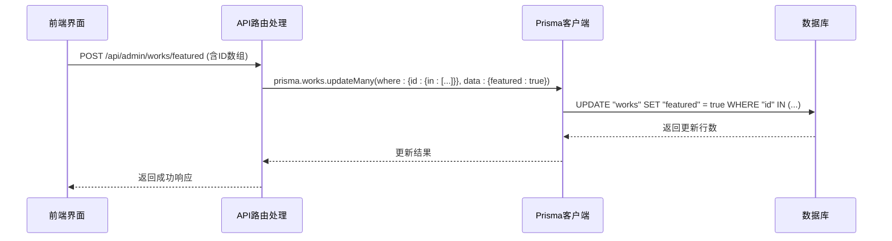
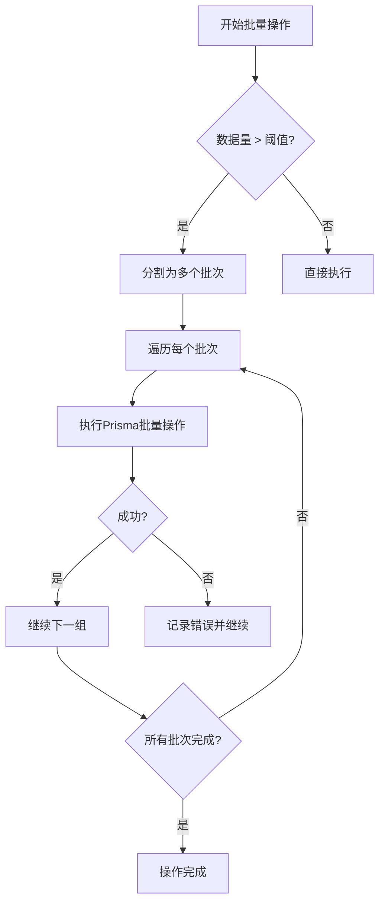

# 批量操作

<cite>
**本文档引用的文件**  
- [prisma.ts](file://src/lib/prisma.ts)
- [migration.sql](file://prisma/migrations/20250831084947_add_featured_field/migration.sql)
- [featured/route.ts](file://src/app/api/admin/works/[id]/featured/route.ts)
- [worksManagement.tsx](file://src/components/admin/WorksManagement.tsx)
- [work.d.ts](file://src/types/work.d.ts)
</cite>

## 目录
1. [引言](#引言)
2. [Prisma批量操作方法概述](#prisma批量操作方法概述)
3. [管理员批量设置精选作品的实现](#管理员批量设置精选作品的实现)
4. [唯一键冲突与数据完整性保障](#唯一键冲突与数据完整性保障)
5. [批量操作性能优化策略](#批量操作性能优化策略)
6. [异步处理与后台任务集成](#异步处理与后台任务集成)
7. [结论](#结论)

## 引言
本系统为“数字化作品互动展示平台”，支持用户上传AI生成作品并进行社区互动。管理员需具备批量管理功能，包括审核、推荐和数据统计。本文档聚焦于Prisma ORM的批量操作能力，结合`createMany`、`updateMany`和`deleteMany`方法，系统性阐述其使用规范与性能优化策略，特别针对“管理员批量设置精选作品”这一核心业务场景展开分析。

## Prisma批量操作方法概述
Prisma提供了三种主要的批量操作方法，用于高效处理大规模数据变更：

- **`createMany`**：批量插入多条记录，适用于初始化数据或批量导入场景。
- **`updateMany`**：根据条件批量更新符合条件的所有记录，无需逐条查询。
- **`deleteMany`**：根据条件批量删除记录，性能远高于循环调用单条删除。

这些方法直接生成对应的SQL语句，在数据库层面执行，避免了多次网络往返，显著提升了数据操作效率。

**Section sources**
- [prisma.ts](file://src/lib/prisma.ts#L6-L17)

## 管理员批量设置精选作品的实现
系统通过`works`表中的`featured`布尔字段标识作品是否为精选。管理员在后台界面（`WorksManagement.tsx`）可选择多个作品并执行“设为精选”操作。

该功能的后端实现位于`/api/admin/works/[id]/featured`路由。当接收到批量操作请求时，服务端使用Prisma的`updateMany`方法：

**Diagram sources**
- [featured/route.ts](file://src/app/api/admin/works/[id]/featured/route.ts)
- [migration.sql](file://prisma/migrations/20250831084947_add_featured_field/migration.sql#L100-L105)

**Section sources**
- [featured/route.ts](file://src/app/api/admin/works/[id]/featured/route.ts)
- [worksManagement.tsx](file://src/components/admin/WorksManagement.tsx)

## 唯一键冲突与数据完整性保障
在执行`createMany`操作时，若插入的数据违反了数据库的唯一约束（如`users.email`的唯一索引），Prisma会抛出`P2002`错误。系统通过数据库迁移脚本严格定义了数据完整性规则：

- `users.email`字段具有唯一索引（`CREATE UNIQUE INDEX "users_email_key" ON "users"("email")`），防止重复邮箱注册。
- `accounts`表的`provider`和`providerAccountId`组合具有唯一性，确保第三方账号绑定的唯一性。

这些约束在数据库层面强制执行，是保障数据一致性的最后一道防线。应用层应在批量插入前进行数据清洗和校验，但不应完全依赖应用逻辑，而应利用数据库的约束机制作为兜底。

**Section sources**
- [migration.sql](file://prisma/migrations/20250831084947_add_featured_field/migration.sql#L70-L75)

## 批量操作性能优化策略
为确保大规模数据操作的稳定性和效率，需遵循以下性能优化策略：

### 批次大小控制
避免一次性处理过多数据。建议将大批量操作拆分为较小的批次（例如每批100-500条记录），以防止内存溢出和数据库连接超时。

### 索引利用
`updateMany`和`deleteMany`的`where`条件中使用的字段应建立索引。例如，`works`表的`id`字段为主键，天然具有索引，因此基于ID列表的更新非常高效。

### 事务边界设置
对于需要保证原子性的操作，应使用`$transaction`。但对于纯粹的批量更新，如设置精选作品，由于每条记录相互独立，无需包裹在事务中，以减少锁竞争和日志开销。

**Diagram sources**
- [prisma.ts](file://src/lib/prisma.ts#L6-L17)

**Section sources**
- [prisma.ts](file://src/lib/prisma.ts#L6-L17)

## 异步处理与后台任务集成
对于极其耗时的批量操作（例如涉及数万条记录的更新或复杂的业务逻辑），应避免在API请求的生命周期内同步执行，以防请求超时。

推荐方案是将操作请求入队，由后台任务处理器（如Celery、BullMQ或AWS Lambda）异步执行。API只需返回“任务已提交”状态，并提供任务ID供前端轮询进度。

虽然当前代码库中未实现此模式，但架构上已具备条件。`prisma`客户端是全局单例，可在任何Node.js环境中安全使用，为集成后台任务队列提供了基础。

**Section sources**
- [prisma.ts](file://src/lib/prisma.ts#L6-L17)

## 结论
Prisma的批量操作方法是处理大规模数据变更的高效工具。通过合理使用`updateMany`等方法，结合数据库约束保障数据完整性，并遵循批次控制、索引优化等性能策略，可以安全、高效地实现“管理员批量设置精选作品”等功能。对于超大规模操作，应设计异步处理机制，将长时间运行的任务移出请求响应循环，确保系统稳定性和用户体验。