# 数据访问模式

<cite>
**本文档引用的文件**
- [db-utils.ts](file://src/lib/db-utils.ts)
- [prisma.ts](file://src/lib/prisma.ts)
- [route.ts](file://src/app/api/works/route.ts)
- [route.ts](file://src/app/api/admin/works/[id]/approve/route.ts)
- [route.ts](file://src/app/api/user/works/route.ts)
- [route.ts](file://src/app/api/works/[id]/like/route.ts)
</cite>

## 目录
1. [简介](#简介)
2. [项目结构](#项目结构)
3. [核心组件](#核心组件)
4. [架构概述](#架构概述)
5. [详细组件分析](#详细组件分析)
6. [依赖分析](#依赖分析)
7. [性能考虑](#性能考虑)
8. [故障排除指南](#故障排除指南)
9. [结论](#结论)

## 简介
本文档系统性地介绍了基于Prisma的典型数据访问模式，涵盖单表增删改查、关联数据嵌套查询、事务处理和批量操作等常见操作。通过分析`src/lib/db-utils.ts`中的工具函数示例，说明如何封装通用查询逻辑以提升代码复用性。结合API路由中的实际用例（如作品审核、用户作品列表获取），展示复杂查询的构建方法。强调安全查询实践，防止N+1查询问题和过度数据加载，并提供性能优化建议。

## 项目结构
本项目采用Next.js App Router架构，数据访问层主要集中在`src/lib`目录下，通过Prisma Client实现数据库操作。API路由分布在`src/app/api`目录中，按功能模块组织。

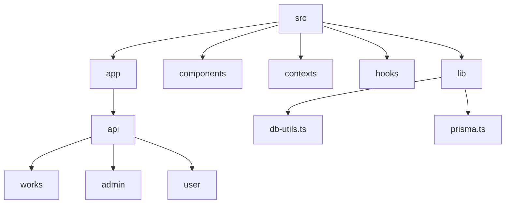

**图示来源**
- [db-utils.ts](file://src/lib/db-utils.ts)
- [prisma.ts](file://src/lib/prisma.ts)

**章节来源**
- [db-utils.ts](file://src/lib/db-utils.ts)
- [prisma.ts](file://src/lib/prisma.ts)

## 核心组件
核心数据访问组件包括Prisma Client实例化、通用查询工具函数和API路由处理器。`prisma.ts`文件负责创建和管理Prisma Client实例，而`db-utils.ts`封装了常用的查询逻辑。

**章节来源**
- [db-utils.ts](file://src/lib/db-utils.ts#L4-L67)
- [prisma.ts](file://src/lib/prisma.ts#L1-L20)

## 架构概述
系统采用分层架构，API路由层处理HTTP请求，调用数据访问层进行数据库操作。Prisma Client作为ORM层，提供类型安全的数据库访问接口。

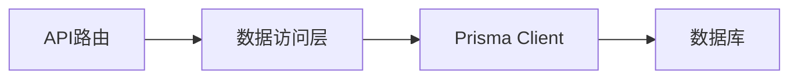

**图示来源**
- [prisma.ts](file://src/lib/prisma.ts#L1-L20)
- [db-utils.ts](file://src/lib/db-utils.ts#L4-L67)

## 详细组件分析

### 数据访问工具函数分析
`db-utils.ts`文件中的工具函数展示了如何封装通用查询逻辑。

#### 获取热门作品
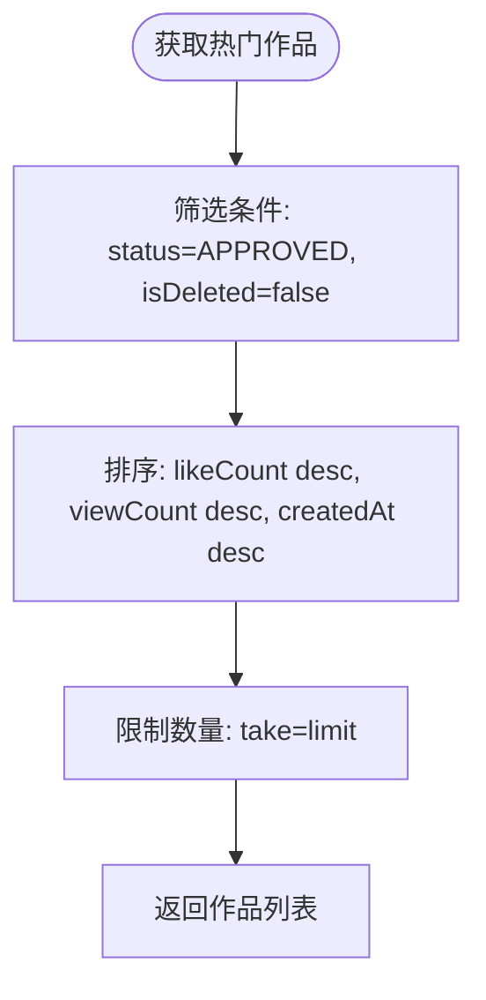

**图示来源**
- [db-utils.ts](file://src/lib/db-utils.ts#L4-L17)

#### 获取最新作品
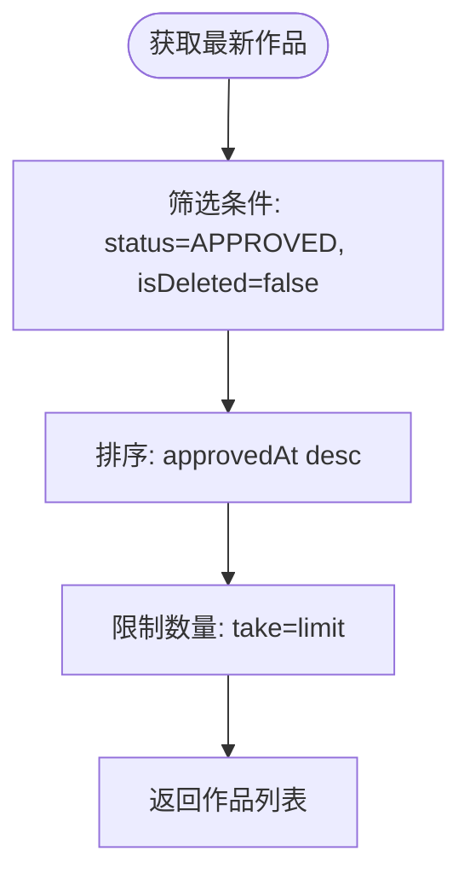

**图示来源**
- [db-utils.ts](file://src/lib/db-utils.ts#L20-L31)

#### 增加浏览数
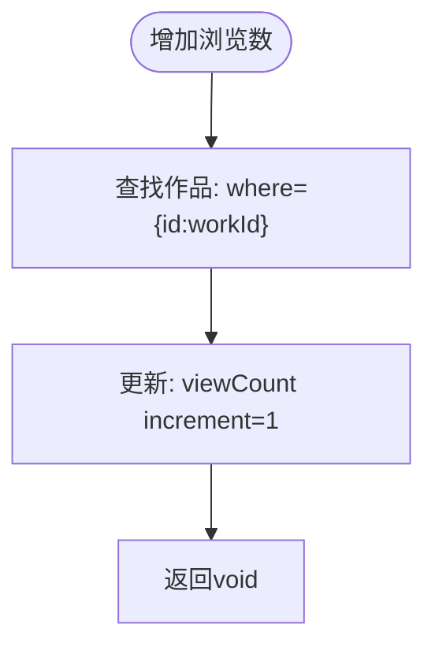

**图示来源**
- [db-utils.ts](file://src/lib/db-utils.ts#L34-L43)

#### 获取作品统计
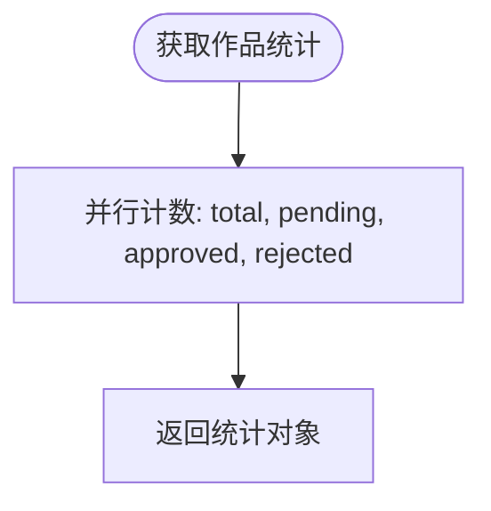

**图示来源**
- [db-utils.ts](file://src/lib/db-utils.ts#L58-L67)

**章节来源**
- [db-utils.ts](file://src/lib/db-utils.ts#L4-L67)

### API路由分析

#### 作品列表获取
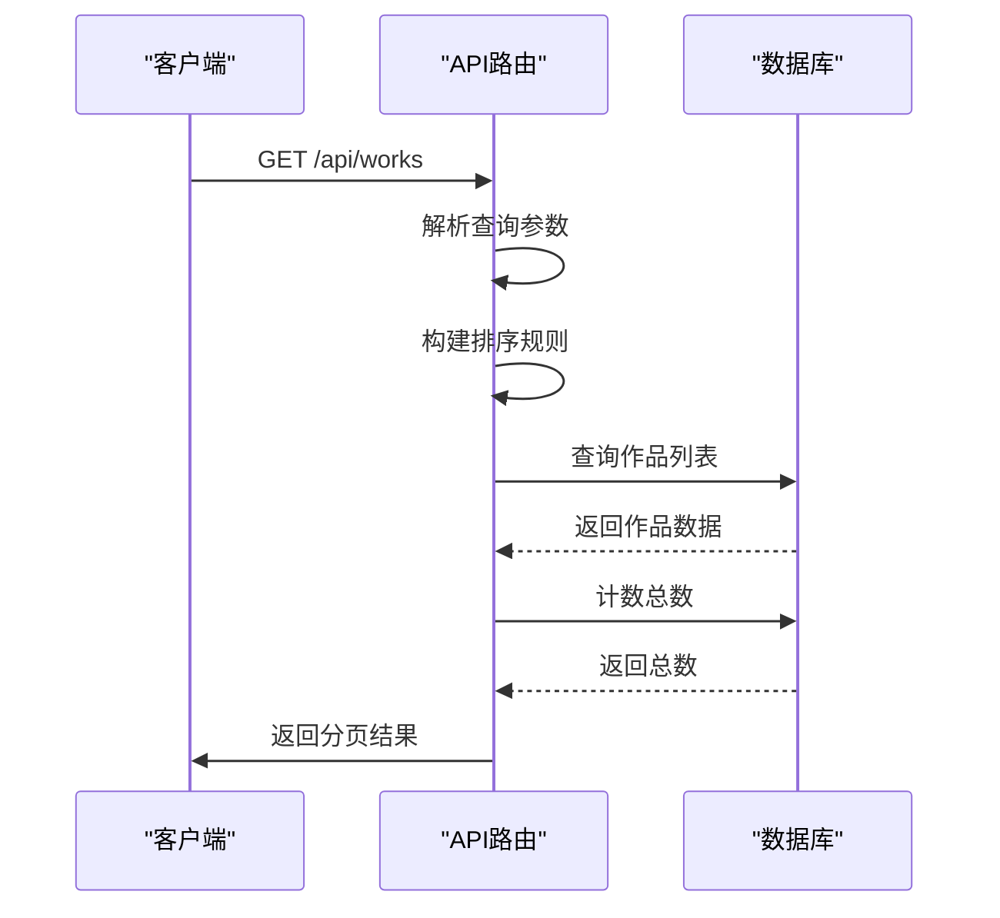

**图示来源**
- [route.ts](file://src/app/api/works/route.ts#L1-L195)

#### 作品审核通过
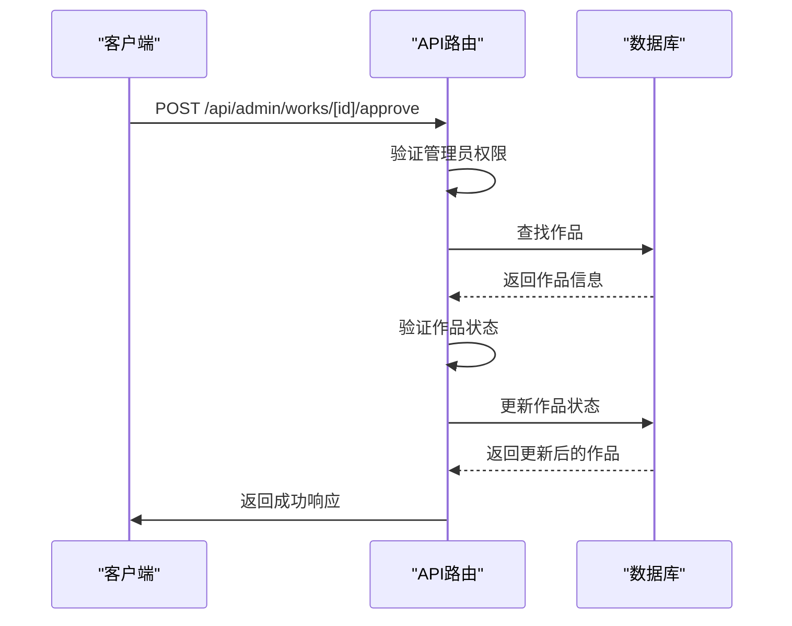

**图示来源**
- [route.ts](file://src/app/api/admin/works/[id]/approve/route.ts#L1-L76)

#### 用户作品列表获取
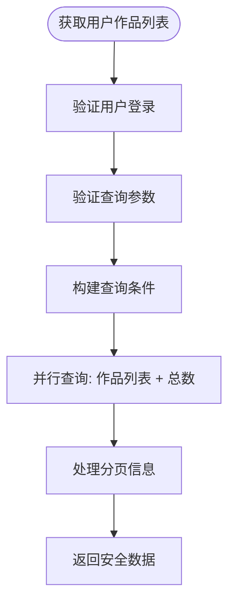

**图示来源**
- [route.ts](file://src/app/api/user/works/route.ts#L1-L126)

#### 作品点赞
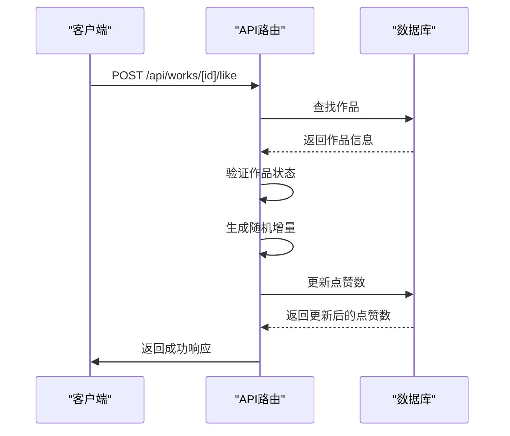

**图示来源**
- [route.ts](file://src/app/api/works/[id]/like/route.ts#L1-L65)

**章节来源**
- [route.ts](file://src/app/api/works/route.ts#L1-L195)
- [route.ts](file://src/app/api/admin/works/[id]/approve/route.ts#L1-L76)
- [route.ts](file://src/app/api/user/works/route.ts#L1-L126)
- [route.ts](file://src/app/api/works/[id]/like/route.ts#L1-L65)

## 依赖分析
项目依赖关系清晰，API路由依赖数据访问层，数据访问层依赖Prisma Client。

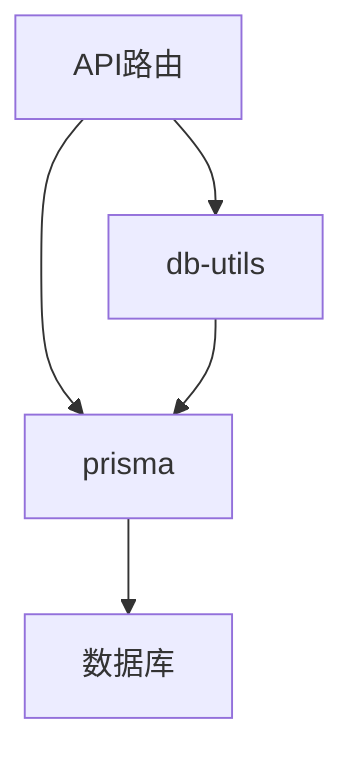

**图示来源**
- [db-utils.ts](file://src/lib/db-utils.ts)
- [prisma.ts](file://src/lib/prisma.ts)

**章节来源**
- [db-utils.ts](file://src/lib/db-utils.ts)
- [prisma.ts](file://src/lib/prisma.ts)

## 性能考虑
在数据访问模式中，性能优化主要体现在以下几个方面：
- 使用`Promise.all`并行执行独立查询
- 合理使用`select`字段裁剪减少数据传输量
- 利用唯一索引加速查询
- 避免N+1查询问题，通过`include`一次性获取关联数据

## 故障排除指南
常见问题及解决方案：
- **数据库连接失败**：检查`DATABASE_URL`环境变量配置
- **查询参数验证失败**：确保传递的参数符合Zod验证模式
- **权限不足**：确认用户角色和会话状态
- **作品状态变更失败**：检查当前状态是否允许目标状态变更

**章节来源**
- [route.ts](file://src/app/api/works/route.ts#L1-L195)
- [route.ts](file://src/app/api/admin/works/[id]/approve/route.ts#L1-L76)

## 结论
本文档详细介绍了基于Prisma的典型数据访问模式，展示了如何通过合理的封装和设计提升代码复用性和可维护性。通过实际用例分析，说明了复杂查询的构建方法和性能优化策略。建议在开发中遵循这些模式，确保数据访问的安全性和效率。