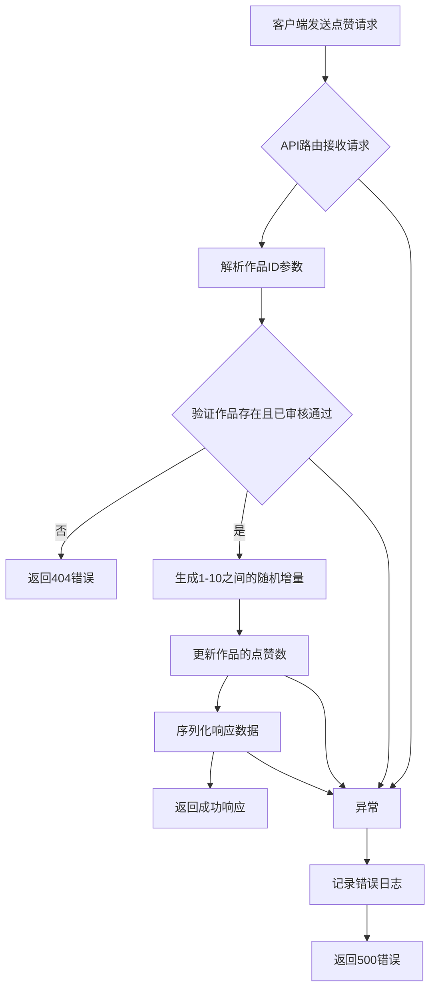
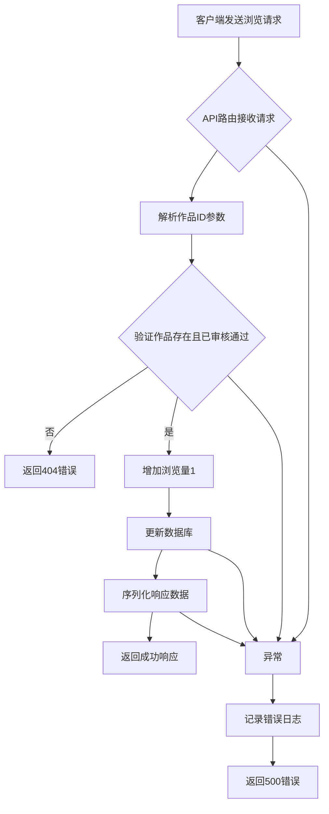
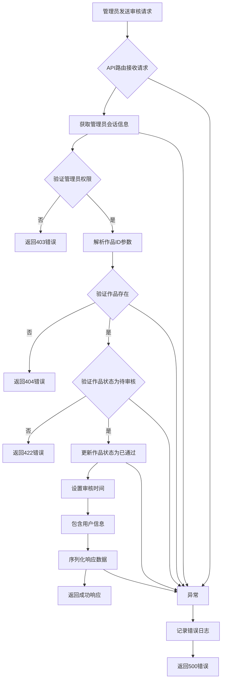

# 核心业务逻辑流

<cite>
**本文档引用的文件**   
- [like/route.ts](file://src/app/api/works/[id]/like/route.ts)
- [view/route.ts](file://src/app/api/works/[id]/view/route.ts)
- [approve/route.ts](file://src/app/api/admin/works/[id]/approve/route.ts)
- [serialize.ts](file://src/lib/serialize.ts)
- [prisma.ts](file://src/lib/prisma.ts)
- [schema.prisma](file://prisma/schema.prisma)
</cite>

## 目录
1. [简介](#简介)
2. [核心业务逻辑处理链](#核心业务逻辑处理链)
3. [典型功能流程分析](#典型功能流程分析)
4. [错误边界处理](#错误边界处理)
5. [事务一致性保障](#事务一致性保障)
6. [副作用管理](#副作用管理)
7. [可复用逻辑模式](#可复用逻辑模式)
8. [总结](#总结)

## 简介
本文件旨在详细说明数字化作品互动展示平台的核心业务逻辑流，以点赞、浏览计数和作品审核三个典型功能为例，完整展示从API请求到数据持久化的处理链条。文档将深入分析各环节的职责划分、错误处理机制、事务一致性保障以及副作用管理策略，帮助开发者理解系统设计并快速实现类似功能。

## 核心业务逻辑处理链
核心业务逻辑流遵循统一的处理模式，确保代码的一致性和可维护性。整个处理链可分为四个主要阶段：

1. **API路由接收并验证输入**：API路由作为系统的入口点，负责接收HTTP请求，解析参数，并进行初步的输入验证。
2. **调用业务逻辑函数**：在验证通过后，路由将调用相应的业务逻辑函数，这些函数封装了具体的业务规则和处理逻辑。
3. **操作数据库**：业务逻辑函数通过Prisma客户端与数据库交互，执行数据的读取、更新或删除操作。
4. **序列化响应**：最后，将处理结果通过`serialize.ts`中的`toPlainJSON`函数进行序列化，生成JSON响应返回给客户端。

这一处理链确保了业务逻辑的清晰分离，提高了代码的可测试性和可维护性。

## 典型功能流程分析

### 点赞功能流程
点赞功能允许用户为已审核通过的作品增加点赞数。该功能的处理流程如下：

**流程说明**：
- 客户端通过POST请求调用`/api/works/[id]/like`接口。
- 路由解析动态参数`id`，并检查对应作品是否存在且状态为"已通过"。
- 如果验证通过，则生成1到10之间的随机数作为点赞增量，并更新数据库中的`likeCount`字段。
- 最后，将更新后的点赞数和实际增量返回给客户端。

**Diagram sources**
- [like/route.ts](file://src/app/api/works/[id]/like/route.ts#L1-L64)

**Section sources**
- [like/route.ts](file://src/app/api/works/[id]/like/route.ts#L1-L64)

### 浏览计数功能流程
浏览计数功能用于记录作品的访问次数，每次访问都会使浏览量增加1。该功能的处理流程如下：

**流程说明**：
- 客户端通过POST请求调用`/api/works/[id]/view`接口。
- 路由解析作品ID，并验证作品的存在性和审核状态。
- 验证通过后，将`viewCount`字段递增1，并将更新后的浏览量返回给客户端。

**Diagram sources**
- [view/route.ts](file://src/app/api/works/[id]/view/route.ts#L1-L61)

**Section sources**
- [view/route.ts](file://src/app/api/works/[id]/view/route.ts#L1-L61)

### 作品审核功能流程
作品审核功能允许管理员将待审核的作品状态更改为"已通过"。该功能的处理流程如下：

**流程说明**：
- 管理员通过POST请求调用`/api/admin/works/[id]/approve`接口。
- 路由首先验证管理员的会话信息和角色权限。
- 然后解析作品ID，检查作品是否存在且当前状态为"待审核"。
- 验证通过后，将作品状态更新为"已通过"，并记录审核时间。
- 最后，使用`toPlainJSON`函数序列化包含用户信息的更新后作品数据，并返回成功响应。

**Diagram sources**
- [approve/route.ts](file://src/app/api/admin/works/[id]/approve/route.ts#L1-L75)
- [serialize.ts](file://src/lib/serialize.ts#L1-L52)

**Section sources**
- [approve/route.ts](file://src/app/api/admin/works/[id]/approve/route.ts#L1-L75)
- [serialize.ts](file://src/lib/serialize.ts#L1-L52)

## 错误边界处理
系统在各个层面都实现了完善的错误边界处理机制，确保在异常情况下能够提供有意义的错误信息并保持系统的稳定性。

### 输入验证错误
在处理请求时，系统会首先验证输入参数的有效性。例如，在点赞和浏览功能中，会检查作品ID对应的作品是否存在且状态正确。如果验证失败，系统会返回404状态码和相应的错误信息。

### 权限验证错误
对于需要特定权限的操作（如作品审核），系统会验证用户的角色。如果用户没有足够的权限，系统会返回403状态码和"权限不足"的错误信息。

### 数据库操作错误
在执行数据库操作时，系统使用try-catch块捕获可能的异常。如果发生数据库错误，系统会记录详细的错误日志，并返回500状态码和"服务器内部错误"的信息。

### 序列化错误
在序列化响应数据时，`toPlainJSON`函数能够处理各种数据类型，包括Date对象和BigInt，确保不会因数据类型不兼容而导致序列化失败。

## 事务一致性保障
虽然当前的业务逻辑主要涉及单个数据库操作，但系统设计考虑了未来可能的复杂事务需求。通过使用Prisma的事务功能，可以在需要时确保多个数据库操作的原子性。

例如，在作品审核过程中，如果需要同时更新多个相关实体（如作品状态、审核日志、用户积分等），可以使用Prisma的`$transaction`方法将这些操作包装在一个事务中，确保要么全部成功，要么全部回滚。

## 副作用管理
系统在设计时充分考虑了副作用的管理，特别是在更新关联计数器方面。

### 点赞数更新
点赞功能不是简单地将点赞数加1，而是随机增加1到10之间的数值。这种设计增加了互动的趣味性，同时也减少了频繁的数据库更新操作。

### 浏览量更新
浏览量每次只增加1，确保了数据的准确性和可预测性。同时，系统可以通过分析浏览数据来了解作品的受欢迎程度。

### 图片URL优化
在序列化作品数据时，`toPlainJSON`函数会检查是否存在`ossUrl`，如果存在则优先使用`ossUrl`作为`imageUrl`。这一优化确保了图片加载的效率和可靠性。

## 可复用逻辑模式
通过对核心业务逻辑的分析，可以总结出以下可复用的逻辑模式，帮助开发者快速实现类似功能。

### 统一的API路由结构
所有API路由都遵循相同的结构：接收请求、验证输入、调用业务逻辑、处理结果、返回响应。这种一致性使得新功能的开发更加高效。

### 集中的序列化逻辑
`serialize.ts`文件中的`toPlainJSON`函数提供了一个集中的序列化逻辑，可以处理各种数据类型和特殊情况。这一模式可以被所有API路由复用，确保响应数据的一致性。

### 模块化的业务逻辑
业务逻辑被封装在独立的函数或模块中，与API路由分离。这种设计使得业务逻辑可以被多个路由复用，也便于单元测试。

### 全局的错误处理
系统采用统一的错误处理策略，所有异常都被捕获并转换为标准化的错误响应。这种模式提高了系统的健壮性和用户体验。

## 总结
本文档详细分析了数字化作品互动展示平台的核心业务逻辑流，以点赞、浏览计数和作品审核三个功能为例，展示了从API请求到数据持久化的完整处理链条。通过遵循统一的处理模式、完善的错误处理机制、事务一致性保障和副作用管理策略，系统实现了高可靠性和可维护性。开发者可以借鉴这些可复用的逻辑模式，快速实现新的业务功能，同时保持代码的一致性和质量。