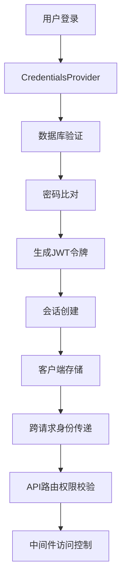
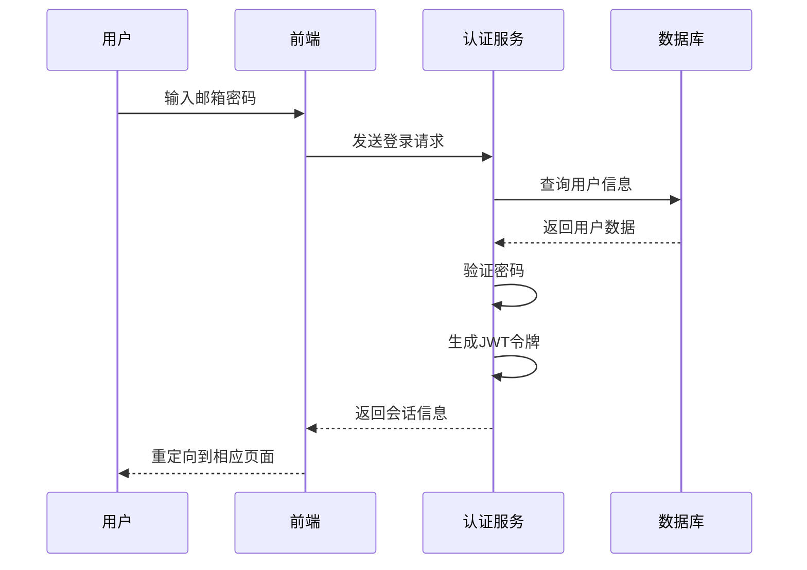
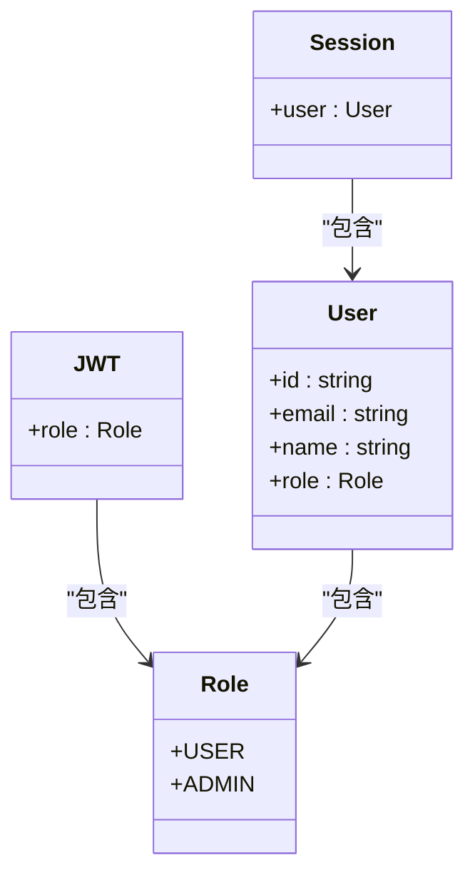
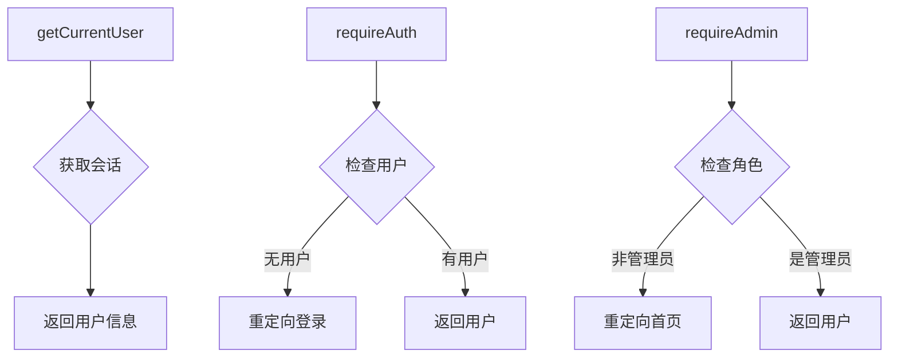
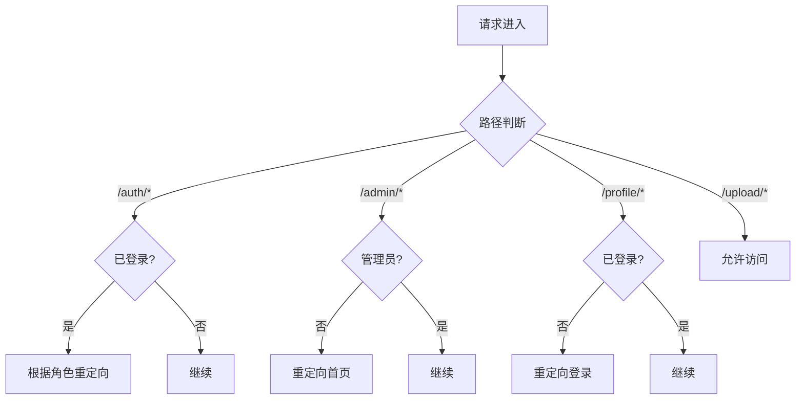

# 认证与权限控制

<cite>
**本文档引用的文件**
- [auth.ts](file://src/lib/auth.ts)
- [auth-utils.ts](file://src/lib/auth-utils.ts)
- [middleware.ts](file://middleware.ts)
- [next-auth.d.ts](file://src/types/next-auth.d.ts)
- [route.ts](file://src/app/api/auth/[...nextauth]/route.ts)
</cite>

## 目录
1. [简介](#简介)
2. [认证系统架构](#认证系统架构)
3. [核心认证流程](#核心认证流程)
4. [权限控制机制](#权限控制机制)
5. [中间件路由控制](#中间件路由控制)
6. [受保护路由实现](#受保护路由实现)
7. [常见问题处理](#常见问题处理)
8. [总结](#总结)

## 简介
本项目采用NextAuth.js实现完整的用户认证与权限控制系统，支持基于JWT的会话管理、角色权限控制和路由级访问控制。系统定义了管理员（ADMIN）和普通用户（USER）两种角色，通过中间件和工具函数实现多层次的安全防护。

## 认证系统架构



**Diagram sources**
- [auth.ts](file://src/lib/auth.ts#L7-L71)
- [route.ts](file://src/app/api/auth/[...nextauth]/route.ts#L1-L5)

**Section sources**
- [auth.ts](file://src/lib/auth.ts#L1-L71)
- [route.ts](file://src/app/api/auth/[...nextauth]/route.ts#L1-L5)

## 核心认证流程

### 用户登录与会话创建
系统使用NextAuth.js的CredentialsProvider实现基于邮箱和密码的认证流程：

1. 用户在登录页面输入邮箱和密码
2. 系统通过PrismaAdapter连接数据库验证用户信息
3. 使用bcryptjs比对密码哈希值
4. 认证成功后生成包含用户角色信息的JWT令牌
5. 会话信息通过JWT策略进行管理



**Diagram sources**
- [auth.ts](file://src/lib/auth.ts#L7-L71)
- [signin/page.tsx](file://src/app/auth/signin/page.tsx#L1-L39)

**Section sources**
- [auth.ts](file://src/lib/auth.ts#L7-L71)

### JWT令牌管理
系统采用JWT策略管理会话，通过回调函数在令牌中嵌入角色信息：

- `jwt`回调：在令牌生成时将用户角色添加到JWT中
- `session`回调：将会话信息与JWT中的角色信息同步
- 使用NEXTAUTH_SECRET环境变量确保令牌安全性

**Section sources**
- [auth.ts](file://src/lib/auth.ts#L43-L58)

## 权限控制机制

### 角色定义与类型扩展
系统基于Prisma的Role枚举定义用户角色，并通过类型声明扩展NextAuth的会话类型：



**Diagram sources**
- [next-auth.d.ts](file://src/types/next-auth.d.ts#L1-L22)
- [auth.ts](file://src/lib/auth.ts#L43-L58)

**Section sources**
- [next-auth.d.ts](file://src/types/next-auth.d.ts#L1-L22)

### 权限校验函数实现
系统提供了一系列工具函数用于权限校验：



**Diagram sources**
- [auth-utils.ts](file://src/lib/auth-utils.ts#L5-L24)

**Section sources**
- [auth-utils.ts](file://src/lib/auth-utils.ts#L5-L24)

## 中间件路由控制

### 路由访问策略
middleware.ts文件定义了系统的路由级访问控制策略：



**Diagram sources**
- [middleware.ts](file://middleware.ts#L1-L50)

**Section sources**
- [middleware.ts](file://middleware.ts#L1-L50)

### 匹配器配置
系统通过config.matcher指定需要中间件处理的路由模式：

- `/admin/:path*`：管理后台所有路由
- `/upload/:path*`：上传功能所有路由
- `/auth/:path*`：认证相关所有路由
- `/profile/:path*`：个人中心所有路由

**Section sources**
- [middleware.ts](file://middleware.ts#L45-L50)

## 受保护路由实现

### API路由权限控制
在API路由中使用工具函数实现权限控制：

```typescript
// 示例：管理员专用API
export async function GET() {
  const user = await requireAdmin();
  // 管理员专属逻辑
}
```

### 页面级权限控制
在客户端组件中使用useSession钩子进行权限控制：

```typescript
// 示例：管理页面
useEffect(() => {
  if (session?.user?.role !== 'ADMIN') {
    router.push('/');
  }
}, [session]);
```

**Section sources**
- [admin/page.tsx](file://src/app/admin/page.tsx#L1-L47)
- [auth-utils.ts](file://src/lib/auth-utils.ts#L10-L24)

## 常见问题处理

### 会话过期处理
系统通过以下方式处理会话过期：

1. 客户端定期检查会话状态
2. API路由返回401状态码时重定向到登录页
3. 使用getServerSession在服务端验证会话

### 权限不足响应
当用户权限不足时，系统采取以下措施：

1. 管理员页面：重定向到首页
2. 个人中心页面：重定向到登录页
3. API接口：返回相应的HTTP状态码（403）

**Section sources**
- [middleware.ts](file://middleware.ts#L25-L40)
- [auth-utils.ts](file://src/lib/auth-utils.ts#L18-L24)

## 总结
本认证系统通过NextAuth.js实现了安全可靠的用户认证和权限控制机制。系统采用JWT会话策略，通过中间件和工具函数实现了多层次的访问控制。角色权限机制确保了不同用户类型的安全隔离，为系统的稳定运行提供了保障。