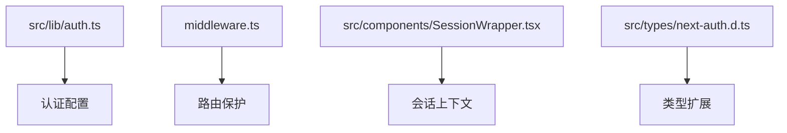
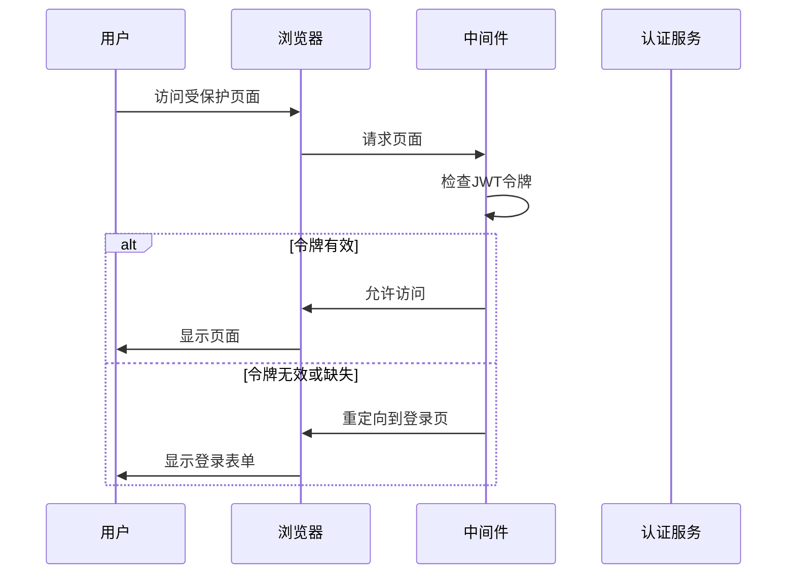
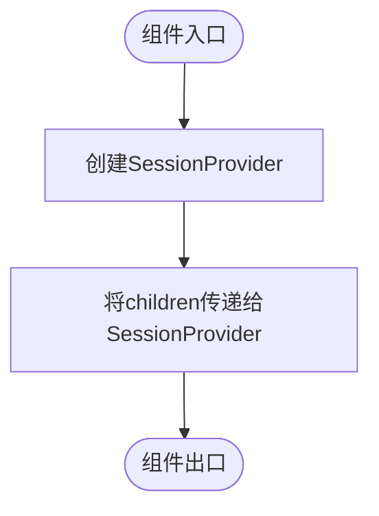
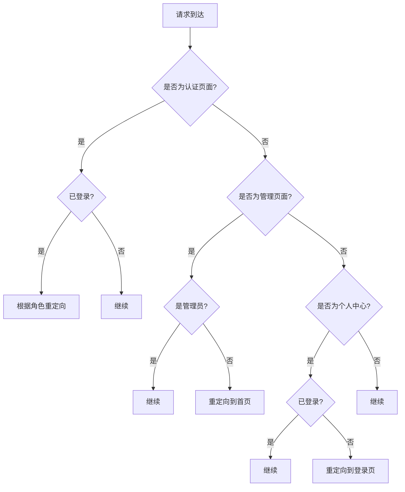
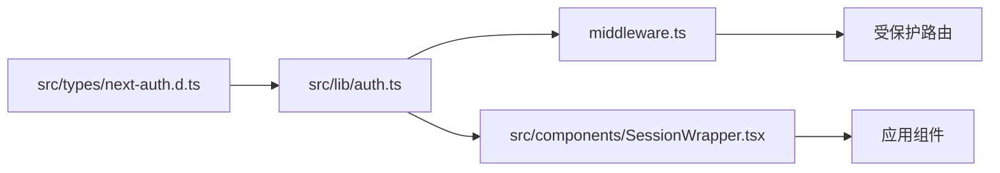

# 会话管理

<cite>
**本文档引用文件**  
- [auth.ts](file://src/lib/auth.ts)
- [SessionWrapper.tsx](file://src/components/SessionWrapper.tsx)
- [middleware.ts](file://middleware.ts)
- [next-auth.d.ts](file://src/types/next-auth.d.ts)
</cite>

## 目录
1. [简介](#简介)
2. [项目结构](#项目结构)
3. [核心组件](#核心组件)
4. [架构概述](#架构概述)
5. [详细组件分析](#详细组件分析)
6. [依赖分析](#依赖分析)
7. [性能考虑](#性能考虑)
8. [故障排除指南](#故障排除指南)
9. [结论](#结论)

## 简介
本文档全面描述了基于JWT的无状态会话机制在Next.js环境中的实现。重点分析了会话配置、路由保护、会话刷新等核心功能，以及会话劫持防护的最佳实践。

## 项目结构
本项目采用Next.js App Router架构，会话管理相关代码分布在多个关键位置。核心认证逻辑位于`src/lib/auth.ts`，中间件用于路由保护，`SessionWrapper`组件提供React上下文支持。



**图示来源**  
- [auth.ts](file://src/lib/auth.ts)
- [middleware.ts](file://middleware.ts)
- [SessionWrapper.tsx](file://src/components/SessionWrapper.tsx)
- [next-auth.d.ts](file://src/types/next-auth.d.ts)

**章节来源**  
- [auth.ts](file://src/lib/auth.ts)
- [middleware.ts](file://middleware.ts)

## 核心组件
系统会话管理由四个核心部分构成：认证配置、会话包装器、中间件和类型定义。这些组件协同工作，实现了安全的无状态会话管理。

**章节来源**  
- [auth.ts](file://src/lib/auth.ts#L1-L71)
- [SessionWrapper.tsx](file://src/components/SessionWrapper.tsx#L1-L15)

## 架构概述
系统采用基于JWT的无状态会话机制，通过NextAuth.js实现完整的认证流程。会话信息在客户端和服务器端无缝传递，确保了良好的用户体验和安全性。



**图示来源**  
- [middleware.ts](file://middleware.ts#L1-L50)
- [auth.ts](file://src/lib/auth.ts#L43-L71)

## 详细组件分析

### 认证配置分析
`src/lib/auth.ts`文件中的`authOptions`配置了基于JWT的会话策略，通过CredentialsProvider实现邮箱密码认证。

```mermaid
classDiagram
class authOptions {
+adapter : PrismaAdapter
+providers : CredentialsProvider[]
+session : {strategy : 'jwt'}
+callbacks : {jwt, session}
+pages : {signIn}
+secret : string
}
class CredentialsProvider {
+name : 'credentials'
+credentials : {email, password}
+authorize(credentials) : User | null
}
authOptions --> CredentialsProvider : "包含"
```

**图示来源**  
- [auth.ts](file://src/lib/auth.ts#L7-L71)

**章节来源**  
- [auth.ts](file://src/lib/auth.ts#L7-L71)

### 会话包装器分析
`SessionWrapper`组件使用NextAuth的`SessionProvider`为整个应用提供会话上下文，使React组件能够访问会话信息。



**图示来源**  
- [SessionWrapper.tsx](file://src/components/SessionWrapper.tsx#L9-L15)

**章节来源**  
- [SessionWrapper.tsx](file://src/components/SessionWrapper.tsx#L1-L15)

### 路由保护分析
中间件实现了精细化的路由保护策略，根据用户角色和访问路径进行智能重定向，确保系统安全。



**图示来源**  
- [middleware.ts](file://middleware.ts#L1-L50)

**章节来源**  
- [middleware.ts](file://middleware.ts#L1-L50)

## 依赖分析
系统会话管理组件之间存在明确的依赖关系，形成了一个完整的认证生态系统。



**图示来源**  
- [auth.ts](file://src/lib/auth.ts)
- [middleware.ts](file://middleware.ts)
- [SessionWrapper.tsx](file://src/components/SessionWrapper.tsx)
- [next-auth.d.ts](file://src/types/next-auth.d.ts)

**章节来源**  
- [auth.ts](file://src/lib/auth.ts)
- [middleware.ts](file://middleware.ts)
- [SessionWrapper.tsx](file://src/components/SessionWrapper.tsx)

## 性能考虑
基于JWT的无状态会话机制减少了服务器端的会话存储开销，提高了系统的可扩展性。每次请求都包含完整的用户信息，避免了数据库查询。

## 故障排除指南
常见会话问题包括令牌过期、角色权限不匹配和重定向循环。检查`middleware.ts`中的条件逻辑和`auth.ts`中的回调函数是解决问题的关键。

**章节来源**  
- [middleware.ts](file://middleware.ts#L1-L50)
- [auth.ts](file://src/lib/auth.ts#L43-L71)

## 结论
本系统实现了安全、高效的无状态会话管理机制。通过JWT令牌、中间件保护和类型安全的会话处理，为用户提供流畅的认证体验，同时确保了系统的安全性。