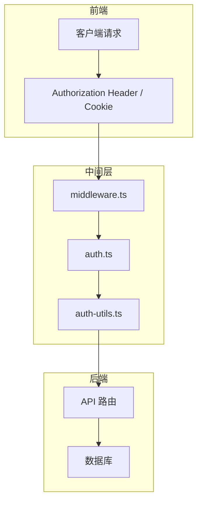
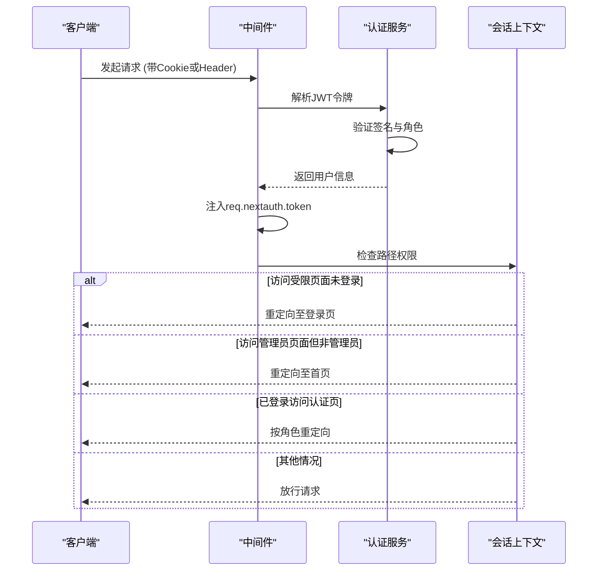
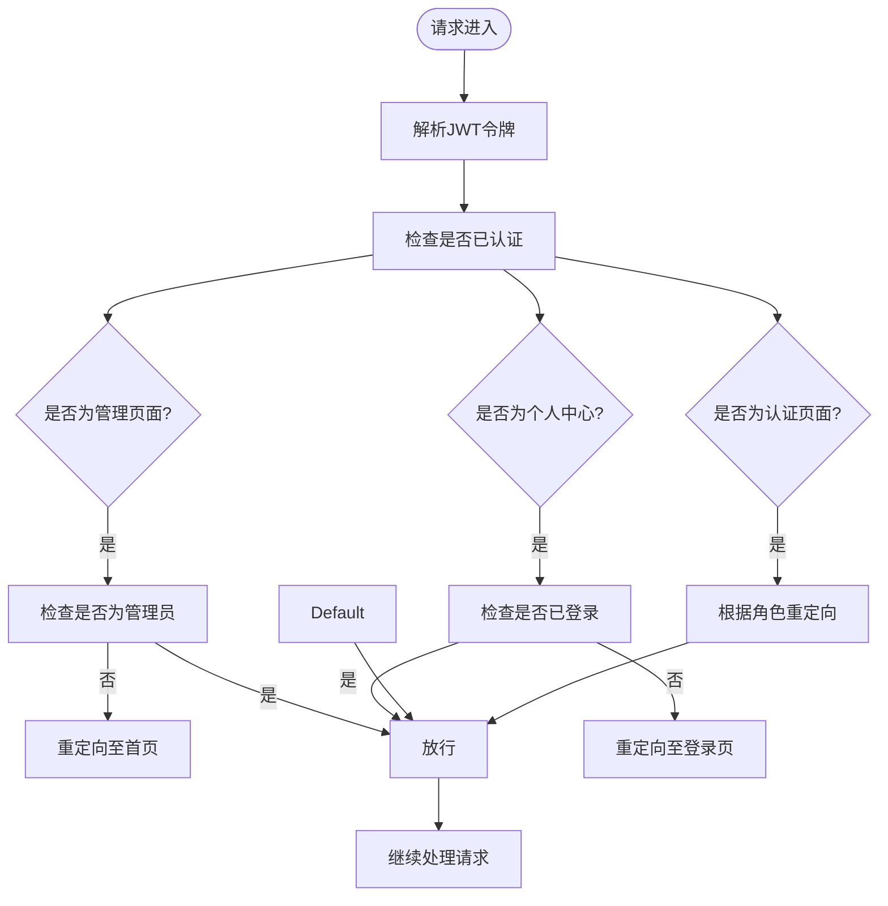
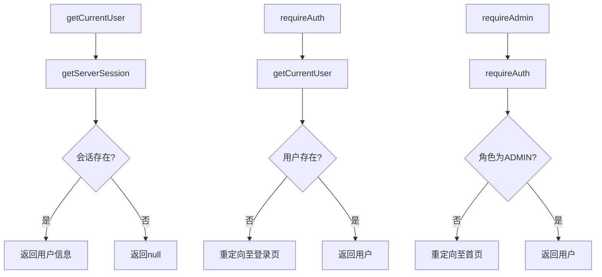
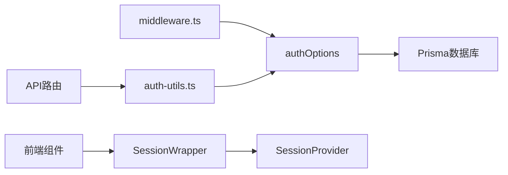

# 会话管理

<cite>
**本文档中引用的文件**  
- [middleware.ts](file://middleware.ts)
- [auth.ts](file://src/lib/auth.ts)
- [auth-utils.ts](file://src/lib/auth-utils.ts)
- [SessionWrapper.tsx](file://src/components/SessionWrapper.tsx)
- [next-auth.d.ts](file://src/types/next-auth.d.ts)
- [route.ts](file://src/app/api/auth/[...nextauth]/route.ts)
</cite>

## 目录
1. [引言](#引言)
2. [项目结构与会话机制概览](#项目结构与会话机制概览)
3. [核心组件分析](#核心组件分析)
4. [架构总览](#架构总览)
5. [详细组件分析](#详细组件分析)
6. [依赖关系分析](#依赖关系分析)
7. [性能考量](#性能考量)
8. [故障排除指南](#故障排除指南)
9. [结论](#结论)

## 引言
本文档深入解析数字化作品互动展示平台的会话管理机制，涵盖从请求拦截到权限控制的完整链路。重点阐述中间件如何解析JWT令牌、认证用户身份并注入上下文，以及辅助函数如何封装认证逻辑。同时说明会话数据在前后端之间的传递方式与常见问题解决方案。

## 项目结构与会话机制概览



**图示来源**  
- [middleware.ts](file://middleware.ts#L1-L50)
- [auth.ts](file://src/lib/auth.ts#L1-L72)
- [auth-utils.ts](file://src/lib/auth-utils.ts#L1-L23)

**本节来源**  
- [middleware.ts](file://middleware.ts#L1-L50)
- [auth.ts](file://src/lib/auth.ts#L1-L72)
- [auth-utils.ts](file://src/lib/auth-utils.ts#L1-L23)

## 核心组件分析

本节分析会话管理中的三个核心文件：`middleware.ts`、`auth.ts` 和 `auth-utils.ts`，分别负责请求拦截、身份验证配置和认证逻辑封装。

**本节来源**  
- [middleware.ts](file://middleware.ts#L1-L50)
- [auth.ts](file://src/lib/auth.ts#L1-L72)
- [auth-utils.ts](file://src/lib/auth-utils.ts#L1-L23)

## 架构总览



**图示来源**  
- [middleware.ts](file://middleware.ts#L5-L45)
- [auth.ts](file://src/lib/auth.ts#L50-L65)

## 详细组件分析

### middleware.ts 分析

`middleware.ts` 是全局中间件，负责在每个请求前进行会话检查和权限控制。



**图示来源**  
- [middleware.ts](file://middleware.ts#L5-L45)

**本节来源**  
- [middleware.ts](file://middleware.ts#L1-L50)

### auth.ts 分析

`auth.ts` 定义了 NextAuth 的认证选项，包括凭证提供者、会话策略和回调函数。

```mermaid
classDiagram
class authOptions {
+adapter : PrismaAdapter
+providers : CredentialsProvider[]
+session : { strategy : 'jwt' }
+callbacks : { jwt(), session() }
+pages : { signIn : '/auth/signin' }
+secret : string
}
class CredentialsProvider {
+name : 'credentials'
+credentials : { email, password }
+authorize(credentials) : User | null
}
class JWTCallback {
+jwt({ token, user }) : token
+session({ session, token }) : session
}
authOptions --> CredentialsProvider : 使用
authOptions --> JWTCallback : 包含回调
```

**图示来源**  
- [auth.ts](file://src/lib/auth.ts#L7-L71)
- [next-auth.d.ts](file://src/types/next-auth.d.ts#L4-L22)

**本节来源**  
- [auth.ts](file://src/lib/auth.ts#L1-L72)

### auth-utils.ts 分析

`auth-utils.ts` 提供高层级认证工具函数，用于服务端路由中强制认证和角色检查。



**图示来源**  
- [auth-utils.ts](file://src/lib/auth-utils.ts#L4-L23)

**本节来源**  
- [auth-utils.ts](file://src/lib/auth-utils.ts#L1-L23)

## 依赖关系分析



**图示来源**  
- [middleware.ts](file://middleware.ts#L1-L50)
- [auth-utils.ts](file://src/lib/auth-utils.ts#L1-L23)
- [SessionWrapper.tsx](file://src/components/SessionWrapper.tsx#L1-L15)

**本节来源**  
- [middleware.ts](file://middleware.ts#L1-L50)
- [auth-utils.ts](file://src/lib/auth-utils.ts#L1-L23)
- [SessionWrapper.tsx](file://src/components/SessionWrapper.tsx#L1-L15)

## 性能考量
会话管理采用JWT无状态认证，避免了频繁查询数据库。令牌信息缓存在内存中，提升验证效率。建议合理设置JWT过期时间以平衡安全与用户体验。

## 故障排除指南

### 常见问题及解决方案

| 问题现象 | 可能原因 | 解决方案 |
|--------|--------|--------|
| 会话失效频繁 | JWT过期时间设置过短 | 调整`authOptions.session.maxAge` |
| 角色信息丢失 | JWT回调未正确写入角色 | 检查`auth.ts`中`jwt`回调逻辑 |
| 登录后无法访问管理页面 | 角色判断逻辑错误 | 确认数据库中用户角色字段正确 |
| 令牌刷新失败 | 刷新机制未实现 | 实现`jwt`回调中的刷新逻辑 |

**本节来源**  
- [middleware.ts](file://middleware.ts#L1-L50)
- [auth.ts](file://src/lib/auth.ts#L1-L72)
- [auth-utils.ts](file://src/lib/auth-utils.ts#L1-L23)

## 结论
本项目通过 NextAuth.js 实现了完整的会话管理机制，结合中间件、认证配置和工具函数，实现了从请求拦截到权限控制的闭环。系统具备良好的可扩展性和安全性，适用于多角色权限管理的应用场景。