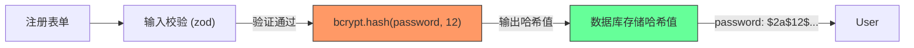
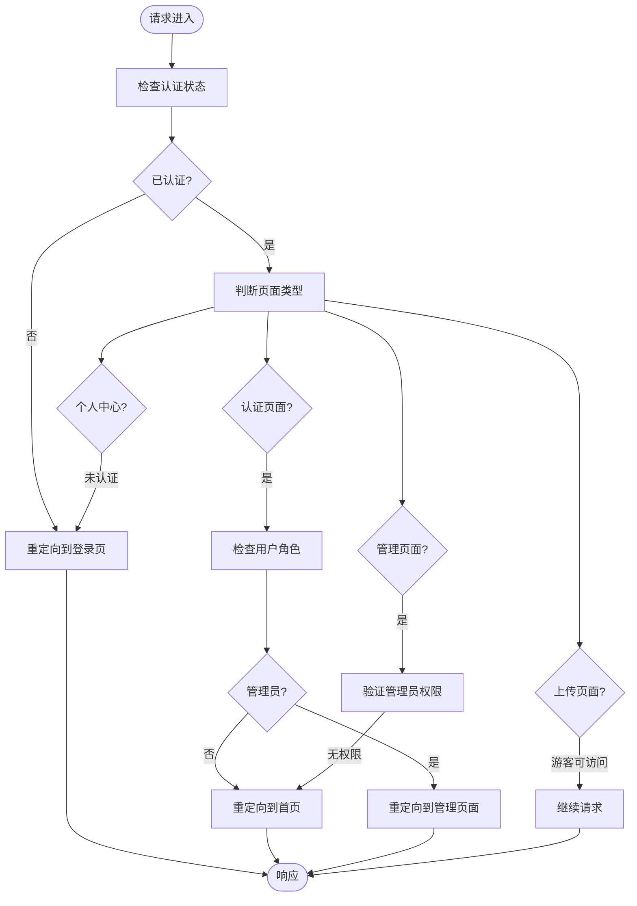

# 安全策略

<cite>
**本文档引用的文件**
- [middleware.ts](file://middleware.ts)
- [auth.ts](file://src/lib/auth.ts)
- [register/route.ts](file://src/app/api/register/route.ts)
- [auth/[...nextauth]/route.ts](file://src/app/api/auth/[...nextauth]/route.ts)
- [prisma/schema.prisma](file://prisma/schema.prisma)
- [next-auth.d.ts](file://src/types/next-auth.d.ts)
</cite>

## 目录
1. [引言](#引言)
2. [CSRF 攻击防护机制](#csrf-攻击防护机制)
3. [XSS 攻击防范措施](#xss-攻击防范措施)
4. [JWT 令牌安全配置](#jwt-令牌安全配置)
5. [密码存储安全机制](#密码存储安全机制)
6. [基于角色的访问控制（RBAC）](#基于角色的访问控制rbac)
7. [OAuth 登录安全集成](#oauth-登录安全集成)
8. [安全审计要点与漏洞修复建议](#安全审计要点与漏洞修复建议)

## 引言
本安全策略文档旨在系统性阐述数字化作品互动展示平台的身份验证与安全防护机制。项目基于 Next.js 15 和 NextAuth.js 构建，采用 JWT 会话策略，结合 Prisma ORM 与 SQLite 数据库，实现用户身份认证、权限控制和数据安全。文档详细说明了防止 CSRF 和 XSS 攻击的措施、JWT 令牌的安全配置、密码哈希处理、基于角色的访问控制以及 OAuth 第三方登录的安全集成，为系统的安全运行提供全面保障。

## CSRF 攻击防护机制

### NextAuth.js 内置 CSRF 保护
本项目使用 NextAuth.js 的 `credentials` 提供者进行身份验证，其内置了 CSRF 保护机制。当用户提交登录表单时，NextAuth.js 会自动生成并验证一次性令牌（CSRF Token），防止跨站请求伪造攻击。

### HTTPS 传输与 SameSite Cookie 策略
会话安全通过以下措施保障：
- **HTTPS 传输**：所有认证请求均通过 HTTPS 加密传输，防止中间人攻击。
- **SameSite Cookie 策略**：NextAuth.js 生成的会话 Cookie 默认设置 `SameSite=Lax`，有效防止跨站请求在非安全上下文中携带 Cookie。

```mermaid
flowchart TD
Client["用户浏览器"]
AuthPage["登录页面 /auth/signin"]
NextAuth["NextAuth.js 认证服务"]
Session["会话 Cookie"]
Client --> |访问| AuthPage
AuthPage --> |渲染表单并注入 CSRF Token| NextAuth
Client --> |提交表单 (含 CSRF Token)| NextAuth
NextAuth --> |验证 Token 并创建会话| Session
Session --> |设置 SameSite=Lax, Secure| Client
Client --> |后续请求携带 Cookie| NextAuth
NextAuth --> |验证会话| Client
style Client fill:#f9f,stroke:#333
style AuthPage fill:#bbf,stroke:#333
style NextAuth fill:#f96,stroke:#333
style Session fill:#6f9,stroke:#333
```

**Diagram sources**
- [auth.ts](file://src/lib/auth.ts#L0-L71)
- [auth/[...nextauth]/route.ts](file://src/app/api/auth/[...nextauth]/route.ts#L0-L5)

**Section sources**
- [auth.ts](file://src/lib/auth.ts#L0-L71)
- [auth/[...nextauth]/route.ts](file://src/app/api/auth/[...nextauth]/route.ts#L0-L5)

## XSS 攻击防范措施

### 用户输入校验
所有用户输入均通过 `zod` 库进行严格校验，防止恶意数据注入。

### 服务端 HTML 转义
在服务端渲染时，对用户提交的内容（如作品名称、描述等）进行 HTML 转义，避免脚本执行。

### Cookie 安全属性
会话 Cookie 设置了以下安全属性：
- **HttpOnly**: 防止 JavaScript 通过 `document.cookie` 访问 Cookie，抵御 XSS 攻击。
- **Secure**: 确保 Cookie 仅通过 HTTPS 连接传输。

**Section sources**
- [register/route.ts](file://src/app/api/register/route.ts#L0-L94)
- [auth.ts](file://src/lib/auth.ts#L0-L71)

## JWT 令牌安全配置

### 令牌过期时间
JWT 令牌采用合理的过期策略，会话有效期由 NextAuth.js 默认管理，确保令牌不会长期有效。

### 强密钥签名
使用环境变量 `NEXTAUTH_SECRET` 作为强密钥对 JWT 令牌进行签名，确保令牌的完整性和不可伪造性。

### 敏感信息保护
客户端不存储敏感信息。JWT 载荷中仅包含必要的用户标识和角色，避免泄露用户隐私。

```mermaid
classDiagram
class JWT {
+string sub : 用户ID
+string email : 邮箱
+string role : 角色
+number iat : 签发时间
+number exp : 过期时间
}
class User {
+string id
+string name
+string email
+Role role
-string password
}
class AuthOptions {
+string secret : NEXTAUTH_SECRET
+string session.strategy : "jwt"
}
JWT --> User : "包含公开信息"
AuthOptions --> JWT : "使用密钥签名"
note right of JWT
仅包含非敏感信息
不包含密码、手机号等
end note
```

**Diagram sources**
- [auth.ts](file://src/lib/auth.ts#L0-L71)
- [next-auth.d.ts](file://src/types/next-auth.d.ts#L0-L22)

**Section sources**
- [auth.ts](file://src/lib/auth.ts#L0-L71)
- [next-auth.d.ts](file://src/types/next-auth.d.ts#L0-L22)

## 密码存储安全机制

### Bcrypt 哈希处理
在用户注册时，密码使用 `bcryptjs` 库进行哈希处理，盐值因子为 12，确保密码即使数据库泄露也无法被轻易破解。

### 明文密码永不存储
系统设计确保明文密码在任何环节都不会被存储或记录。`prisma/user` 模型中的 `password` 字段存储的是哈希值。



**Diagram sources**
- [register/route.ts](file://src/app/api/register/route.ts#L0-L94)
- [prisma/schema.prisma](file://prisma/schema.prisma#L39-L65)

**Section sources**
- [register/route.ts](file://src/app/api/register/route.ts#L0-L94)
- [prisma/schema.prisma](file://prisma/schema.prisma#L39-L65)

## 基于角色的访问控制（RBAC）

### 角色定义
系统定义了两种角色：
- **USER**: 普通用户，可上传作品。
- **ADMIN**: 管理员，可审核作品、管理平台配置。

### 中间件权限控制
`middleware.ts` 文件实现了基于角色的访问控制，防止越权访问。



**Diagram sources**
- [middleware.ts](file://middleware.ts#L0-L51)

**Section sources**
- [middleware.ts](file://middleware.ts#L0-L51)
- [auth.ts](file://src/lib/auth.ts#L0-L71)

## OAuth 登录安全集成

### 第三方登录支持
项目可扩展集成 GitHub、Google 等 OAuth 提供者，为用户提供更多登录选择。

### 安全集成要点
- **客户端密钥管理**：将 `client_id` 和 `client_secret` 存储在环境变量中，避免硬编码。
- **回调 URL 验证**：严格配置 OAuth 提供者的回调 URL，防止重定向攻击。
- **作用域最小化**：仅请求必要的用户信息权限。

**Section sources**
- [auth.ts](file://src/lib/auth.ts#L0-L71)
- [auth/[...nextauth]/route.ts](file://src/app/api/auth/[...nextauth]/route.ts#L0-L5)

## 安全审计要点与漏洞修复建议

### 安全审计清单
- [ ] 确保 `NEXTAUTH_SECRET` 足够长且随机
- [ ] 定期更新依赖包，修复已知漏洞
- [ ] 数据库连接使用安全配置
- [ ] 生产环境禁用调试信息输出
- [ ] 实现日志监控与异常告警

### 常见漏洞修复
- **输入验证**：所有 API 端点均应使用 `zod` 进行输入校验。
- **错误信息脱敏**：生产环境不返回详细的错误堆栈。
- **权限最小化**：数据库账户应遵循最小权限原则。
- **定期安全扫描**：使用工具对代码进行静态分析。

**Section sources**
- [register/route.ts](file://src/app/api/register/route.ts#L0-L94)
- [platform-config/route.ts](file://src/app/api/platform-config/route.ts#L44-L113)
- [middleware.ts](file://middleware.ts#L0-L51)