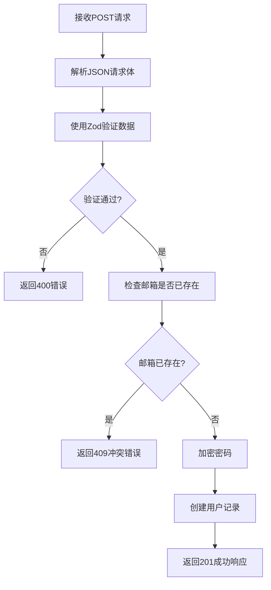
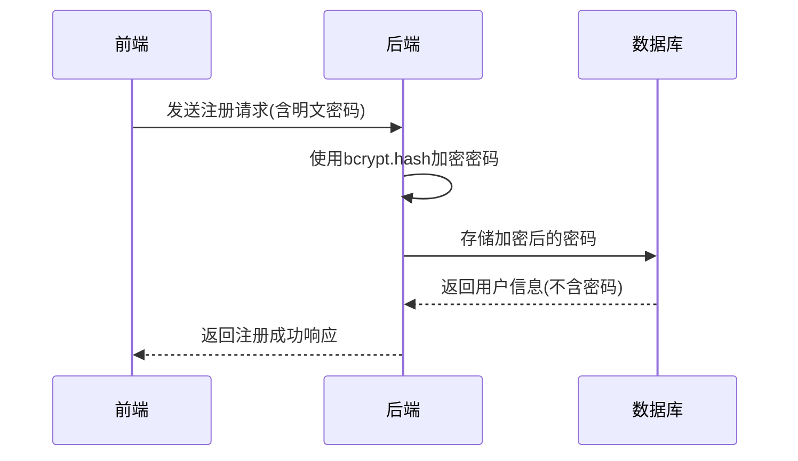
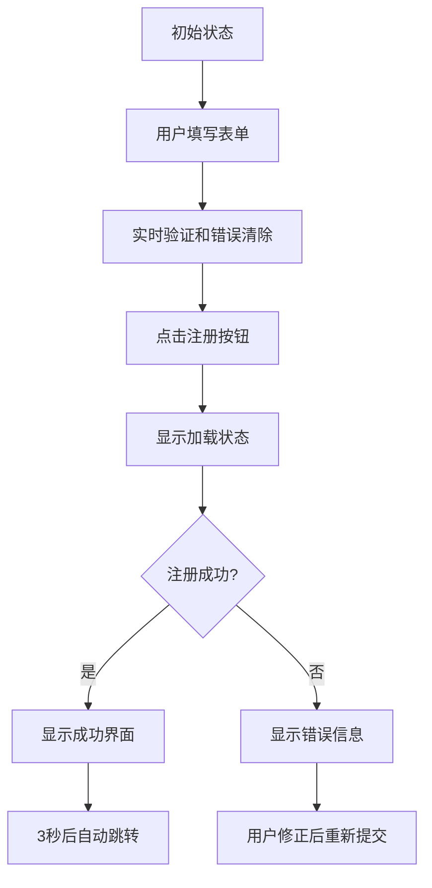
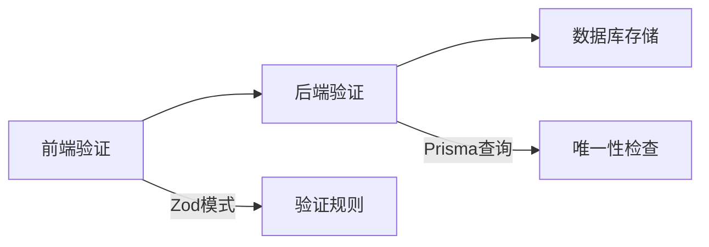
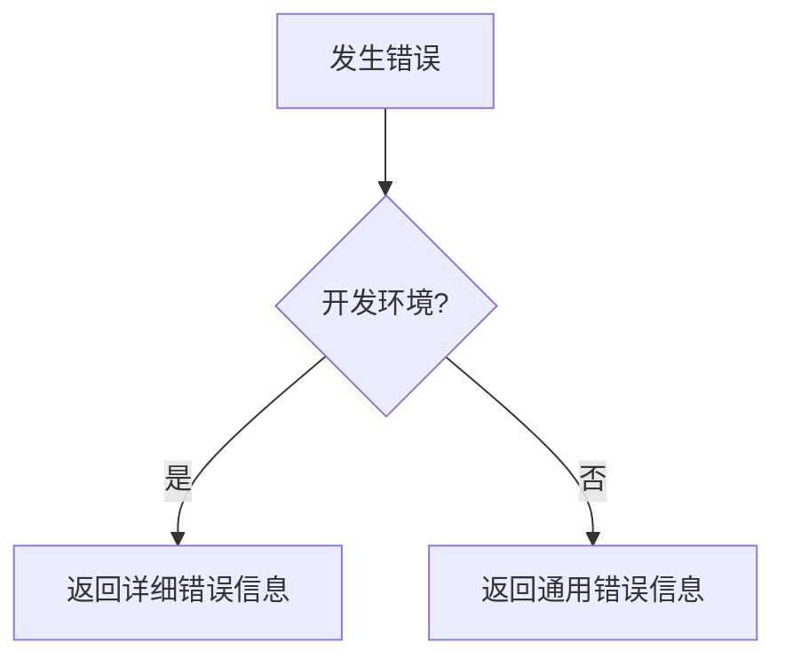

# 用户注册

<cite>
**本文档引用的文件**
- [route.ts](file://src/app/api/register/route.ts)
- [page.tsx](file://src/app/auth/register/page.tsx)
</cite>

## 目录
1. [简介](#简介)
2. [后端注册接口实现](#后端注册接口实现)
3. [前端注册页面实现](#前端注册页面实现)
4. [安全防护措施](#安全防护措施)
5. [常见问题与解决方案](#常见问题与解决方案)
6. [结论](#结论)

## 简介
本文档详细说明了数字化作品互动展示平台的用户注册功能实现。重点分析了后端API接口的处理逻辑、前端页面的交互设计、密码加密存储机制、用户唯一性校验、表单验证规则以及安全防护措施。文档结合了`/src/app/api/register/route.ts`中的后端实现和`/src/app/auth/register/page.tsx`中的前端实现，全面展示了注册功能的技术细节和用户体验设计。

## 后端注册接口实现

### 接口处理逻辑
用户注册接口位于`/src/app/api/register/route.ts`，通过POST请求处理用户注册。接口首先对请求体进行JSON解析，然后使用Zod库对输入数据进行验证。



**Diagram sources**
- [route.ts](file://src/app/api/register/route.ts#L1-L94)

**Section sources**
- [route.ts](file://src/app/api/register/route.ts#L1-L94)

### 密码加密存储机制
系统使用bcryptjs库对用户密码进行加密存储。在用户注册时，系统会使用bcrypt的hash函数对明文密码进行哈希处理，盐值因子设置为12。



**Diagram sources**
- [route.ts](file://src/app/api/register/route.ts#L30-L35)

**Section sources**
- [route.ts](file://src/app/api/register/route.ts#L30-L35)

### 用户唯一性校验
系统通过Prisma ORM检查邮箱的唯一性。在创建新用户之前，系统会查询数据库中是否已存在相同邮箱的用户记录。

```mermaid
flowchart TD
A[开始注册流程] --> B[查询邮箱是否存在]
B --> C{邮箱存在?}
C --> |是| D[返回"该邮箱已被注册"]
C --> |否| E[继续注册流程]
```

**Diagram sources**
- [route.ts](file://src/app/api/register/route.ts#L20-L25)

**Section sources**
- [route.ts](file://src/app/api/register/route.ts#L20-L25)

### 注册成功响应格式
当注册成功时，接口返回201状态码和包含用户信息的JSON响应。响应数据包括用户ID、姓名、邮箱、角色和创建时间。

```json
{
  "success": true,
  "data": {
    "id": "string",
    "name": "string",
    "email": "string",
    "role": "USER",
    "createdAt": "string"
  },
  "message": "注册成功，请登录"
}
```

**Section sources**
- [route.ts](file://src/app/api/register/route.ts#L37-L45)

## 前端注册页面实现

### 表单验证规则
前端页面`/src/app/auth/register/page.tsx`实现了客户端表单验证，确保用户在提交前输入符合要求的数据。验证规则包括：

- 姓名：不能为空，长度不超过50个字符
- 邮箱：必须为有效邮箱格式
- 密码：至少6位，不超过100个字符
- 确认密码：必须与密码一致

```mermaid
flowchart TD
A[用户输入数据] --> B{字段是否为空?}
B --> |是| C[显示"请输入[字段名]"]
B --> |否| D{符合格式要求?}
D --> |否| E[显示具体格式错误]
D --> |是| F[清除该字段错误]
F --> G[继续其他字段验证]
```

**Diagram sources**
- [page.tsx](file://src/app/auth/register/page.tsx#L80-L126)

**Section sources**
- [page.tsx](file://src/app/auth/register/page.tsx#L80-L126)

### 错误处理机制
系统实现了完善的错误处理机制，能够根据后端返回的不同错误类型显示相应的错误信息。

```mermaid
flowchart TD
A[提交表单] --> B[调用注册API]
B --> C{API调用成功?}
C --> |否| D[显示"网络错误"]
C --> |是| E{注册成功?}
E --> |否| F{是否有字段验证错误?}
F --> |是| G[在对应字段显示错误]
F --> |否| H[显示通用错误信息]
E --> |是| I[显示注册成功界面]
```

**Diagram sources**
- [page.tsx](file://src/app/auth/register/page.tsx#L121-L159)

**Section sources**
- [page.tsx](file://src/app/auth/register/page.tsx#L121-L159)

### 用户体验设计
注册页面采用了现代化的用户体验设计，包括：

- 实时验证：用户在输入时即时清除对应字段的错误提示
- 加载状态：提交时显示加载动画，防止重复提交
- 成功反馈：注册成功后显示成功图标和跳转提示
- 友好界面：清晰的布局和直观的交互设计



**Diagram sources**
- [page.tsx](file://src/app/auth/register/page.tsx#L158-L278)

**Section sources**
- [page.tsx](file://src/app/auth/register/page.tsx#L158-L278)

## 安全防护措施

### 输入验证与清理
系统在前后端都实现了严格的输入验证，防止恶意数据注入。



**Section sources**
- [route.ts](file://src/app/api/register/route.ts#L10-L15)
- [page.tsx](file://src/app/auth/register/page.tsx#L80-L126)

### 错误处理安全
系统对错误信息进行了适当的处理，避免在生产环境中泄露敏感信息。



**Section sources**
- [route.ts](file://src/app/api/register/route.ts#L80-L94)

## 常见问题与解决方案

### 重复注册问题
当用户尝试使用已注册的邮箱进行注册时，系统会返回明确的错误提示。

**问题原因**：邮箱已被其他用户注册
**解决方案**：
1. 提示用户"该邮箱已被注册"
2. 提供登录链接引导用户登录
3. 建议用户使用其他邮箱或找回密码

**Section sources**
- [route.ts](file://src/app/api/register/route.ts#L20-L25)

### 验证码相关问题
虽然当前实现中未包含验证码功能，但可以考虑添加以防止自动化注册。

**潜在问题**：机器人自动化注册
**解决方案**：
1. 添加图形验证码
2. 实现邮箱验证流程
3. 添加速率限制

## 结论
用户注册功能通过前后端协同工作，实现了安全、可靠和用户友好的注册流程。后端通过bcrypt加密存储密码，使用Prisma进行数据验证和存储，前端提供了实时验证和友好的用户体验。系统具备完善的错误处理机制和安全防护措施，能够有效防止常见安全风险。未来可以考虑添加邮箱验证和验证码功能，进一步提升账户安全性和防止自动化注册。