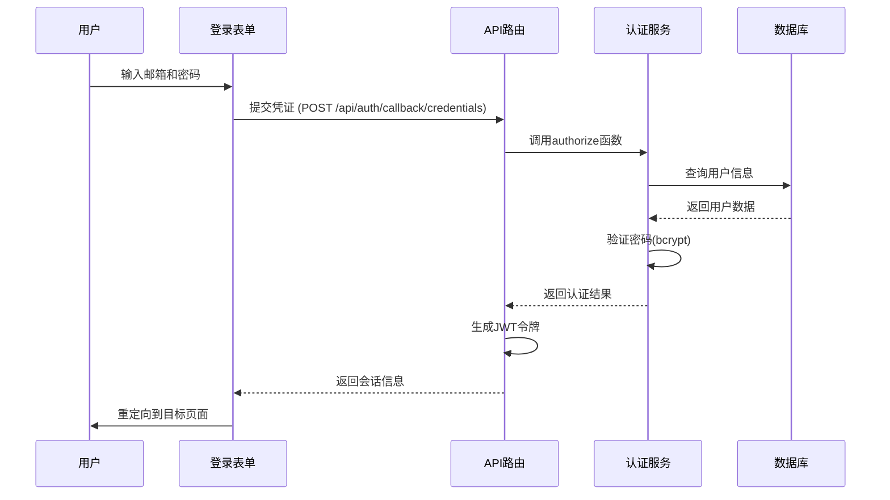
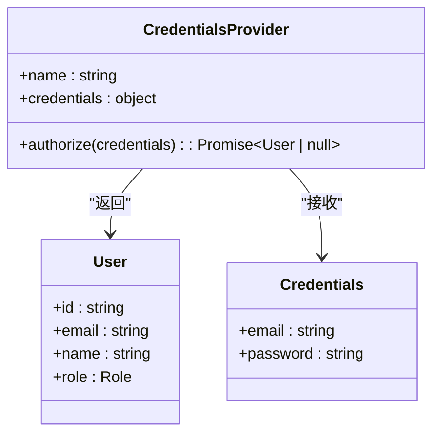
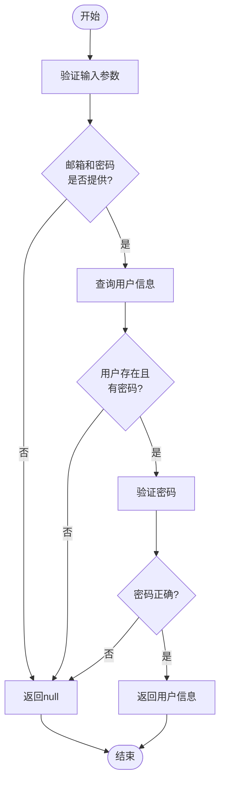
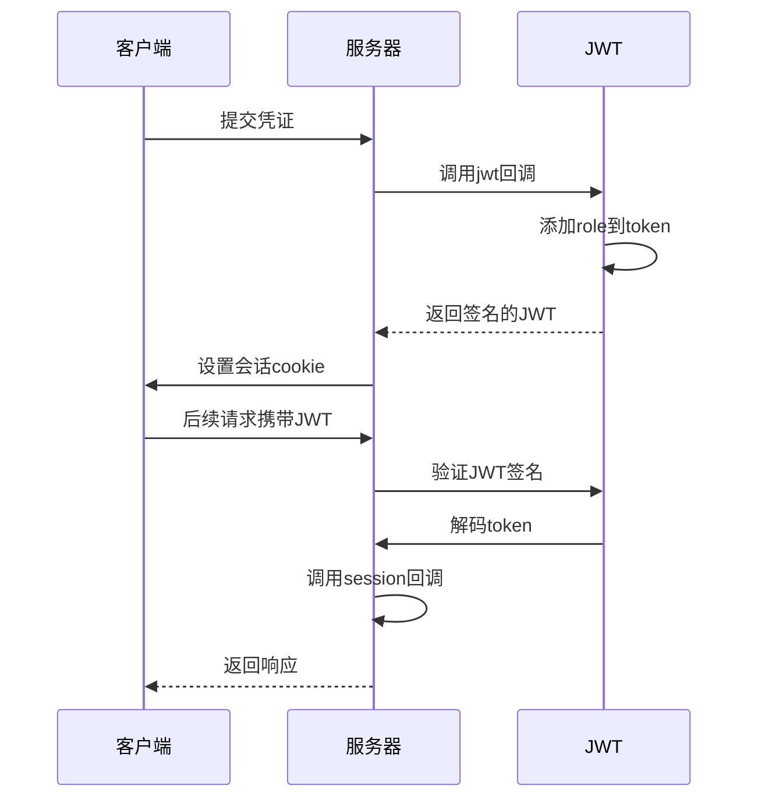
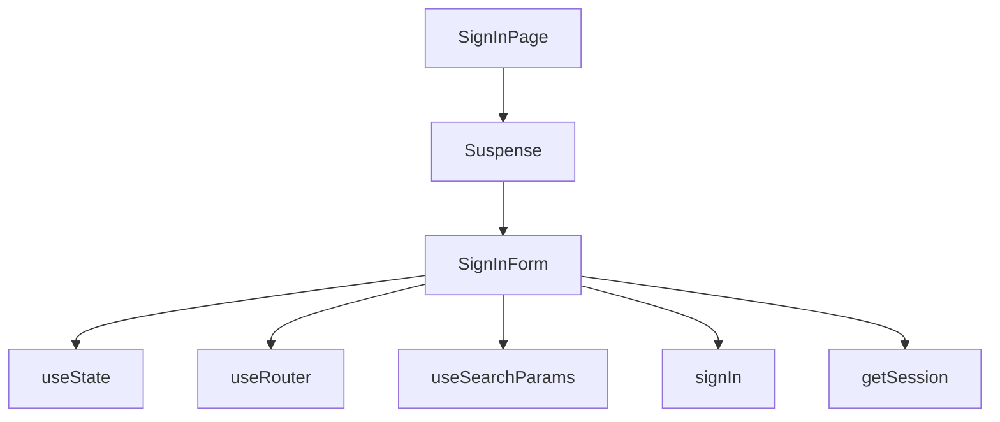
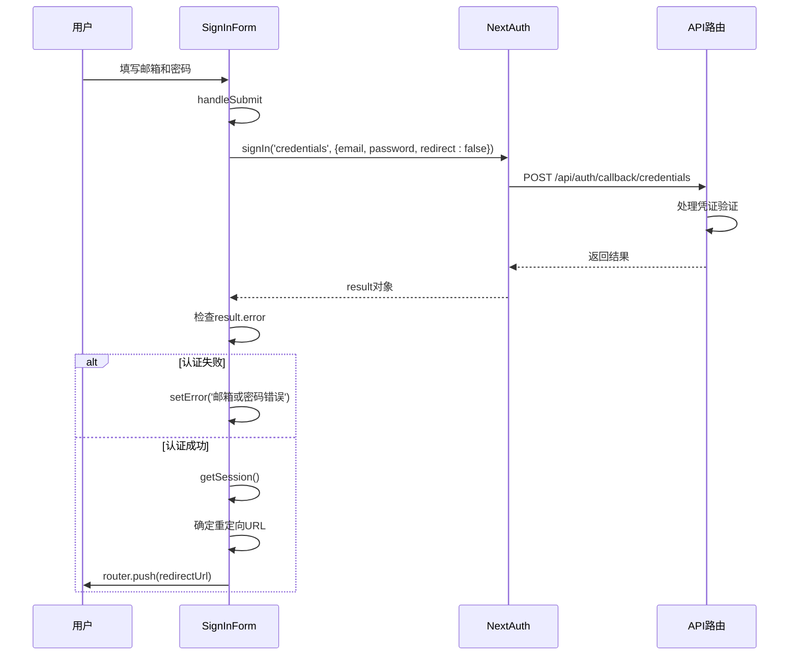
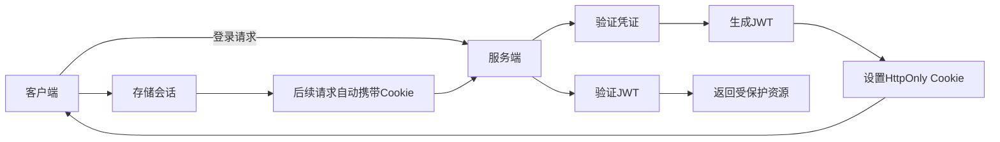
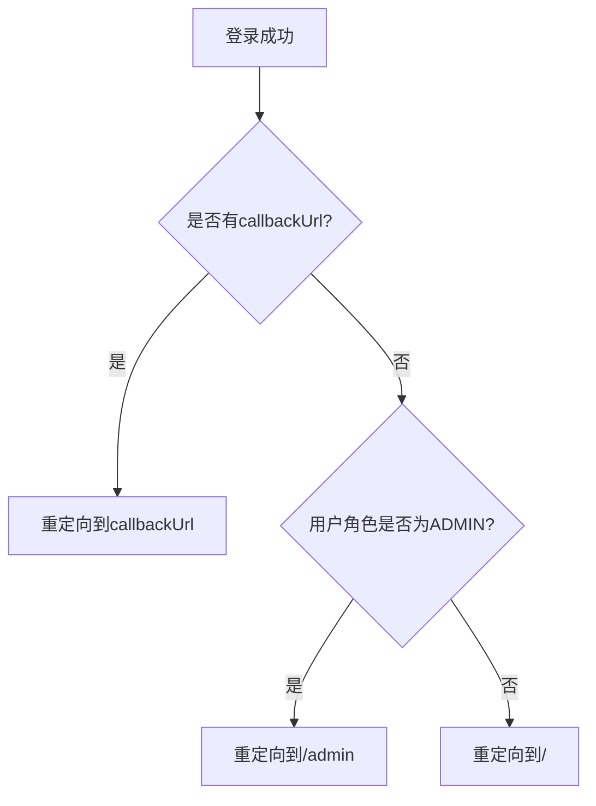
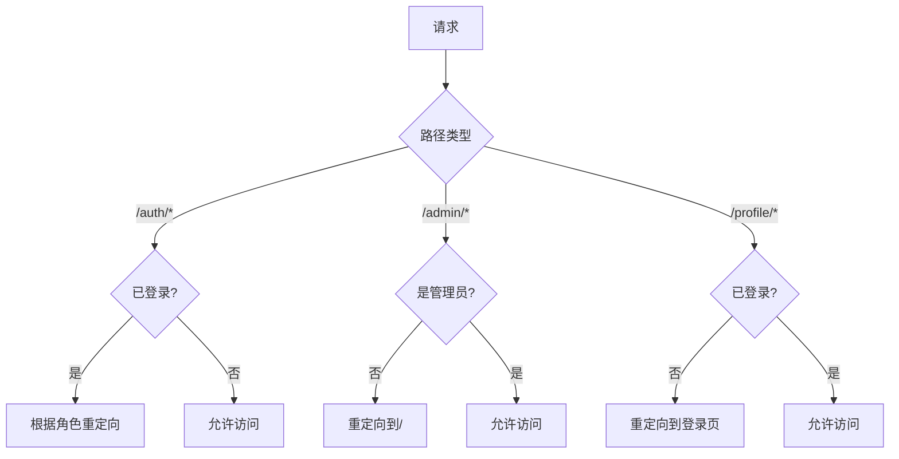

# 用户登录

<cite>
**本文档引用的文件**
- [auth.ts](file://src/lib/auth.ts)
- [signin/page.tsx](file://src/app/auth/signin/page.tsx)
- [route.ts](file://src/app/api/auth/[...nextauth]/route.ts)
- [next-auth.d.ts](file://src/types/next-auth.d.ts)
- [middleware.ts](file://middleware.ts)
</cite>

## 目录
1. [用户登录流程概述](#用户登录流程概述)
2. [认证配置详解](#认证配置详解)
3. [登录表单与API交互流程](#登录表单与api交互流程)
4. [会话状态同步机制](#会话状态同步机制)
5. [重定向逻辑分析](#重定向逻辑分析)
6. [安全设置](#安全设置)
7. [登录失败排查](#登录失败排查)

## 用户登录流程概述

用户登录流程基于NextAuth.js的Credentials Provider认证机制实现，采用JWT会话策略。整个流程包括前端登录表单提交、后端凭证验证、JWT令牌生成与加密、会话状态维护以及安全的重定向控制。



**Diagram sources**
- [auth.ts](file://src/lib/auth.ts#L7-L71)
- [signin/page.tsx](file://src/app/auth/signin/page.tsx#L10-L140)
- [route.ts](file://src/app/api/auth/[...nextauth]/route.ts#L1-L6)

**Section sources**
- [auth.ts](file://src/lib/auth.ts#L7-L71)
- [signin/page.tsx](file://src/app/auth/signin/page.tsx#L10-L140)

## 认证配置详解

`src/lib/auth.ts`中的`authOptions`对象定义了完整的认证配置，采用Prisma适配器与数据库交互，并使用Credentials Provider进行凭证验证。

### Credentials Provider配置



**Diagram sources**
- [auth.ts](file://src/lib/auth.ts#L16-L44)

**Section sources**
- [auth.ts](file://src/lib/auth.ts#L7-L71)

### authorize函数验证逻辑

`authorize`函数负责验证用户凭证，其执行流程如下：

1. 检查邮箱和密码是否提供
2. 通过Prisma查询用户信息
3. 验证用户是否存在且有密码
4. 使用bcrypt比较密码哈希值
5. 返回用户信息对象（包含id、email、name、role）



**Diagram sources**
- [auth.ts](file://src/lib/auth.ts#L16-L44)

**Section sources**
- [auth.ts](file://src/lib/auth.ts#L16-L44)

### JWT令牌签发与加密

系统采用JWT会话策略，通过回调函数在令牌中添加角色信息：



**Diagram sources**
- [auth.ts](file://src/lib/auth.ts#L51-L56)
- [next-auth.d.ts](file://src/types/next-auth.d.ts#L18-L22)

**Section sources**
- [auth.ts](file://src/lib/auth.ts#L51-L56)
- [next-auth.d.ts](file://src/types/next-auth.d.ts#L18-L22)

## 登录表单与API交互流程

登录流程涉及前端组件与API路由的协同工作，确保安全的认证交互。

### 组件结构



**Diagram sources**
- [signin/page.tsx](file://src/app/auth/signin/page.tsx#L143-L153)

**Section sources**
- [signin/page.tsx](file://src/app/auth/signin/page.tsx#L10-L140)

### 交互流程



**Diagram sources**
- [signin/page.tsx](file://src/app/auth/signin/page.tsx#L30-L74)
- [route.ts](file://src/app/api/auth/[...nextauth]/route.ts#L1-L6)

**Section sources**
- [signin/page.tsx](file://src/app/auth/signin/page.tsx#L30-L74)

## 会话状态同步机制

系统通过JWT和cookie机制在客户端和服务端同步会话状态。

### 会话数据结构

```typescript
interface Session {
  user: {
    id: string;
    email: string;
    name?: string | null;
    role: Role;
  };
  expires: string;
}
```

### 同步流程



**Diagram sources**
- [auth.ts](file://src/lib/auth.ts#L57-L63)
- [next-auth.d.ts](file://src/types/next-auth.d.ts#L4-L11)

**Section sources**
- [auth.ts](file://src/lib/auth.ts#L57-L63)
- [next-auth.d.ts](file://src/types/next-auth.d.ts#L4-L11)

## 重定向逻辑分析

系统实现了智能的重定向逻辑，根据用户角色和原始请求目标进行适当的页面跳转。

### 重定向规则



### 代码实现

```typescript
let redirectUrl = callbackUrl;
if (callbackUrl === '/' && session?.user?.role === 'ADMIN') {
  redirectUrl = '/admin';
}
router.push(redirectUrl);
```

**Section sources**
- [signin/page.tsx](file://src/app/auth/signin/page.tsx#L39-L44)

## 安全设置

系统采用了多项安全措施来保护用户认证过程。

### Cookie安全设置

- **HttpOnly**: 防止XSS攻击读取cookie
- **Secure**: 仅通过HTTPS传输
- **SameSite**: 防止CSRF攻击
- **加密**: JWT使用NEXTAUTH_SECRET签名

### 中间件保护



**Diagram sources**
- [middleware.ts](file://middleware.ts#L1-L50)

**Section sources**
- [middleware.ts](file://middleware.ts#L1-L50)

## 登录失败排查

以下是常见登录失败原因及排查方法：

### 常见错误原因

| 错误类型 | 可能原因 | 解决方案 |
|---------|--------|--------|
| 邮箱或密码错误 | 凭证不匹配 | 检查邮箱和密码是否正确 |
| 账户不存在 | 邮箱未注册 | 引导用户注册新账户 |
| 密码错误 | 密码输入错误 | 提示用户重置密码 |
| 系统错误 | 服务器内部问题 | 检查服务状态和日志 |

### 错误处理流程

```mermaid
flowchart TD
A[登录失败] --> B{result.error存在?}
B --> |是| C[显示"邮箱或密码错误"]
B --> |否| D[捕获异常]
D --> E[显示"登录失败，请稍后重试"]
C --> F[清空密码字段]
E --> F
F --> G[启用提交按钮]
```

**Section sources**
- [signin/page.tsx](file://src/app/auth/signin/page.tsx#L50-L60)