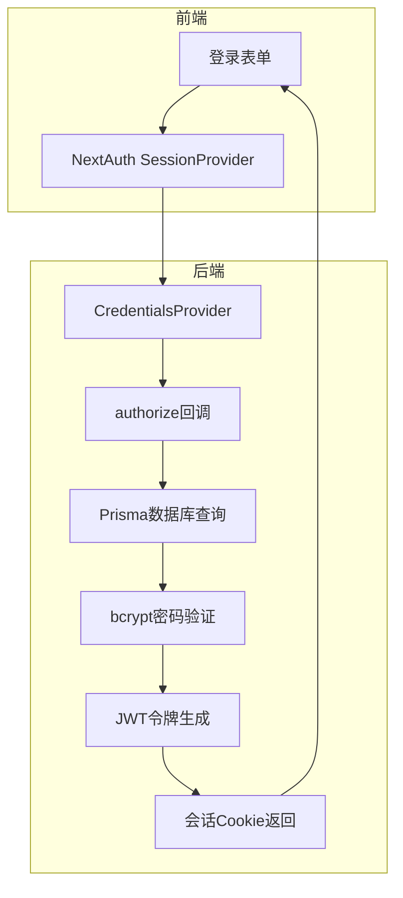
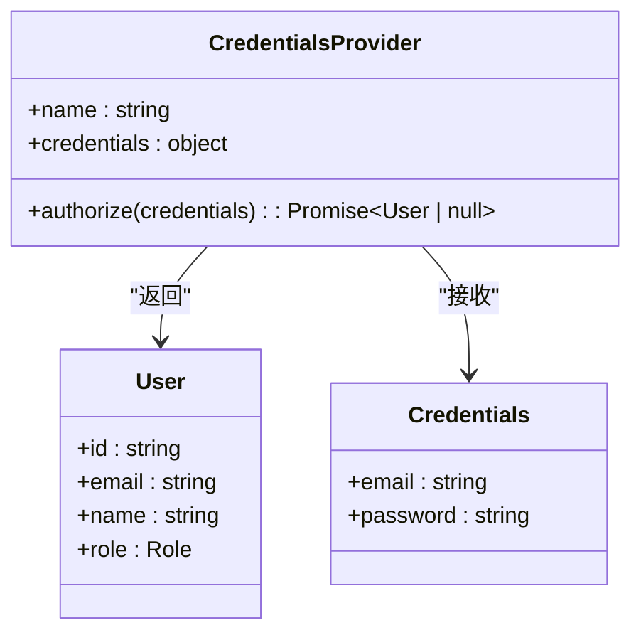
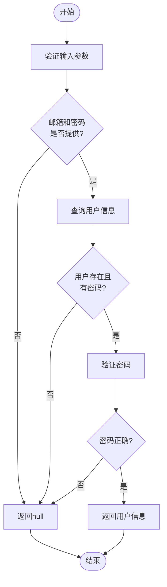
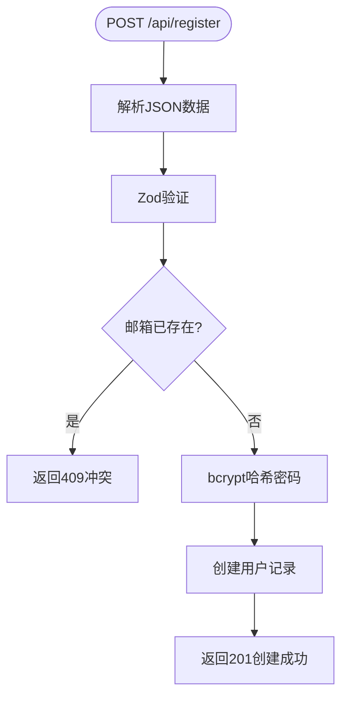
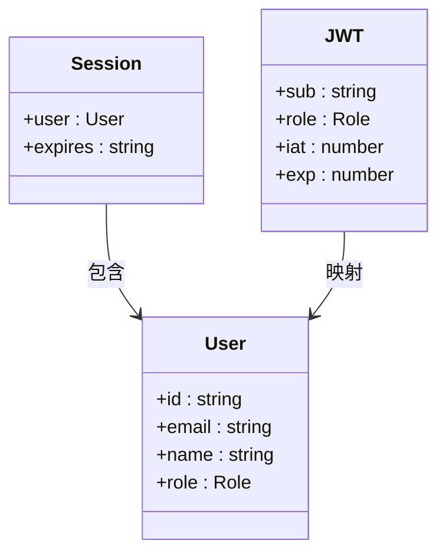
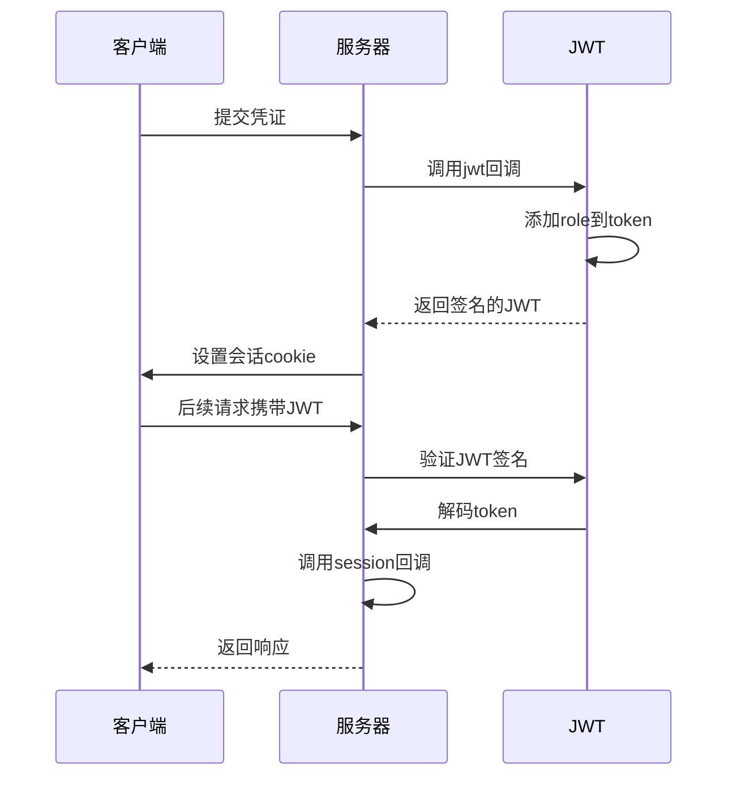
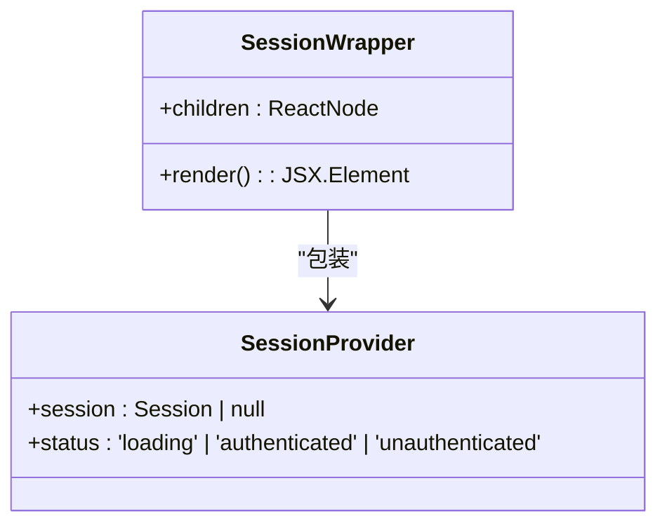

# 认证流程

<cite>
**本文档引用的文件**  
- [auth.ts](file://src/lib/auth.ts)
- [auth-utils.ts](file://src/lib/auth-utils.ts)
- [next-auth.d.ts](file://src/types/next-auth.d.ts)
- [route.ts](file://src/app/api/register/route.ts)
- [SessionWrapper.tsx](file://src/components/SessionWrapper.tsx)
</cite>

## 目录
1. [简介](#简介)
2. [认证机制总体架构](#认证机制总体架构)
3. [凭证提供者与登录流程](#凭证提供者与登录流程)
4. [用户注册流程](#用户注册流程)
5. [JWT令牌生成与会话管理](#jwt令牌生成与会话管理)
6. [前后端交互流程](#前后端交互流程)
7. [常见问题与调试建议](#常见问题与调试建议)
8. [总结](#总结)

## 简介
本项目采用NextAuth.js实现完整的用户认证系统，支持基于邮箱和密码的凭证登录及用户注册功能。系统通过JWT（JSON Web Token）进行会话管理，结合Prisma适配器与数据库交互，确保用户身份的安全验证与持久化。本文档深入解析认证流程的核心实现，涵盖登录、注册、令牌签发及权限管理等关键环节。

## 认证机制总体架构

系统采用NextAuth.js作为认证框架，结合Prisma ORM与数据库进行用户信息存储与查询。认证流程主要由以下组件构成：

**图示来源**  
- [auth.ts](file://src/lib/auth.ts#L7-L71)
- [SessionWrapper.tsx](file://src/components/SessionWrapper.tsx#L9-L15)

**本节来源**  
- [auth.ts](file://src/lib/auth.ts#L7-L71)

## 凭证提供者与登录流程

### CredentialsProvider配置
系统配置了`CredentialsProvider`用于处理邮箱和密码登录。该提供者定义了输入字段（邮箱、密码）并实现`authorize`回调函数进行身份验证。

**图示来源**  
- [auth.ts](file://src/lib/auth.ts#L16-L44)

**本节来源**  
- [auth.ts](file://src/lib/auth.ts#L7-L71)

### authorize函数验证逻辑
`authorize`函数执行以下步骤验证用户身份：

1. 检查邮箱和密码是否提供
2. 使用Prisma查询用户记录
3. 验证用户是否存在且已设置密码
4. 使用bcrypt比较密码哈希值
5. 成功则返回用户信息（含ID、邮箱、姓名、角色），否则返回null

**图示来源**  
- [auth.ts](file://src/lib/auth.ts#L16-L44)

**本节来源**  
- [auth.ts](file://src/lib/auth.ts#L16-L44)

## 用户注册流程

### 注册接口实现
`/api/register`路由处理用户注册请求，位于`src/app/api/register/route.ts`。流程如下：

1. 使用Zod验证输入数据（姓名、邮箱、密码、确认密码）
2. 检查邮箱是否已存在
3. 使用bcrypt对密码进行哈希加密（盐值12）
4. 创建用户记录，默认角色为`USER`
5. 返回成功响应并提示登录

**本节来源**  
- [route.ts](file://src/app/api/register/route.ts#L1-L95)

## JWT令牌生成与会话管理

### JWT与会话扩展
系统采用JWT会话策略，通过回调函数扩展令牌和会话对象：

- `jwt`回调：在用户登录时将`role`写入JWT令牌
- `session`回调：在每次请求时将令牌中的`role`映射到`session.user.role`

**图示来源**  
- [auth.ts](file://src/lib/auth.ts#L50-L60)
- [next-auth.d.ts](file://src/types/next-auth.d.ts#L5-L20)

**本节来源**  
- [auth.ts](file://src/lib/auth.ts#L50-L65)
- [next-auth.d.ts](file://src/types/next-auth.d.ts)

### JWT令牌签发与加密
认证成功后，NextAuth使用`NEXTAUTH_SECRET`签名生成JWT令牌，包含以下载荷：

- `sub`: 用户ID
- `role`: 用户角色（ADMIN/USER）
- `iat`: 签发时间
- `exp`: 过期时间（默认30天）

**图示来源**  
- [auth.ts](file://src/lib/auth.ts#L51-L56)
- [next-auth.d.ts](file://src/types/next-auth.d.ts#L18-L22)

**本节来源**  
- [auth.ts](file://src/lib/auth.ts#L51-L56)
- [next-auth.d.ts](file://src/types/next-auth.d.ts#L18-L22)

## 前后端交互流程

### 前端认证上下文管理
`SessionWrapper`组件封装`SessionProvider`，为整个应用提供认证上下文。

**图示来源**  
- [SessionWrapper.tsx](file://src/components/SessionWrapper.tsx#L9-L15)

**本节来源**  
- [SessionWrapper.tsx](file://src/components/SessionWrapper.tsx#L1-L15)

### 交互示例
1. 用户在`/auth/signin`页面提交邮箱密码
2. 前端调用NextAuth signIn方法
3. 后端验证通过后返回JWT会话Cookie
4. 前端后续请求自动携带Cookie
5. 服务端通过`getServerSession(authOptions)`获取会话

## 常见问题与调试建议

### 常见错误及排查
| 错误现象 | 可能原因 | 解决方案 |
|--------|--------|--------|
| 密码错误 | bcrypt比较失败 | 检查密码哈希是否正确存储 |
| 邮箱已存在 | Prisma P2002错误 | 检查唯一约束及注册逻辑 |
| 令牌生成失败 | NEXTAUTH_SECRET未设置 | 确保环境变量正确配置 |
| 会话为空 | JWT验证失败 | 检查密钥一致性及过期时间 |

### 调试建议
- 启用开发模式以查看详细错误信息
- 检查`NEXTAUTH_SECRET`是否在`.env`中正确设置
- 使用`console.log`输出`authorize`函数中的用户查询结果
- 验证Prisma数据库中用户密码字段是否为哈希值
- 确保`next-auth.d.ts`类型扩展正确声明`role`字段

## 总结
本项目的认证系统基于NextAuth.js构建，实现了安全可靠的邮箱密码登录与注册功能。通过JWT令牌和会话回调机制，系统能够有效管理用户身份与权限。密码使用bcrypt加密存储，结合Zod数据验证和Prisma数据库操作，确保了数据完整性与安全性。开发者可基于`auth-utils.ts`中的`requireAuth`和`requireAdmin`工具函数快速实现权限控制。