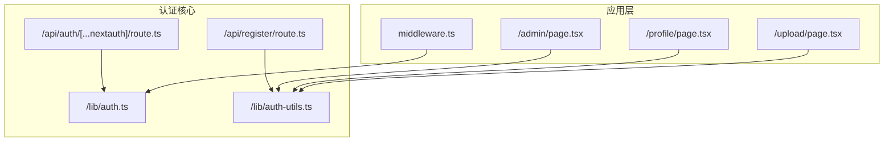
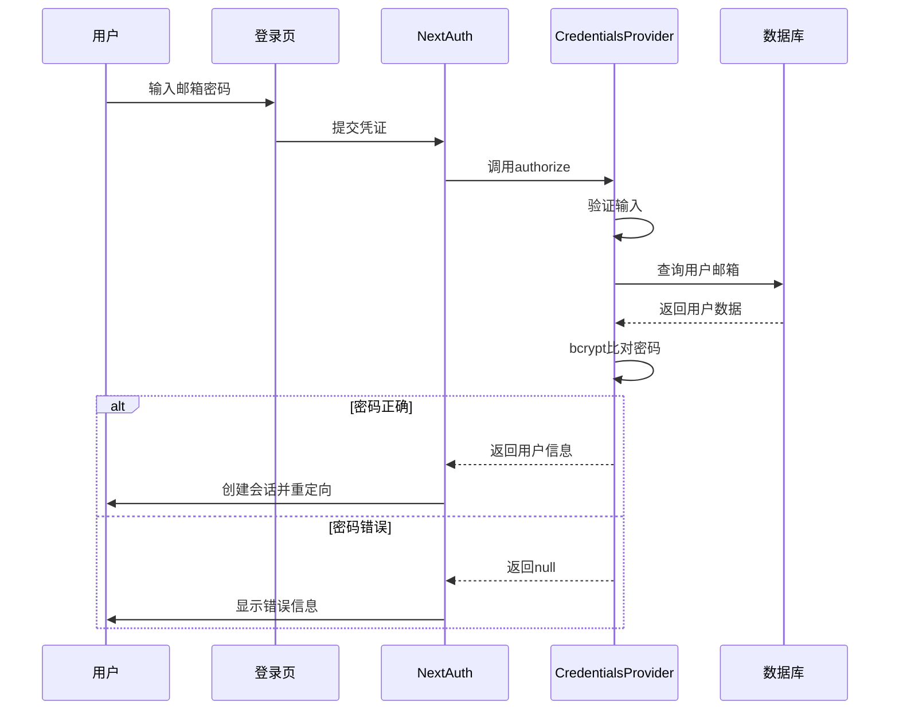
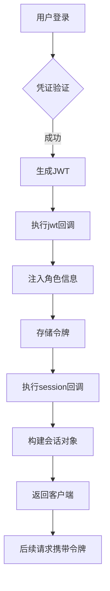
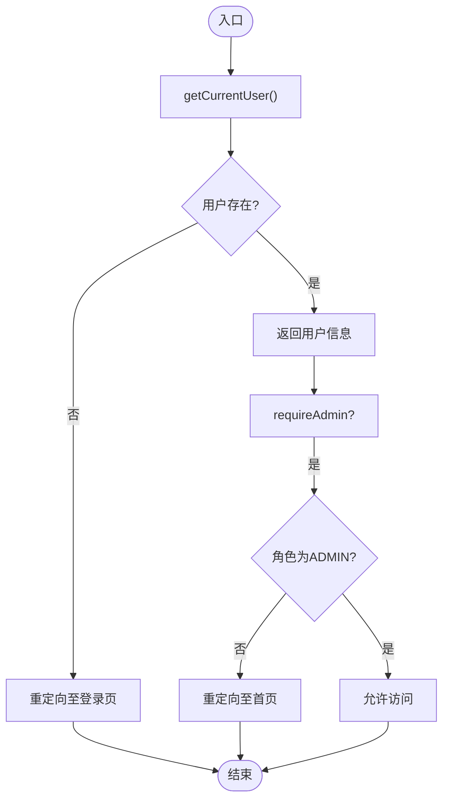
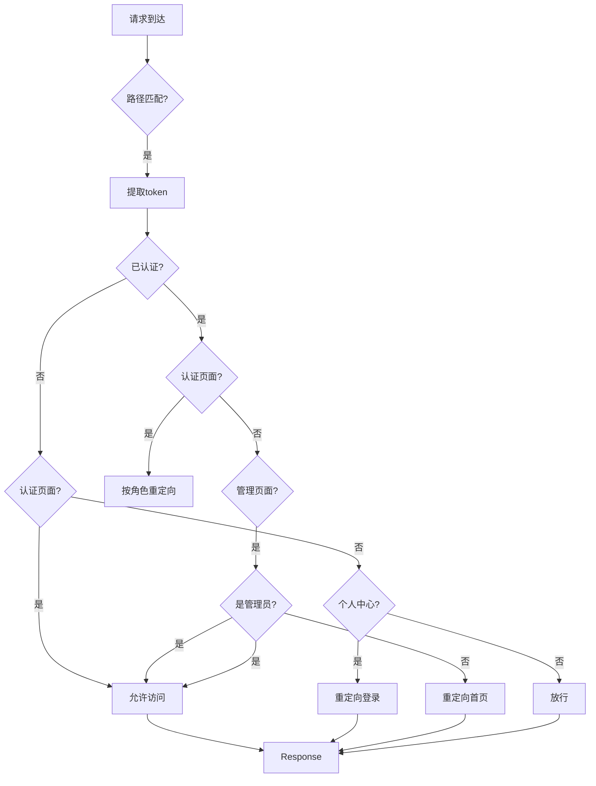

# 认证系统

<cite>
**本文档引用文件**  
- [auth.ts](file://src/lib/auth.ts)
- [auth-utils.ts](file://src/lib/auth-utils.ts)
- [middleware.ts](file://middleware.ts)
- [route.ts](file://src/app/api/auth/[...nextauth]/route.ts)
- [register/route.ts](file://src/app/api/register/route.ts)
</cite>

## 目录
1. [项目结构](#项目结构)
2. [核心组件](#核心组件)
3. [认证流程详解](#认证流程详解)
4. [JWT令牌机制](#jwt令牌机制)
5. [权限保护机制](#权限保护机制)
6. [中间件会话注入](#中间件会话注入)
7. [用户注册流程](#用户注册流程)
8. [安全最佳实践](#安全最佳实践)
9. [常见问题排查](#常见问题排查)

## 项目结构

本项目采用Next.js App Router架构，认证相关功能集中分布在特定路径下。主要认证模块位于`src/app/api/auth/[...nextauth]`路径，用户注册接口位于`src/app/api/register`，全局中间件配置在项目根目录的`middleware.ts`中。认证逻辑封装在`src/lib`目录下的`auth.ts`和`auth-utils.ts`工具文件中。

**图示来源**  
- [auth.ts](file://src/lib/auth.ts)
- [auth-utils.ts](file://src/lib/auth-utils.ts)
- [middleware.ts](file://middleware.ts)
- [route.ts](file://src/app/api/auth/[...nextauth]/route.ts)

**本节来源**  
- [src/app/api/auth/[...nextauth]/route.ts](file://src/app/api/auth/[...nextauth]/route.ts)
- [middleware.ts](file://middleware.ts)
- [src/lib/auth.ts](file://src/lib/auth.ts)

## 核心组件

项目认证系统由多个核心组件构成：基于NextAuth.js的认证配置、凭证提供者、JWT会话策略、Prisma适配器、密码加密工具及权限检查高阶函数。这些组件协同工作，实现安全可靠的用户身份验证与授权机制。

**本节来源**  
- [auth.ts](file://src/lib/auth.ts#L7-L71)
- [auth-utils.ts](file://src/lib/auth-utils.ts#L4-L23)

## 认证流程详解

系统采用凭证认证方式，用户通过邮箱和密码登录。认证流程始于`/api/auth/signin`页面，提交凭证后由NextAuth.js处理。`auth.ts`中配置的`CredentialsProvider`定义了认证逻辑：首先验证输入完整性，然后通过Prisma查询用户，最后使用bcrypt验证密码哈希。认证成功后返回用户基本信息用于会话创建。

**图示来源**  
- [auth.ts](file://src/lib/auth.ts#L15-L45)

**本节来源**  
- [auth.ts](file://src/lib/auth.ts#L15-L45)

## JWT令牌机制

系统采用JWT（JSON Web Token）作为会话管理策略。在`authOptions`中设置`session.strategy = 'jwt'`，使得NextAuth.js使用JWT存储会话信息。认证成功后，`jwt`回调函数将用户角色注入令牌；`session`回调函数则从令牌中提取信息并注入会话对象，确保前端可访问用户ID和角色。

**图示来源**  
- [auth.ts](file://src/lib/auth.ts#L50-L60)

**本节来源**  
- [auth.ts](file://src/lib/auth.ts#L50-L60)

## 权限保护机制

`auth-utils.ts`文件提供了`requireAuth`和`requireAdmin`两个高阶函数用于保护路由。`requireAuth`检查当前会话是否存在，若无会话则重定向至登录页；`requireAdmin`在此基础上额外验证用户角色，非管理员用户将被重定向至首页。这些函数可在服务器组件或API路由中调用，实现细粒度访问控制。

**图示来源**  
- [auth-utils.ts](file://src/lib/auth-utils.ts#L9-L23)

**本节来源**  
- [auth-utils.ts](file://src/lib/auth-utils.ts#L9-L23)

## 中间件会话注入

`middleware.ts`文件配置了全局中间件，使用`withAuth`包装函数实现会话注入。中间件拦截指定路径的请求，从`req.nextauth.token`获取JWT解码后的令牌信息。根据用户认证状态和角色，实现智能重定向：已登录用户访问登录页时按角色分流，管理员访问管理页面获得授权，未登录用户访问个人中心被引导至登录页。

**图示来源**  
- [middleware.ts](file://middleware.ts#L1-L50)

**本节来源**  
- [middleware.ts](file://middleware.ts#L1-L50)

## 用户注册流程

用户注册通过`/api/register/route.ts`接口处理。流程包括：接收注册数据、验证邮箱唯一性、使用bcrypt生成密码哈希、创建用户记录并建立会话。密码加密使用bcryptjs库，确保即使数据库泄露也无法反向推导原始密码。注册成功后，系统自动创建认证会话，实现注册即登录的用户体验。

**本节来源**  
- [register/route.ts](file://src/app/api/register/route.ts)

## 安全最佳实践

系统实施多项安全措施：使用bcrypt进行密码哈希，防止明文存储；JWT设置合理过期时间，降低令牌泄露风险；通过中间件防止CSRF攻击，所有敏感操作均需有效会话；前端输出转义防止XSS攻击；环境变量存储`NEXTAUTH_SECRET`确保密钥安全。未来可扩展OAuth提供商如GitHub、Google，通过添加相应provider配置即可实现第三方登录。

**本节来源**  
- [auth.ts](file://src/lib/auth.ts)
- [middleware.ts](file://middleware.ts)

## 常见问题排查

**登录失败**：检查邮箱是否存在、密码是否正确、数据库连接是否正常。  
**会话失效**：确认`NEXTAUTH_SECRET`环境变量一致，检查JWT过期时间设置。  
**重定向循环**：验证中间件匹配路径配置，确保认证页面重定向逻辑正确。  
**角色权限错误**：检查数据库用户角色字段值，确认`session`回调函数正确注入角色信息。  
**注册邮箱重复**：确保数据库邮箱字段有唯一约束，注册逻辑包含重复检查。

**本节来源**  
- [auth.ts](file://src/lib/auth.ts)
- [middleware.ts](file://middleware.ts)
- [auth-utils.ts](file://src/lib/auth-utils.ts)
- [register/route.ts](file://src/app/api/register/route.ts)