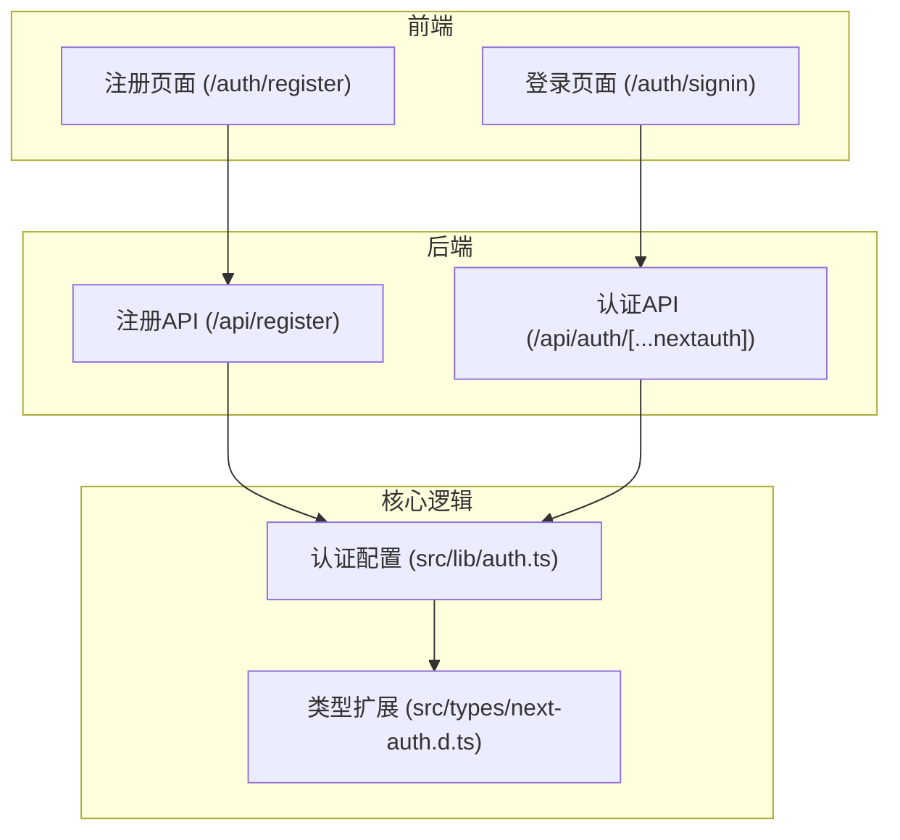
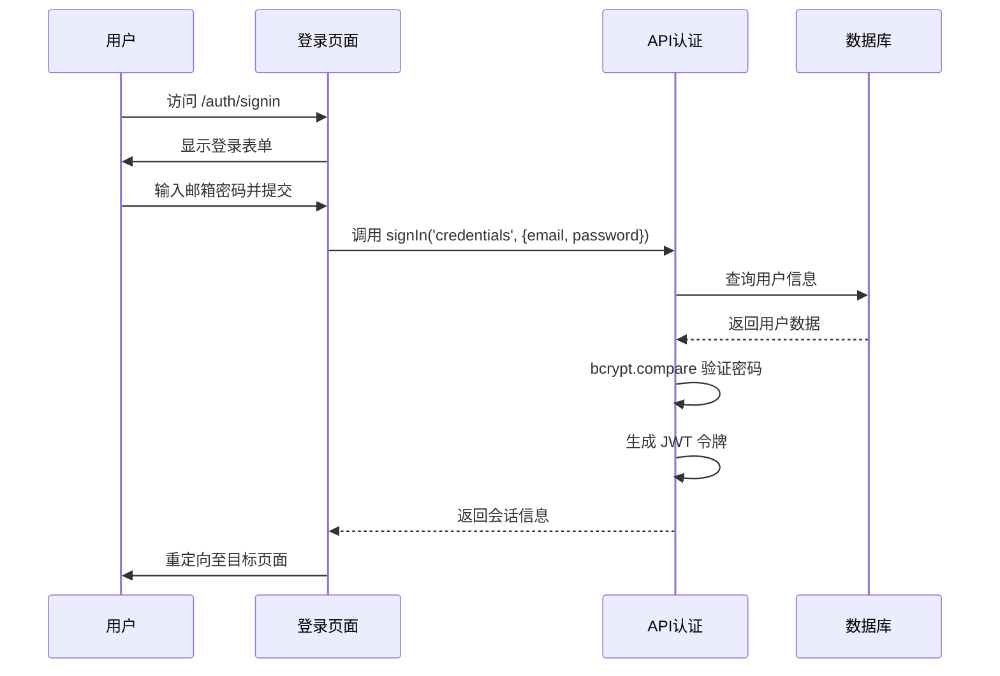
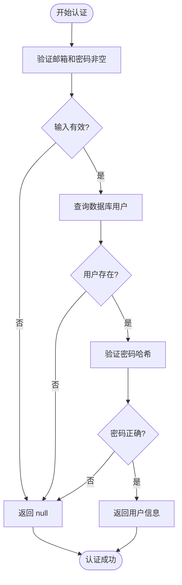
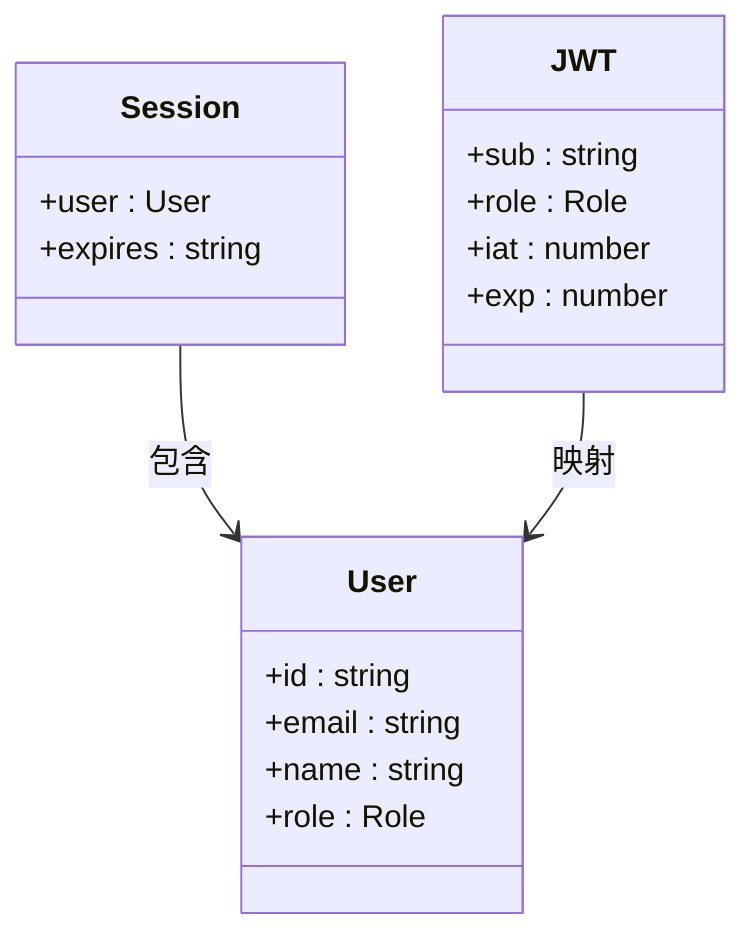
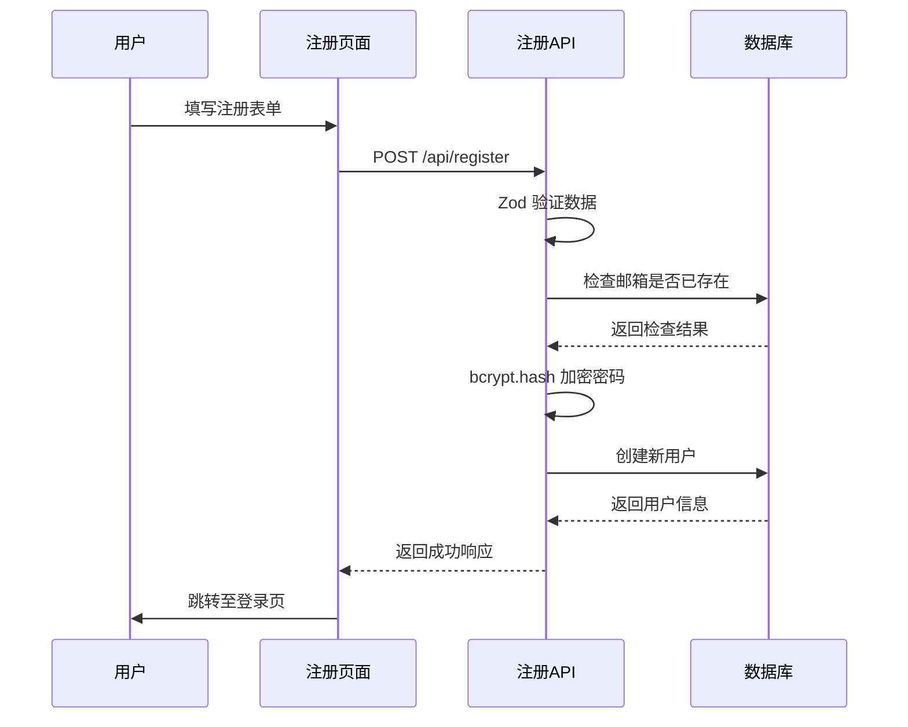
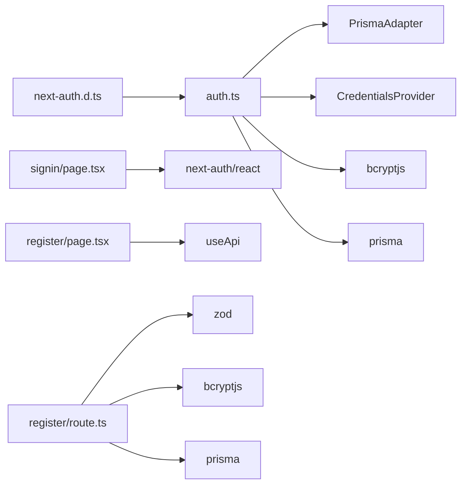

# 认证系统

<cite>
**本文档引用的文件**
- [auth.ts](file://src/lib/auth.ts)
- [signin/page.tsx](file://src/app/auth/signin/page.tsx)
- [register/page.tsx](file://src/app/auth/register/page.tsx)
- [route.ts](file://src/app/api/register/route.ts)
- [next-auth.d.ts](file://src/types/next-auth.d.ts)
</cite>

## 目录
1. [简介](#简介)
2. [项目结构](#项目结构)
3. [核心组件](#核心组件)
4. [认证架构概述](#认证架构概述)
5. [详细组件分析](#详细组件分析)
6. [依赖关系分析](#依赖关系分析)
7. [性能与安全实践](#性能与安全实践)
8. [常见问题排查指南](#常见问题排查指南)
9. [结论](#结论)

## 简介
本系统基于 NextAuth.js 实现了完整的身份验证机制，支持用户注册、登录、会话管理及权限控制。系统采用 JWT 会话策略，结合 Prisma 适配器与数据库集成，确保用户数据安全。通过凭证提供者（Credentials Provider）实现自定义邮箱密码认证流程，并在注册时对密码进行哈希处理，保障安全性。同时，系统通过类型扩展增强了用户角色信息的序列化与反序列化能力，支持管理员与普通用户的权限区分。

## 项目结构
认证相关功能主要分布在 `src/app/auth` 和 `src/lib` 目录下，API 路由集中于 `src/app/api`。前端页面采用 Next.js App Router 模式，服务端逻辑通过 API Route 处理。

**图示来源**
- [auth.ts](file://src/lib/auth.ts)
- [signin/page.tsx](file://src/app/auth/signin/page.tsx)
- [register/page.tsx](file://src/app/auth/register/page.tsx)
- [route.ts](file://src/app/api/register/route.ts)

**本节来源**
- [src/lib/auth.ts](file://src/lib/auth.ts)
- [src/app/auth](file://src/app/auth)

## 核心组件
系统核心为 `authOptions` 配置对象，定义了认证流程的适配器、提供者、会话策略和回调函数。凭证提供者负责邮箱密码验证，JWT 回调用于注入用户角色信息，会话回调则将 JWT 中的信息映射到客户端会话对象。

**本节来源**
- [auth.ts](file://src/lib/auth.ts#L7-L71)

## 认证架构概述
系统采用基于 JWT 的会话管理策略，所有认证请求通过 NextAuth.js 统一处理。用户登录后生成加密 JWT 令牌，存储于客户端 Cookie 中。每次请求通过中间件验证会话有效性。

**图示来源**
- [auth.ts](file://src/lib/auth.ts#L7-L71)
- [signin/page.tsx](file://src/app/auth/signin/page.tsx#L30-L60)

## 详细组件分析

### 凭证提供者实现
凭证提供者通过 `authorize` 方法实现自定义认证逻辑。首先验证输入字段，然后从数据库查找用户，使用 `bcrypt.compare` 安全比对密码哈希值。认证成功后返回包含用户 ID、邮箱、姓名和角色的对象。

**图示来源**
- [auth.ts](file://src/lib/auth.ts#L15-L45)

**本节来源**
- [auth.ts](file://src/lib/auth.ts#L10-L50)

### JWT 与会话管理
系统通过 `jwt` 和 `session` 回调扩展 JWT 负载和会话对象。`jwt` 回调在用户首次登录时将角色信息写入令牌；`session` 回调在每次会话恢复时将令牌中的角色映射到 `session.user.role`。

**图示来源**
- [auth.ts](file://src/lib/auth.ts#L50-L60)
- [next-auth.d.ts](file://src/types/next-auth.d.ts#L5-L20)

**本节来源**
- [auth.ts](file://src/lib/auth.ts#L50-L65)
- [next-auth.d.ts](file://src/types/next-auth.d.ts)

### 用户注册流程
注册功能通过独立 API 路由 `/api/register` 实现，使用 Zod 进行请求体验证，防止无效数据入库。密码通过 `bcrypt.hash` 加密后存储，确保即使数据库泄露也无法直接获取明文密码。

**图示来源**
- [route.ts](file://src/app/api/register/route.ts#L10-L90)
- [register/page.tsx](file://src/app/auth/register/page.tsx)

**本节来源**
- [route.ts](file://src/app/api/register/route.ts)
- [register/page.tsx](file://src/app/auth/register/page.tsx)

## 依赖关系分析
认证系统依赖多个核心模块协同工作：

**图示来源**
- [auth.ts](file://src/lib/auth.ts)
- [route.ts](file://src/app/api/register/route.ts)
- [next-auth.d.ts](file://src/types/next-auth.d.ts)

**本节来源**
- [auth.ts](file://src/lib/auth.ts)
- [route.ts](file://src/app/api/register/route.ts)

## 性能与安全实践
- **密码哈希**：使用 `bcryptjs` 对密码进行 12 轮哈希，防止彩虹表攻击。
- **CSRF 防护**：NextAuth.js 自动启用 CSRF 保护，所有认证请求需通过安全 Cookie 验证。
- **会话持久化**：JWT 存储于加密 Cookie 中，设置合理的过期时间（由 `NEXTAUTH_SECRET` 保证签名安全）。
- **输入验证**：注册接口使用 Zod 进行严格验证，防止恶意数据注入。
- **错误处理**：统一捕获并格式化错误响应，避免泄露敏感信息。

**本节来源**
- [auth.ts](file://src/lib/auth.ts)
- [route.ts](file://src/app/api/register/route.ts)

## 常见问题排查指南

### 会话失效
- **可能原因**：`NEXTAUTH_SECRET` 变更或未设置。
- **解决方案**：确保 `.env` 文件中正确配置 `NEXTAUTH_SECRET`，且部署环境一致。

### 跨域认证失败
- **可能原因**：前端与后端域名不一致导致 Cookie 被阻止。
- **解决方案**：确保 `NEXTAUTH_URL` 环境变量正确指向部署域名，并配置 CORS。

### 登录后角色信息丢失
- **可能原因**：`next-auth.d.ts` 类型未正确扩展，或 `jwt` 回调未注入角色。
- **解决方案**：检查 `jwt` 和 `session` 回调逻辑，确认 `token.role` 正确赋值。

### 注册提示邮箱已存在
- **可能原因**：数据库中已有相同邮箱的用户记录。
- **解决方案**：查询数据库确认用户状态，或实现邮箱激活机制。

**本节来源**
- [auth.ts](file://src/lib/auth.ts#L50-L65)
- [next-auth.d.ts](file://src/types/next-auth.d.ts)

## 结论
本认证系统基于 NextAuth.js 构建，具备高安全性与可扩展性。通过自定义凭证提供者、JWT 扩展和类型声明，实现了完整的用户身份管理功能。注册与登录流程均经过严格验证与加密处理，符合现代 Web 应用安全标准。建议定期更新依赖库，监控认证日志，以进一步提升系统安全性。