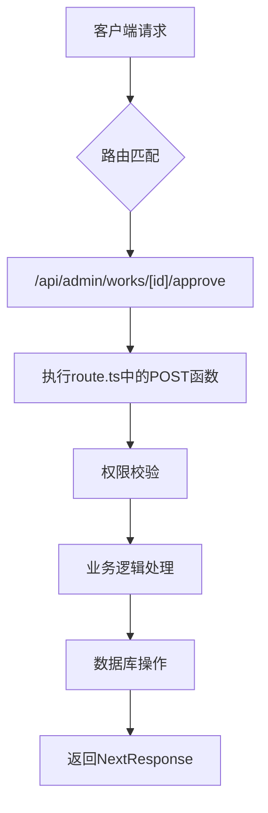
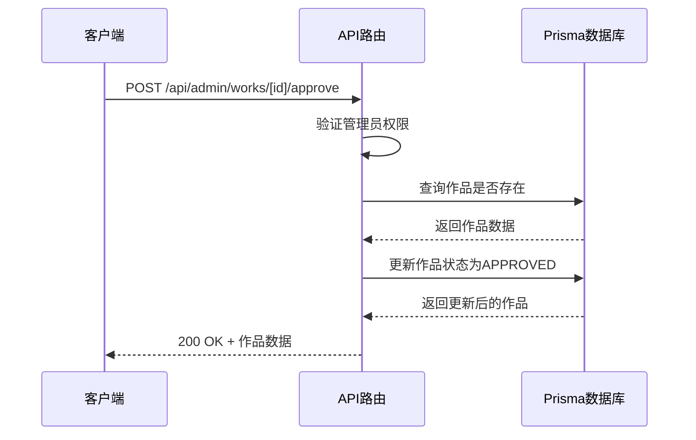
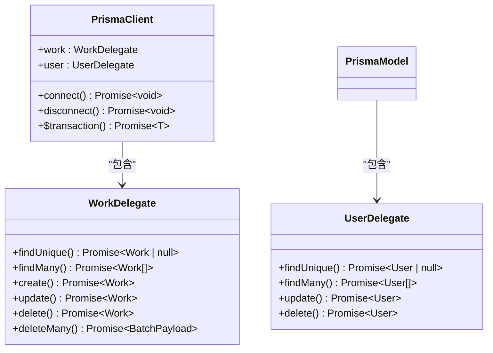
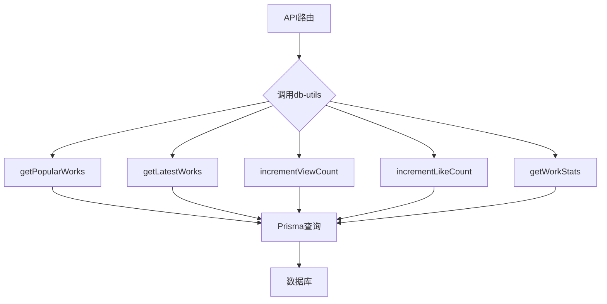
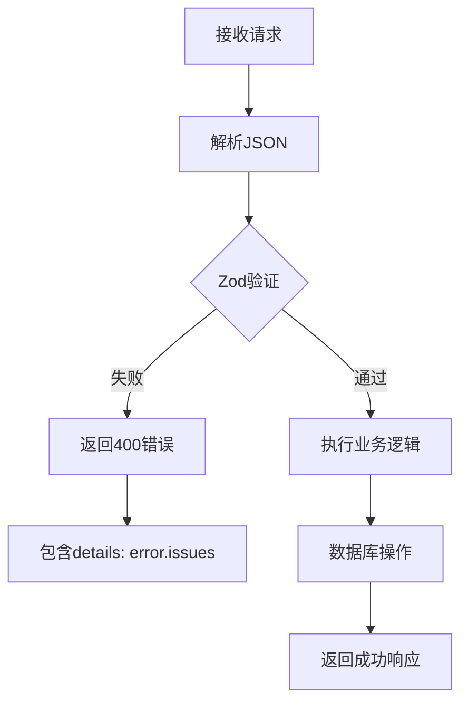
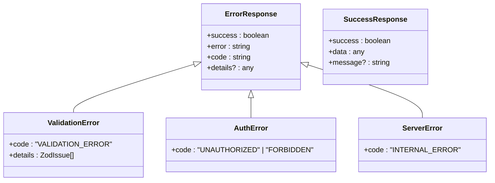
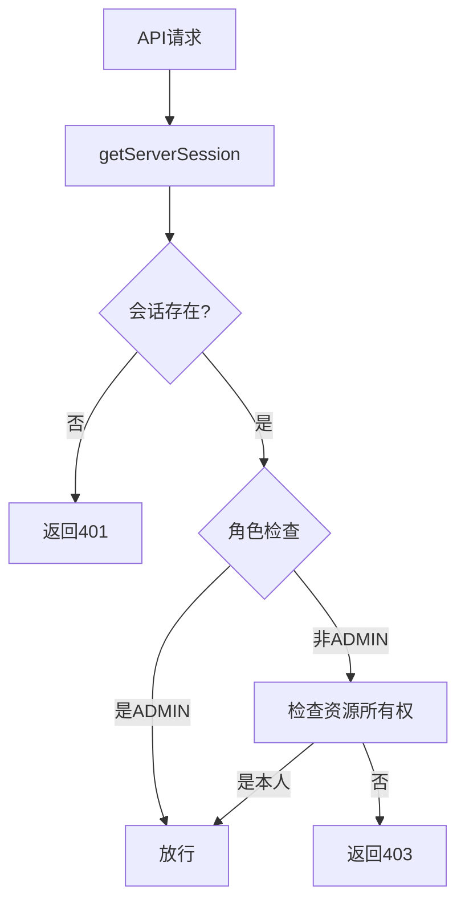

# API扩展开发指南

<cite>
**本文档中引用的文件**  
- [src/app/api/admin/works/[id]/approve/route.ts](file://src/app/api/admin/works/[id]/approve/route.ts)
- [src/app/api/admin/works/[id]/reject/route.ts](file://src/app/api/admin/works/[id]/reject/route.ts)
- [src/app/api/admin/works/[id]/edit/route.ts](file://src/app/api/admin/works/[id]/edit/route.ts)
- [src/app/api/admin/works/route.ts](file://src/app/api/admin/works/route.ts)
- [src/app/api/admin/users/[id]/route.ts](file://src/app/api/admin/users/[id]/route.ts)
- [src/app/api/admin/users/route.ts](file://src/app/api/admin/users/route.ts)
- [src/app/api/works/[id]/like/route.ts](file://src/app/api/works/[id]/like/route.ts)
- [src/app/api/works/[id]/view/route.ts](file://src/app/api/works/[id]/view/route.ts)
- [src/app/api/works/[id]/route.ts](file://src/app/api/works/[id]/route.ts)
- [src/lib/db-utils.ts](file://src/lib/db-utils.ts)
- [src/lib/prisma.ts](file://src/lib/prisma.ts)
</cite>

## 目录
1. [简介](#简介)
2. [Next.js App Router路由结构与请求流程](#nextjs-app-router路由结构与请求流程)
3. [API接口设计与RESTful原则](#api接口设计与restful原则)
4. [Prisma数据库操作集成](#prisma数据库操作集成)
5. [数据访问逻辑复用（db-utils.ts）](#数据访问逻辑复用db-utilsts)
6. [请求验证与Zod应用](#请求验证与zod应用)
7. [统一错误响应格式](#统一错误响应格式)
8. [权限校验中间件实现](#权限校验中间件实现)
9. [异步处理与超时控制](#异步处理与超时控制)
10. [新建API完整代码模板](#新建api完整代码模板)

## 简介
本文档旨在为开发者提供基于现有架构安全扩展新API接口的详细指导。通过分析平台中已有的API实现，系统性地讲解Next.js App Router的路由组织方式、Prisma数据库集成、权限控制、请求验证、错误处理等关键开发实践。重点以作品审核API为例，展示如何遵循RESTful设计原则构建健壮、可维护的后端接口。

## Next.js App Router路由结构与请求流程
项目采用Next.js App Router模式，API路由统一放置在`src/app/api`目录下，通过文件系统自动生成路由。每个API端点由一个`route.ts`文件定义，支持标准HTTP方法（GET、POST、PUT、PATCH、DELETE）作为导出函数。

路由支持动态参数（如`[id]`）和嵌套路由结构，例如`/api/admin/works/[id]/approve`对应`src/app/api/admin/works/[id]/approve/route.ts`文件。请求流程如下：
1. 客户端发起HTTP请求
2. Next.js路由系统匹配对应`route.ts`文件
3. 执行文件中匹配HTTP方法的导出函数
4. 函数内部处理业务逻辑并返回`NextResponse`



**图示来源**
- [src/app/api/admin/works/[id]/approve/route.ts](file://src/app/api/admin/works/[id]/approve/route.ts)
- [src/app/api/works/[id]/like/route.ts](file://src/app/api/works/[id]/like/route.ts)

**本节来源**
- [src/app/api/admin/works/[id]/approve/route.ts](file://src/app/api/admin/works/[id]/approve/route.ts)
- [src/app/api/works/[id]/like/route.ts](file://src/app/api/works/[id]/like/route.ts)

## API接口设计与RESTful原则
项目严格遵循RESTful设计原则，通过HTTP方法语义化地表达操作意图：

| HTTP方法 | 用途 | 示例 |
|---------|------|------|
| GET | 获取资源 | `GET /api/works/[id]` 获取作品详情 |
| POST | 创建资源或执行操作 | `POST /api/works/[id]/like` 点赞作品 |
| PUT | 全量更新资源 | `PUT /api/admin/works/[id]/edit` 管理员编辑作品 |
| PATCH | 部分更新资源 | `PATCH /api/admin/works/[id]` 审核作品 |
| DELETE | 删除资源 | `DELETE /api/works/[id]` 删除作品 |

状态码使用规范：
- `200 OK`：请求成功，返回数据
- `204 No Content`：请求成功，无返回内容
- `400 Bad Request`：客户端请求错误
- `401 Unauthorized`：未认证
- `403 Forbidden`：权限不足
- `404 Not Found`：资源不存在
- `422 Unprocessable Entity`：语义错误（如状态变更非法）
- `500 Internal Server Error`：服务器内部错误



**图示来源**
- [src/app/api/admin/works/[id]/approve/route.ts](file://src/app/api/admin/works/[id]/approve/route.ts)
- [src/app/api/admin/works/[id]/reject/route.ts](file://src/app/api/admin/works/[id]/reject/route.ts)

**本节来源**
- [src/app/api/admin/works/[id]/approve/route.ts](file://src/app/api/admin/works/[id]/approve/route.ts)
- [src/app/api/admin/works/[id]/reject/route.ts](file://src/app/api/admin/works/[id]/reject/route.ts)

## Prisma数据库操作集成
所有API接口通过`@/lib/prisma`模块集成Prisma进行数据库操作。该模块提供了单例Prisma客户端，确保连接池优化和资源复用。

核心集成要点：
1. **导入Prisma实例**：`import { prisma } from '@/lib/prisma'`
2. **类型安全查询**：利用Prisma Client生成的类型进行类型安全的数据库操作
3. **事务支持**：通过`$transaction`方法支持多操作事务
4. **连接池优化**：在`prisma.ts`中配置连接池参数以适应生产环境



**图示来源**
- [src/lib/prisma.ts](file://src/lib/prisma.ts)
- [src/app/api/admin/works/[id]/approve/route.ts](file://src/app/api/admin/works/[id]/approve/route.ts)

**本节来源**
- [src/lib/prisma.ts](file://src/lib/prisma.ts)
- [src/app/api/admin/works/[id]/approve/route.ts](file://src/app/api/admin/works/[id]/approve/route.ts)

## 数据访问逻辑复用（db-utils.ts）
为避免重复代码，项目在`src/lib/db-utils.ts`中封装了常用的数据访问逻辑，实现跨API的逻辑复用。

主要工具函数：
- `getPopularWorks()`：获取热门作品（按点赞、浏览数排序）
- `getLatestWorks()`：获取最新审核通过的作品
- `incrementViewCount()`：增加作品浏览数
- `incrementLikeCount()`：增加作品点赞数
- `getWorkStats()`：获取作品统计信息

这些工具函数被多个API路由复用，如作品展示、统计面板等，确保数据访问逻辑的一致性和可维护性。



**图示来源**
- [src/lib/db-utils.ts](file://src/lib/db-utils.ts)
- [src/app/api/works/[id]/view/route.ts](file://src/app/api/works/[id]/view/route.ts)

**本节来源**
- [src/lib/db-utils.ts](file://src/lib/db-utils.ts)
- [src/app/api/works/[id]/view/route.ts](file://src/app/api/works/[id]/view/route.ts)

## 请求验证与Zod应用
项目使用Zod进行请求数据验证，确保输入数据的完整性和正确性。验证模式定义在路由文件内部，采用`safeParse`或`parse`方法进行验证。

验证实践：
1. **定义Schema**：使用Zod定义请求体或查询参数的验证模式
2. **解析请求**：`const body = await request.json()`
3. **执行验证**：`const validationResult = Schema.safeParse(body)`
4. **处理错误**：返回400状态码及详细的验证错误信息



**图示来源**
- [src/app/api/admin/works/[id]/reject/route.ts](file://src/app/api/admin/works/[id]/reject/route.ts)
- [src/app/api/admin/works/route.ts](file://src/app/api/admin/works/route.ts)

**本节来源**
- [src/app/api/admin/works/[id]/reject/route.ts](file://src/app/api/admin/works/[id]/reject/route.ts)
- [src/app/api/admin/works/route.ts](file://src/app/api/admin/works/route.ts)

## 统一错误响应格式
所有API接口采用统一的错误响应格式，便于前端统一处理。标准错误响应包含：

- `success: false`：标识请求失败
- `error: string`：错误消息（面向用户）
- `code: string`：错误代码（用于程序判断）
- `details: any`：详细信息（开发环境包含Zod验证错误）

常见错误代码：
- `FORBIDDEN`：权限不足
- `NOT_FOUND`：资源不存在
- `VALIDATION_ERROR`：数据验证失败
- `INTERNAL_ERROR`：服务器内部错误
- `UNAUTHORIZED`：未认证



**图示来源**
- [src/app/api/admin/works/[id]/approve/route.ts](file://src/app/api/admin/works/[id]/approve/route.ts)
- [src/app/api/admin/works/[id]/reject/route.ts](file://src/app/api/admin/works/[id]/reject/route.ts)

**本节来源**
- [src/app/api/admin/works/[id]/approve/route.ts](file://src/app/api/admin/works/[id]/approve/route.ts)
- [src/app/api/admin/works/[id]/reject/route.ts](file://src/app/api/admin/works/[id]/reject/route.ts)

## 权限校验中间件实现
权限校验通过`getServerSession(authOptions)`实现，作为每个API端点的前置检查。不同角色（ADMIN、USER）拥有不同的操作权限。

权限校验流程：
1. 获取服务器会话
2. 检查用户是否存在及角色
3. 根据角色和资源所有权决定是否放行



**图示来源**
- [src/app/api/admin/works/[id]/approve/route.ts](file://src/app/api/admin/works/[id]/approve/route.ts)
- [src/app/api/works/[id]/route.ts](file://src/app/api/works/[id]/route.ts)

**本节来源**
- [src/app/api/admin/works/[id]/approve/route.ts](file://src/app/api/admin/works/[id]/approve/route.ts)
- [src/app/api/works/[id]/route.ts](file://src/app/api/works/[id]/route.ts)

## 异步处理与超时控制
所有API接口均为异步函数，使用`async/await`语法处理异步操作。通过以下方式确保稳定性：

1. **错误捕获**：使用try-catch捕获异步错误
2. **超时控制**：Prisma连接池配置超时参数
3. **资源清理**：通过`process.on('SIGINT', gracefulShutdown)`优雅关闭数据库连接

数据库连接配置了合理的超时参数：
- `connect_timeout`: 10秒
- `socket_timeout`: 30秒
- `statement_timeout`: 30秒
- `pool_timeout`: 20秒

**本节来源**
- [src/lib/prisma.ts](file://src/lib/prisma.ts)
- [src/app/api/admin/works/[id]/approve/route.ts](file://src/app/api/admin/works/[id]/approve/route.ts)

## 新建API完整代码模板
```typescript
import { NextRequest, NextResponse } from 'next/server';
import { getServerSession } from 'next-auth';
import { prisma } from '@/lib/prisma';
import { authOptions } from '@/lib/auth';
import { Role } from '@prisma/client';
import { z } from 'zod';
import { toPlainJSON } from '@/lib/serialize';

// 请求验证模式
const RequestSchema = z.object({
  // 定义字段验证规则
});

// GET /api/your-endpoint - 获取资源
export async function GET(request: NextRequest) {
  try {
    const session = await getServerSession(authOptions);
    
    // 权限校验
    if (!session?.user) {
      return NextResponse.json({
        success: false,
        error: '请先登录',
        code: 'UNAUTHORIZED'
      }, { status: 401 });
    }

    // 业务逻辑
    const data = await prisma.yourModel.findMany({
      // 查询条件
    });

    return NextResponse.json({
      success: true,
      data: toPlainJSON(data)
    });

  } catch (error) {
    console.error('操作失败:', error);
    return NextResponse.json({
      success: false,
      error: '服务器内部错误',
      code: 'INTERNAL_ERROR'
    }, { status: 500 });
  }
}

// POST /api/your-endpoint - 创建资源
export async function POST(request: NextRequest) {
  try {
    const session = await getServerSession(authOptions);
    if (!session?.user) {
      return NextResponse.json({
        success: false,
        error: '请先登录',
        code: 'UNAUTHORIZED'
      }, { status: 401 });
    }

    const body = await request.json();
    const validatedData = RequestSchema.parse(body);

    // 业务逻辑
    const result = await prisma.yourModel.create({
      data: validatedData
    });

    return NextResponse.json({
      success: true,
      data: toPlainJSON(result),
      message: '创建成功'
    });

  } catch (error) {
    console.error('创建失败:', error);
    
    if (error instanceof z.ZodError) {
      return NextResponse.json({
        success: false,
        error: '输入数据无效',
        code: 'VALIDATION_ERROR',
        details: error.issues
      }, { status: 400 });
    }

    return NextResponse.json({
      success: false,
      error: '服务器内部错误',
      code: 'INTERNAL_ERROR'
    }, { status: 500 });
  }
}
```

**本节来源**
- [src/app/api/admin/works/[id]/approve/route.ts](file://src/app/api/admin/works/[id]/approve/route.ts)
- [src/app/api/admin/works/[id]/reject/route.ts](file://src/app/api/admin/works/[id]/reject/route.ts)
- [src/app/api/admin/works/route.ts](file://src/app/api/admin/works/route.ts)