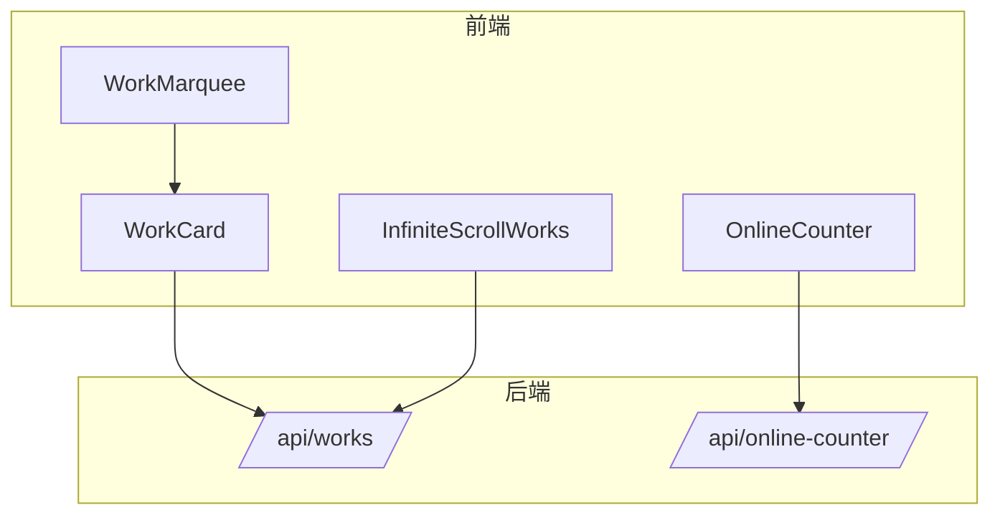
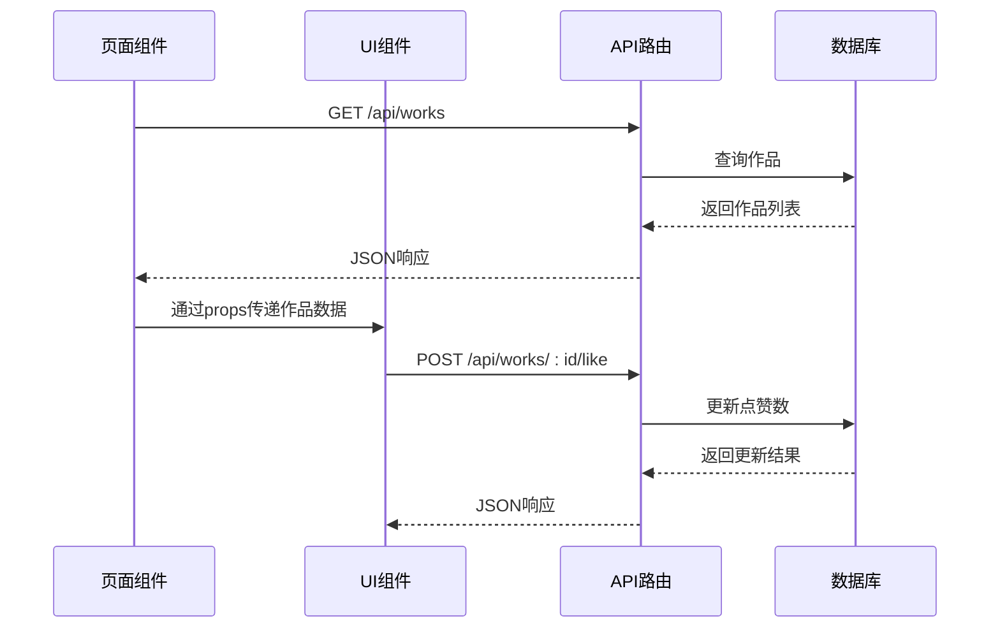
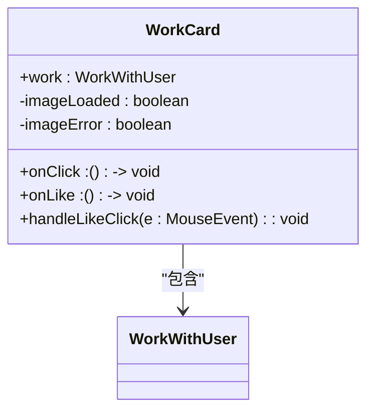
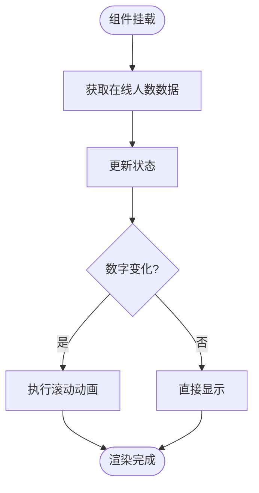
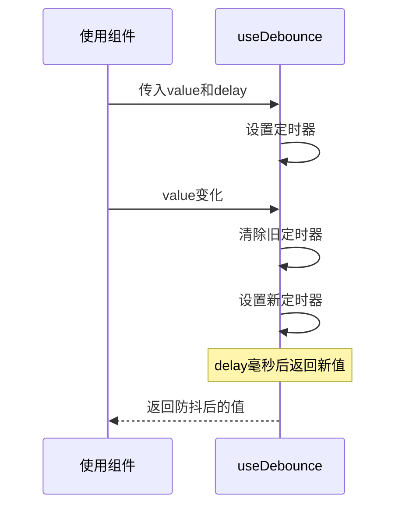
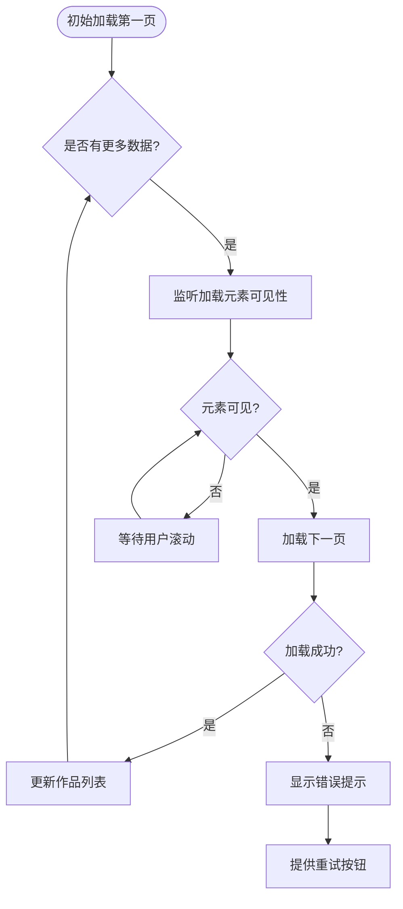

# 前端组件集成与复用

<cite>
**本文档引用的文件**
- [WorkCard.tsx](file://src/components/WorkCard.tsx)
- [OnlineCounter.tsx](file://src/components/OnlineCounter.tsx)
- [useDebounce.ts](file://src/hooks/useDebounce.ts)
- [InfiniteScrollWorks.tsx](file://src/components/InfiniteScrollWorks.tsx)
- [work.d.ts](file://src/types/work.d.ts)
- [page.tsx](file://src/app/page.tsx)
- [image-url.ts](file://src/lib/image-url.ts)
- [route.ts](file://src/app/api/works/route.ts)
- [like/route.ts](file://src/app/api/works/[id]/like/route.ts)
- [online-counter/route.ts](file://src/app/api/online-counter/route.ts)
- [prisma.ts](file://src/lib/prisma.ts)
- [migration.sql](file://prisma/migrations/20250905143157_add_online_counter_config/migration.sql)
</cite>

## 目录
1. [简介](#简介)
2. [项目结构](#项目结构)
3. [核心组件](#核心组件)
4. [架构概览](#架构概览)
5. [详细组件分析](#详细组件分析)
6. [依赖分析](#依赖分析)
7. [性能考虑](#性能考虑)
8. [故障排除指南](#故障排除指南)
9. [结论](#结论)

## 简介
本文档为前端组件的开发与集成立即提供实践指导。详细说明组件设计原则，如状态管理、props传递、事件回调机制，结合WorkCard和OnlineCounter组件分析其结构与行为。解释如何使用useDebounce等自定义Hook优化用户交互体验，避免高频请求。指导如何在新页面中复用现有UI组件，保持视觉一致性与交互逻辑统一。包含响应式布局适配、动态加载策略（InfiniteScrollWorks）及与后端API的数据绑定方法，确保组件高效渲染与良好用户体验。

## 项目结构
本项目采用Next.js 15框架构建，遵循标准的模块化结构。核心组件位于`src/components`目录下，自定义Hook位于`src/hooks`，类型定义集中于`src/types`。API路由使用Next.js App Router模式，位于`src/app/api`路径下。数据访问通过Prisma ORM实现，配置文件位于根目录。



**图示来源**
- [WorkCard.tsx](file://src/components/WorkCard.tsx)
- [OnlineCounter.tsx](file://src/components/OnlineCounter.tsx)
- [InfiniteScrollWorks.tsx](file://src/components/InfiniteScrollWorks.tsx)
- [route.ts](file://src/app/api/works/route.ts)
- [online-counter/route.ts](file://src/app/api/online-counter/route.ts)

**本节来源**
- [WorkCard.tsx](file://src/components/WorkCard.tsx)
- [OnlineCounter.tsx](file://src/components/OnlineCounter.tsx)
- [InfiniteScrollWorks.tsx](file://src/components/InfiniteScrollWorks.tsx)

## 核心组件
文档重点分析的三个核心组件：WorkCard用于展示单个作品卡片，支持点击查看详情和点赞操作；OnlineCounter实时显示在线创作人数，具备平滑动画效果；InfiniteScrollWorks实现无限滚动加载热门作品列表，支持自动和手动加载更多。

**本节来源**
- [WorkCard.tsx](file://src/components/WorkCard.tsx#L7-L92)
- [OnlineCounter.tsx](file://src/components/OnlineCounter.tsx#L15-L157)
- [InfiniteScrollWorks.tsx](file://src/components/InfiniteScrollWorks.tsx#L7-L267)

## 架构概览
系统采用前后端分离架构，前端通过API路由与后端交互。组件间通过props传递数据和回调函数，状态管理主要依赖React内置的useState和useEffect。数据流从API获取后，经由页面组件分发给子组件。自定义Hook封装通用逻辑，提高代码复用性。



**图示来源**
- [page.tsx](file://src/app/page.tsx#L1-L386)
- [route.ts](file://src/app/api/works/route.ts#L1-L224)
- [like/route.ts](file://src/app/api/works/[id]/like/route.ts#L1-L64)
- [prisma.ts](file://src/lib/prisma.ts#L1-L50)

## 详细组件分析
对关键组件进行深入分析，包括其设计模式、状态管理、事件处理和性能优化策略。

### WorkCard 组件分析
WorkCard组件展示单个作品的缩略图、名称、作者及互动数据（点赞数、浏览数）。通过props接收作品数据、点击回调和点赞回调。使用useState管理图片加载状态，防止重复加载。点赞按钮通过stopPropagation阻止事件冒泡，避免触发卡片点击事件。



**图示来源**
- [WorkCard.tsx](file://src/components/WorkCard.tsx#L7-L92)
- [work.d.ts](file://src/types/work.d.ts#L1-L95)

**本节来源**
- [WorkCard.tsx](file://src/components/WorkCard.tsx#L7-L92)
- [work.d.ts](file://src/types/work.d.ts#L1-L95)

### OnlineCounter 组件分析
OnlineCounter组件显示实时在线人数，每10秒自动更新。使用useState管理计数器数据、加载状态和动画状态。通过useRef存储动画帧引用，避免内存泄漏。实现平滑的数字滚动动画，使用缓动函数easeOutCubic创建自然的动画效果。组件支持动态文本显示，可配置是否启用。



**图示来源**
- [OnlineCounter.tsx](file://src/components/OnlineCounter.tsx#L15-L157)
- [online-counter/route.ts](file://src/app/api/online-counter/route.ts#L1-L188)

**本节来源**
- [OnlineCounter.tsx](file://src/components/OnlineCounter.tsx#L15-L157)
- [online-counter/route.ts](file://src/app/api/online-counter/route.ts#L1-L188)

### useDebounce Hook 分析
useDebounce是一个通用的防抖Hook，用于延迟值的更新，避免高频触发。接收两个参数：待防抖的值和延迟时间（毫秒）。内部使用setTimeout实现延迟更新，每次值变化时重置定时器。适用于搜索输入、窗口大小变化等场景，有效减少不必要的渲染和API调用。



**图示来源**
- [useDebounce.ts](file://src/hooks/useDebounce.ts#L2-L16)

**本节来源**
- [useDebounce.ts](file://src/hooks/useDebounce.ts#L2-L16)

### InfiniteScrollWorks 组件分析
InfiniteScrollWorks组件实现无限滚动加载功能。使用IntersectionObserver监听"加载更多"元素的可见性，自动触发下一页加载。通过ref避免闭包问题，确保状态同步。支持手动加载和自动刷新机制。组件将作品分组为行，每行8个作品，保持布局整齐。错误处理机制完善，支持重试功能。



**图示来源**
- [InfiniteScrollWorks.tsx](file://src/components/InfiniteScrollWorks.tsx#L7-L267)
- [route.ts](file://src/app/api/works/route.ts#L1-L224)

**本节来源**
- [InfiniteScrollWorks.tsx](file://src/components/InfiniteScrollWorks.tsx#L7-L267)
- [route.ts](file://src/app/api/works/route.ts#L1-L224)

## 依赖分析
项目依赖关系清晰，组件间耦合度低。UI组件依赖于类型定义和工具函数，不直接依赖API。API路由依赖Prisma客户端进行数据库操作。自定义Hook独立于具体组件，可在多处复用。环境变量通过配置文件注入，确保安全性。

```mermaid
graph TD
A[WorkCard] --> B[work.d.ts]
C[OnlineCounter] --> B
D[InfiniteScrollWorks] --> B
E[useDebounce] --> F[React]
G[page.tsx] --> A
G --> C
G --> D
H[route.ts] --> I[prisma]
I --> J[DATABASE_URL]
K[OnlineCounter] --> L[/api/online-counter/]
M[WorkCard] --> N[/api/works/:id/like]
```

**图示来源**
- [package.json](file://package.json#L1-L10)
- [go.mod](file://go.mod#L1-L20)

**本节来源**
- [package.json](file://package.json#L1-L10)
- [go.mod](file://go.mod#L1-L20)

## 性能考虑
组件设计充分考虑性能优化。WorkCard使用懒加载和错误处理，避免图片加载阻塞。OnlineCounter通过缓存头优化API响应，减少服务器压力。InfiniteScrollWorks采用虚拟滚动策略，只加载可见区域内容。useDebounce有效减少高频事件的处理次数。所有动画使用CSS transition和requestAnimationFrame，确保流畅性。

## 故障排除指南
常见问题包括图片加载失败、在线人数不更新、无限滚动不触发等。图片加载失败通常由URL格式错误引起，可通过getImageUrl工具函数处理。在线人数不更新需检查API路由和数据库配置。无限滚动不触发需确认IntersectionObserver兼容性和元素可见性。所有组件均包含错误边界和加载状态，确保用户体验。

**本节来源**
- [ErrorBoundary.tsx](file://src/components/ErrorBoundary.tsx#L1-L20)
- [LoadingSpinner.tsx](file://src/components/LoadingSpinner.tsx#L1-L15)

## 结论
本文档详细介绍了前端组件的集成与复用实践。通过分析WorkCard、OnlineCounter和InfiniteScrollWorks等核心组件，展示了现代React应用的组件设计原则。强调了状态管理、props传递、事件回调和性能优化的重要性。提供的指导可帮助开发者快速上手，构建高效、可维护的前端界面。