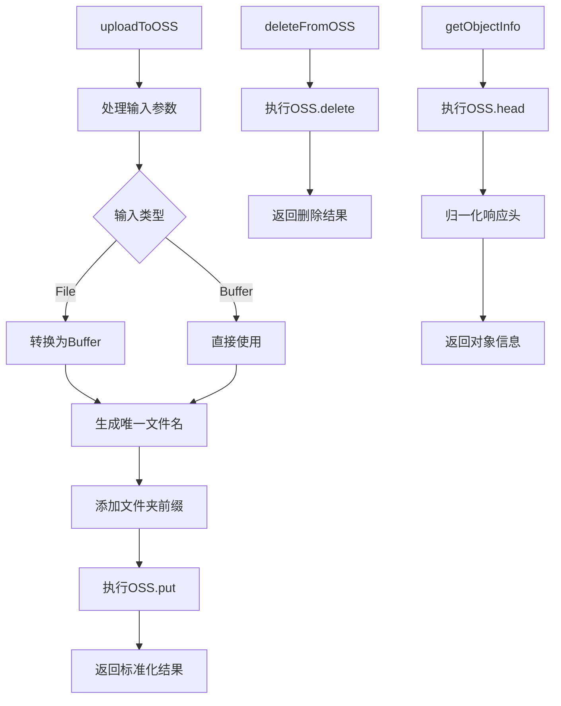
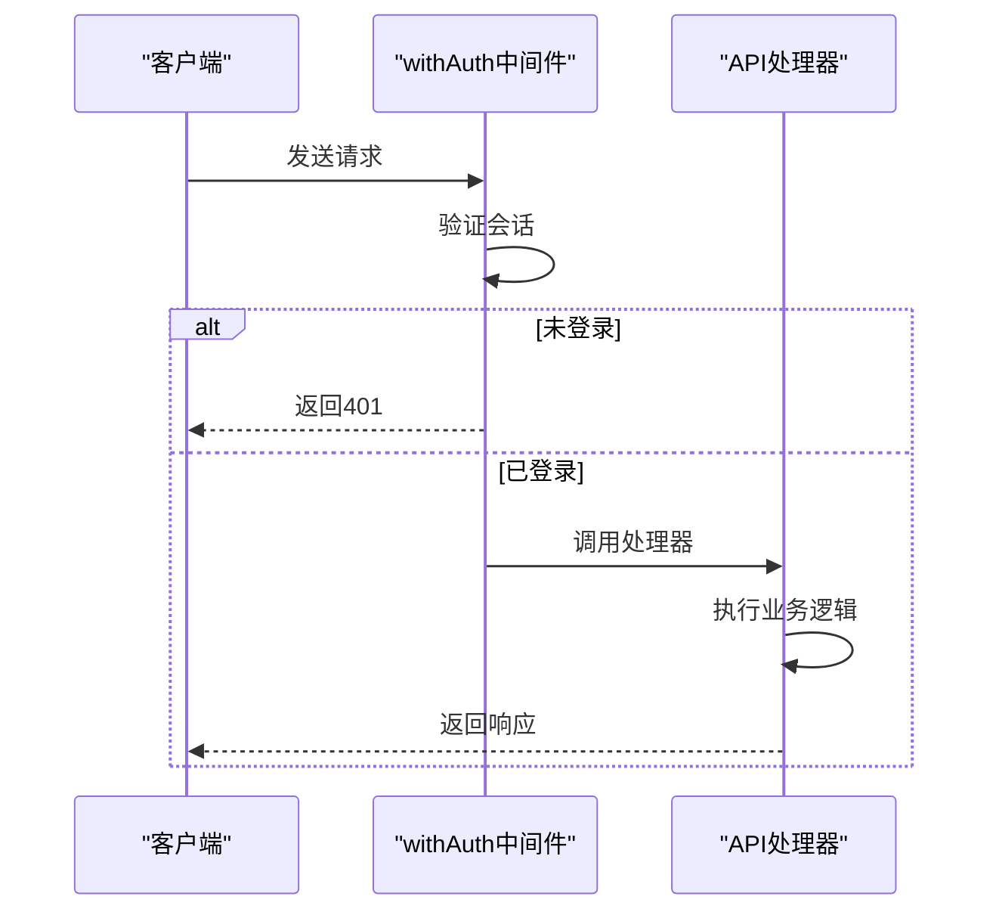
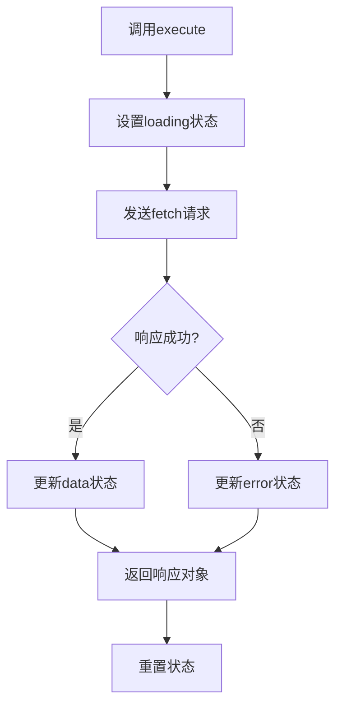

# 开发者指南

<cite>
**Referenced Files in This Document **   
- [useApi.ts](file://src/hooks/useApi.ts)
- [db-utils.ts](file://src/lib/db-utils.ts)
- [oss.ts](file://src/lib/oss.ts)
- [middleware.ts](file://middleware.ts)
- [schema.prisma](file://prisma/schema.prisma)
- [work.d.ts](file://src/types/work.d.ts)
</cite>

## 目录
1. [引言](#引言)
2. [项目结构概览](#项目结构概览)
3. [核心工具函数复用](#核心工具函数复用)
4. [API路由创建规范](#api路由创建规范)
5. [Prisma模型定义与数据层](#prisma模型定义与数据层)
6. [前端组件开发实践](#前端组件开发实践)
7. [中间件扩展方法](#中间件扩展方法)
8. [代码风格与安全编码](#代码风格与安全编码)
9. [错误处理与调试技巧](#错误处理与调试技巧)
10. [集成测试策略](#集成测试策略)

## 引言

本开发者指南旨在为二次开发和功能扩展提供权威指导。文档详细说明了如何遵循现有架构添加新功能，包括创建新的API路由、定义Prisma模型、编写前端组件以及集成测试的最佳实践。重点介绍了lib目录下工具函数的复用方式、自定义Hook的使用方法、中间件的扩展技术，并提供了代码风格规范、错误处理最佳实践、安全编码建议及调试技巧。

## 项目结构概览

项目采用Next.js App Router架构，主要分为以下几个核心目录：

- `src/app`: Next.js应用主目录，包含页面、布局和API路由
- `src/components`: 可复用的UI组件库
- `src/hooks`: 自定义React Hook
- `src/lib`: 核心工具函数库，包含数据库操作、文件上传等封装
- `src/types`: TypeScript类型定义
- `prisma`: Prisma ORM配置和迁移文件
- `middleware.ts`: 全局中间件配置

这种分层架构确保了代码的可维护性和可扩展性，新功能开发应遵循此结构进行组织。

## 核心工具函数复用

### 数据库操作封装 (db-utils.ts)

`db-utils.ts`文件封装了常用的数据访问逻辑，通过复用这些工具函数可以避免重复代码并保证数据操作的一致性。

```mermaid
flowchart TD
A[调用getPopularWorks] --> B[执行Prisma查询]
B --> C{查询条件}
C --> D[status: APPROVED]
C --> E[isDeleted: false]
C --> F[orderBy: likeCount/viewCount/createdAt]
D --> G[返回热门作品列表]
E --> G
F --> G
H[调用incrementViewCount] --> I[执行Prisma更新]
I --> J[where: workId]
J --> K[data: viewCount.increment(1)]
K --> L[更新浏览数]
```

**Diagram sources**
- [db-utils.ts](file://src/lib/db-utils.ts#L1-L67)

**Section sources**
- [db-utils.ts](file://src/lib/db-utils.ts#L1-L67)

### 文件上传处理 (oss.ts)

`oss.ts`文件提供了完整的阿里云OSS对象存储操作封装，支持上传、下载、删除等多种操作。



**Diagram sources**
- [oss.ts](file://src/lib/oss.ts#L1-L302)

**Section sources**
- [oss.ts](file://src/lib/oss.ts#L1-L302)

## API路由创建规范

在Next.js App Router中，API路由位于`src/app/api`目录下，每个路由文件导出HTTP方法处理器。

### 基本模式

```typescript
import { NextRequest, NextResponse } from 'next/server';

// GET /api/example - 获取资源
export async function GET(request: NextRequest): Promise<NextResponse> {
  try {
    // 业务逻辑
    return NextResponse.json({ success: true, data: result });
  } catch (error) {
    console.error('请求失败:', error);
    return NextResponse.json(
      { success: false, error: '服务器内部错误' },
      { status: 500 }
    );
  }
}

// POST /api/example - 创建资源
export async function POST(request: NextRequest): Promise<NextResponse> {
  try {
    const body = await request.json();
    // 数据验证和处理
    return NextResponse.json({ success: true, data: created }, { status: 201 });
  } catch (error) {
    // 错误处理
  }
}
```

### 认证保护

使用`withAuth`高阶函数为需要认证的路由添加保护：



**Diagram sources**
- [auth-utils.ts](file://src/lib/auth-utils.ts#L0-L65)
- [middleware.ts](file://middleware.ts#L0-L50)

## Prisma模型定义与数据层

### Work模型结构

根据Prisma Schema定义，Work模型包含以下字段：

```prisma
model Work {
  id              String      @id @default(cuid())
  name            String      // 作品名字 (最多50字符)
  title           String      // 作品简述 (最多300字符)
  author          String      // 作者名 (最多15字符)
  prompt          String?     // 完整的Prompt (最多8000字符)
  imageUrl        String      // 作品图片URL
  status          WorkStatus  @default(PENDING)
  likeCount       Int         @default(0)
  viewCount       Int         @default(0)
  shareCount      Int         @default(0)
  isFeatured      Boolean     @default(false)
  isDeleted       Boolean     @default(false)
  
  userId          String?
  user            User?       @relation("UserWorks", fields: [userId], references: [id])
  
  moderatorId     String?
  moderator       User?       @relation("ModeratedWorks", fields: [moderatorId], references: [id])
  rejectionReason String?
  
  createdAt       DateTime    @default(now())
  approvedAt      DateTime?   // 审核通过时间
  updatedAt       DateTime    @updatedAt
}
```

**Section sources**
- [schema.prisma](file://prisma/schema.prisma#L39-L160)

### 类型定义同步

前端TypeScript类型应与Prisma模型保持同步：

```typescript
export type WorkWithUser = Work & {
  user?: {
    id: string;
    name: string;
    email: string;
  };
};

export interface UserWork {
  id: string;
  name: string;
  author: string;
  imageUrl: string;
  status: WorkStatus;
  featured: boolean;
  likeCount: number;
  viewCount: number;
  createdAt: string;
  updatedAt: string;
}
```

**Section sources**
- [work.d.ts](file://src/types/work.d.ts#L0-L73)

## 前端组件开发实践

### 组件结构规范

所有组件应遵循一致的结构模式：

1. 使用TypeScript接口定义Props
2. 包含必要的状态管理
3. 实现适当的错误边界
4. 支持服务端渲染(SSR)

### 自定义Hook使用 (useApi.ts)

`useApi.ts`提供了统一的API调用封装，简化了数据获取流程：



**Diagram sources**
- [useApi.ts](file://src/hooks/useApi.ts#L19-L85)

**Section sources**
- [useApi.ts](file://src/hooks/useApi.ts#L19-L85)

## 中间件扩展方法

### 路由权限控制

`middleware.ts`实现了基于角色的访问控制(RBAC)，可根据需求进行扩展：

```typescript
export default withAuth(
  function middleware(req) {
    const token = req.nextauth.token;
    const isAuth = !!token;
    const isAdminPage = req.nextUrl.pathname.startsWith('/admin');
    
    // 管理页面权限检查
    if (isAdminPage && (!isAuth || token?.role !== 'ADMIN')) {
      return NextResponse.redirect(new URL('/', req.url));
    }
    
    return NextResponse.next();
  },
  {
    callbacks: {
      authorized: () => true,
    },
  }
);
```

### 扩展点

1. **新增路由匹配**: 在`config.matcher`中添加新的受保护路径
2. **自定义重定向逻辑**: 修改不同角色的默认跳转页面
3. **添加额外验证**: 在中间件中集成更多安全检查

**Section sources**
- [middleware.ts](file://middleware.ts#L0-L50)

## 代码风格与安全编码

### 安全最佳实践

1. **输入验证**: 所有API端点必须验证输入数据
2. **防注入**: 使用Prisma参数化查询防止SQL注入
3. **XSS防护**: 对用户输入内容进行适当转义
4. **CORS配置**: 限制允许的来源域
5. **敏感信息保护**: 不在客户端暴露敏感数据

### 代码风格规范

1. **命名约定**: 使用PascalCase表示组件，camelCase表示函数和变量
2. **文件组织**: 每个文件只导出一个主要组件或函数
3. **注释要求**: 复杂逻辑必须添加JSDoc注释
4. **错误处理**: 所有异步操作必须包含try-catch块

## 错误处理与调试技巧

### 全局错误边界

使用ErrorBoundary组件捕获未处理的异常：

```tsx
export default class ErrorBoundary extends React.Component<ErrorBoundaryProps, ErrorBoundaryState> {
  static getDerivedStateFromError(error: Error): ErrorBoundaryState {
    return { hasError: true, error };
  }

  componentDidCatch(error: Error, errorInfo: React.ErrorInfo) {
    console.error('ErrorBoundary caught an error:', error, errorInfo);
  }

  render() {
    if (this.state.hasError) {
      return (
        <div className="min-h-screen flex items-center justify-center">
          <div className="text-center p-8">
            <h2>出现了一些问题</h2>
            <button onClick={() => window.location.reload()}>刷新页面</button>
          </div>
        </div>
      );
    }
    return this.props.children;
  }
}
```

**Section sources**
- [ErrorBoundary.tsx](file://src/components/ErrorBoundary.tsx#L0-L57)

### 调试策略

1. **日志记录**: 在关键路径添加详细的console.error输出
2. **网络监控**: 使用浏览器开发者工具检查API请求
3. **状态跟踪**: 利用React DevTools观察组件状态变化
4. **性能分析**: 使用Next.js内置的性能监测工具

## 集成测试策略

### 测试覆盖范围

1. **API端点测试**: 验证所有HTTP方法的正确性和错误处理
2. **组件交互测试**: 模拟用户操作验证UI行为
3. **边界条件测试**: 检查极端输入情况下的系统表现
4. **性能基准测试**: 监控关键路径的响应时间

### 测试工具

1. **单元测试**: Jest + React Testing Library
2. **E2E测试**: Cypress或Playwright
3. **性能测试**: 自定义脚本模拟并发请求
4. **类型检查**: TypeScript编译器严格模式

通过遵循本指南中的规范和最佳实践，开发者可以高效地进行二次开发和功能扩展，同时确保代码质量和系统稳定性。