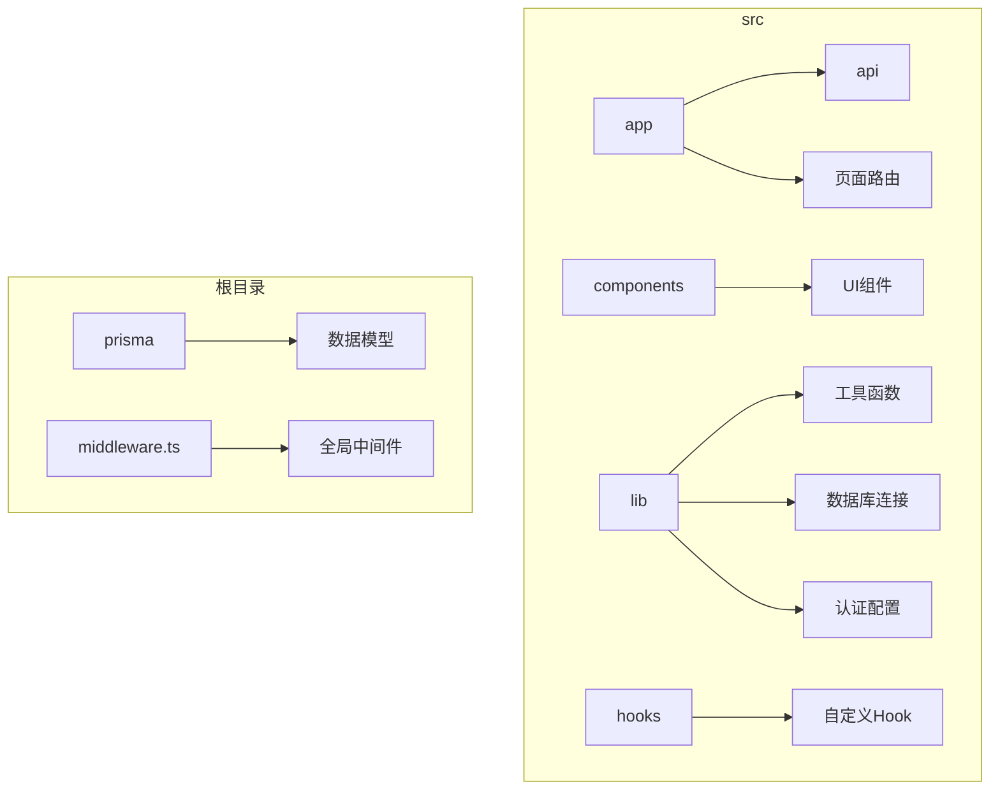
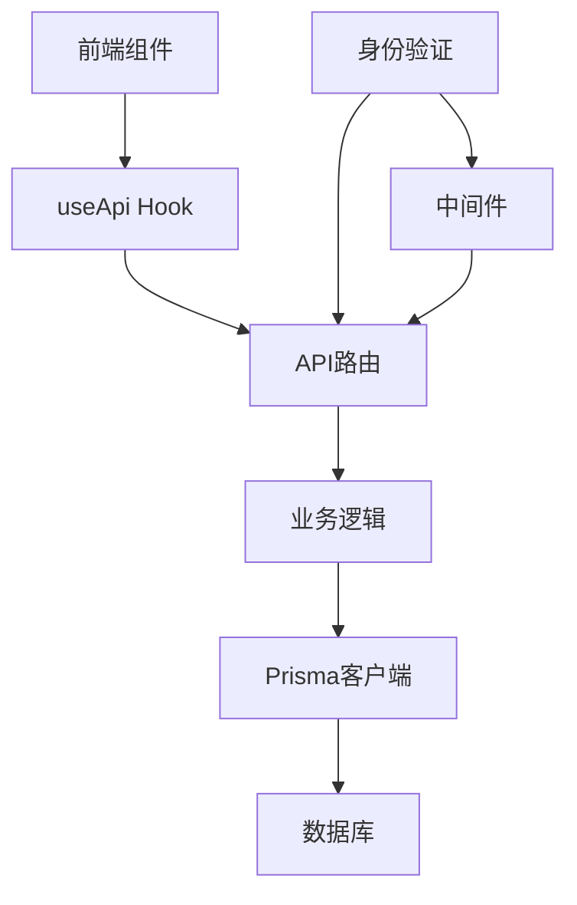
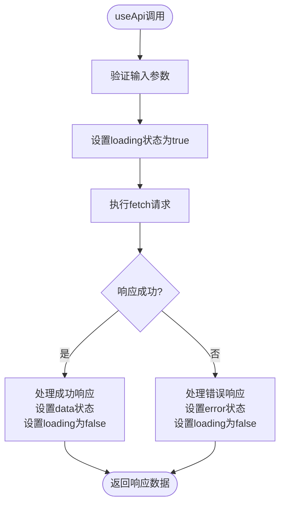
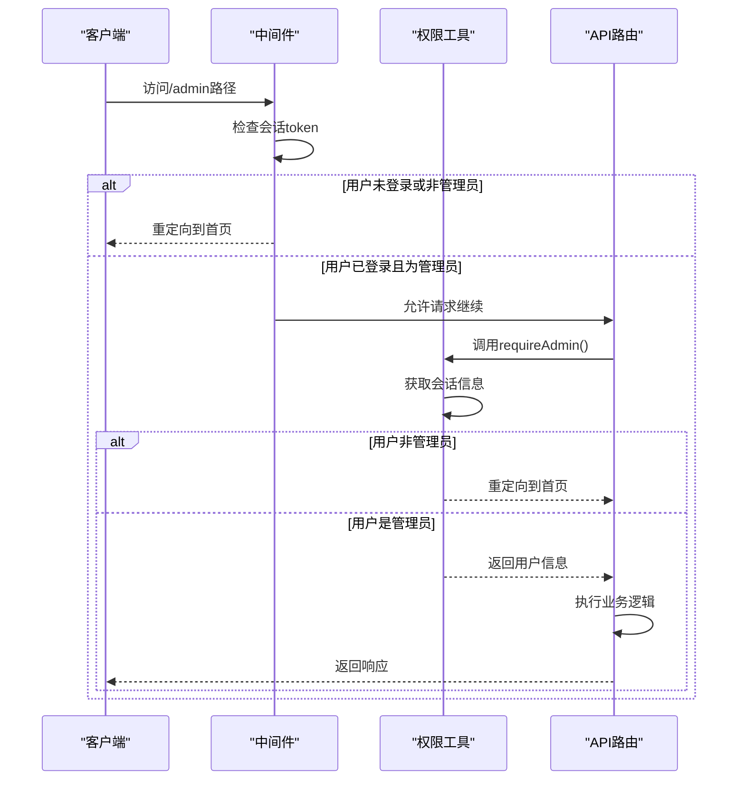
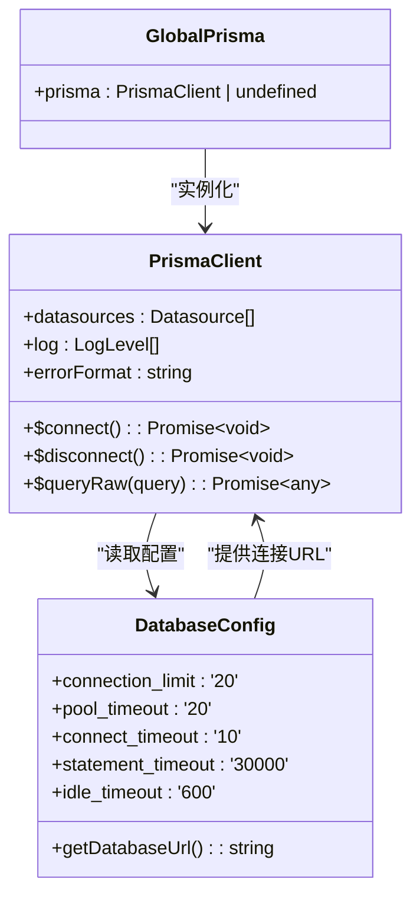

# 开发规范与最佳实践

<cite>
**本文档引用的文件**
- [useApi.ts](file://src/hooks/useApi.ts)
- [auth-utils.ts](file://src/lib/auth-utils.ts)
- [prisma.ts](file://src/lib/prisma.ts)
- [middleware.ts](file://middleware.ts)
- [auth.ts](file://src/lib/auth.ts)
- [schema.prisma](file://prisma/schema.prisma)
</cite>

## 目录
1. [简介](#简介)
2. [项目结构](#项目结构)
3. [核心组件](#核心组件)
4. [架构概述](#架构概述)
5. [详细组件分析](#详细组件分析)
6. [依赖分析](#依赖分析)
7. [性能考虑](#性能考虑)
8. [故障排除指南](#故障排除指南)
9. [结论](#结论)

## 简介
本文档详细阐述了数字化作品互动展示平台的开发规范与最佳实践，重点聚焦于代码架构一致性、错误处理机制、安全编码实践和性能优化策略。文档解释了如何遵循分层架构模式进行功能开发，确保表现层、业务逻辑层与数据访问层职责分离。详细说明了Prisma客户端的正确使用方式（如避免N+1查询、事务管理），中间件中的身份验证与权限控制实现逻辑，以及自定义Hook useApi的封装原理与调用约定。提供了防SQL注入、XSS攻击的编码示例，并阐述了统一的异常捕获与日志记录方案。结合auth-utils.ts中的工具函数，展示了用户权限校验的最佳实践。

## 项目结构
本项目采用Next.js 14的App Router架构，结合TypeScript、Prisma ORM和Tailwind CSS构建现代化全栈应用。项目结构清晰地分离了关注点，src目录下包含app、components、hooks、lib等核心模块。



**Diagram sources**
- [middleware.ts](file://middleware.ts#L1-L50)
- [prisma/schema.prisma](file://prisma/schema.prisma#L1-L200)

**Section sources**
- [middleware.ts](file://middleware.ts#L1-L50)
- [prisma/schema.prisma](file://prisma/schema.prisma#L1-L200)

## 核心组件
项目的核心组件包括基于Prisma的数据库访问层、NextAuth.js实现的身份认证系统、自定义Hook useApi封装的API调用逻辑，以及middleware.ts中定义的全局权限控制中间件。这些组件共同构成了应用的基础架构，确保了代码的可维护性和安全性。

**Section sources**
- [useApi.ts](file://src/hooks/useApi.ts#L1-L85)
- [auth-utils.ts](file://src/lib/auth-utils.ts#L1-L24)
- [prisma.ts](file://src/lib/prisma.ts#L1-L50)

## 架构概述
系统采用典型的分层架构模式，严格分离表现层、业务逻辑层和数据访问层。API路由作为入口点，通过自定义Hook useApi与前端组件交互，业务逻辑在API处理函数中实现，数据访问则通过Prisma客户端完成。身份验证和权限控制由NextAuth.js和自定义中间件协同处理。



**Diagram sources**
- [useApi.ts](file://src/hooks/useApi.ts#L1-L85)
- [middleware.ts](file://middleware.ts#L1-L50)
- [prisma.ts](file://src/lib/prisma.ts#L1-L50)

## 详细组件分析

### useApi Hook 分析
`useApi` Hook 是前端与后端API通信的核心封装，提供了统一的状态管理（加载、数据、错误）和请求执行机制。它使用泛型确保类型安全，通过`execute`函数封装fetch调用，自动处理JSON序列化和错误捕获，使前端组件能够以声明式方式调用API。



**Diagram sources**
- [useApi.ts](file://src/hooks/useApi.ts#L19-L85)

**Section sources**
- [useApi.ts](file://src/hooks/useApi.ts#L19-L85)

### 身份验证与权限控制分析
系统的身份验证基于NextAuth.js实现，通过CredentialsProvider支持用户名/邮箱和密码登录。权限控制通过中间件和工具函数双重保障。`middleware.ts`实现全局路由级别的权限控制，而`auth-utils.ts`提供页面级别的权限校验函数。



**Diagram sources**
- [middleware.ts](file://middleware.ts#L1-L50)
- [auth-utils.ts](file://src/lib/auth-utils.ts#L1-L24)

**Section sources**
- [middleware.ts](file://middleware.ts#L1-L50)
- [auth-utils.ts](file://src/lib/auth-utils.ts#L1-L24)

### Prisma 客户端分析
Prisma客户端在`prisma.ts`中进行全局单例化配置，避免了重复创建实例导致的连接泄漏。连接池参数针对8核16GB服务器进行了优化，设置了合理的连接限制和超时时间。通过`globalForPrisma`模式确保在开发环境中热重载时不会创建多个实例。



**Diagram sources**
- [prisma.ts](file://src/lib/prisma.ts#L1-L50)

**Section sources**
- [prisma.ts](file://src/lib/prisma.ts#L1-L50)

## 依赖分析
项目依赖关系清晰，核心依赖包括Next.js、TypeScript、Prisma、NextAuth.js等。Prisma相关依赖（@prisma/client, prisma）版本统一为5.22.0，确保了兼容性。NextAuth.js用于身份验证，其配置与Prisma数据模型紧密集成。

```mermaid
graph TD
A[应用] --> B[Next.js]
A --> C[TypeScript]
A --> D[Prisma]
A --> E[NextAuth.js]
D --> F[@prisma/client]
D --> G[prisma CLI]
E --> H[next-auth]
A --> I[Tailwind CSS]
A --> J[bcryptjs]
J --> K[密码哈希]
```

**Diagram sources**
- [package-lock.json](file://package-lock.json#L1863-L1901)
- [package.json](file://package.json#L1-L50)

**Section sources**
- [package-lock.json](file://package-lock.json#L1863-L1901)

## 性能考虑
项目在性能方面进行了多项优化。Prisma连接池配置针对生产服务器进行了调优，避免了数据库连接瓶颈。API路由中实现了健康检查端点，可用于监控服务状态。前端通过useApi Hook统一管理API调用状态，避免了不必要的重复请求。

**Section sources**
- [prisma.ts](file://src/lib/prisma.ts#L1-L50)
- [health/route.ts](file://src/app/api/health/route.ts#L1-L25)

## 故障排除指南
常见问题包括数据库连接失败、身份验证问题和API调用错误。数据库连接问题通常由环境变量DATABASE_URL未设置或网络问题引起。身份验证问题可能源于会话过期或角色权限不足。API调用错误可通过查看控制台日志和响应状态码进行诊断。

**Section sources**
- [prisma.ts](file://src/lib/prisma.ts#L1-L50)
- [auth-utils.ts](file://src/lib/auth-utils.ts#L1-L24)
- [health/route.ts](file://src/app/api/health/route.ts#L1-L25)

## 结论
本文档全面介绍了数字化作品互动展示平台的开发规范与最佳实践。通过遵循分层架构、合理使用Prisma客户端、实施严格的身份验证与权限控制，以及优化性能配置，确保了应用的可维护性、安全性和高性能。开发者应严格遵守这些规范，以保证代码质量和系统稳定性。