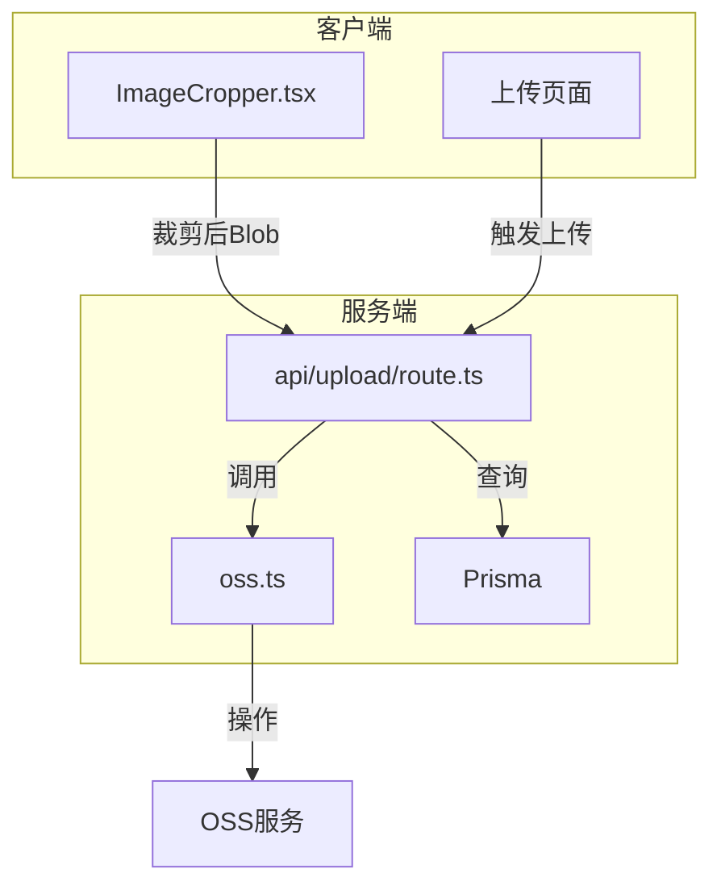
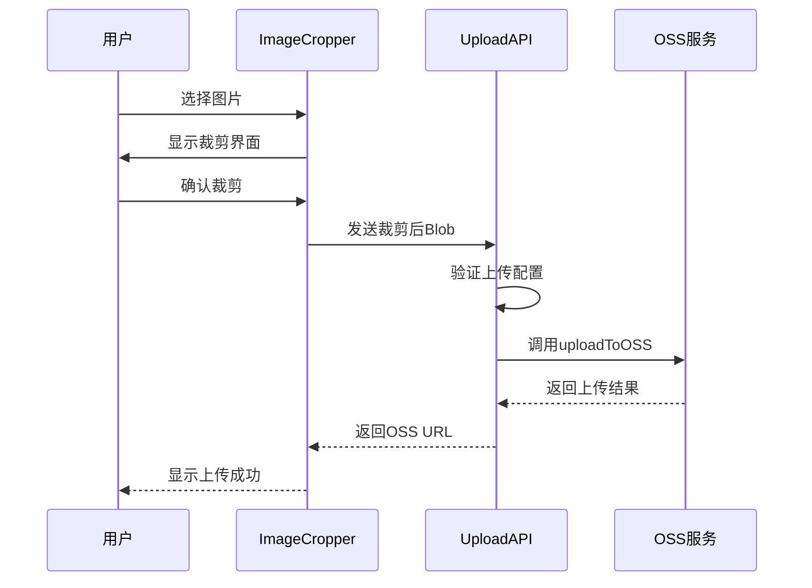
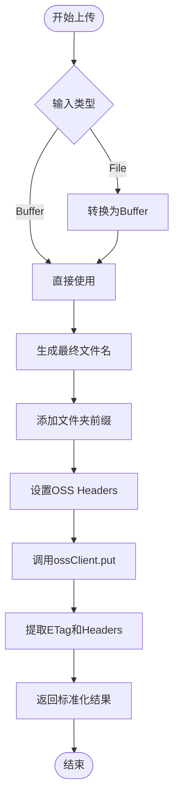
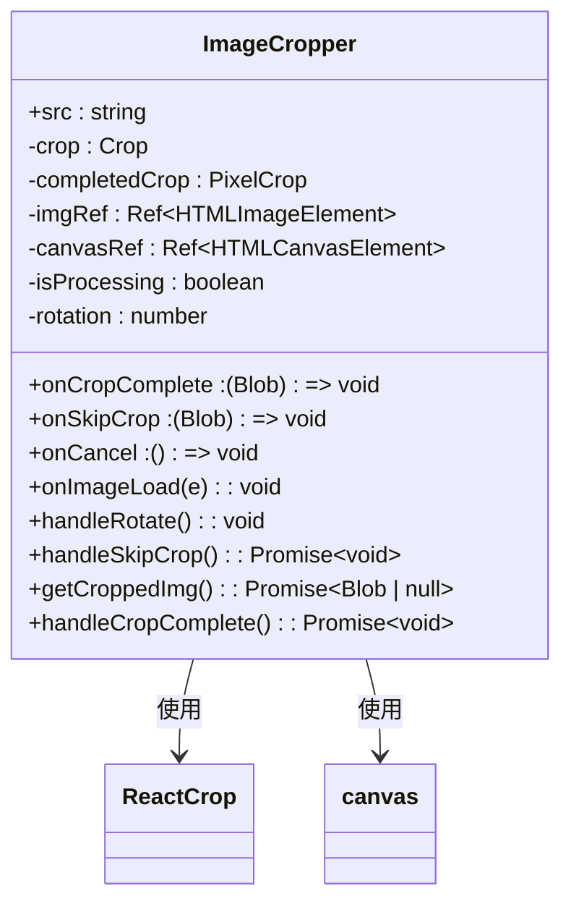
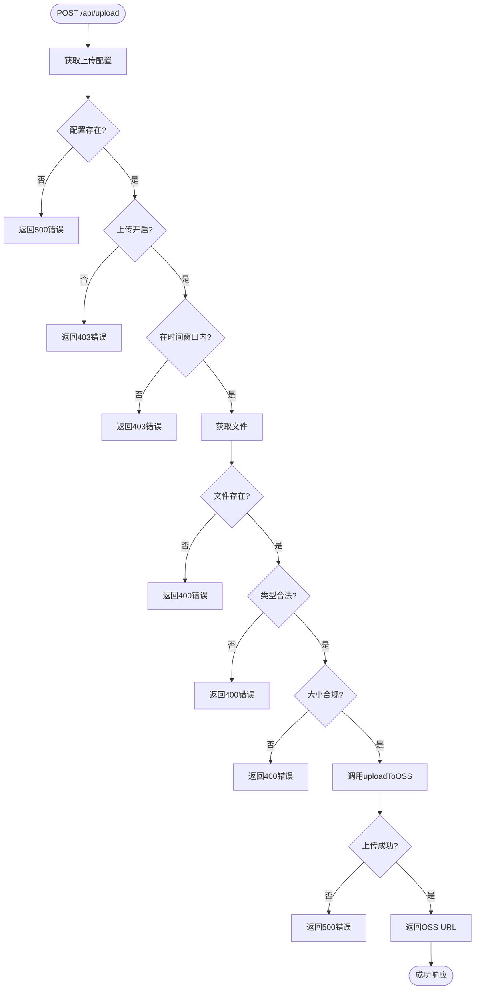
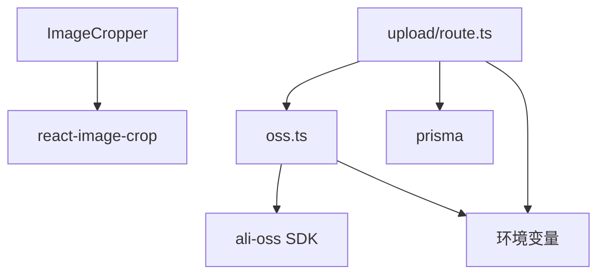

# 文件存储系统集成

<cite>
**本文档引用的文件**
- [oss.ts](file://src/lib/oss.ts)
- [ImageCropper.tsx](file://src/components/ImageCropper.tsx)
- [route.ts](file://src/app/api/upload/route.ts)
- [upload-config/route.ts](file://src/app/api/admin/upload-config/route.ts)
- [UploadConfigManagement.tsx](file://src/components/admin/UploadConfigManagement.tsx)
- [next.config.ts](file://next.config.ts)
- [run-oss-test.js](file://run-oss-test.js)
- [test-oss.ts](file://test-oss.ts)
</cite>

## 目录
1. [简介](#简介)
2. [项目结构](#项目结构)
3. [核心组件](#核心组件)
4. [架构概览](#架构概览)
5. [详细组件分析](#详细组件分析)
6. [依赖分析](#依赖分析)
7. [性能考虑](#性能考虑)
8. [故障排除指南](#故障排除指南)
9. [结论](#结论)

## 简介
本文档旨在为阿里云OSS（对象存储服务）集成提供权威指南，涵盖从客户端图像预处理、文件上传、服务端处理、URL生成到权限配置的全流程。文档深入解析 `oss.ts` 中封装的核心方法，说明如何在API路由中调用这些服务处理用户上传请求，并结合 `ImageCropper` 组件阐述客户端与服务端的协同工作流程。同时，涵盖OSS权限配置、上传限制、CDN加速、安全性考虑及进阶实践建议。

## 项目结构
项目采用标准的Next.js应用结构，OSS相关功能主要集中在 `src/lib` 和 `src/app/api` 目录下。核心的OSS操作封装在 `src/lib/oss.ts`，API路由在 `src/app/api/upload/route.ts` 中处理上传请求，而上传配置管理则通过 `src/app/api/admin/upload-config/route.ts` 实现。

**Diagram sources**
- [ImageCropper.tsx](file://src/components/ImageCropper.tsx)
- [route.ts](file://src/app/api/upload/route.ts)
- [oss.ts](file://src/lib/oss.ts)

**Section sources**
- [src/lib/oss.ts](file://src/lib/oss.ts)
- [src/components/ImageCropper.tsx](file://src/components/ImageCropper.tsx)
- [src/app/api/upload/route.ts](file://src/app/api/upload/route.ts)

## 核心组件
核心组件包括 `oss.ts` 中的OSS服务封装、`ImageCropper.tsx` 客户端图像处理组件以及 `api/upload/route.ts` 中的上传API路由。`oss.ts` 提供了上传、删除、获取信息、生成签名URL等原子操作，`ImageCropper` 负责在客户端进行图像预处理，`upload/route.ts` 则作为服务端入口，协调配置验证与OSS上传。

**Section sources**
- [oss.ts](file://src/lib/oss.ts#L50-L106)
- [ImageCropper.tsx](file://src/components/ImageCropper.tsx#L0-L311)
- [route.ts](file://src/app/api/upload/route.ts#L0-L114)

## 架构概览
系统采用客户端-服务端分离架构。客户端负责用户交互和图像预处理，服务端负责业务逻辑、安全验证和与OSS的交互。上传流程始于用户选择文件，经 `ImageCropper` 裁剪后，通过API路由发送至服务端。服务端首先验证全局上传配置，然后调用 `oss.ts` 中的 `uploadToOSS` 方法将文件上传至OSS，并返回可访问的URL。

**Diagram sources**
- [ImageCropper.tsx](file://src/components/ImageCropper.tsx#L0-L311)
- [route.ts](file://src/app/api/upload/route.ts#L0-L114)
- [oss.ts](file://src/lib/oss.ts#L50-L106)

## 详细组件分析

### oss.ts 核心方法分析
`oss.ts` 是OSS功能的核心封装，提供了安全且易用的接口。

#### 上传方法
`uploadToOSS` 函数是文件上传的核心。它接受 `File` 或 `Buffer` 对象，支持自定义文件名、文件夹路径、HTTP头信息，并可生成唯一文件名以避免覆盖。上传时，函数会自动将 `File` 对象转换为 `Buffer`，并设置OSS对象的存储类型、访问权限和缓存策略。

**Diagram sources**
- [oss.ts](file://src/lib/oss.ts#L50-L106)

#### 删除与信息查询
`deleteFromOSS` 和 `deleteMultipleFromOSS` 提供了单个和批量删除功能。`getObjectInfo` 方法通过 `HEAD` 请求获取文件元信息，如大小、最后修改时间、内容类型等，可用于前端显示或验证。

#### URL生成方法
`getSignedUrl` 和 `getDownloadUrl` 用于生成临时访问链接。`getSignedUrl` 生成一个带签名的GET请求URL，可用于在一定时间内安全地访问私有文件。`getDownloadUrl` 在此基础上，通过设置 `Content-Disposition` 头，强制浏览器下载文件而非预览。

**Section sources**
- [oss.ts](file://src/lib/oss.ts#L50-L250)

### ImageCropper 组件分析
`ImageCropper` 是一个客户端图像裁剪组件，使用 `react-image-crop` 库实现。它允许用户对上传的图片进行16:9比例的裁剪，并支持旋转功能。

#### 工作流程
1.  **加载**: 组件接收图片 `src`，加载后自动创建一个居中的16:9裁剪框。
2.  **交互**: 用户可拖拽调整裁剪区域，或点击“旋转90°”按钮旋转图片。
3.  **处理**: 用户点击“确认裁剪”或“不裁剪”后，组件使用 `canvas` 元素将当前视图（包括旋转）转换为高质量的 `Blob` 对象。
4.  **回调**: 处理完成后，通过 `onCropComplete` 或 `onSkipCrop` 回调函数将 `Blob` 传递给父组件。

该组件与服务端的协同体现在，它将预处理后的 `Blob` 作为 `File` 对象的一部分发送给 `upload` API，确保了上传图片的质量和格式符合要求。

**Diagram sources**
- [ImageCropper.tsx](file://src/components/ImageCropper.tsx#L0-L311)

**Section sources**
- [ImageCropper.tsx](file://src/components/ImageCropper.tsx#L0-L311)

### 上传API路由分析
`api/upload/route.ts` 是处理文件上传的API端点。

#### 处理流程
1.  **获取配置**: 首先从数据库获取最新的上传配置。
2.  **状态检查**: 检查上传功能是否开启、是否在允许的时间窗口内。
3.  **文件验证**: 验证文件是否存在、类型是否在允许列表中、大小是否超过限制。
4.  **上传OSS**: 调用 `uploadToOSS` 函数，上传文件至OSS。上传时会设置 `public-read` 权限、`Cache-Control` 缓存头和文件标签。
5.  **返回结果**: 成功后返回包含OSS URL、文件名等信息的JSON响应。

此路由不创建数据库记录，仅负责文件存储，体现了关注点分离的设计原则。

**Diagram sources**
- [route.ts](file://src/app/api/upload/route.ts#L0-L114)

**Section sources**
- [route.ts](file://src/app/api/upload/route.ts#L0-L114)

## 依赖分析
系统依赖关系清晰。`ImageCropper` 组件依赖 `react-image-crop` 库进行UI交互。`upload/route.ts` 依赖 `oss.ts` 进行OSS操作，依赖 `prisma` 查询上传配置。`oss.ts` 依赖 `ali-oss` SDK 与阿里云OSS服务通信。所有服务端组件都依赖环境变量（`.env`）来配置OSS的访问密钥和存储桶信息。

**Diagram sources**
- [ImageCropper.tsx](file://src/components/ImageCropper.tsx)
- [route.ts](file://src/app/api/upload/route.ts)
- [oss.ts](file://src/lib/oss.ts)

**Section sources**
- [oss.ts](file://src/lib/oss.ts)
- [run-oss-test.js](file://run-oss-test.js)
- [test-oss.ts](file://test-oss.ts)

## 性能考虑
系统在性能方面做了多项优化：
- **CDN与缓存**: `next.config.ts` 中配置了针对静态资源和API的 `Cache-Control` 头，利用CDN进行缓存，减少重复请求。
- **OSS存储类**: 上传文件时指定 `Standard` 存储类，确保高可用性和低延迟访问。
- **客户端预处理**: `ImageCropper` 在客户端进行裁剪，避免了上传大尺寸原图，节省了带宽和OSS存储成本。
- **高效API**: `upload` API 逻辑简洁，仅做必要验证，保证了上传响应速度。

**Section sources**
- [next.config.ts](file://next.config.ts#L45-L102)

## 故障排除指南
- **上传失败**: 检查 `.env` 文件中的OSS配置是否正确，确保 `ALI_OSS_ACCESS_KEY_ID` 等环境变量已设置。可运行 `run-oss-test.js` 进行快速诊断。
- **文件类型错误**: 确认上传的文件类型在 `uploadConfig.allowedFormats` 列表中。
- **文件过大**: 检查 `uploadConfig.maxFileSize` 的限制，确保文件大小符合要求。
- **权限不足**: 确保OSS Bucket的访问权限策略（Bucket Policy）允许应用的 `accessKeyId` 进行 `PutObject`、`DeleteObject` 等操作。
- **签名URL无效**: 检查 `getSignedUrl` 的 `expires` 参数，确保URL未过期。

**Section sources**
- [run-oss-test.js](file://run-oss-test.js)
- [test-oss.ts](file://test-oss.ts)
- [upload-config/route.ts](file://src/app/api/admin/upload-config/route.ts)

## 结论
本系统通过 `oss.ts` 提供了强大且安全的OSS集成能力，结合 `ImageCropper` 实现了高质量的客户端图像预处理。API路由设计合理，将上传配置与文件存储分离，提高了系统的灵活性和可维护性。整体架构清晰，性能优化到位，为数字化作品展示平台提供了可靠的文件存储解决方案。未来可考虑实现大文件分片上传以支持更大尺寸的文件。