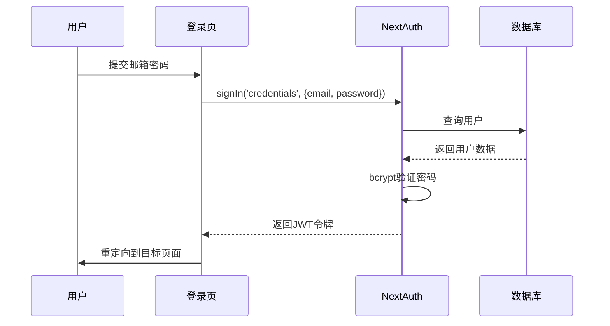
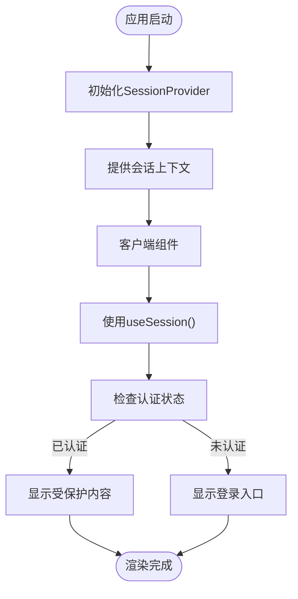
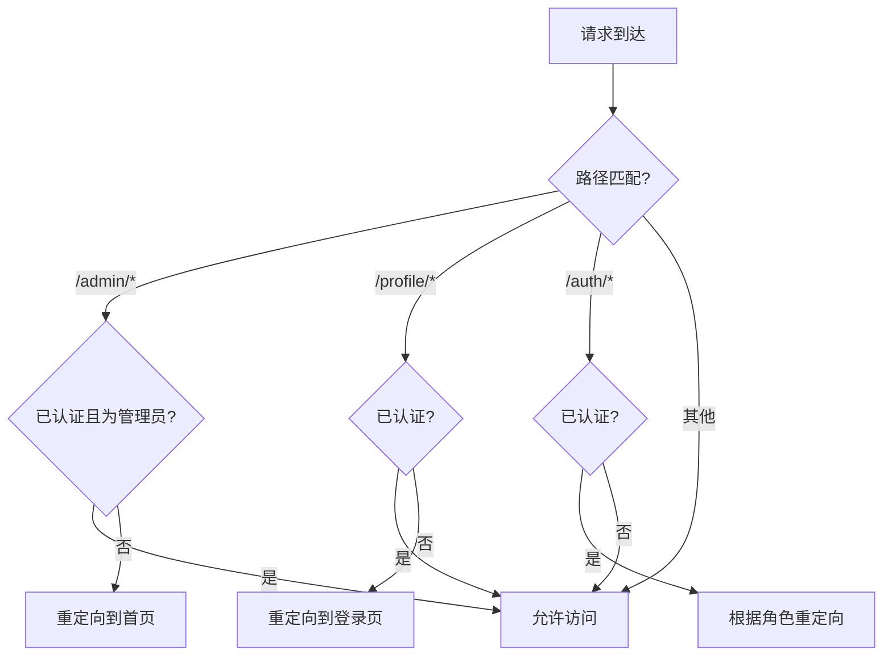
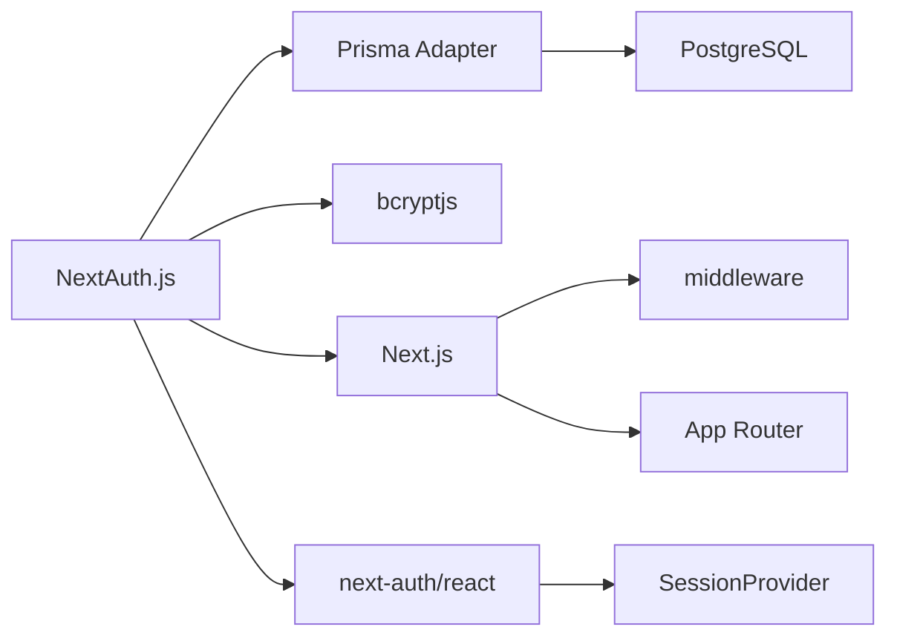

# 身份验证系统扩展

<cite>
**本文档引用的文件**  
- [auth.ts](file://src/lib/auth.ts)
- [auth\[...nextauth]\route.ts](file://src/app/api/auth/[...nextauth]/route.ts)
- [SessionWrapper.tsx](file://src/components/SessionWrapper.tsx)
- [next-auth.d.ts](file://src/types/next-auth.d.ts)
- [middleware.ts](file://middleware.ts)
- [prisma/schema.prisma](file://prisma/schema.prisma)
- [signin/page.tsx](file://src/app/auth/signin/page.tsx)
- [admin/page.tsx](file://src/app/admin/page.tsx)
</cite>

## 目录
1. [简介](#简介)
2. [项目结构](#项目结构)
3. [核心组件](#核心组件)
4. [架构概述](#架构概述)
5. [详细组件分析](#详细组件分析)
6. [依赖分析](#依赖分析)
7. [性能考虑](#性能考虑)
8. [故障排除指南](#故障排除指南)
9. [结论](#结论)

## 简介
本文档详细阐述了NextAuth集成机制及扩展方法，帮助开发者理解并定制身份验证流程。重点解析`auth.ts`中的认证策略、会话管理与用户信息序列化逻辑，说明如何扩展用户模型以支持自定义字段。指导如何通过`[...nextauth]`路由处理登录、登出、回调等流程，并集成到前端`SessionWrapper`组件中实现状态同步。涵盖OAuth提供商配置、密码加密（bcryptjs）存储、会话持久化与安全令牌管理的最佳实践，同时提供自定义认证接口的开发示例。

## 项目结构
项目采用Next.js App Router架构，身份验证系统主要分布在`src/lib`和`src/app/api/auth`目录下。`auth.ts`文件集中配置NextAuth选项，`[...nextauth]/route.ts`作为API路由入口，`SessionWrapper.tsx`提供客户端会话上下文，`next-auth.d.ts`扩展类型定义以支持自定义用户字段。

```mermaid
graph TB
subgraph "身份验证模块"
AuthTS[auth.ts<br/>认证配置]
NextAuthRoute[api/auth/[...nextauth]/route.ts<br/>API路由]
SessionWrapper[components/SessionWrapper.tsx<br/>会话提供者]
Types[next-auth.d.ts<br/>类型扩展]
end
subgraph "关联组件"
SigninPage[auth/signin/page.tsx<br/>登录页面]
AdminPage[admin/page.tsx<br/>管理员页面]
Middleware[middleware.ts<br/>中间件路由保护]
end
AuthTS --> NextAuthRoute
AuthTS --> Types
NextAuthRoute --> SessionWrapper
SessionWrapper --> SigninPage
Middleware --> AuthTS
AdminPage --> SessionWrapper
```

**Diagram sources**
- [auth.ts](file://src/lib/auth.ts#L1-L71)
- [auth\[...nextauth]\route.ts](file://src/app/api/auth/[...nextauth]/route.ts#L1-L6)
- [SessionWrapper.tsx](file://src/components/SessionWrapper.tsx#L1-L16)

**Section sources**
- [auth.ts](file://src/lib/auth.ts#L1-L71)
- [auth\[...nextauth]\route.ts](file://src/app/api/auth/[...nextauth]/route.ts#L1-L6)
- [SessionWrapper.tsx](file://src/components/SessionWrapper.tsx#L1-L16)

## 核心组件
核心身份验证组件包括：`authOptions`配置对象定义认证策略和回调函数，`CredentialsProvider`处理凭证登录，Prisma适配器实现数据库持久化，JWT会话策略管理用户状态，以及类型扩展确保角色信息在客户端和服务端的一致性。

**Section sources**
- [auth.ts](file://src/lib/auth.ts#L7-L71)
- [next-auth.d.ts](file://src/types/next-auth.d.ts#L3-L22)

## 架构概述
系统采用NextAuth.js作为身份验证框架，结合Prisma ORM实现用户数据持久化。认证流程始于用户在登录页面提交凭证，NextAuth通过`CredentialsProvider`验证后生成JWT令牌，会话通过Cookie存储。`SessionProvider`在客户端提供会话上下文，中间件基于会话状态实现路由保护。



**Diagram sources**
- [auth.ts](file://src/lib/auth.ts#L43-L71)
- [signin/page.tsx](file://src/app/auth/signin/page.tsx#L1-L39)

## 详细组件分析

### 认证配置分析
`authOptions`对象配置了基于凭证的认证方式，使用邮箱作为唯一标识。会话策略设置为JWT，通过`jwt`和`session`回调函数将用户角色信息注入令牌和会话对象，确保权限信息在客户端和服务端的一致性。

```mermaid
classDiagram
class authOptions {
+adapter : PrismaAdapter
+providers : CredentialsProvider[]
+session : {strategy : 'jwt'}
+callbacks : {jwt(), session()}
+pages : {signIn : '/auth/signin'}
+secret : string
}
class CredentialsProvider {
+name : 'credentials'
+credentials : {email, password}
+authorize(credentials) : User | null
}
class jwtCallback {
+jwt({token, user}) : JWT
+session({session, token}) : Session
}
authOptions --> CredentialsProvider : 包含
authOptions --> jwtCallback : 使用回调
```

**Diagram sources**
- [auth.ts](file://src/lib/auth.ts#L1-L71)

**Section sources**
- [auth.ts](file://src/lib/auth.ts#L1-L71)

### 会话管理与状态同步
`SessionWrapper`组件封装`SessionProvider`，为整个应用提供会话上下文。`layout.tsx`中集成该组件，确保所有页面都能访问会话状态。`useSession`钩子在客户端组件中消费会话数据，实现UI状态同步。



**Diagram sources**
- [SessionWrapper.tsx](file://src/components/SessionWrapper.tsx#L1-L16)
- [layout.tsx](file://src/app/layout.tsx#L1-L85)

**Section sources**
- [SessionWrapper.tsx](file://src/components/SessionWrapper.tsx#L1-L16)
- [layout.tsx](file://src/app/layout.tsx#L1-L85)

### 权限控制与路由保护
中间件（middleware.ts）基于认证状态实现细粒度路由保护。管理员页面仅允许管理员访问，个人中心页面要求用户登录，上传页面允许游客访问。通过`token.role`检查用户角色，实现基于角色的访问控制（RBAC）。



**Diagram sources**
- [middleware.ts](file://middleware.ts#L1-L51)

**Section sources**
- [middleware.ts](file://middleware.ts#L1-L51)
- [admin/page.tsx](file://src/app/admin/page.tsx#L1-L47)

## 依赖分析
身份验证系统依赖NextAuth.js核心库、Prisma ORM、bcryptjs密码哈希库和Next.js框架特性。Prisma适配器桥接NextAuth与PostgreSQL数据库，`next-auth/middleware`提供服务器端认证检查，`next-auth/react`支持客户端会话管理。



**Diagram sources**
- [auth.ts](file://src/lib/auth.ts#L1-L71)
- [go.mod](file://package.json#L1-L10)

**Section sources**
- [auth.ts](file://src/lib/auth.ts#L1-L71)
- [package.json](file://package.json#L1-L50)

## 性能考虑
JWT会话策略减少数据库查询，提升性能。密码哈希使用bcryptjs默认成本因子，平衡安全与性能。建议在生产环境配置`NEXTAUTH_SECRET`环境变量，避免每次重启生成新密钥导致会话失效。数据库索引优化用户查询性能。

## 故障排除指南
常见问题包括会话无法持久化、角色信息丢失、重定向循环等。检查`NEXTAUTH_SECRET`是否配置、`session.strategy`是否正确设置为'jwt'、类型扩展是否同步更新。调试时可启用NextAuth日志，检查中间件匹配规则和回调函数执行情况。

**Section sources**
- [auth.ts](file://src/lib/auth.ts#L1-L71)
- [middleware.ts](file://middleware.ts#L1-L51)
- [auth\[...nextauth]\route.ts](file://src/app/api/auth/[...nextauth]/route.ts#L1-L6)

## 结论
本系统通过NextAuth.js实现了安全、可扩展的身份验证机制。凭证登录结合bcrypt密码哈希确保安全性，JWT会话策略提升性能，角色信息注入支持细粒度权限控制。通过类型扩展和中间件配置，开发者可轻松定制认证流程，满足复杂业务需求。