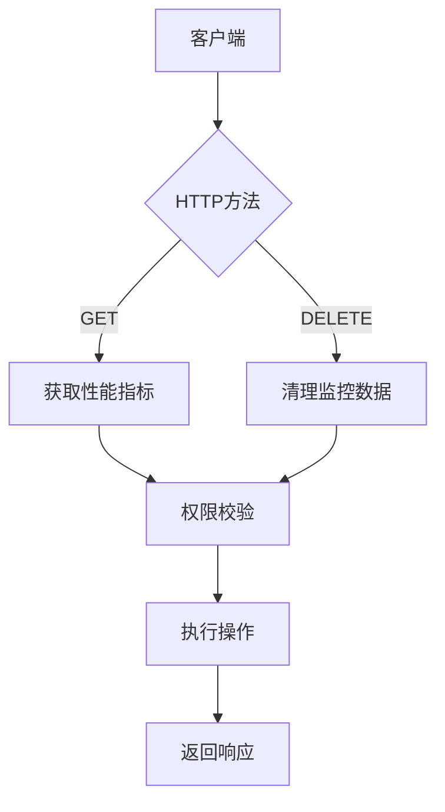
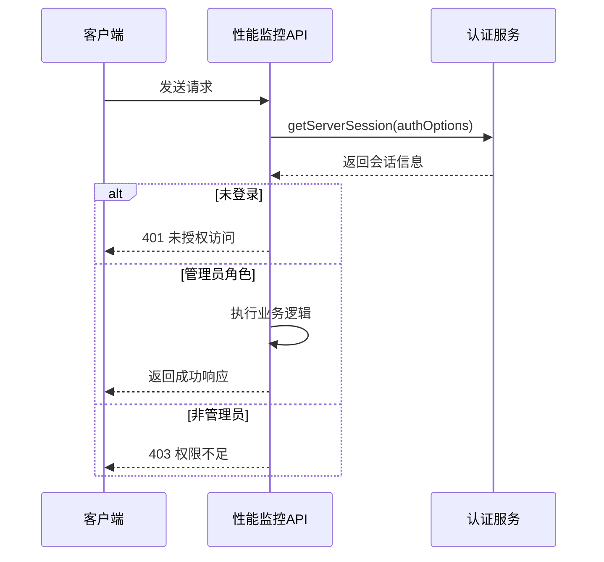
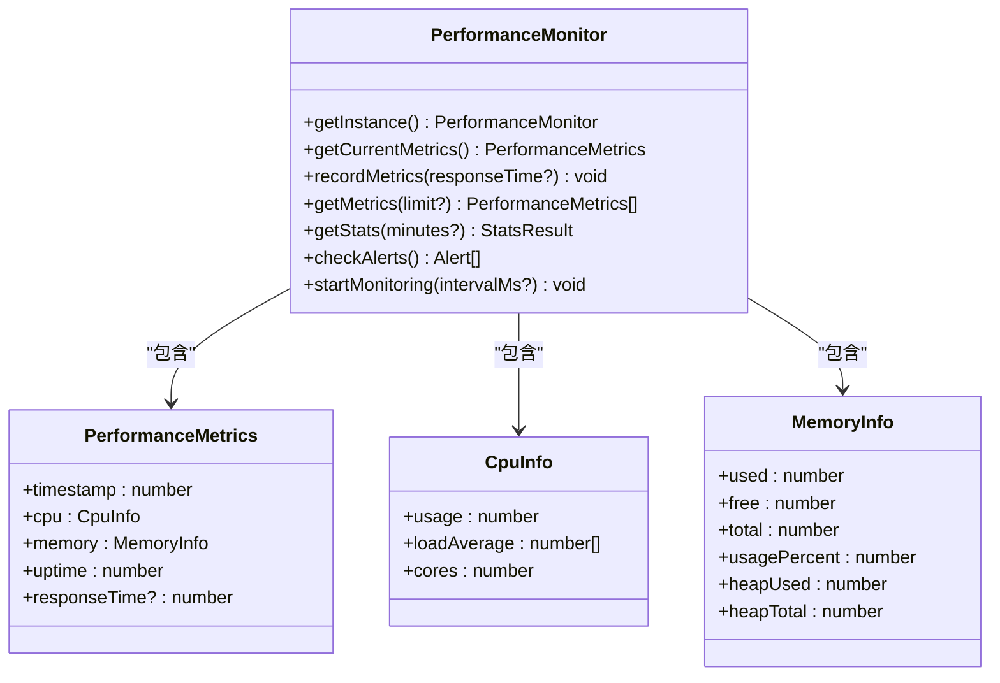

# 性能监控API

<cite>
**本文档引用的文件**  
- [performance\route.ts](file://src/app/api/admin/performance/route.ts)
- [performance-monitor.ts](file://src/lib/performance-monitor.ts)
- [auth.ts](file://src/lib/auth.ts)
</cite>

## 目录
1. [简介](#简介)
2. [API端点](#api端点)
3. [请求参数](#请求参数)
4. [响应结构](#响应结构)
5. [权限校验机制](#权限校验机制)
6. [错误处理](#错误处理)
7. [调用示例](#调用示例)
8. [性能监控核心类](#性能监控核心类)

## 简介

性能监控API为系统管理员提供了一套完整的服务器性能监控解决方案。该API允许管理员获取详细的系统性能指标，并在必要时清理历史监控数据。API设计遵循RESTful原则，通过GET和DELETE两个HTTP方法提供核心功能。

系统通过`PerformanceMonitor`类收集和管理性能数据，包括CPU使用率、内存使用情况、系统负载等关键指标。所有API访问都受到严格的权限控制，确保只有管理员角色的用户才能访问敏感的性能数据。

**Section sources**
- [performance\route.ts](file://src/app/api/admin/performance/route.ts#L1-L123)

## API端点

性能监控API提供了两个核心端点：

- **GET /api/admin/performance** - 获取系统性能指标
- **DELETE /api/admin/performance** - 清理性能监控历史数据

这两个端点位于`src/app/api/admin/performance/route.ts`文件中，通过Next.js的API路由功能实现。GET方法用于查询当前和历史性能数据，而DELETE方法用于重置监控数据，通常在系统维护或问题排查时使用。



**Diagram sources**
- [performance\route.ts](file://src/app/api/admin/performance/route.ts#L1-L123)

**Section sources**
- [performance\route.ts](file://src/app/api/admin/performance/route.ts#L1-L123)

## 请求参数

### GET请求参数

GET请求支持以下查询参数：

| 参数名 | 类型 | 必需 | 默认值 | 描述 |
|-------|------|------|--------|------|
| minutes | number | 否 | 5 | 指定获取统计信息的时间范围（分钟） |
| history | boolean | 否 | false | 是否包含历史数据，设置为"true"时返回最近100条记录 |

示例：
```
GET /api/admin/performance?minutes=10&history=true
```

当`history=true`时，API会返回最近100条性能记录，便于进行趋势分析和问题排查。

**Section sources**
- [performance\route.ts](file://src/app/api/admin/performance/route.ts#L15-L50)

## 响应结构

### GET响应结构

成功的GET请求返回以下JSON结构：

```json
{
  "success": true,
  "data": {
    "current": {
      "timestamp": 1732550400000,
      "cpu": {
        "usage": 25.5,
        "loadAverage": [1.2, 1.1, 1.0],
        "cores": 8
      },
      "memory": {
        "used": 2147483648,
        "free": 1073741824,
        "total": 3221225472,
        "usagePercent": 66.7,
        "heapUsed": 104857600,
        "heapTotal": 209715200
      },
      "uptime": 3600
    },
    "stats": {
      "avgCpuUsage": 24.8,
      "avgMemoryUsage": 65.2,
      "avgResponseTime": 45.6,
      "maxMemoryUsage": 78.3,
      "maxCpuUsage": 45.2,
      "maxResponseTime": 120.4
    },
    "alerts": [
      {
        "type": "warning",
        "message": "内存使用率较高: 66.7%"
      }
    ],
    "serverInfo": {
      "nodeVersion": "v18.17.0",
      "platform": "win32",
      "arch": "x64",
      "pid": 12345
    },
    "history": [
      // 最近100条性能记录
    ]
  }
}
```

响应包含四个主要部分：
- **current**: 当前实时性能指标
- **stats**: 指定时间范围内的统计信息
- **alerts**: 当前系统告警信息
- **serverInfo**: 服务器基本信息

### DELETE响应结构

成功的DELETE请求返回简洁的确认信息：

```json
{
  "success": true,
  "message": "性能监控数据已清理"
}
```

**Section sources**
- [performance\route.ts](file://src/app/api/admin/performance/route.ts#L50-L90)
- [performance\route.ts](file://src/app/api/admin/performance/route.ts#L91-L123)

## 权限校验机制

性能监控API实施了严格的双层权限校验机制，确保只有经过身份验证的管理员才能访问。

### 校验流程



### 实现细节

1. **会话获取**: 使用`getServerSession`函数从NextAuth获取当前用户会话
2. **登录校验**: 检查`session?.user`是否存在，确保用户已登录
3. **角色校验**: 验证`session.user.role`是否为'ADMIN'

权限校验代码在每个API处理函数的开头执行，形成安全的"防护门"模式：

```typescript
const session = await getServerSession(authOptions);

// 检查用户是否已登录
if (!session?.user) {
  return NextResponse.json(
    { success: false, error: '未授权访问' },
    { status: 401 }
  );
}

// 检查管理员权限
if (session.user.role !== 'ADMIN') {
  return NextResponse.json(
    { success: false, error: '权限不足' },
    { status: 403 }
  );
}
```

**Diagram sources**
- [performance\route.ts](file://src/app/api/admin/performance/route.ts#L10-L40)

**Section sources**
- [performance\route.ts](file://src/app/api/admin/performance/route.ts#L10-L40)
- [auth.ts](file://src/lib/auth.ts#L7-L71)

## 错误处理

API实现了全面的错误处理机制，确保在各种异常情况下都能返回有意义的响应。

### 错误类型

| HTTP状态码 | 错误类型 | 响应内容 |
|-----------|---------|---------|
| 401 | 未授权访问 | `{ success: false, error: '未授权访问' }` |
| 403 | 权限不足 | `{ success: false, error: '权限不足' }` |
| 500 | 服务器内部错误 | `{ success: false, error: '获取性能指标失败' }` 或 `{ success: false, error: '清理性能数据失败' }` |

### 异常捕获

所有API操作都包裹在try-catch块中，捕获并处理潜在的运行时错误：

```typescript
try {
  // 核心业务逻辑
} catch (error) {
  console.error('获取性能指标失败:', error);
  return NextResponse.json(
    { success: false, error: '获取性能指标失败' },
    { status: 500 }
  );
}
```

这种设计确保了即使在监控系统自身出现问题时，API仍能返回结构化的错误信息，而不是抛出未处理的异常。

**Section sources**
- [performance\route.ts](file://src/app/api/admin/performance/route.ts#L45-L55)
- [performance\route.ts](file://src/app/api/admin/performance/route.ts#L110-L120)

## 调用示例

### 获取性能指标

```bash
# 获取最近5分钟的性能统计（默认）
curl -X GET "http://localhost:3000/api/admin/performance" \
  -H "Authorization: Bearer <admin_token>"

# 获取最近10分钟的性能统计并包含历史数据
curl -X GET "http://localhost:3000/api/admin/performance?minutes=10&history=true" \
  -H "Authorization: Bearer <admin_token>"
```

### 清理监控数据

```bash
# 清理所有历史性能监控数据
curl -X DELETE "http://localhost:3000/api/admin/performance" \
  -H "Authorization: Bearer <admin_token>"
```

### JavaScript调用示例

```javascript
// 获取性能数据
async function getPerformanceMetrics() {
  const response = await fetch('/api/admin/performance?minutes=15&history=true', {
    method: 'GET',
    headers: {
      'Authorization': `Bearer ${adminToken}`
    }
  });
  
  const data = await response.json();
  if (data.success) {
    console.log('当前CPU使用率:', data.data.current.cpu.usage);
    console.log('内存告警:', data.data.alerts);
  } else {
    console.error('获取失败:', data.error);
  }
}

// 清理数据
async function clearPerformanceData() {
  const response = await fetch('/api/admin/performance', {
    method: 'DELETE',
    headers: {
      'Authorization': `Bearer ${adminToken}`
    }
  });
  
  const result = await response.json();
  if (result.success) {
    console.log(result.message);
  } else {
    console.error('清理失败:', result.error);
  }
}
```

**Section sources**
- [performance\route.ts](file://src/app/api/admin/performance/route.ts#L1-L123)

## 性能监控核心类

`PerformanceMonitor`是系统性能监控的核心类，采用单例模式确保全局唯一实例。



**Diagram sources**
- [performance-monitor.ts](file://src/lib/performance-monitor.ts#L22-L202)

**Section sources**
- [performance-monitor.ts](file://src/lib/performance-monitor.ts#L22-L202)